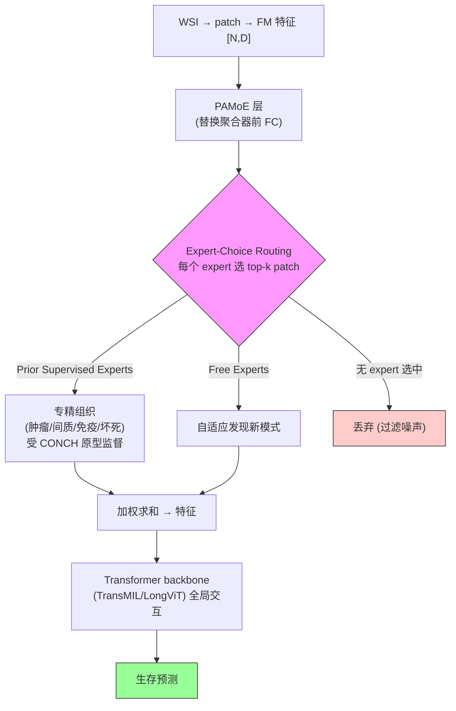

# PAMoE: Learning Heterogeneous Tissues with Mixture of Experts for Gigapixel WSIs

**作者**: Junxian Wu, Minheng Chen, Xinyi Ke, Tianwang Xun, Xiaoming Jiang, Hongyu Zhou, Lizhi Shao, Youyong Kong（东南大学 等）
**会议**: CVPR 2025 | **年份**: 2025（arXiv 2503.xxxxx）
**链接**: [CVPR 2025](https://openaccess.thecvf.com/content/CVPR2025/html/Wu_Learning_Heterogeneous_Tissues_with_Mixture_of_Experts_for_Gigapixel_Whole_CVPR_2025_paper.html) · [DOI](https://doi.org/10.1109/CVPR52734.2025.00485) · [Code](https://github.com/wjx-error/PAMoE)

## 一句话总结

**plug-and-play 的 Pathology-Aware Mixture-of-Experts 模块**：用 **expert-choice routing**（每个 expert 选 top-k patch，未被选中的 patch 丢弃 → 过滤无关内容 + 负载均衡）+ **组织原型监督**（CONCH 提取肿瘤/间质/免疫/坏死原型监督部分 expert 专精不同组织，保留部分 Free Experts 自适应），端到端建模瘤内组织异质性，一致提升 Transformer 类 MIL。

## 核心贡献

1. **Expert-Choice Routing 做 evidence filtering**：expert 选 patch（非 patch 选 expert），未被选中的 patch 丢弃——一石二鸟（负载均衡 + 过滤噪声）。
2. **Prior Supervised + Free Experts**：CONCH 组织原型监督部分 expert 专精（肿瘤/间质/免疫/坏死），Free Experts 自适应发现新模式。
3. **plug-and-play**：替换聚合器前 FC 层，集成 TransMIL/LongViT/PatchGCN；推理端到端无需额外先验。
4. **needle vs panoramic 任务二分**：明确 attention-MIL 适合 needle（微转移）、MoE 适合 panoramic（预后需组织异质性）。

## 📖 批读导航

| Section | 内容 |
|---------|------|
| [00 - Abstract & Introduction](sections/00-abstract-intro.md) | 摘要+引言、needle vs panoramic、Fig.1 vs PANTHER/HEAT |
| [01 - Preliminaries & Method](sections/01-method.md) | MIL/MoE 预备、Expert-Choice(Eq.4-8)、原型监督(Eq.9-16)、Fig.2/3 |
| [02 - Experiments & Discussion](sections/02-experiments-conclusion.md) | Table 1 主结果、假设、Fig.4 expert 可解释、消融、baseline 定位 |

## 关键数字

| 指标 | 数值 |
|------|------|
| 数据集 | 5 癌种生存预测：COAD/LGG/LUAD/PAAD/BRCA，5-fold CV |
| 特征 | UNI |
| 配置 | 4 Prior Supervised + 2 Free Experts，容量因子 c=2.0，α=0.1 |
| 组织原型 | tumor / stroma / immune infiltration / necrosis（CONCH 提取） |
| 主结果 | TransMIL+PAMoE BRCA 0.694（全局最优）；LongViT+PAMoE 一致提升 |
| 适用边界 | Transformer 类一致提升；PatchGCN（图类）提升有限 |
| 消融 | PAMoE(软路由) > CSA(硬聚类分配)；Free Experts 不能为 0 |

## 数据流：输入 → 中间表示 → 输出

## 优缺点与还能做什么

### 优点
- **Expert-Choice 一石二鸟**：负载均衡 + evidence filtering（丢无关 patch）。
- **软路由 + 先验监督**：比硬聚类分配（CSA）好；组织原型可解释（expert 真的专精了组织类型）。
- **plug-and-play**：可集成多种 backbone；推理端到端无需外部分类器（相对 HEAT 高效）。

### 局限 / 风险
- **只帮 Transformer 类**：PatchGCN 等局部交互模型受限（需全局自注意力支撑扩展的隐空间）。
- **依赖 CONCH 提原型**：训练时需病理 FM 分类器（虽推理不需）；原型质量影响监督。
- **容量因子丢弃比例**是超参：激进丢弃有丢关键 patch 风险。
- **未在大模型上验证**（作者承认硬件限制）。

### 还能做什么（对本课题 CKMIL/ReadySlide）
- **Expert-Choice = 聚合即筛选**：一种内置于聚合器的 patch 保留机制，与显式压缩正交。
- **组织语义分组**：tumor/stroma/immune/necrosis 原型是可复用的病理语义，用于语义化的 importance/retention。
- **软路由 + 先验监督 > 硬先验分配**：领域知识该软性引导可学习路由，而非硬约束——对 retention 打分设计有直接启示。
- **needle vs panoramic 任务二分**：压缩/保留策略应按任务类型区分（needle 保少数关键，panoramic 保多样组织）。

## 阅读 Q&A 记录

- **Q: Expert-Choice routing 相对 vanilla MoE 的好处？**
  A: vanilla MoE (token-choice) 每个 patch 挑 expert → 负载不均、无法过滤噪声。Expert-Choice 每个 expert 挑 top-k patch → 负载天然均衡 + 未被选中的 patch 丢弃（过滤背景/噪声）。

- **Q: 为什么要 Prior Supervised + Free Experts 混合？**
  A: 纯 Expert-Choice 有 expert 趋同、误丢关键 patch 问题。Prior Supervised（CONCH 原型监督）强制 expert 专精不同组织；Free Experts 保留发现未知因素能力。消融显示 Free=0 不稳，4+2 最佳。

- **Q: 为什么 PAMoE 只帮 Transformer、不帮 PatchGCN？**
  A: 作者假设——PAMoE 增益来自"不同 expert 扩展隐空间 → 更多样全局交互"，需全局自注意力（Transformer）支撑。PatchGCN 只建局部邻近交互，无法利用扩展的隐空间。

- **Q: 对 CKMIL/ReadySlide 最大启示？**
  A: (1) Expert-Choice 是"聚合即筛选"的保留机制；(2) 组织原型是可复用病理语义分组；(3) 软路由+先验监督 > 硬先验分配（对 retention 打分设计）；(4) needle vs panoramic 任务二分。

## 📊 Citation Landscape

> Semantic Scholar 采集限流，据论文自身引用整理。

**同主题最相关**
- [TransMIL](../%5BNeurIPS%202021%5D%20TransMIL/)（NeurIPS 2021）——PAMoE 的主要集成 backbone；PANTHER（Song et al.）——原型聚合；HEAT（Chan et al.）——异质图 + Hover-net 分类器（PAMoE 的对照）。
- [MAMMOTH](../%5BICLR%202026%5D%20MAMMOTH/)——同为"改进聚合器前的特征处理/变换"的 drop-in 思路；ABMIL/AttnMISL/CaMIL/PatchGCN——对比基线。

**方法来源**
- Shazeer et al.（sparsely-gated MoE）、Expert-Choice Routing（Zhou et al.）——MoE 基础；CONCH（Lu et al., Nat Med 2024）——组织原型提取的病理 FM；UNI（Chen et al., Nat Med 2024）——instance encoder。
