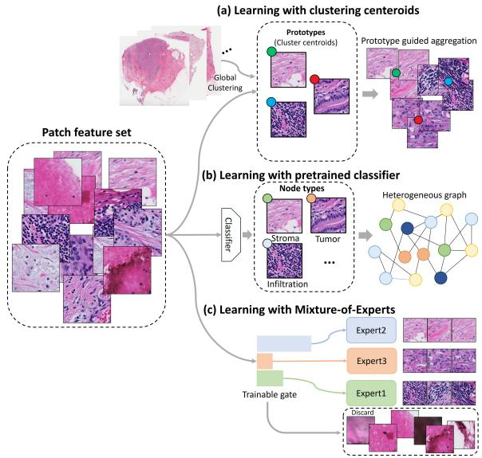

[← 返回 README](../README.md)

# Abstract & Introduction 摘要与引言

## 📌 预览

PAMoE 是一个 **plug-and-play 的 Pathology-Aware Mixture-of-Experts 模块**：把每个 patch 路由到"专精某类瘤内组织（肿瘤/间质/免疫浸润/坏死）的 expert"，并用 **expert-choice routing**（expert 选 patch，而非 patch 选 expert）**丢弃无 expert 感兴趣的 patch**（过滤无关内容）。相比 PANTHER（聚类原型）/HEAT（异质图 + 预训练分类器）需额外推理步骤，PAMoE 端到端、推理时无需额外先验。在 baseline set 里对应"关键只是 tissue heterogeneity + MoE routing"这一竞争解释。

---

## Abstract

Analyzing gigapixel WSIs is challenging due to the complex pathological tissue environment and the absence of target-driven domain knowledge. Previous methods incorporated pathological priors but relied on additional inference steps and specialized workflows, restricting scalability. To address these challenges, we propose a plug-and-play Pathology-Aware Mixture-of-Experts (PAMoE) module, which based on mixture of experts to learn pathology-related knowledge. We train the experts to become 'specialists' in specific intratumoral tissues by learning to route each tissue to its mapped expert. In addition, to reduce the impact of irrelevant content, we introduce a new routing rule that discards patches in which none of the experts express interest. Through comprehensive evaluation on survival task, we demonstrate that 1) our module enhances the performance of baseline models in most cases, and 2) the sparse expert processing across different tissues enhances the learning of patch representations by addressing tissue heterogeneity. Code: https://github.com/wjx-error/PAMoE.

> 💡 **问题动机（needle-in-haystack vs panoramic 任务）**（Hao 批注）：PAMoE 点出一个关键的**任务二分**：
> - **"needle-in-a-haystack"任务**（如微转移检测）：只需定位少数关键 patch → attention-based MIL 擅长。
> - **"panoramic"任务**（预后/分期/分型）：需综合**瘤内异质性**（不同肿瘤群体的多样性）+ **组织间交互**（如侵袭边缘的免疫浸润）→ 需识别并处理**不同瘤内组织**的 patch。
>
> attention-MIL 对后者不足（只盯少数）。PAMoE 用 MoE 让不同 expert 专精不同组织类型（肿瘤/间质/免疫/坏死），显式建模异质性。**这个任务二分对 CKMIL/ReadySlide 很重要**——压缩/保留策略在 needle 任务（保少数关键）和 panoramic 任务（保多样组织）上应不同。

> 💡 **机制拆解（PAMoE 三个设计点）**（Hao 批注）：
> 1. **MoE 处理组织异质性**：每个 expert 专精一类组织，patch 按组织类型路由到对应 expert——用 MoE 的"异质输入处理"能力建模瘤内异质性。
> 2. **Expert-Choice Routing（关键）**：不是"每个 patch 选 top-k expert"，而是"**每个 expert 选 top-k patch**"。副产品：**没被任何 expert 选中的 patch 被丢弃** → 天然过滤无关/背景 patch（evidence filtering）。
> 3. **先验监督 + 免费 expert**：用 CONCH（病理 FM）预分类得到组织原型，监督部分 expert（Prior Supervised）的选择偏好；保留部分 Free Expert 自适应发现未知因素。推理时端到端、无需先验。

## 1. Introduction

The standard approach for WSI is weakly supervised MIL. Attention-based methods prefer "needle-in-a-haystack" tasks (micro-metastasis detection). However, for "panoramic" tasks (prognosis, staging, subtyping), the model needs to integrate intratumoral heterogeneity and inter-tissue interactions. Many works exploit pathology tissue priors (prototype-based PANTHER, heterogeneous-graph HEAT), but rely on specific priors (clustering/classification) to pre-classify patches, increasing framework complexity and limiting focus by fixed priors.

Inspired by MoE advancements, PAMoE recognizes and processes patches from heterogeneous tissues **without additional priors during inference**. Building on expert-choice routing, PAMoE filters task-irrelevant patches by allowing experts to select patches of interest. Each expert becomes an 'expert' of a certain intratumoral tissue by learning routing preference aligned with its mapped tissue. Plug-and-play, integrable with most classical WSI methods.

*Figure 1: 利用组织异质性的三类方法。(a) PANTHER：全局聚类中心作原型引导聚合；(b) HEAT：预训练分类器给每个 patch 组织类别 + 异质图建交互；(c) PAMoE：可训练门控端到端识别与处理 patch。*

> 💡 **Figure 1 批读（PAMoE vs 现有 prior-based 方法）**（Hao 批注）：三类方法对比揭示 PAMoE 的定位——PANTHER/HEAT 都需要**独立的预处理步骤**（聚类 / 预训练分类器给标签）来引入组织先验，流程复杂且被固定先验限制。PAMoE 的创新：把组织先验**内化到 MoE 的门控里**（训练时用 CONCH 原型监督，推理时端到端）——既有先验引导（可解释）又不需推理时额外步骤（可扩展）。对 CKMIL：这是"如何把领域先验优雅地嵌入模型而非外挂"的好范例。
