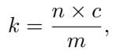
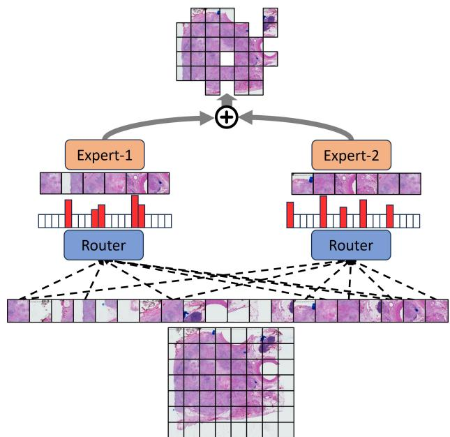
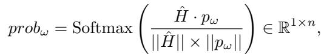
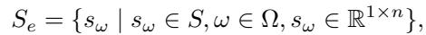
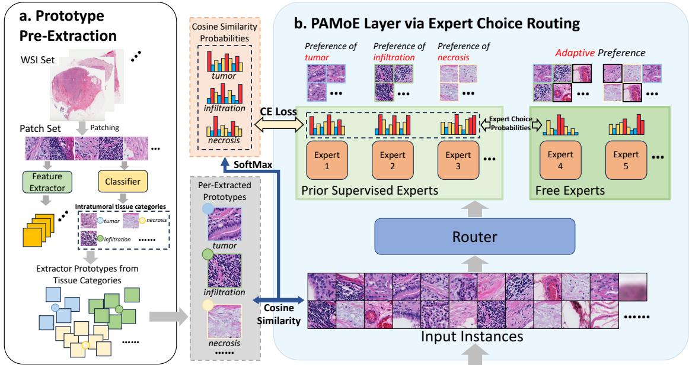

[← 返回 README](../README.md)

# 3-4. Preliminaries & Method 预备与方法

## 📌 预览

预备：MIL 三步（Eq.1）+ vanilla MoE（router 给每个 token 选 top-k expert，Eq.2-3）。方法：**(4.1) Expert-Choice Routing**——每个 expert 选 top-k patch（Eq.4-8），未被选中 patch 丢弃（过滤噪声 + 负载均衡）；**(4.2) PAMoE**——用 CONCH 预提组织原型（肿瘤/间质/坏死/浸润，Eq.9-12），分 Prior Supervised Experts（原型监督选择偏好，Eq.13-15）+ Free Experts（自适应），总损失 = 任务损失 + α·PAMoE 损失（Eq.16）。

---

## 3. Preliminaries

**MIL formulation** (Eq.1): $\hat{Y}=D(A(h_1,\ldots,h_n)),\; h_k=f(p_k)$ — encoder $f$ → aggregation $A$ → prediction $D$.

**Vanilla MoE**: router $W_r$ gives probability $p_i(x)=\text{softmax}(W_r\cdot x)$ (Eq.2), output $y=\sum_{i|p_i\in top_k} p_i(x)e_i(x)$ (Eq.3) — **each token selects top-k experts**.

## 4.1 Mixture-of-Experts via Expert Choice Routing

Vanilla MoE assigns experts to each input → load imbalance. WSI patches contain much noise/background/irrelevant tissue. **Expert Choice Routing**: each expert selects patches it is interested in; patches not selected by any expert are **discarded**. This addresses load balancing AND naturally filters irrelevant patches.

*Eq. (4): 每 expert 选 patch 数 $k=\frac{n\times c}{m}$（n=patch 数，c=容量因子，m=expert 数）。*

Router $g(\cdot)$ (MLP) gives assignment probability $\bar{S}=g(X)\in\mathbb{R}^{m\times n}$ (Eq.5). Each expert selects top-k patches along patch dim; a patch may be chosen by multiple experts or none (Eq.6 selected index set $\mathcal{T}$). Softmax along expert dim (Eq.7). Output $y=\sum_{i\in\mathcal{T}} S_i^\top e_i(x)$ (Eq.8); discarded patches have all-zero features (removed by post-processing).

*Figure 2: Expert Choice Routing。每个 patch 经门控网络对每个 expert 打分，expert 选固定数 top-k patch；patch 可被多 expert 选或不被选；选中的按门控分加权求和，未选的丢弃。*

> 💡 **机制拆解（Expert-Choice vs Token-Choice 的妙处）**（Hao 批注）：这是 PAMoE 的核心机制反转。**vanilla MoE (token-choice)**：每个 patch 挑 top-k expert → 问题：热门 expert 过载、冷门 expert 饿死（负载不均），且每个 patch 都必须处理（无法过滤噪声）。**Expert-Choice**：每个 expert 挑 top-k patch → 好处：(1) 每个 expert 固定处理 k 个 patch（负载天然均衡）；(2) **没被任何 expert 选中的 patch 直接丢弃**（evidence filtering，过滤背景/噪声）。这个"反转"一石二鸟。对 CKMIL/ReadySlide：Expert-Choice 是一种**内置于聚合器的 patch 保留机制**——与显式压缩不同，它在 MoE 层里自动丢无关 patch，是"聚合即筛选"的思路。

## 4.2 PAMoE: Pathology-Aware Mixture-of-Experts

**Prototype Pre-Extraction** (Fig.3a): use CONCH (pathology FM) as classifier to determine each patch's tissue category. Focus on prognosis-relevant intratumoral tissues: **tumor, stroma, immune infiltration, necrosis**. Sample 10% instances, classify, average per category to get prior-based prototypes $\mathcal{P}=\{p_\omega=\text{mean}(\bar{H}_\omega)\}$ (Eq.9-12).

**Expert Choice Supervision by Prototypes** (Fig.3b): divide experts into **Prior Supervised Experts** ($m_p$) + **Free Experts** ($m_f$). Compute cosine similarity between instances and prototypes → selection probability $prob_\omega$ (Eq.13). Supervise supervised-experts' assignment probability $s_\omega$ with cross-entropy against $prob_\omega$:

*Eq. (15): PAMoE 损失 $\mathcal{L}_{PAMoE}=-\sum_\omega\sum_i prob_{\omega_i}\log s_{\omega_i}$（监督 expert 选择偏好对齐组织原型）。*

*Eq. (16): 总损失 $\mathcal{L}=\mathcal{L}_{task}+\alpha\mathcal{L}_{PAMoE}$。*

*Figure 3: PAMoE 总览。(a) 从某癌种 WSI 集提取 prior-based 原型（CONCH 分类）；(b) PAMoE 工作流——分 Prior Supervised Experts（原型监督）+ Free Experts（自适应）。*

> 💡 **机制拆解 + 公式批读（Prior Supervised + Free Experts 的平衡）**（Hao 批注）：PAMoE 的精髓在**监督 + 自由的混合**：
> - **为何需要监督**：纯 Expert-Choice 有两个问题——expert 偏好趋同（都学到相似 patch）、有价值 patch 因 router 难拟合被误丢。用组织原型（CONCH 提取的肿瘤/间质/免疫/坏死）监督部分 expert 的选择偏好（Eq.15 交叉熵），强制它们专精不同组织 → 解决趋同、保住关键组织。
> - **为何保留 Free Experts**：固定先验会限制模型发现"未知的预后相关因素"。Free Experts 不受监督、自适应学习 → 保留发现新模式的能力。
> - **CONCH 只在训练时用**（提原型监督），**推理时端到端**（router 已学会偏好）——这是相对 HEAT（推理时也需分类器）的关键效率优势。
> - **对 CKMIL/ReadySlide**：这个"先验监督 router + 自由 expert"的设计，是把领域知识（组织类型）注入而不硬约束的优雅范式。组织原型（tumor/stroma/immune/necrosis）也是一个可复用的"病理语义分组"，可用于 importance/retention 的语义化。
