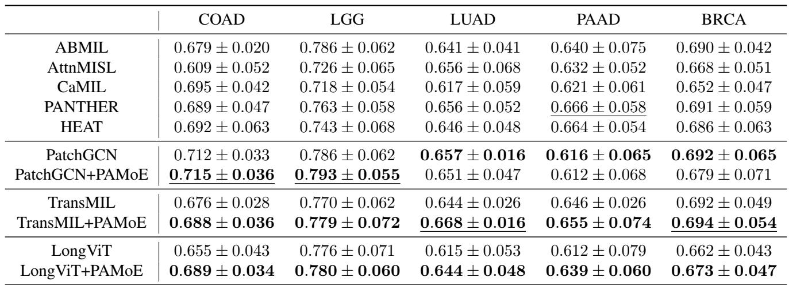
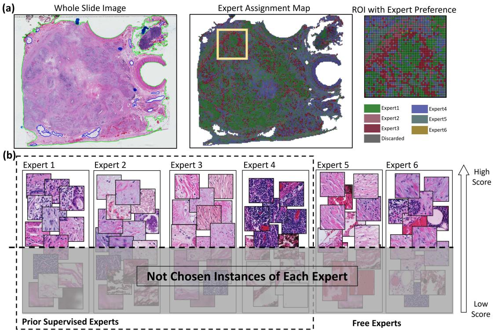
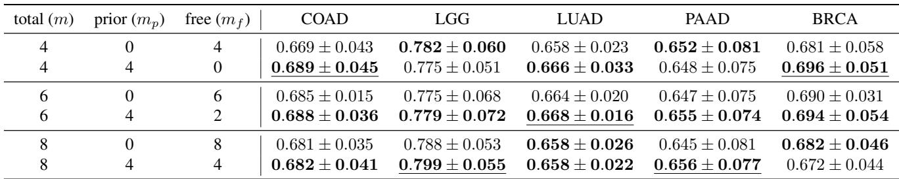

[← 返回 README](../README.md)

# 5-6. Experiments & Discussion 实验与讨论

## 📌 预览

5 癌种（COAD/LGG/LUAD/PAAD/BRCA）生存预测，UNI 特征，5-fold CV。PAMoE 插入 TransMIL/LongViT（Transformer 类）**一致提升**，插 PatchGCN（图类）提升有限。消融：Prior Supervised Experts 必要（比同数纯 Free 好）、Free Experts 不能为 0（否则不稳）、PAMoE(router) > CSA(硬聚类分配)、α>0 普遍有益。提出假设：PAMoE 增益来自"不同 expert 以不同方式映射 patch、扩展隐空间 → 更丰富全局交互"，需 Transformer 全局自注意力支撑。

---

## 4.3 Integrating PAMoE with Classical Methods

Integrate PAMoE by replacing fully connected layers with PAMoE layer. Selected TransMIL, LongViT (transformer-based), PatchGCN (non-transformer, tests PAMoE on graph model).

*Table 1: 5 癌种生存预测 C-index。PAMoE 插入 TransMIL/LongViT 一致提升；PatchGCN 提升有限。UNI 特征，5-fold CV。*

## 5. Experiments

Settings: 4 Prior Supervised Experts + 2 Free Experts, capacity factor c=2.0, α=0.1, Cox regression loss. Compare with ABMIL, AttnMISL, CaMIL, PANTHER (prototype-based), HEAT (heterogeneous graph + Hover-net classifier). UNI as instance encoder, identical 5-fold CV.

**Results**: Models with priors tend to perform better. Models integrated with PAMoE consistently outperform/on-par with transformer-based baselines. For PatchGCN, PAMoE gives limited/inconsistent improvement.

> 💡 **Table 1 批读（PAMoE 对 Transformer vs 图模型的差异）**（Hao 批注）：关键观察——**PAMoE 对 Transformer 类（TransMIL/LongViT）一致提升，对图类（PatchGCN）提升有限**。TransMIL+PAMoE 在 BRCA 达全局最优 0.694；LongViT+PAMoE 提升尤其明显（LUAD 0.615→0.644）。PatchGCN+PAMoE 则时好时坏。这个差异引出作者的核心假设（下）。对 baseline set：PAMoE 是"pathology-aware MoE routing"竞争解释，但**其增益依赖 backbone 的全局交互能力**——这是重要的适用边界。

> 💡 **假设批读（PAMoE 为何只帮 Transformer）**（Hao 批注）：作者的假设很有洞察力——**PAMoE 的增益来自"不同 expert 以独特方式映射 patch、扩展了隐空间，使模型能捕获更多样的全局交互"**。这些交互需要**全局自注意力**（Transformer）来支撑；而 PatchGCN 只建模邻近 patch 的局部交互，无法利用 expert 扩展的隐空间多样性 → 增益受限。
> - **含义**：PAMoE 不是独立的聚合器，而是**特征变换/路由增强器**，需搭配全局交互 backbone。这与 [MAMMOTH](../../%5BICLR%202026%5D%20MAMMOTH/)（feature transformation）思路相通——都是"改进 aggregator 前的特征处理"。对 CKMIL/ReadySlide：若用 MoE 路由，需确保下游有全局交互能力才能兑现增益。

## 5.4 Interpretability

*Figure 4: Expert 热图解释。(a) WSI 与 expert 分配图；(b) expert 偏好的 patch 可视化（y 轴越高偏好分越高）。*

Supervised Experts exhibit consistent preferences aligning with supervised priors; Free Experts display dispersed preferences (explore novel patterns). Specifically: Expert 1 → tumor & activated stroma; Expert 2 → necrosis & inactivated stroma; Expert 3 → general stroma; Expert 4 → infiltration & lymph nodes. Validates pathology-aware routing.

> 💡 **Figure 4 批读（expert 真的专精了组织类型）**（Hao 批注）：可视化证明 PAMoE 的核心 claim——**Prior Supervised Experts 确实各自专精不同组织**（Expert 1 肿瘤+活化间质、Expert 2 坏死+失活间质、Expert 3 一般间质、Expert 4 浸润+淋巴结），Free Experts 则分散探索。这是 MoE 可解释性的漂亮案例——不是黑盒路由，而是学到了病理语义的分工。对 CKMIL/ReadySlide：这种"组织类型级"的重要性归因比单一注意力热图信息更丰富（能区分"肿瘤 vs 间质 vs 免疫"的贡献），可用于语义化的 retention。

## 5.5 Ablation Studies

*Table 2: Expert 数量消融。有 Prior Supervised Experts 比同总数纯 Free 好；Free Experts 为 0 时不稳。*

**Number of Experts**: models with Prior Supervised Experts consistently outperform same-total without prior supervision; when Free Experts = 0, improvement becomes unstable. **MoE necessity (Table 3)**: designed CSA (Cosine Similarity Assignment — directly assign patch to MLP by prototype similarity, like clustering); CSA improves over plain TransMIL but is **lower than PAMoE** on most datasets → flexible router (trained with task + loose prior constraints) beats hard assignment. **Effect of α**: most non-zero α values yield improvements.

> 💡 **Table 2/3 消融解读（三个关键设计验证）**（Hao 批注）：
> 1. **Prior Supervised 必要**（Tab.2）：有原型监督 > 同数纯 Free——先验引导确实帮助 expert 分工。
> 2. **Free Experts 不能为 0**（Tab.2）：纯监督（Free=0）不稳定——需保留自适应发现能力。最佳配比 4 监督 + 2 自由。
> 3. **PAMoE(软路由) > CSA(硬聚类分配)**（Tab.3）：这是最有意思的消融——CSA 用余弦相似度硬性把 patch 分给对应 MLP（像聚类），虽有先验但**不如 PAMoE 的可学习软路由**。说明"**task-driven + 松散先验约束的灵活路由**" > "精确但僵硬的先验分配"。
> - **对 CKMIL/ReadySlide 的启示**：这直接呼应"先验该软性引导而非硬约束"——把领域知识（组织类型）作为**监督信号**引导可学习路由，比直接按先验硬分配更好。对 retention 设计：软性的、可学习的、带先验监督的重要性打分 > 硬性的规则分配。

## 6. Conclusion

PAMoE: plug-and-play MoE-based module enabling end-to-end systematic learning of tissue heterogeneity, improving transformer-based models. **Limitations**: not explored on larger models; impact on non-transformer architectures unclear.

> 💡 **总结 + 对 baseline set 的定位**（Hao 批注）：PAMoE 在 baseline set 里：
> - **排除的竞争解释**："关键只是 tissue heterogeneity + MoE routing"——若新方法超不过 TransMIL+PAMoE，说明增益不只来自组织异质性路由。
> - **plug-and-play**：官方提供 TransMIL/LongViT/PatchGCN 集成，可与其他聚合器组合（类似 [MAMMOTH](../../%5BICLR%202026%5D%20MAMMOTH/) 的 drop-in 定位）。
> - **适用边界明确**：只帮有全局交互的 Transformer 类，图类受限——这是诚实且重要的边界。
> - **对 CKMIL/ReadySlide**：(1) needle vs panoramic 任务二分；(2) Expert-Choice routing 是"聚合即筛选"的 patch 保留机制；(3) 组织原型（tumor/stroma/immune/necrosis）是可复用的病理语义分组；(4) 软路由+先验监督 > 硬先验分配。

> 💡 **Q&A 批注记录**（Hao 批注）：
> - Q：PAMoE 能在冻结 FM 特征上跑吗？
> - A：能。它替换聚合器前的 FC 层，输入是 patch 特征。原文用 UNI 特征。但注意它是 plug-in（需搭配 TransMIL 等 backbone），不是独立聚合器。
> - Q：Expert-Choice routing 丢弃 patch 会丢信息吗？
> - A：会丢未被任何 expert 选中的 patch（容量因子 c 控制丢弃比例）。作者认为这些是背景/噪声，丢弃反而有益（evidence filtering）。但激进丢弃有丢关键 patch 风险（靠 Prior Supervised Experts + Free Experts 缓解）。
> - Q：CONCH 分类器在推理时需要吗？
> - A：不需要。CONCH 只在训练时提组织原型监督 router；推理时 router 已学会偏好，端到端。这是相对 HEAT（推理需 Hover-net）的效率优势。
