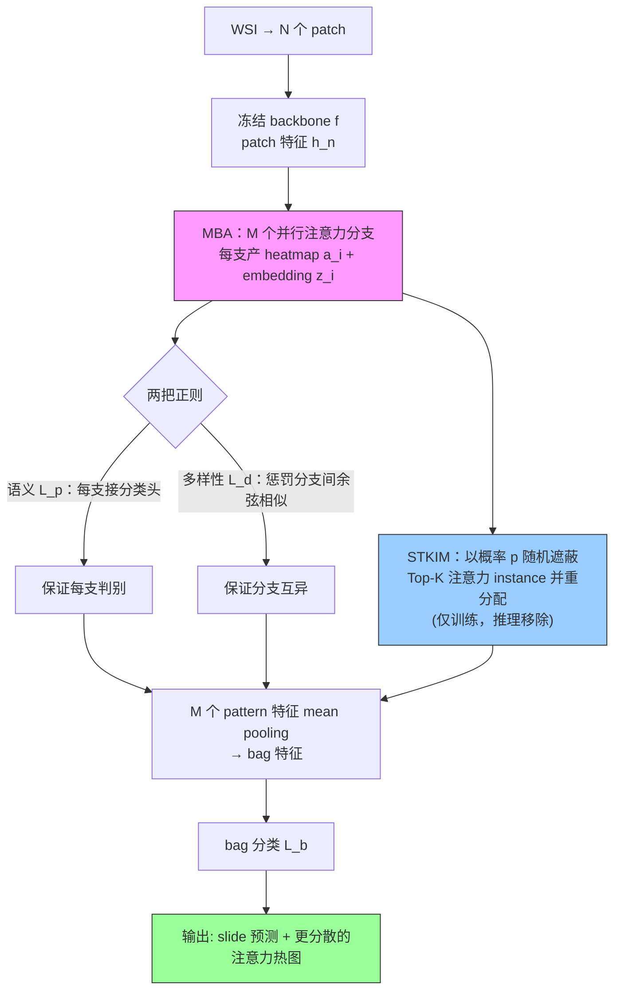

# ACMIL: Attention-Challenging Multiple Instance Learning for Whole Slide Image Classification

**作者**: Yunlong Zhang, Honglin Li, Yunxuan Sun, Sunyi Zheng, Chenglu Zhu, Lin Yang（Zhejiang University & Westlake University）
**会议**: ECCV 2024 | **年份**: 2023（arXiv 2311.07125，2023-11-13）
**链接**: [arXiv](https://arxiv.org/abs/2311.07125) · [Code](https://github.com/dazhangyu123/ACMIL)

## 一句话总结

把 WSI-MIL 的过拟合精确归因到"**注意力值过度集中于少数 instance**"，用 **MBA（多分支注意力，补足判别模式多样性）** + **STKIM（随机遮蔽 Top-K 显著 instance 并重分配，抑制少数垄断）** 两个正交技术把注意力"摊开"，在三数据集 12 项指标里 10 项最优。

## 核心贡献

1. **诊断**：用注意力熵 vs 验证损失的负相关（Fig. 1）证明"注意力越集中→泛化越差"，把过拟合绑定到一个可监控量。
2. **MBA**：M 个注意力分支 + 语义正则 $\mathcal{L}_p$（每支判别）+ 多样性正则 $\mathcal{L}_d$（分支互异），覆盖 UMAP 上的多个判别 cluster；与 MHA 的关键区别就是 $\mathcal{L}_d$。
3. **STKIM**：训练时以概率 p 随机遮蔽 Top-K 注意力 instance 并归一化重分配，推理时移除；只遮 K=10、无需 teacher-student，训练开销≈ABMIL。
4. **验证**：热图（覆盖更全）、UMAP（bag 特征更可分，V-measure 0.224→0.316）、Top-K 累积（0.87→0.60）三重可视化直接看见机制生效。

## 📖 批读导航

| Section | 内容 |
|---------|------|
| [00 - Abstract](sections/00-abstract.md) | 摘要 + 两成因两药的定位 |
| [01 - Introduction](sections/01-introduction.md) | 过拟合三诱因、Fig.1/2 熵-损失负相关、相关工作三支 |
| [02 - Method](sections/02-method.md) | ABMIL 三步（Eq.1-3）、MBA（Eq.4-8）、STKIM（Eq.9）、Fig.3/4/5 |
| [03 - Experiments](sections/03-experiments.md) | Table 1 主结果、Fig.6 热图、Fig.7 消融、Table 2 FROC、Table 3 消融、UMAP |
| [04 - Conclusion & Appendix](sections/04-conclusion.md) | 结论、GA/MHA 通用性、效率账、三条局限 |

## 关键数字

| 指标 | 数值 |
|------|------|
| 数据集 | CAMELYON16 / BRACS / LBC（私有，1989 WSI 4 类） |
| Backbone | ImageNet-ResNet18 / DINO-SSL-ViT-S/16（36,666 WSI 预训练） |
| 主结果 | 12 项中 10 项最优、2 项次优 |
| Top-10 注意力占比 | >0.85（用 STKIM 后 CAMELYON16 降到 0.60） |
| 最优超参 | M=5, K=10, p=0.6~0.8（K 不敏感，p=1.0 全遮反而差） |
| bag 特征 V-measure | ABMIL 0.224 → ACMIL 0.316 |
| 定位 FROC | ABMIL 0.399 → ACMIL 0.423（全监督 0.807，差距仍大） |
| 训练开销 | STKIM≈ABMIL；MHIM-MIL 2.4× 时间、6× 显存 |

## 数据流：输入 → 中间表示 → 输出

## 优缺点与还能做什么

### 优点
- **诊断驱动**：先证明"注意力集中↔过拟合"再对症，不是又堆一个架构。
- **两药正交且通用**：MBA/STKIM 可加到 GA/MHA 上都提升；STKIM 训练几乎零额外开销。
- **可视化扎实**：热图/UMAP/Top-K 三重证据直接看见机制。

### 局限 / 风险
- **超参敏感**（M、K 依数据集试错）。
- **未建 instance 相关性**（独立处理 patch，忽略空间/结构关系）。
- **定位仍弱**（FROC 0.43 vs 全监督 0.81）——分类友好的注意力不等于定位友好。

### 还能做什么
- **多视角 patch importance 用于压缩**：MBA 的多分支重要性可替代单一注意力做内容自适应保留，避免只留 Top-K 而丢掉上千判别 patch。
- **与空间相关性结合**：把 MBA 装进图/Transformer MIL，补上 instance 相关性这条缺口。
- **注意力熵作为泛化监控信号**：训练时监控注意力熵，作 early-stopping 或正则强度自适应的依据。

## 阅读 Q&A 记录

- **Q: 为什么注意力集中会导致过拟合？**
  A: MIL 标签假设（Eq.1）只要求"存在一个阳性 instance"，模型抓少数最易识别的（常带染色/纹理 spurious 特征）就能降训练损失，但换中心/扫描仪即失效 → 验证损失升。分散注意力=逼模型综合更多证据。

- **Q: MBA 和 Multi-Head Attention 有何本质区别？**
  A: MBA 有多样性损失 $\mathcal{L}_d$ 强制各分支互异，MHA 没有 → MHA 多头易塌缩成学同一概念（Tab.3b：去掉 $\mathcal{L}_d$ 掉 5-8pp）。且 MBA 与注意力公式解耦，可把 MHA 套进 MBA。

- **Q: 为什么 STKIM 只遮 K=10 且随机、推理还移除？**
  A: 全遮 Top-K（p=1.0）会丢关键信息并造成训练/推理统计失配，实验反而变差；随机遮（类比 dropout/cutout）保留期望信息又制造扰动；推理移除同 dropout 惯例（Tab.3a：测试用 STKIM 降 1-3pp）。

- **Q: 对 WSI 压缩/保留研究的最大启示？**
  A: "Top-10 instance 占 85% 注意力，但真实阳性 instance 有上千个"——**基于单一注意力的 patch importance 会系统性漏掉大量判别 patch**，做内容自适应压缩时不能只留 Top-K。

## 📊 Citation Landscape

> Semantic Scholar 详情接口在采集时限流（429），此处据论文自身引用整理。ACMIL 已被后续 WSI-MIL 工作广泛引用为"抗过拟合/注意力分析"的代表。

**同主题最相关**
- ABMIL [27]（Ilse et al., ICML 2018）——注意力池化 MIL 鼻祖，ACMIL 的直接基座。
- [MHIM-MIL](../%5BICCV%202023%5D%20MHIM-MIL/) [47]（Tang et al., ICCV 2023）——同为"遮蔽显著 instance"，但用 teacher-student；本目录已批读，是 STKIM 的主要对照。
- DTFD-MIL [59]（CVPR 2022）——伪 bag 双层蒸馏，SSL 特征下的强基线。
- CLAM [36]（Nat BME 2021）、TransMIL [45]（NeurIPS 2021）、DSMIL [30]（CVPR 2021）——主流注意力/自注意力 MIL 基线。

**方法思想来源（自然图像抗过拟合）**
- Cutout [17,62]、RSC [26]、Dropout [46]——STKIM 的灵感来源（随机遮蔽显著特征）。
- Shortcut learning [19]、texture bias [20]——"DNN 惰性只学简单模式"的理论依据。
