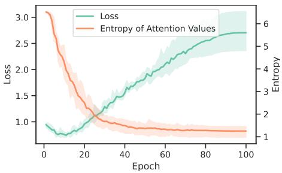
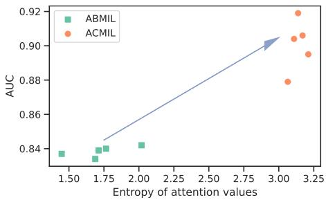

[← 返回 README](../README.md)

# 1. Introduction 引言

## 📌 预览

引言建立全文的因果链：**WSI 数据集天生小样本 + 超高分辨率 + 染色偏差 → MIL 易过拟合 → 而过拟合与"注意力过度集中"强相关**（Fig. 1 熵-损失负相关，Fig. 2 ACMIL 同时提高 AUC 和注意力熵）。随后引出两组分析（UMAP、Top-K 统计）与两个对应技术（MBA、STKIM）。

---

Whole slide image (WSI) classification is a critical undertaking in digital pathology, aiming to extract valuable information from high-resolution scanned images for precise diagnosis [23,33,51,54], prognosis [11,32,57,63], and treatment planning [14, 35, 37, 40, 41] of diseases. In recent years, multiple instance learning (MIL) [1, 18, 38] has emerged as a promising approach for WSI classification, treating each WSI as a "bag" and its extracted small patches as "instances" within the bag, thus enabling eficient classification of WSIs through assigning a single label to the entire slide.

Overfitting is a significant challenge in utilizing MIL methods for WSI classification [34, 47, 59]. Common WSI datasets exhibit intrinsic characteristics of limited data scale, ultra-high resolutions, and staining bias, which makes overfitting more likely [2]. Specifically, these datasets often consist of a relatively small number of slides, typically in the hundreds, with a resolution ranging from 50, 000 × 50, 000 to 10, 000 × 10, 000 [36]. Moreover, pathology images are susceptible to staining bias caused by variations in tissue preparations, staining protocols, and digital scanning methods [60], leading models to learn spurious correlations [34].

> 💡 **机制拆解**（过拟合的三个结构性诱因）（Hao 批注）：作者把 WSI 过拟合归到数据本身的三个"先天缺陷"：**(1) 样本少**（切片常仅数百张）；**(2) 分辨率极高**（单图上万 patch，bag 内 instance 数量巨大）；**(3) 染色偏差**（制片/扫描差异 → 模型学到 spurious correlation）。这三点决定了 WSI-MIL 不能照搬自然图像的做法——bag 大、label 少、噪声偏差多，注意力极易"抄近路"聚焦到少数好识别的 instance。

<table>
<tr>
<td width="50%"></td>
<td width="50%"></td>
</tr>
<tr>
<td align="center"><i>Fig. 1: 训练过程中验证损失与注意力值熵的变化（LBC + SSL 特征），损失与熵强负相关。</i></td>
<td align="center"><i>Fig. 2: ABMIL 与 ACMIL 的 AUC vs 注意力熵对比，一点为一个 seed。ACMIL 同时取得更高 AUC 和更高熵。</i></td>
</tr>
</table>

> 💡 **Figure 1 & 2 批读**（全文的"实验锚点"）（Hao 批注）：这两张图是 ACMIL 立论的经验基石。
> - **Fig. 1**：训练中"注意力熵↓"与"验证损失↑"几乎镜像同步 → **注意力越集中（熵越低），泛化越差（损失越高）**。这把"过拟合"这个抽象概念，绑定到一个训练中可监控的量（注意力熵）。
> - **Fig. 2**：每个点是一个随机种子的结果。ACMIL 的点云整体位于 ABMIL 的右上方 —— **AUC 更高 且 熵更高**。这直接证明"提高注意力熵（分散注意力）"和"提高泛化"是同向的，不是 trade-off。
> - **对压缩研究的意义**：低熵注意力 = 模型只"信"少数 patch。若用这种注意力当 patch 重要性来压缩/保留，会系统性丢掉大量真正判别性的 patch（Fig. 5 会量化：Top-10 就占 85% 注意力，但肿瘤 instance 常有上千个）。

In the attention mechanism, attention values/heatmaps provide insights into the model's decision-making process. Multiple existing works [36,45,47,58] alongside our own experiments (as indicated in Sec. 4.3) have pointed out the excessive concentration of attention values in current MIL methods. Specifically, MIL's attention mechanisms often concentrate on a subset of discriminative instances (i.e., instances relevant to the bag label) while disregarding the remaining ones. We investigate the correlation between attention value concentration and overfitting, utilizing the entropy of attention values and validation loss. Fig. 1 depicts a negative correlation between loss and entropy throughout the training process, illustrating that over-concentration of attention values (indicated by lower entropy) significantly compromises the model's generalization ability (indicated by higher loss values). Moreover, in the field of natural image classification, recent studies [17,26, 49] have demonstrated that models solely relying on a portion of discriminative features could be susceptible to overfitting. Transitioning to WSI classification, fixating on a subset of discriminative instances similarly impedes the model's ability to generalize. These findings highlight the tight connection between attention value concentration and overfitting.

Recently, numerous eforts have been made to address the overfitting challenge by enhancing representation quality [16, 24, 31, 36, 53], building spatial instance correlations [21, 30, 45] and developing data augmentation methods [13, 42, 47, 56, 59]. Additionally, some of these studies [30, 36] suggest that reducing the concentration of attention values can enhance model interpretability.

However, the investigation of attention values concentration for alleviating overfitting remains under-explored.

To mitigate overfitting, we present two analyses for attention value concentration using UMAP and Top-K value statistics. Then, we introduce Attention-Challenging MIL (ACMIL), which combines two novel techniques based on these two analyses. First, by observing UMAP of instance features, we find that there are various patterns among discriminative instances, and attention mechanisms tend to capture some of them. To solve this, we introduce Multiple Branch Attention (MBA). MBA utilizes multiple attention branches, each focusing on capturing instances with a specific pattern, thereby ensuring that more discriminative instances contribute to the final prediction. Second, by analyzing the cumulative value of Top-K attention scores, we find that a tiny number of instances (e.g., K=10) occupy majority attention, resulting in overlooking sophisticated discriminative instances. To suppress these instances, we propose Stochastic Top-K Instance Masking (STKIM). STKIM randomly masks out a portion of instances with Top-K attention values and assigns their attention values to the remaining instances. Combining MBA and STKIM, our ACMIL efectively alleviates the attention value concentration and suppresses overfitting (see Fig. 2).

> 💡 **Q&A 批注记录**（Hao 批注）：
> - Q：为什么"注意力集中"会导致过拟合，而不是仅仅"关注重点"？
> - A：因为 WSI 的 bag label 只需要"存在一个阳性 instance"就成立（Eq. 1）。模型只要抓住少数最易识别的阳性 instance 就能最小化训练损失（DNN 的"惰性"，[19,20]），但这批 instance 往往带染色/纹理的 spurious 特征 → 换个中心/扫描仪就失效 → 验证损失升高。分散注意力 = 强迫模型综合更多证据，降低对少数 spurious instance 的依赖。

We conduct experiments on three WSI datasets (i.e., CAMELYON16, BRACS, and our in-house LBC dataset) with two backbones (i.e., ImageNet pre-trained ResNet18 and SSL pre-trained ViT/S-16). Experimental results demonstrate the superiority of our ACMIL over existing state-of-the-art methods. We also present substantial experimental results, including heatmap visualization and UMAP visualization, to comprehensively demonstrate the efectiveness of ACMIL in suppressing attention value concentration and combatting overfitting.

## 2 Related Work

### 2.1 Combating Overfitting in WSI Analysis

In the domain of WSI classification, combating the challenge of overfitting has received substantial attention. Next three paragraphs detail methods from three diferent aspects.

Some eforts have concentrated on enhancing the quality of instance representations. Early studies (e.g., [7, 27, 45]) rely on backbones pre-trained on the ImageNet dataset. However, the substantial domain gap between natural and pathological images hinders representation quality. Recent works (e.g., [16, 24, 36, 48, 53]) address this by emphasizing Self-Supervised Learning (SSL) to learn patch-level feature representations. In addition, eforts such as the work by Chen et al. [10] leverage hierarchical SSL for high-resolution image representations. Further, studies by Li et al. [31] and Wang et al. [52] demonstrate that fine-tuning the pre-trained encoder is essential for acquiring task-specific information.

Another line of research has focused on establishing spatial instance correlations. DSMIL [30], H2MIL [25], and DAS-MIL [5] consider the hierarchical structure of patches and aggregate multi-scale representations in attention mechanisms. Furthermore, some studies introduce self-attention layers [43,45,55] and graph neural networks [9, 21, 61] to model correlations between diferent areas.

Further strategies have concentrated on data augmentation. Examples include DTFD-MIL [59], which introduces pseudo-bags for expanding bag counts and employs a double-tier MIL framework. IPS [4], Zoom-In Network [29], and Top-K MIL [13] generate bag representations by aggregating the representations of salient patches. Remix [56] and RankMix [12] introduce instance representation mixup for MIL. MHIM-MIL [47] and WENO [42] augments bags by randomly masking salient instances.

Although our ACMIL shares a similar spirit with some of these works, the proposed ACMIL excels by further building on detailed analysis for attention value concentration. As a result, our ACMIL exhibits stronger interpretability against existing solutions.

### 2.2 Over-Concentration of Attention Values

In the realm of natural image classification, research has shown that an excessive focus on certain parts of an object can impede the overall efectiveness of model generalization [17, 26, 62]. To tackle this issue, various heuristic techniques have been proposed. For instance, Cutout [17, 62] is a valuable data augmentation method that randomly masks square regions of input during training. Another approach, RSC [26], involves regularization that eliminates salient features activated during training. This paper investigates the issue of attention value concentration in WSI classification tasks. We identify two specific phenomena related to attention value concentration existing in WSI classification and propose two techniques to address them respectively.

> 💡 **相关工作定位**（Hao 批注）：作者把抗过拟合的现有工作分三支——**提表征质量**（SSL 预训练、微调 encoder）、**建空间相关**（DSMIL/H²MIL 多尺度、TransMIL 自注意力、GNN）、**数据增强**（DTFD 伪 bag、Remix/RankMix mixup、MHIM/WENO 遮蔽显著 instance）。ACMIL 归到第三支但强调"**基于对注意力集中的细致分析**"而非启发式增强。第 2.2 节把根源追到自然图像里的 Cutout/RSC——即"消除显著特征、逼模型看别处"的思想迁移到 instance 级。**关键区分点**（后文 3.3 详述）：STKIM 只遮极少数（K=10）、无 teacher，而 MHIM/WENO 遮更多且需 teacher-student。
