[← 返回 README](../README.md)

# 3. Method 方法

## 📌 预览

方法建立在 **ABMIL**（3.1，注意力池化的标准三步）之上，加两个模块：**MBA（3.2）**——多分支注意力 + 语义正则 + 多样性正则，让不同分支捕获不同判别模式；**STKIM（3.3）**——随机遮蔽 Top-K 注意力 instance 并重分配，抑制少数 instance 垄断。总损失 = bag 分类 + 各分支语义 + 分支间多样性。

---

Based on the ABMIL (detailed in Sec. 3.1), we present ACMIL to alleviate the overfitting problem, which is built on two components: Multiple Branch Attention (MBA) and Stochastic Top-K Instance Masking (STKIM). We describe the details of two components in Sec. 3.2 and 3.3, respectively.

## 3.1 ABMIL for WSI Classification

In the binary MIL classification problem [7], a bag of instance, $X = \{x_n\}_{n=1}^{N}$ is associated with a single bag label, Y. Each instance, $x_n$, is associated with a single binary label, $y_n$, which remains unknown during training. The assumption behind the MIL can be written as:

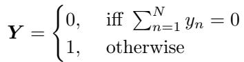

*Eq. (1): MIL 假设——bag 为阴性当且仅当所有 instance 阴性，否则为阳性。*

In the ABMIL [27], the multiple instance learning is modeled by a three-step process. i) Instance transformation into a low-dimensional embedding through neural networks: $h_n = f(x_n)$. ii) Aggregation of all instance embeddings into the bag-level representation using an attention operator. Specifically, this operation is defined as:

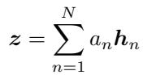

*Eq. (2): bag 表征 $z=\sum_n a_n h_n$，注意力加权求和。*

Here, $a_n = \sigma(h_n)$ represents the attention values for n-th instance, $h_n$. In the case of ABMIL, a gated attention (GA) mechanism [15] is adopted:

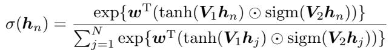

*Eq. (3): 门控注意力 (gated attention)，用 tanh⊙sigmoid 双门控生成注意力权重。*

where V, $V_2 \in \mathbb{R}^{L \times M}$ $w \in \mathbb{R}^{L \times 1}$ are parameters, ⊙ is an element-wise multiplication and sigm(·) is the sigmoid non-linearity. iii) The bag prediction is generated based on the aggregated bag embedding: $\hat{Y} = g(z)$

> 💡 **公式批读**（Eq. 1–3：ABMIL 三步骨架）（Hao 批注）：这是全领域最基础的 MIL 范式，务必吃透——ACMIL、[MHIM](../../%5BICCV%202023%5D%20MHIM-MIL/) 全建在它上面。
> - **Eq. 1**：MIL 的标签假设——只要一个阳性 instance，整袋阳性。这解释了为何注意力会"偷懒"集中：训练目标不要求覆盖所有阳性 instance，抓一个最好认的就够降 loss。
> - **Eq. 2**：聚合 = **注意力加权求和** $z=\sum a_n h_n$。$a_n$ 就是 patch 的"重要性权重"——这正是压缩/保留研究常拿来当 patch importance 的量。
> - **Eq. 3**：门控注意力，$\tanh(V_1 h)\odot\text{sigm}(V_2 h)$ 双支再经 softmax。sigmoid 门控让模型能抑制某些维度。**ACMIL 的所有改动都作用在 $a_n$ 的生成/使用上**，不改 $f$（冻结的 backbone）。

## 3.2 Mutiple Branch Attention

Motivation. It is challenging to capture all discriminative instances using a single attention branch (see Fig. 3). This challenge arises due to variations in patterns among discriminative patches, stemming from diferences in texture and morphology. Additionally, DNNs tend to exhibit a form of "laziness" where they prioritize capturing simpler patterns to minimize training loss, neglecting more intricate and challenging patterns [19, 20]. To tackle this issue, we design the MBA that captures more discriminative instances by multiple attention branches.

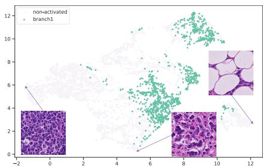

*Fig. 3: MBA 动机。CAMELYON16 'test_113' 肿瘤 instance 特征的 UMAP——肿瘤 instance 内部存在多种 pattern/cluster，单分支只能抓其中一部分；选了三个 instance 展示纹理差异。*

> 💡 **Figure 3 批读**（MBA 的动机图）（Hao 批注）：这张 UMAP 是 MBA 存在的理由——**"判别性 instance"不是一个 cluster，而是多个纹理/形态各异的 cluster**。DNN 的"惰性"（[19,20] shortcut learning）会让单分支只锁定最易分的那个 cluster。所以 MBA 的思路不是"更强的注意力"，而是"更多路互补的注意力"，每路负责一个 pattern。

As depicted in Fig. 4 top view, the MBA firstly captures M patterns and then aggregates their embeddings to make predictions. Each pattern is captured by an attention branch. To maintain both the discriminative nature of patterns and semantic diversity between them, we introduce two regularization techniques: semantic regularization and diversity regularization. Firstly, to ensure capturing discriminative patterns, the semantic regularization is accomplished by hanging a MLP layer behind each pattern embedding, equipping with the cross entropy loss function:

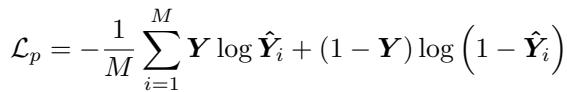

*Eq. (4): 语义正则 $\mathcal{L}_p$——每个分支的 pattern embedding 接 MLP + 交叉熵，保证每支都判别。*

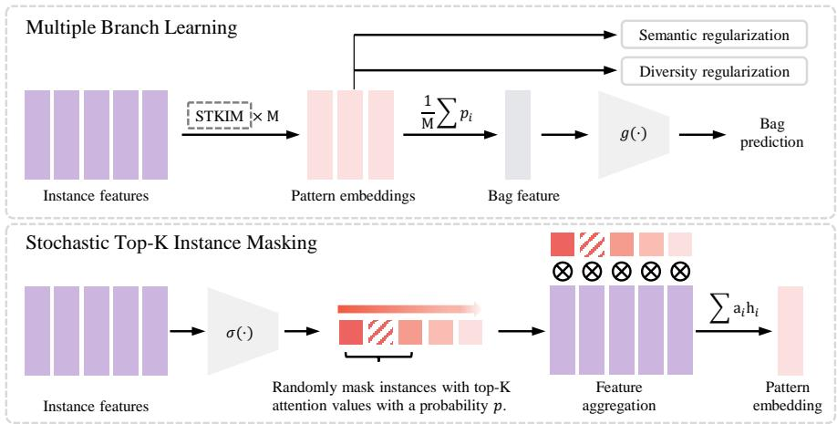

*Fig. 4: MBA（上）与 STKIM（下）总览。MBA 用注意力算子提取 M 个判别 pattern（受语义正则 + 多样性正则约束），对 M 个 pattern 特征做 mean 得到 bag 特征用于分类。STKIM 以概率 p 随机遮蔽 Top-K 注意力 instance。*

> 💡 **Figure 4 批读**（ACMIL 总架构 = 数据流全景）（Hao 批注）：
> - **MBA（上半）**：patch 特征 → M 个并行注意力分支 → 每支产出一个 pattern 的 heatmap $a_i$ 与 embedding $z_i$ → 各支接 MLP 受语义正则 $\mathcal{L}_p$（保判别）→ 各支 heatmap 间受多样性正则 $\mathcal{L}_d$（保互异）→ M 个 pattern 特征 mean pooling 得 bag 特征。
> - **STKIM（下半）**：在"生成注意力值之后、聚合之前"插入——对 Top-K instance 以概率 p 清零并重分配。
> - **关键**：两个模块作用在数据流的不同位置（MBA 在"分支结构"，STKIM 在"注意力后处理"），故正交可叠。

where $\hat{Y}_i = g_i(z_i)$ is the prediction based on i-th pattern embedding, $z_i$. However, only equipping with cross-entropy loss may learn similar patterns and cannot dig out more discriminative information. To tackle this issue, we further introduce a diversity loss as follows:

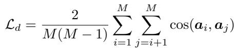

*Eq. (5): 多样性正则 $\mathcal{L}_d$——用分支间 heatmap 的余弦相似度惩罚，逼各分支关注不同区域。*

where $a_i$ consists of all attention values of i-th pattern, $a_i = \{a_{i1}, \cdots, a_{iN}\}$, also named heatmap as custom. The cos(·) function is used to measure the similarity of the heatmaps between branches. By diversifying the heatmaps, the embedding of each branch can concentrate on diferent patterns.

To aggregate the captured patterns to make predictions, the average of heatmaps is utilized as the heatmap of the whole bag:

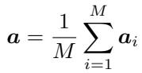

*Eq. (6): 整袋 heatmap = M 个分支 heatmap 的平均。*

where a is the heatmap of the whole bag, with a dimension of N. Then, the bag embedding can be obtained by aggregating the instance features using averaged heatmap $a$. Moreover, since $\sum_{n=1}^{N}(\frac{1}{M}\sum_{i=1}^{M} a_{in})h_n = \frac{1}{M}\sum_{i=1}^{M}(\sum_{n=1}^{N} a_{in}\tilde{h_n})$, the bag embedding also can be formulated by applying mean pooling operator to pattern embeddings. The top view of Fig. 4 adopts the latter formulation for brevity. The loss function for the bag classifier is defined as:

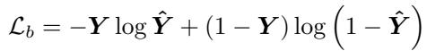

*Eq. (7): bag 分类损失 $\mathcal{L}_b$（交叉熵）。*

Finally, the overall loss function for the ACMIL can be written as the combination of three loss terms defined in Eq. 4, 5 and 7,

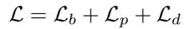

*Eq. (8): 总损失 $\mathcal{L} = \mathcal{L}_b + \mathcal{L}_p + \mathcal{L}_d$。*

> 💡 **公式批读**（Eq. 4–8：MBA 的两把正则是灵魂）（Hao 批注）：
> - **$\mathcal{L}_p$（Eq. 4，语义正则）**：给每个分支单独接分类头 + 交叉熵，保证"每支都是判别性的"，而不是有的支学到无关噪声。
> - **$\mathcal{L}_d$（Eq. 5，多样性正则）**：惩罚分支间 heatmap 的余弦相似度——**这是 MBA 区别于 Multi-Head Attention 的关键**。MHA 的多头没有互异约束，实践中常塌缩成学同一概念（HIPT [10] 已指出）；$\mathcal{L}_d$ 强制各支 heatmap 正交，才能真正覆盖 Fig. 3 的多个 cluster。消融（Tab. 3b）显示去掉 $\mathcal{L}_d$ 掉 5–8pp，证明它不可或缺。
> - **聚合等价性**：Eq. 6 下的推导说明"对平均 heatmap 聚合"等价于"对各分支 embedding 做 mean pooling"——所以 Fig. 4 画成后者更简洁。

Discussion. It's important to highlight that when the parameter M is set to 1 in MBA, it essentially mirrors the feature aggregation process of ABMIL, allowing for the discernment of a single pattern. In this sense, MBA serves as an extension of ABMIL, specifically designed to capture a more diverse set of patterns. We further discuss the connection between MBA and Multiple-Head Attention (MHA). HIPT [10] has unveiled that distinct heads in MHA can efectively capture diferent visual concepts, akin to the role played by our MBA. However, these two techniques can be easily distinguished by: 1) MBA has diversity regularization, ensuring that diferent branches can learn diferent concepts. This is absent in MHA, resulting in diferent heads learning the same concept [10]. We demonstrate the critical role of $\mathcal{L}_d$ for performance in Tab. 3b. 2) MHA is a type of attention formulation, while MBA operates independently of the attention formulation, accommodating MHA within its framework. Appendix Sec. 9.1 reports the results of combining MHA and ACMIL.

> 💡 **机制拆解**（MBA vs MHA：M=1 退化为 ABMIL）（Hao 批注）：作者明确 MBA 是 ABMIL 的超集（M=1 时完全等价）。与 MHA 的两点区别很重要：(1) MBA 有 $\mathcal{L}_d$ 强制互异，MHA 没有 → MHA 头易塌缩；(2) MBA 是"分支结构"层面的设计，与具体注意力公式无关，可以把 MHA 套进 MBA 框架（附录 9.1 验证了 MHA+ACMIL 也提升）。这解释了为何 MBA 能作为通用外挂加到不同注意力 MIL 上。

## 3.3 Stochastic Top-K Instance Masking

Motivation. A tiny number of instances will occupy the majority of attention in ABMIL while ignoring sophisticated discriminative instances. As depicted in Fig. 5, the sum of top-10 attention values is larger than 0.85 on all three datasets. However, the WSI typically involves more than 10 discriminative instances. For instance, in the CAMELYON16 dataset, 129 out of 155 tumor slides contain 10 to 20,000 cancerous instances. In essence, numerous discriminative instances are overlooked. To deal with this issue, the proposed STKIM aims to suppress the salient instances and assign more attention to the remaining instances.

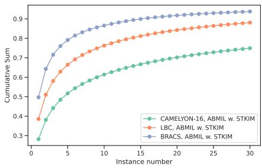

*Fig. 5: STKIM 动机。Top-K 注意力值的累积——少数 instance 占据大部分注意力（Top-10 在三个数据集上都 >0.85）。基于监督预训练特征。*

> 💡 **Figure 5 批读**（"Top-10 占 85%" = 压缩研究该警惕的数字）（Hao 批注）：这是全文最有冲击力的量化证据。**Top-10 个 instance 就吸走了 >85% 的注意力质量**，但 CAMELYON16 的肿瘤片里 129/155 张含有 10–20000 个癌变 instance。含义：**注意力把成百上千个真实阳性 instance 压成了近乎 0 的权重**。对压缩/保留：若按注意力 Top-K 保留 patch，会丢掉绝大多数判别性 patch——这正是 ReadySlide 那条"retention 才是杠杆、per-patch importance 不可尽信"结论的旁证。

As depicted in Fig. 4 bottom view, STKIM introduces a masking operation into the attention mechanism, before feature aggregation and after attention values generation. The primary objective is to suppress Top-K salient instances. A straightforward solution to achieve this is to mask out all of the Top-K salient instances. However, this method poses certain challenges. It can result in the loss of information associated with key instances, which are crucial for discrimination. Furthermore, it might lead to a statistical mismatch between the feature representations before and after discarding these key instances. To address these issues, we draw inspiration from dropout [46] and cutout [17,62] commonly used in computer vision. Our proposed solution employs stochastic masking for instance features with Top-K attention values. Specifically, we begin by sorting all attention values from highest to lowest. Subsequently, we randomly set the attention values of the Top-K instances to 0, with a probability of p. This process can be formulated as:

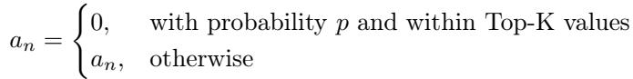

*Eq. (9): STKIM——将 Top-K 内的 instance 以概率 p 把注意力置 0，其余不变。*

where p and K are two hyperparameters that control the intensity of masking. Following Eq. 9, we will assign the attention values of masked instances to the remaining instances by $a_n \to \frac{1}{\sum_{n=1}^{N} a_n} a_n$. Notably, drawing inspiration from dropout and cutout, we remove STKIM at the inference time.

Discussion. While STKIM, MHIM-MIL [47], and WENO [42] all adopt the technique that masks salient instances, there are notable technical distinctions between them. Firstly, our STKIM has the diferent masking strategy compared with WENO and MHIM-MIL. STKIM only masks a minority of instances (i.e., K = 10) with a probability of p. As a comparison, the other two methods mask out a larger number of instances. WENO masks out 95 instances. MHIM-MIL masks 1% instances. In our framework, our scheme performs best in three strategies (see Appendix Sec. 9.5). Secondly, both MHIM-MIL and WENO necessitate a well-trained model for masking out salient instances, utilizing the remaining instances for model training. They both employ a teacher-student framework, wherein the teacher model needs to be pre-trained beforehand (the warm-up process in WENO and the pre-training stage in MHIM-MIL). In contrast, STKIM requires neither a teacher-student framework nor a pre-training process, thus highlighting simplicity and eficiency.

> 💡 **公式批读 + 机制拆解**（Eq. 9：STKIM 为何"随机"而非"全遮"）（Hao 批注）：
> - **为何不全遮 Top-K**：全遮会丢关键信息，且造成训练/推理的统计失配。故借鉴 dropout/cutout，用**概率 p 随机遮**——保留期望上的信息，同时制造扰动逼模型看别处。
> - **重分配**：被遮 instance 的注意力按归一化重新分给其余 instance（$a_n\to a_n/\sum a_n$），保证注意力仍是概率分布。
> - **推理移除**：和 dropout 一样，STKIM 只在训练用，推理关掉（Tab. 3a 证明推理用 STKIM 反而掉 1–3pp）。
> - **与 MHIM/WENO 的三点区别**：STKIM 只遮 K=10（少）、无需 teacher-student、无需预训练。MHIM 遮 1% 且需动量 teacher 两次前向；WENO 遮 95 个且需 warm-up。**STKIM 的卖点是"同样的抗集中效果，但训练成本≈ABMIL"**（Tab. 6：STKIM 训练时间/显存与 ABMIL 几乎相同，MHIM 则显著更高）。
