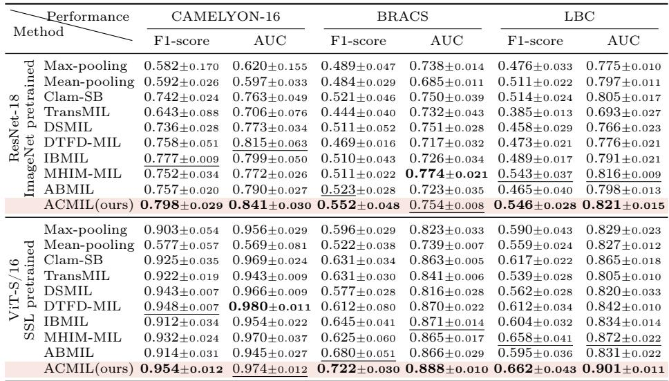
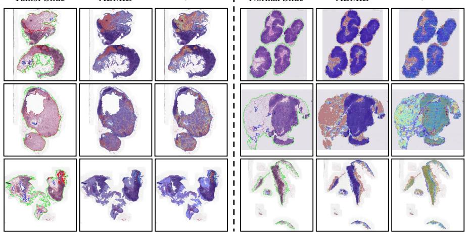
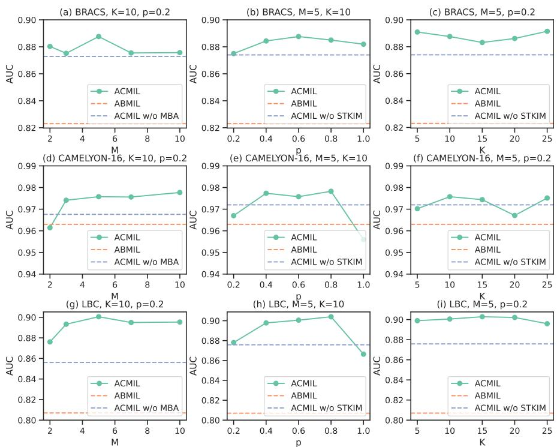
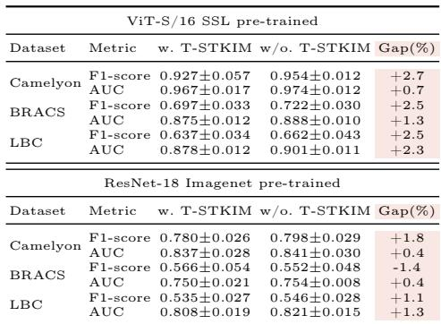
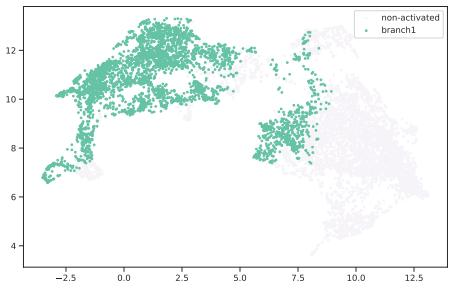
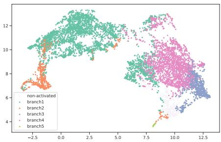
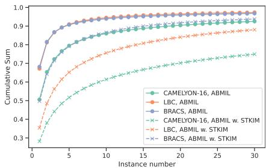

[← 返回 README](../README.md)

# 4. Experiments 实验

## 📌 预览

三数据集（CAMELYON16、BRACS、私有 LBC）× 两 backbone（ImageNet-ResNet18、SSL-ViT-S/16）× 两指标（macro-F1、macro-AUC）= 12 项。ACMIL 在 10/12 项最优、2/12 次优。另有热图/UMAP 可视化证明"抑制注意力集中 + 缓解过拟合"，以及 MBA/STKIM 的消融（$\mathcal{L}_d$ 必要、推理不用 STKIM、K 不敏感、M=5 最好）。

---

## 4.1 Experimental Details

Datasets and Evaluation Metrics. The performance of ACMIL is evaluated on two public WSI datasets, i.e., CAMELYON16 [3] and BRACS [6], and one private benchmark, LBC. CAMELYON16 dataset consists of 400 WSIs in total, including 270 for training and 130 for testing. Following [30, 59], we further randomly split the training and validation sets from the oficial training set with a ratio of 9:1. We do not resplit BRACS dataset as it has been oficially split to 395 of training set, 65 of validation set, and 87 of test set. We follow the challenge for a 3-class WSI classification: benign tumor, atypical tumor, and malignant. The liquid-based cytology (LBC) dataset collected 1,989 WSIs and included 4 classes, i.e., Negative, ASC-US, LSIL, and ASC-H/HSIL. We randomly split the whole dataset into training, validation, and test sets with the ratio of 6:2:2. Following [31], macro-AUC and macro-F1 scores are reported since all three datasets are class imbalanced. Each of the main experiments is performed five times with random parameter initializations, and the average classification performance and standard deviation are reported. Besides, following [36,59], the test performance is reported in epochs with the best validation performance.

Table 1: The performance of diferent MIL approaches across three datasets, two pre-trained methods, and two evaluation metrics. The most superior performance is highlighted in bold, while the second-best performance is indicated by underlining.

*Table 1: 三数据集 × 两预训练 × 两指标下各 MIL 方法对比。加粗为最优、下划线为次优。*

> 💡 **Table 1 批读**（主结果 = 证据链核心）（Hao 批注）：
> - **总战绩**：ACMIL 在 12 项里 10 项最优、2 项次优。ResNet18 特征下 CAMELYON16 F1/AUC 分别超次优 +2.1/+2.6pp；BRACS（SSL 特征）超次优 +4.2/+1.7pp；LBC 全面领先。
> - **一个关键观察（对压缩研究极重要）**：**Mean-pooling 在 SSL 特征下崩得很惨**（CAMELYON16 AUC 仅 0.569），而 Max-pooling 反而不错（0.956）——这与 [SiMLP](../../../ckmil-re-attn-mil/) 里"mean>>max"的结论相反。差异根源是特征分布：SSL 特征下阳性信号稀疏且强，mean 会被大量阴性 patch 稀释。**说明"用什么聚合"高度依赖特征来源**，没有普适赢家。
> - **SSL 特征下差距收窄**：ViT-S/16 SSL 特征让所有注意力法 AUC 都 >0.9，ACMIL 与 DTFD-MIL 接近 → 好特征本身就压制了过拟合，ACMIL 的增量在弱特征（ResNet18）下更明显。

Baselines. We systematically assess the eficacy of our ACMIL approach by benchmarking it against conventional MIL pooling strategies, Max-pooling and Mean-pooling, as well as contemporary attention-based techniques such as AB-MIL [27], DSMIL [30], TransMIL [45], CLAM-SB [36], DTFD-MIL [59], MHIM-MIL [47], and IBMIL [34]. In pursuit of a comprehensive comparison across diverse aggregation operators, we utilize two distinct sets of features derived from ResNet-18 pre-trained on the ImageNet dataset [22] and ViT-S/16 pretrained using DINO [8] on a substantial collection of 36,666 WSIs [28]. The results of all other methods are reproduced using the oficial code they provide under the same settings.

Implementation Details. Implementation Details are in Appendix Sec. 8.

## 4.2 WSI Classification Results

Tab. 1 provides a thorough comparison of performance between ACMIL and existing MIL methods. This evaluation spans three diverse datasets, involves two diferent choices for pretraining methods, and employs two crucial evaluation metrics, resulting in a comprehensive assessment with a total of 12 terms.

Considering the overall performance, ACMIL consistently outshines existing methods. It secures the top position in 10 out of the 12 metrics and holds the second position in the remaining 2 metrics. Specifically, for the CAMELYON16, ACMIL achieves outstanding results using ResNet-18 pre-trained on ImageNet embeddings, surpassing the runner-up by 2.1% and 2.6% in terms of F1-score and AUC, respectively. On the other hand, with ViT-S/16 SSL pretrained embeddings, existing attention-based MIL methods exhibit remarkable performance, boasting F1-scores and AUC values exceeding 0.9. Notably, ACMIL achieves comparable performance with the former best-performing method, DTFD-MIL, in this setup. For the BRACS, ACMIL demonstrates a substantial lead when utilizing ViT-S/16 SSL pre-trained embeddings, surpassing the second-best performance by margins of 4.2% and 1.7% in F1-score and AUC, respectively. Moreover, when employing ResNet-18 pre-trained on ImageNet embeddings, ACMIL achieves comparable performance with the previously top-performing method, MHIM-MIL. For the LBC, ACMIL stands out significantly among the other methods across all four metrics.

## 4.3 Localization Results

Heatmap visualization. Fig. 6 presents heatmap visualizations illustrating examples of our approach's performance in comparison to the baseline method, ABMIL [27]. Three tumor slides (left part) and three normal slides (right part) are selected to showcase the heatmap diferences.

*Fig. 6: ABMIL（baseline）与 ACMIL 的热图对比。左：三张肿瘤 WSI（红线为肿瘤区），ACMIL 覆盖更完整；右：三张正常 WSI，ABMIL 只盯脂肪等局部，ACMIL 覆盖更多正常组织。*

> 💡 **Figure 6 批读**（热图 = 定性证据）（Hao 批注）：肿瘤片上 ABMIL 只点亮部分肿瘤区，ACMIL 覆盖更全、更贴合专家标注；正常片上 ABMIL 只盯脂肪（易误导为"只有脂肪是正常组织"），ACMIL 把注意力铺满所有正常区。这正是 MIL 假设（Eq. 1）想要的——**所有相关 instance 都该对 bag label 有贡献**，而非少数。但注意后文附录 Fig. 13 诚实展示了反例：过度铺开有时把正常 instance 也点亮、或在小肿瘤上定位变糊。

For the tumor slides, ABMIL tends to concentrate its attention on only a fraction of the tumor regions, potentially overlooking other significant areas. In contrast, ACMIL allocates attention across a wider spectrum of tumor regions, resulting in better alignment with expert annotations. For the normal slides, ABMIL predominantly focuses on specific tissue types, such as adipose tissue. This will lead to misinterpretation that only the adipose tissue is the normal tissue and other normal regions are uncorrelated to the WSI label. On the other hand, ACMIL efectively distributes attention values to encompass all normal regions, ensuring all regions are correlated for the WSI label. This approach closely mimics human intuition and satisfies the definition of the MIL formulation.

FROC results. We employ the FROC metric suggested by CAMELYON16 challenge to evaluate the localization of tumor region quantitatively. As shown in Tab. 2, the proposed ACMIL achieves higher FROC than ABMIL.

Table 2: Comparison of FROC between ABMIL and ACMIL

| | ABMIL | ACMIL |
|------|-------|-------|
| FROC | 0.3987 | 0.4233 |

> 💡 **Table 2 批读 + 局限伏笔**（Hao 批注）：ACMIL 的 FROC（肿瘤定位）从 0.3987 提到 0.4233，确实更好；但**绝对值仍很低**——附录 Sec. 10 坦承 ACMIL 的 FROC 0.4322 远低于全监督方法的 0.8074。含义：**分散注意力提升了分类泛化，却没让定位变准**。这对"用注意力做可解释定位/压缩定位"是个警告：分类友好的注意力 ≠ 定位友好的注意力。

## 4.4 Ablation Study

Fig. 7 illustrates the AUC scores of ACMIL across three datasets when utilizing a ViT/B-16 feature extractor and varying hyperparameter settings.

*Fig. 7: 超参消融（SSL 特征）。橙色虚线为 ABMIL baseline，蓝色虚线为 ACMIL 去掉 MBA/STKIM。三列分别研究 M、p、K。*

Efect of branches number M in MBA. As shown in the first column, we find that the choice of M afects performance significantly. Combining three datasets, setting M = 5 achieves the best performance.

Efect of masking probability p in STKIM. As shown in the second column, we find that the choice of M also afects performance significantly. Notably, setting $p = 1.0$ (masking all of Top-K instances) leads to performance deterioration across all three datasets. For LBC and CAMELYON, a $p = 1.0$ setting even results in performance lower than the blue dotted lines. Otherwise, $p = 0.6$ achieves the best performance on the BRACS dataset, whereas p = 0.8 achieves the best performance on the other two datasets.

Efect of number of masking instances K in STKIM. The third column shows that hyperparameter K exhibits minimal sensitivity, where diferent K values result in a performance diference of less than 1.0% AUC. In practice, setting K to 10 is generally suficient for achieving near-optimal performance.

Implementing either MBA or STKIM individually leads to significant performance improvements. The blue dotted lines represent ACMIL's AUC performance without MBA or STKIM, outperforming the orange dotted lines (ABMIL's performance) across all subfigures. Particularly noteworthy is the observation that MBA achieves better improvement than STKIM on all three datasets.

Combining MBA with STKIM yields greater performance improvements compared to using either MBA or STKIM alone. The green dots represent ACMIL's performance under diferent hyperparameter combinations, with 39 out of 45 green dots exceeding blue dotted lines.

> 💡 **Figure 7 消融解读**（四条可复用结论）（Hao 批注）：
> 1. **M（分支数）**：显著影响，综合三数据集 **M=5 最好**（太少覆盖不全，太多冗余/难训）。
> 2. **p（遮蔽概率）**：**p=1.0（全遮 Top-K）反而变差**，甚至低于不用 STKIM——印证 3.3 节"随机遮而非全遮"的设计；BRACS 最优 p=0.6，其余 p=0.8。
> 3. **K（遮蔽数量）**：**不敏感**（不同 K 差 <1pp AUC），K=10 足矣——说明关键是"打断 Top 少数垄断"这个动作，而非精确遮多少个。
> 4. **正交叠加**：单用 MBA 或 STKIM 都超 ABMIL（蓝>橙），MBA 增益 > STKIM；两者合用 45 组超参里 39 组超单用。

*Table 3(a)/(b): (a) 测试期用/不用 STKIM 的对比（用了略降）；(b) 有/无多样性损失 $\mathcal{L}_d$ 的对比（无 $\mathcal{L}_d$ 大幅下降）。*

Do we need STKIM at the test phase? The answer is No. In Tab. 3a, we present the outcomes of ACMIL with and without STKIM during the test phase. Across 11 out of 12 evaluation metrics, the version of ACMIL without STKIM during testing outperforms the version with STKIM slightly. This suggests that STKIM is not necessary during the test phase.

Do we need diversity loss in MBA? The answer is Yes. In Tab. 3b, we present the outcomes of ACMIL with and without $\mathcal{L}_d$. Notably, the last column clearly indicates a significant performance drop for ACMIL without $\mathcal{L}_d$. This emphasizes the crucial role of $\mathcal{L}_d$ in encouraging diferent branches to acquire distinctive discriminative knowledge within the MBA technique.

> 💡 **Table 3 消融解读**（两个"要不要"）（Hao 批注）：
> - **(a) 测试期要不要 STKIM？不要**——11/12 项显示测试用 STKIM 反而降 1–3pp。与 dropout 同理：训练扰动、推理关闭。
> - **(b) 要不要 $\mathcal{L}_d$？要**——去掉多样性损失，CAMELYON16 F1 掉 5.3pp、BRACS F1 掉 8.0pp。这是 MBA 有效性的关键：没有 $\mathcal{L}_d$，多分支会塌缩成学同一 pattern（退化成 MHA），MBA 就名存实亡。

## 4.5 Further Analysis

MBA can capture diverse patterns. In Fig. 8a, tumor instances exhibit two primary patterns; ABMIL primarily activates the left pattern and neglects the right. In Fig. 8b, MBA's various branches collectively capture the substructures of the left pattern, while branch4 captures the right pattern.

ACMIL can learn more discriminative bag features. In Fig. 9, ACMIL separates the LSIL and ASC-H/HSIL clusters from the Negative cluster better than ABMIL. ACMIL achieves a V-measure of 0.316 vs ABMIL's 0.224.

<table>
<tr>
<td width="50%"></td>
<td width="50%"></td>
</tr>
<tr>
<td align="center"><i>Fig. 8a: ABMIL（单分支只抓左 pattern）</i></td>
<td align="center"><i>Fig. 8b: ABMIL+MBA（多分支分别抓左/右 pattern）</i></td>
</tr>
</table>

*Fig. 8: CAMELYON16 'test_090' 肿瘤 instance 特征 UMAP。instance>1/N 视为被激活。*

STKIM can suppress the concentration of Top-K attention values. Fig. 10 shows that STKIM mitigates Top-K dominance—for CAMELYON16 the cumulative sum of top-10 values decreases from 0.87 to 0.6.

*Fig. 10: 用/不用 STKIM 时 Top-K 注意力累积对比。STKIM 把 CAMELYON16 的 top-10 累积从 0.87 降到 0.6。*

> 💡 **Figure 8 & 10 批读**（机制被直接看见）（Hao 批注）：Fig. 8 直接可视化了 MBA 的工作原理——单分支 ABMIL 漏掉右 cluster，MBA 的 branch4 专门补上。Fig. 10 则量化 STKIM 的效果：把 Top-10 注意力占比从 0.87 压到 0.6，即**把注意力质量从少数尖峰"摊平"到更多 instance**。两图分别对应 MBA/STKIM 的设计意图，是"机制被实验直接看见"的好范例。V-measure 从 0.224→0.316 则说明 bag 特征的类可分性也提升了。
