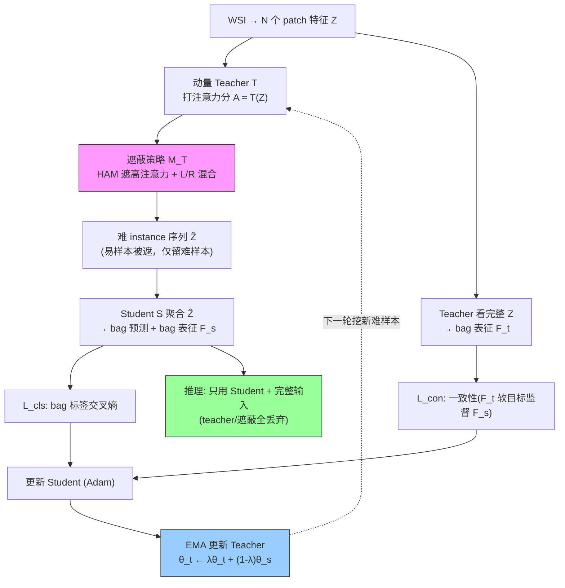

# MHIM-MIL: Multiple Instance Learning Framework with Masked Hard Instance Mining

**作者**: Wenhao Tang, Sheng Huang, Xiaoxian Zhang, Fengtao Zhou, Yi Zhang, Bo Liu（Chongqing University / HKUST / Walmart Global Tech）
**会议**: ICCV 2023 | **年份**: 2023（arXiv 2307.15254）
**链接**: [arXiv](https://arxiv.org/abs/2307.15254) · [Code](https://github.com/DearCaat/MHIM-MIL)

## 一句话总结

反直觉地**遮掉高注意力的"易分 instance"、逼 MIL 模型用"难分 instance"训练**，从而学到更好的判别边界；用动量 Teacher-Student（EMA，无额外参数）+ 一致性损失稳定挖掘，可插到任意注意力 MIL（ABMIL/TransMIL/DSMIL）上，在 CAMELYON-16 与 TCGA 肺癌上刷新 SOTA 且训练更省。

## 核心贡献

1. **Masked Hard Instance Mining (MHIM)**：用注意力分数**间接**挖难样本——遮掉 top-$\beta_h$% 高注意力 instance，剩下的当难样本训练。解决了 MIL 无 instance 标签、无法直接做 hard mining 的难题。
2. **混合遮蔽策略**：HAM（遮高注意力）为核心，可并入 L-HAM（遮低注意力去冗余提效）、R-HAM（随机遮防过拟合）、LR-HAM（全并）；配 mask ratio decay + Randomly HAM 防"错误挖掘"。
3. **动量 teacher + 一致性优化**：teacher 由 student 的 EMA 更新（无参数、稳定），一致性损失挖出 slide 标签外的额外监督；迭代提升双方判别力。
4. **通用 + 高效**：三个 backbone 均涨点；相比 DTFD 更省参数，相比 TransMIL 基线 -24% 训练时间、-48% 显存、AUC std 2.13%→0.48%。

## 📖 批读导航

| Section | 内容 |
|---------|------|
| [00 - Abstract](sections/00-abstract.md) | 摘要 + 与 ACMIL 的表亲关系 |
| [01 - Introduction & Related Work](sections/01-introduction.md) | Fig.1 立论、MIL 两类、CV hard mining 三类 |
| [02 - Method](sections/02-method.md) | MIL 形式化(Eq.1-3)、Siamese 框架(Eq.4)、遮蔽策略(Eq.5-7)、一致性优化(Eq.8-10) |
| [03 - Experiments](sections/03-experiments.md) | Table 1 主结果、Table 2 效率、Table 3/4/5 消融、Fig.4 可视化 |
| [04 - Conclusion & Appendix](sections/04-conclusion.md) | 结论、附录技巧（decay/Randomly HAM/首层注意力/voting）、局限 |

## 关键数字

| 指标 | 数值 |
|------|------|
| 数据集 | CAMELYON-16（400 WSI，3×3-fold CV）/ TCGA Lung（LUAD 541 + LUSC 512，4-fold） |
| Backbone | ResNet-50-ImageNet 特征（1024→512），可插 ABMIL/TransMIL/DSMIL |
| C16 最优 | MHIM(TransMIL/DSMIL) 96.49% AUC（超次优 DTFD +1.34pp） |
| TCGA 最优 | MHIM(DSMIL) 95.53% AUC（超次优 +1.70pp） |
| 效率 | 参数=ABMIL(657K)；TransMIL 上 -24% 时间、-48% 显存 |
| 稳定性 | AUC std：TransMIL 2.13% → MHIM 0.48% |
| 关键超参 | EMA λ=0.9999, 温度 0.1, $\alpha$ 平衡两损失, $\beta_h/\beta_r/\beta_l$ 遮蔽比率 |
| patch 规模 | C16 3.6M patch（~9000/bag），TCGA 10.8M（~10300/bag） |

## 数据流：输入 → 中间表示 → 输出

## 优缺点与还能做什么

### 优点
- **反直觉但有效**：训练用难样本学更好边界，两数据集 SOTA。
- **通用外挂**：可插任意注意力 MIL；动量 teacher 无额外参数。
- **更省更稳**：遮蔽缩短 student 输入，训练时间/显存/方差三降。

### 局限 / 风险
- **难样本难精确评估**：用注意力间接挖是"粗糙代理"，可能挖到非最优难样本，收敛稍慢。
- **调参负担重**：遮蔽策略需按数据/backbone 选，$\beta_h/\beta_r/\beta_l$ + decay + Randomly HAM + TransMIL 首层/voting + student 初始化，一堆技巧（对比 ACMIL 的 STKIM 只需 K/p）。
- **注意力≠肿瘤概率**：可视化提醒别把注意力当定位/概率用。

### 还能做什么
- **更好的难度度量**：作者展望——无监督下精确评估 instance 难度（如用一致性偏差、预测熵）替代"遮高注意力"这个粗代理。
- **与压缩/保留结合**：MHIM 的"难 instance 更有信息"暗示压缩不能只留高注意力 patch——难样本（边界 patch）同样该保留；可把"难度"纳入 retention 度量。
- **与 ACMIL 融合**：STKIM 的轻量随机遮 + MHIM 的 teacher 一致性，或可取长补短。

## 阅读 Q&A 记录

- **Q: 遮掉高注意力 instance 后，模型不会丢掉关键诊断信息吗？**
  A: 会有风险（作者称"error mining"）。解法：Randomly HAM（在 top-$2\beta_h$% 里随机遮一半，保留部分关键 instance）+ mask ratio decay（后期少遮）。且一致性损失让 student 向"看全部"的 teacher 对齐，防判断漂移。

- **Q: 为什么要动量 teacher，而不是让模型自己挖？**
  A: WSI 只能 batch=1 训练，student 自身注意力很抖（噪声大）。动量 teacher 是 student 的 EMA（λ=0.9999），平滑稳定、无额外参数（Tab.5 证明比 student-copy 稳且准）。

- **Q: 和 ACMIL 的 STKIM 有何区别？**
  A: 都遮显著 instance。STKIM 只遮 K=10、无 teacher、推理移除、调参少；MHIM 遮 $\beta_h$% 较多、需动量 teacher + 一致性损失、通用性更强但调参重。ACMIL 论文实测 STKIM 训练开销≈ABMIL，MHIM 更高。

- **Q: 对 WSI 压缩/保留研究的启示？**
  A: "训练时留难 instance 更好 + 注意力≠肿瘤概率"——警告"按注意力 Top-K 保留 patch"会漏掉难样本（边界信息）且误信高注意力非肿瘤区。retention 需比单一注意力更鲁棒的度量。

## 📊 Citation Landscape

> Semantic Scholar 详情接口采集时限流（429），据论文自身引用整理。MHIM-MIL 是 WSI-MIL 领域高影响力工作，被 ACMIL 等后续"抗过拟合/难样本"研究列为核心对照。

**同主题最相关**
- ABMIL [20]（ICML 2018）——注意力池化基座，MHIM 的默认 backbone 之一。
- TransMIL [31]（NeurIPS 2021）、DSMIL [22]（CVPR 2021）——另两个被 MHIM 增强的 backbone。
- DTFD-MIL [49]（CVPR 2022）——伪 bag 双层蒸馏，主要竞品（次优）。
- CLAM [26]（Nat BME 2021）——数据预处理与弱监督 MIL 的标准。
- [ACMIL](../%5BECCV%202024%5D%20ACMIL/)（ECCV 2024）——同为"遮蔽显著 instance 抗过拟合"，本目录已批读，是最直接的对照/后续工作。

**方法思想来源**
- FaceNet [30]、OHEM [34]、triplet/ReID hard mining [1,33,38,39]——hard sample mining 的经典来源。
- BYOL/SimSiam/DINO [5,8]、Siamese [3]——动量 teacher / Siamese 结构来源。
- SVM [17]——"边界样本更有信息"的经典直觉。
