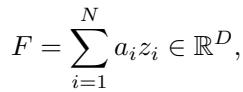
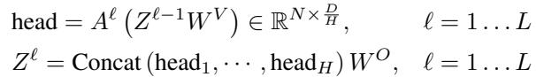
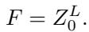
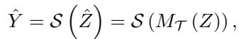
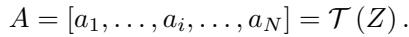
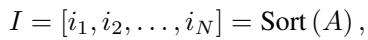
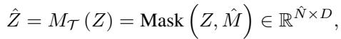
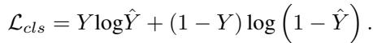
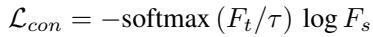
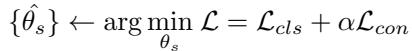

[← 返回 README](../README.md)

# 3. Proposed Method 方法

## 📌 预览

方法四块：**3.1 MIL 形式化**（注意力聚合 Eq.1 / 自注意力聚合 Eq.2-3，二者统称通用注意力 MIL）；**3.2 MHIM-MIL 框架**（Siamese：动量 teacher 打分遮蔽 → student 只看难 instance，Eq.4）；**3.3 遮蔽策略**（HAM 高注意力遮蔽 + L-HAM/R-HAM/LR-HAM 三种混合，Eq.5-7）；**3.4 一致性迭代优化**（student 用 $\mathcal{L}_{cls}+\alpha\mathcal{L}_{con}$，teacher 用 EMA，Eq.8-10）。

---

## 3.1. Background: MIL Formulation

In MIL, any input WSI X is considered as a bag with multiple instances $X = \{x_i\}_{i=1}^{N}$, $x_i$ is a patch. There exists a known label $Y \in C$ for the bag and an unknown label $y_n \in C$ for each instance. The goal of a MIL model $\mathcal{M}(\cdot)$ is to predict the bag label $\hat{Y} \leftarrow \mathcal{M}(X)$. The popular solution is to learn a bag representation $F$ from instance features $Z = \{z_i\}_{i=1}^{N}$ (instance aggregation), then a classifier $\mathcal{C}(\cdot)$ predicts $\hat{Y} \leftarrow \mathcal{C}(F)$. There are two ways to aggregate. One is the attention-based aggregation [20]:

*Eq. (1): 注意力聚合 $F=\sum_i a_i z_i$，$a_i$ 为 $z_i$ 的可学习标量权重。*

Another is the multi-head self-attention (MSA) based aggregation [31]. A class token $z_0$ is embedded to get $Z^0 = [z_0, z_1, \ldots, z_N]$:

*Eq. (2): MSA 聚合，多头 + 多层 Transformer。*

*Eq. (3): bag embedding = 末层 class token $F=Z_0^L$。*

The self-attention-based bag embedding is essentially a special case of attention-based bag embedding. Collectively, these approaches can be referred to as the general attention-based MIL method.

> 💡 **公式批读**（Eq. 1–3：为何统一成"通用注意力 MIL"）（Hao 批注）：这一步统一很关键——不管是 ABMIL 的标量注意力（Eq.1）还是 TransMIL 的自注意力（Eq.2-3），本质都是"用注意力权重聚合 instance"。作者论证自注意力是注意力聚合的特例，从而 **MHIM 可以插到任意一种上**（后文在 ABMIL/TransMIL/DSMIL 三个 backbone 上都验证）。这就是 MHIM 号称"通用外挂"的形式化基础。

## 3.2. MHIM-MIL for WSI Classification

In general attention-based MIL frameworks, the attention scores of instances indicate the contributions of instances to the bag classification. The salient instances with high scores are useful for classifying WSI in the testing phase but are not conducive to training a MIL model with good generalization ability... As illustrated in Figure 2, the MHIM-MIL framework employs a Siamese structure during the training phase. The main component is a general attention-based MIL model (Student) $\mathcal{S}(\cdot)$. To increase the discriminatory difficulty and force it to focus on hard instances, we introduce a momentum teacher $\mathcal{T}(\cdot)$ to score instances with attention weights and then employ masked hard instance mining strategies to mask the salient instances while preserving the hard instances. The teacher shares the same network structure as the student but does not need gradient-based updates.

*Figure 2: MHIM-MIL 总览。动量 teacher 对所有 instance 打注意力分 → 用 hard mining 策略遮蔽 → 剩余喂 student。student 由一致性损失 $\mathcal{L}_{con}$ + 标签损失 $\mathcal{L}_{cls}$ 更新，teacher 由 student 的 EMA 更新（无梯度）。推理时只用完整输入 + student。*

The proposed framework can be defined as:

*Eq. (4): $\hat{Y}=\mathcal{S}(\hat{Z})=\mathcal{S}(M_\mathcal{T}(Z))$，$M_\mathcal{T}$ 是经 teacher 的遮蔽策略。*

> 💡 **Figure 2 + 机制拆解**（数据流全景 + 为何用 Siamese 而非级联）（Hao 批注）：
> - **训练数据流**：完整 instance $Z$ → teacher 打分 $A$ → 遮蔽策略产 $\hat Z$（只留难 instance）→ student 聚合 $\hat Z$ 预测 → 两个损失更新 student → EMA 更新 teacher → 下一轮 teacher 挖新难样本。
> - **推理**：teacher 和遮蔽全丢掉，只用 student + 完整输入。所以推理成本 = 普通 MIL。
> - **为何 Siamese 而非 DTFD 式级联梯度**：WSI 的 bag instance 数不定 → 只能 batch=1 的 SGD（噪声大）。级联梯度结构（DTFD）在此不稳且参数多；动量 teacher（EMA）**无额外参数、更稳**（Tab. 2：MHIM 参数 = ABMIL 的 657K，DTFD 是 987K）。

## 3.3. Masked Hard Instance Mining Strategy

Given a complete sequence $Z = \{z_i\}_{i=1}^{N}$ as input to the teacher $\mathcal{T}(\cdot)$, the teacher outputs attention weight $a_i$:

*Eq. (5): teacher 输出注意力序列 $A=[a_1,\ldots,a_N]=\mathcal{T}(Z)$。*

Then we obtain the indices in descending order:

*Eq. (6): 按注意力降序排序得索引 $I=\text{Sort}(A)$。*

We define a binary mask vector $M = [m_1, \ldots, m_N]$, $m_i \in \{0,1\}$ (1=masked).

**High Attention Masking (HAM)**: masks instances with the top $\beta_h$% highest attention scores. $M_h(:)=0$, collect top-$\beta_h$% indices $I_h$, set $M_h(I_h)=1$. To ensure positive instances are preserved, we also use mask ratio decay.

**Hybrid Masking**: combine HAM with other strategies via union:
• **L-HAM**: also mask top $\beta_l$% *lowest* attention scores to filter redundant uninformative instances, $\hat{M}=M_h \cup M_l$.
• **R-HAM**: generate a random mask $M_r$ with ratio $\beta_r$% and union with $M_h$, introducing randomness to reduce over-fitting, $\hat{M}=M_h \cup M_r$.
• **LR-HAM**: combine all, $\hat{M}=M_h \cup M_r \cup M_l$.

*Figure 3: 混合遮蔽策略示意——HAM（遮高注意力）为核心，可并入 L（遮低注意力去冗余）、R（随机遮防过拟合）。*

Once $\hat{M}$ is produced, the masked instance sequence is:

*Eq. (7): $\hat{Z}=M_\mathcal{T}(Z)=\text{Mask}(Z,\hat{M})$，$\hat{N}$ 为未遮蔽 instance 数。*

> 💡 **机制拆解 + 公式批读**（三种混合遮蔽各治什么）（Hao 批注）：
> - **HAM（核心）**：遮 top-$\beta_h$% 高注意力 → 逼模型看难样本。但风险：可能把关键阳性信息全遮 → 变"error mining"。故配 **mask ratio decay**（$\beta_h$ 随训练余弦衰减，前期多遮逼学难、后期少遮保信息）+ **Randomly HAM**（附录：在 top-$2\beta_h$% 里随机遮一半，保留部分关键信息）。
> - **L-HAM**：额外遮**低**注意力 instance（冗余无信息）→ 提效率（尤其对 TransMIL 的 $O(N^2)$，大幅减输入长度）。
> - **R-HAM**：随机遮 → 引入随机性防过拟合。
> - **数据集依赖**（Tab. 4）：ABMIL 偏爱 R-HAM（善过滤冗余），TransMIL 偏爱 L-HAM；肿瘤占比大的 TCGA 用 LR-HAM 最好，肿瘤占比极小的 CAMELYON16 遮太多反而丢信息。**没有普适最优策略，需按数据/backbone 选**——这是本文诚实但也略繁琐之处。

## 3.4. Consistency-based Iterative Optimization

Under the Siamese structure, the teacher guides the student while the student updates the teacher, progressively improving both. **Student Optimization** has two losses. Cross-entropy for bag label:

*Eq. (8): 标签损失 $\mathcal{L}_{cls}$（交叉熵）。*

A consistency loss between student bag rep $F_s$ and teacher bag rep $F_t$:

*Eq. (9): 一致性损失 $\mathcal{L}_{con}=-\text{softmax}(F_t/\tau)\log F_s$，$\tau$ 为温度。*

*Eq. (10): 总损失 $\mathcal{L}=\mathcal{L}_{cls}+\alpha\mathcal{L}_{con}$。*

**Teacher Optimization**: parameters $\theta_t$ updated by EMA of student: $\theta_t \leftarrow \lambda\theta_t + (1-\lambda)\theta_s$. The updated teacher is used in the next iteration of hard instance mining.

> 💡 **公式批读**（Eq. 8–10：一致性损失的作用）（Hao 批注）：
> - **$\mathcal{L}_{cls}$**：常规 bag 交叉熵，用 slide 标签。
> - **$\mathcal{L}_{con}$**：让 student（看**部分**难 instance）的 bag 表征去逼近 teacher（看**完整**instance）的 bag 表征。含义：**即使只喂难 instance，student 也要产出和"看全部"一致的判断** → 挖出 slide 标签之外的额外监督（teacher 的软目标），且防止遮太多导致 student 判断漂移。$\tau$ 温度控制软目标锐度，$\alpha$ 平衡两损失（附录 Fig. 12：$\alpha$ 过大压制 slide 标签的作用，尤其 CAMELYON16 上难 slide 需 slide 标签纠偏）。
> - **EMA teacher**：$\lambda=0.9999$（附录 D）→ teacher 是 student 的慢速滑动平均，稳定、不产生梯度、不加参数。**这是整个框架"稳"的来源**（Tab. 5：动量 teacher AUC std 0.48% vs student-copy 更抖）。
