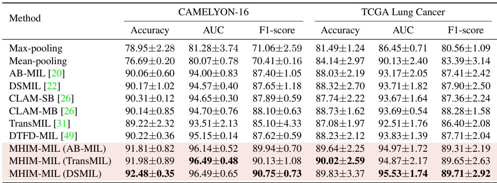
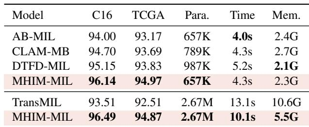
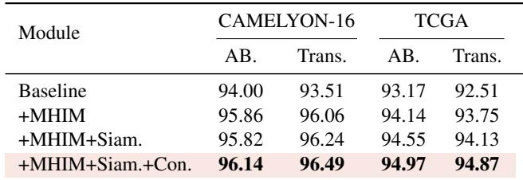
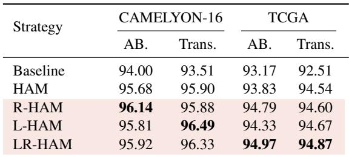
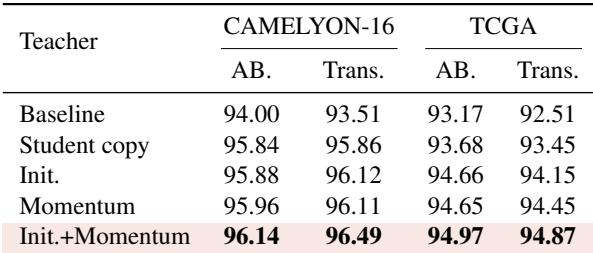
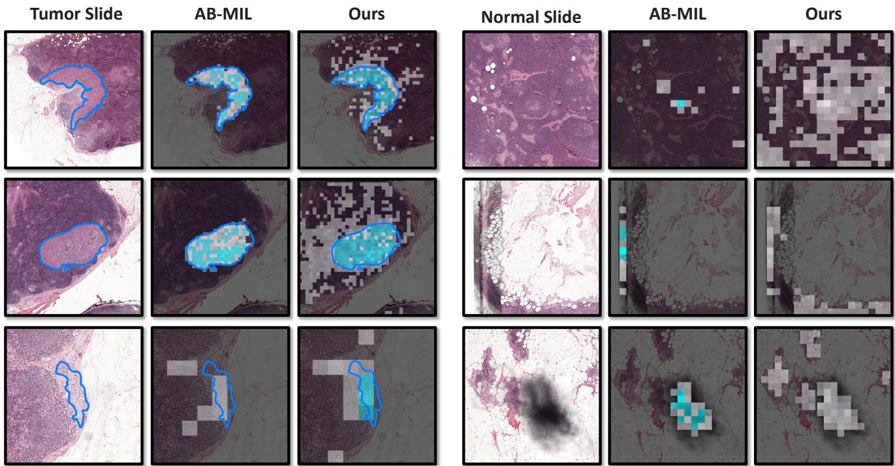

[← 返回 README](../README.md)

# 4. Experiments 实验

## 📌 预览

两数据集（CAMELYON-16 转移检测、TCGA 肺癌分型）× 3 个 backbone（ABMIL/TransMIL/DSMIL）。MHIM 在两数据集均刷新 SOTA（C16 96.49% AUC、TCGA 95.53% AUC），且训练更省（TransMIL 上 -24% 时间、-48% 显存）。消融拆出 MHIM/Siamese/一致性各自贡献、四种遮蔽策略的数据依赖性、teacher 类型的影响。

---

## 4.1. Datasets and Evaluation Metrics

CAMELYON-16 [2] is a WSI dataset for metastasis detection in breast cancer, 400 WSIs (270 train / 130 test). Following [6, 26, 50], we adopt 3-times 3-fold cross-validation. TCGA Lung Cancer includes LUAD (541 slides) and LUSC (512 slides); split train/val/test 65:10:25 at patient level with 4-fold CV. We leverage Accuracy, AUC, and F1-score; AUC is the primary metric and the only one reported in ablations.

## 4.3. Performance Comparison with Existing Works

We compare with AB-MIL [20], DSMIL [22], CLAM-SB/MB [26], TransMIL [31], DTFD-MIL [49], plus Max/Mean-pooling.

*Table 1: 各 MIL 方法在 CAMELYON-16 与 TCGA 上的性能。加粗为最优。MHIM-MIL 在三个 backbone（ABMIL/TransMIL/DSMIL）上均超越现有方法。*

As shown in Table 1, max-pooling and mean-pooling perform poorly (insufficient modeling of key instances; max-pooling lags DTFD-MIL by 13.87% AUC on C16). Attention-based methods do better. DTFD-MIL achieves second-best on both (95.15% AUC on C16, 93.83% on TCGA) but suffers from overemphasizing salient instances, limiting generalization. MHIM-MIL achieves +1.34% AUC on C16 and +1.70% AUC on TCGA over the runner-up by mining hard instances. We validate on three representative MIL models, all outperforming existing methods.

> 💡 **Table 1 批读**（主结果 = MHIM 的通用性证据）（Hao 批注）：
> - **最优战绩**：MHIM(DSMIL) 在 C16 达 92.48% Acc / 96.49% AUC；TCGA 达 95.53% AUC。三个 backbone 装上 MHIM 后**全部**超越各自基线和所有对手。
> - **关键点：通用外挂**。MHIM 不是一个新模型，而是一个能加到 ABMIL/TransMIL/DSMIL 上都涨点的框架——这与 [ACMIL](../%5BECCV%202024%5D%20ACMIL/) 的定位一致（都强调"可插任意注意力 MIL"）。
> - **Max/Mean pooling 崩盘**：在 C16（阳性占比极小）上 max-pooling 落后 DTFD 13.87% AUC——再次印证"简单池化在稀疏阳性 WSI 上不行"，与 ACMIL Table 1 观察一致，也与 [SiMLP](../../ckmil-re-attn-mil/)"mean 池化够用"的结论形成有趣张力（差异来自特征质量 + 数据阳性占比）。

*Table 2: 各 MIL 方法在 C16 上的参数量、单 epoch 训练时间、峰值显存对比。*

## 4.4. Computational Cost Analysis

Traditional MIL frameworks introduce extra parameters and reduce efficiency due to complex structures. DTFD-MIL [49] increases parameters nearly 2× (657K→987K) and training time by 30%. MHIM-MIL achieves the most significant improvement with almost no extra cost (momentum teacher is parameter-free). TransMIL [31] has 4× more parameters than AB-MIL, 3× longer training, 4.5× memory, and high instability (2.13% AUC std on C16). With masked hard instance mining, MHIM-MIL reduces cost by −24% training time and −48% memory and improves stability (0.48% AUC std on C16).

> 💡 **Table 2 批读**（效率账 = 反直觉的亮点）（Hao 批注）：一般"加 teacher"会更贵，但 MHIM 反而**更省**——关键在遮蔽：L-HAM/R-HAM 大幅缩短喂给 student 的序列，对 $O(N^2)$ 的 TransMIL 尤其显著（-48% 显存）。teacher 虽看全长但因是 EMA（无梯度、无优化器状态）几乎不增成本。且遮蔽带来的正则让 AUC std 从 2.13% 降到 0.48%（更稳）。**这是 MHIM 相对 DTFD 的双赢：更准 + 更省 + 更稳**。代价见 04 节局限（难样本难精确评估、收敛稍慢）。

## 4.5. Ablation Study

*Table 3: MHIM-MIL 各组件在 ABMIL/TransMIL 上的效果——MHIM 策略 / Siamese 结构 / 一致性损失逐级叠加。*

First, the naive MHIM strategy (model mines hard instances itself) improves AUC by 1.86% (AB) and 2.55% (Trans) on C16. Adding a momentum-teacher Siamese structure benefits more stable mining. Adding consistency loss yields the full framework's best performance (96.49% AUC on C16, 94.97% on TCGA).

*Table 4: 四种遮蔽策略（HAM/R-HAM/L-HAM/LR-HAM）对比——不同 backbone/数据集偏好不同。*

The basic HAM already boosts +1.68% (AB) and +2.39% (Trans) on C16. AB-MIL gains most from randomness (R-HAM, 96.14% on C16); TransMIL prefers L-HAM (96.49%). The three-hybrid LR-HAM is best on TCGA (larger positive area, more instances).

*Table 5: 不同 teacher 类型对比（student-copy / 初始化 / 动量 / 初始化+动量）+ 底部为动量 teacher 与 batch=1 student 的训练稳定性对比。*

Using the student as its own teacher is susceptible to noise (non-batch gradient update). A momentum teacher (EMA) enhances stability and yields +0.97%/+1.00% on TCGA. With proper initialization, the momentum teacher achieves the best; a fixed-init teacher fails to learn new knowledge, emphasizing iterative optimization.

> 💡 **Table 3/4/5 消融解读**（三张表回答三个问题）（Hao 批注）：
> - **Tab. 3（组件必要性）**：MHIM（挖难样本）贡献最大（+1.86~2.55pp），Siamese 稳住挖掘，一致性损失再加一点。**三者递进有效**，缺一都掉。
> - **Tab. 4（策略选择）**：无普适最优——ABMIL 爱 R-HAM、TransMIL 爱 L-HAM、TCGA 爱 LR-HAM。原因：CAMELYON16 阳性极稀疏，遮太多丢信息；TCGA 阳性占比 >40%，可多遮。**这是 MHIM 的实用负担：策略需按数据/backbone 调**。
> - **Tab. 5（teacher 选择）**：动量 + 初始化最好。student 自当 teacher 太抖（batch=1）；固定 teacher 学不到新知识 → 印证"迭代优化"的价值。底部稳定性图直观显示动量 teacher 平滑很多。

## 4.6. Visualization

*Figure 4: AB-MIL（baseline）与 MHIM-MIL 的 patch 可视化。蓝线勾勒肿瘤区，亮 patch = 高注意力，青色 patch = 高肿瘤概率。理想情况青色应只落在蓝线内。*

To understand the effect, we visualize attention scores (bright) and tumor probabilities (cyan) of AB-MIL vs MHIM-MIL. AB-MIL often assigns high tumor probabilities to non-tumor areas (low generalization from focusing only on salient regions during training). MHIM-MIL shows better generalization for noise robustness and precise detection of subtle tumor areas. Notably, focusing only on tumor areas leads to missing most of them; expanding the view to include some "irrelevant areas" enables more complete judgments.

> 💡 **Figure 4 批读**（可视化直接看见"难样本训练"的收益）（Hao 批注）：这张图证明两件事：(1) baseline ABMIL 把高肿瘤概率错误分到非肿瘤区（泛化差）；(2) MHIM 训练出的模型对噪声更鲁棒、对细微肿瘤更准。**最反直觉的观察**：训练时"扩大视野、纳入一些看似无关区域"（=难样本）反而让模型对肿瘤区判断更完整——这正是 hard instance mining 的价值。注意作者也强调"注意力分数 ≠ 肿瘤概率"（[22,49] 的观点），提醒别把注意力当定位/概率用（与 ACMIL 定位 FROC 差呼应）。
