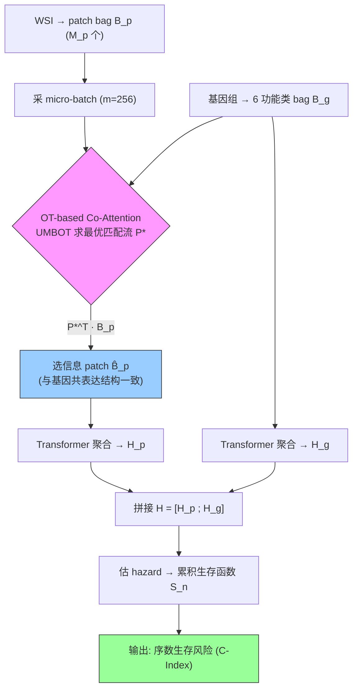

# MOTCat: Multimodal Optimal Transport-based Co-Attention Transformer for Survival Prediction

**作者**: Yingxue Xu, Hao Chen（HKUST）
**会议**: ICCV 2023 | **年份**: 2023（arXiv 2306.08330）
**链接**: [arXiv](https://arxiv.org/abs/2306.08330) · [Code](https://github.com/Innse/MOTCat)

## 一句话总结

用**最优传输（OT）驱动的 co-attention** 替代 MCAT 的稠密局部相似，从**全局结构一致性**视角匹配病理 WSI patch 与基因组，选出与基因共表达结构一致的信息 patch 做生存预测；并用 unbalanced mini-batch OT（UMBOT）在 micro-batch 上把 OT 复杂度从 $O(M^3\log M)$ 降到 $O(M\times m)$ 使其可跑。

## 核心贡献

1. **OT-based Co-Attention**：把跨模态 patch 选择建成全局最优运输问题，边际约束（总质量守恒）让 patch 相互竞争、协调选择，建模 TME 交互 + 基因共表达的全局结构一致性。
2. **UMBOT over Micro-Batch**：unbalanced mini-batch OT 近似，复杂度 $O(M\times m)$，对 micro-batch size 鲁棒，使 OT 首次在 gigapixel 病理上实用。
3. **五癌种 SOTA**：4/5 数据集超所有单模态，多模态上除 UCEC 外全胜 MCAT/Pathomic/Porpoise/PONET（+1.0~2.6% C-Index）。

## 📖 批读导航

| Section | 内容 |
|---------|------|
| [00 - Abstract](sections/00-abstract.md) | 摘要 + OT co-attention 三优势 + 与 PIBD 姊妹关系 |
| [01 - Introduction & Related Work](sections/01-introduction.md) | Fig.1 local vs global、TME 生物学依据、三条相关工作线 |
| [02 - Method](sections/02-method.md) | 两模态 bag（Eq.1-2）、生存序数回归（Eq.3）、OT co-attention（Eq.4）、UMBOT（Eq.5）、NLL 损失（Eq.6） |
| [03 - Experiments & Conclusion](sections/03-experiments.md) | Table 1 主结果、Table 2 消融、Fig.3 micro-batch、Fig.4 KM/Logrank、结论 |

## 关键数字

| 指标 | 数值 |
|------|------|
| 数据集 | 5 TCGA 癌种：BLCA(373)/BRCA(956)/UCEC(480)/GBMLGG(569)/LUAD(453) |
| 评价 | 5-fold CV，C-Index |
| 基因组 | 6 功能类别（肿瘤抑制/致癌/蛋白激酶/细胞分化/转录/细胞因子生长） |
| Micro-Batch | m=256；τ=0.5，ε=0.05~0.1 |
| 主结果 | 多模态 SOTA 上 +1.0~2.6%（UCEC 除外）；GBMLGG 0.849 |
| 复杂度 | $O(M^3\log M)$ → $O(M\times m)$；训练 6540 p/s，推理 11885 p/s |
| 诚实点 | UCEC 上基因组单模态(0.679)≥多模态；融合非普适增益 |

## 数据流：输入 → 中间表示 → 输出

## 优缺点与还能做什么

### 优点
- **全局结构感知**：OT 边际约束让 patch 选择全局协调，比稠密局部 co-attention 更能捕获分散的 TME 交互。
- **不依赖注意力分数**：OT 匹配流是无标签闭式解，弱监督下比学出的注意力更严格。
- **实用化 OT**：UMBOT + micro-batch 让原本跑不动的 OT 可用且鲁棒。

### 局限 / 风险
- **融合有数据依赖**：UCEC 上多模态不如单基因组，OT 也不涨——加模态非免费午餐。
- **基因 bag 仅 6 类**较粗；代价矩阵用 L2 距离未必最优。
- **仍离线冻结提特征**（ResNet-50 frozen），未端到端（作者列为未来工作）。

### 还能做什么（对本课题）
- **OT 匹配流作 retention 信号**：跨模态引导的全局 patch 重要性，比单模态注意力更抗 shortcut，可用于内容自适应压缩的 patch 选择。
- **micro-batch 近似全局分配**：迁移到"预算内全局最优 patch 保留"的近似求解。
- **端到端 + 压缩联合**：作者展望的端到端提取器更新，可与压缩表示联合优化。

## 阅读 Q&A 记录

- **Q: OT co-attention 比 MCAT 的稠密 co-attention 好在哪？**
  A: MCAT 逐对算 (patch, gene) 相似度、各 patch 独立得权重（局部）。OT 把"WSI 质量分配到基因"当全局运输问题，边际约束让 patch 相互竞争 → 选出的 patch 集合整体与基因共表达结构一致（全局）。

- **Q: 为什么需要 UMBOT / micro-batch？**
  A: 原始 OT 复杂度 $O(M^3\log M)$，WSI 上万 patch 跑不动（一张就慢到测不出）。UMBOT 在 m=256 的 micro-batch 上做 unbalanced OT 近似，降到 $O(M\times m)$，且 unbalanced+熵正则让子采样近似更鲁棒。

- **Q: 多模态一定比单模态好吗？**
  A: 否。UCEC 上基因组单模态(0.679)≥大多数多模态，MOTCat 也只打平。作者诚实指出"多模态融合有严峻挑战"——弱模态可能拖累。

- **Q: 对 WSI 压缩/ReadySlide 的启示？**
  A: OT 匹配流是"由另一模态全局引导的 patch 重要性"，比单模态注意力更鲁棒，是 retention 信号的候选；"micro-batch 近似全局 OT"可借鉴到预算内 patch 选择。

## 📊 Citation Landscape

> Semantic Scholar 采集限流，据论文自身引用整理。

**同主题最相关**
- MCAT [5]（Chen et al., ICCV 2021）——稠密 co-attention 生存预测，MOTCat 的直接对标/基线。
- [PIBD](../%5BICLR%202024%5D%20PIBD/)（ICLR 2024）——姊妹工作，用信息瓶颈+原型解耦压冗余，本目录已批读。
- Porpoise [6]（Cancer Cell 2022）、Pathomic [4]（TMI 2022）、PONET [34]——多模态生存 SOTA 对手。
- CLAM [32]、TransMIL [36]、DTFD-MIL [48]、AB-MIL [19]、DS-MIL [26]——病理 MIL 基线。

**方法来源**
- Kantorovich [21]、Sinkhorn scaling [8]、UMBOT [13]（Fatras et al., ICML 2021）——最优传输理论与高效实现。
- SNN [22]（Klambauer et al., NeurIPS 2017）——基因组 encoder。
- NLL survival loss [46]、CoxPH [9]、DeepSurv [12]——生存预测框架。
