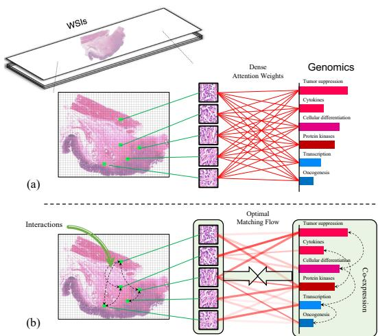

[← 返回 README](../README.md)

# 1. Introduction & Related Work 引言与相关工作

## 📌 预览

引言点出两大挑战：(1) gigapixel WSI 难有效表示；(2) TME 交互对生存重要但 TME patch 占比极小（细粒度识别）。现有 co-attention（MCAT）只看局部相似，忽略全局结构一致性。相关工作梳理三条线：医疗多模态融合（early/late/intermediate）、病理 MIL（instance/embedding based）、生存预测（CoxPH→DeepSurv→深度直接估 hazard）。

---

## 1. Introduction

Survival prediction is a complex ordinal regression task that aims to estimate the relative risk of death in cancer prognosis, which generally integrates the manual assessment of qualitative morphological information from pathology data and quantitative molecular profiles from genomic data. Among others, one daunting challenge is to capture key information from heterogeneous modalities for effective fusion. Particularly, due to the large size of about 500,000 × 500,000 pixels, it is challenging to effectively represent gigapixel whole slide images without losing key information. Furthermore, visual concepts of tumor microenvironment (TME) within pathological images are verified to have significant associations with survival analysis, e.g. cellular components including fibroblast cells and various immune cells that can alter cancer cell behaviors. However, the TME-related patches occupy only a tiny proportion of the entire WSI, leading to a finegrained visual recognition problem that is indiscernible by conventional multimodal learning.

*Figure 1: (a) Co-Attention：稠密注意力学 instance 权重；(b) OT-based Co-Attention：用最优传输匹配流从全局视角识别信息 instance，强制考虑各模态的潜在结构（WSI 内交互、基因共表达）。*

> 💡 **Figure 1 批读**（一图说清 local vs global）（Hao 批注）：(a) MCAT 式：每个 patch 独立地和基因算相似度、各自得权重——是"逐点打分"。(b) OT 式：把"把 WSI 的质量分配到基因"当成一个**全局运输问题**，一次性求整体最小代价的匹配流——patch 之间通过总质量守恒**相互竞争/协作**。含义：OT 选出的 patch 集合是"作为一个整体最能对应基因共表达结构的"，而非"每个都最像某个基因的"。这正是"全局结构一致性"的操作化。

Recently attention-based multiple instance learning (MIL) has provided a typical solution to identify informative instances. In multimodal learning, genomic data has been applied to guide the selection of TME-related instances by co-attention mechanism across modalities [5], as genes expression might correspond to some morphological characteristics revealed in pathological TME. They [5] densely calculate similarity scores for each pair of pathology and genomic instances as weights of selection... However, this type of approaches with a local view may not thoroughly learn information about TME, since they ignore global potential structure within modality.

Fruitful works demonstrate that the interactions within TME are important indicators affecting survival outcomes, e.g. co-occurrence of tumor cells with tumorinfiltrating lymphocytes (TILs) is a positive prognostic indicator. However, these collaborative components in TME might be spatially dispersed throughout the entire WSI, which indicates long-range structural associations. On the other hand, genes co-expression also suggests a potential structure. There might be intrinsic consistency between these two potential structures... However, existing co-attention-based multimodal learning focuses on only dense local similarity, neglecting the global coherence of potential structures.

> 💡 **机制拆解**（为什么"全局结构一致性"是对的先验）（Hao 批注）：作者的生物学论证链——TME 里肿瘤细胞与 TIL 的共现是预后指标，但它们**空间分散**（长程结构）；基因共表达也是一种结构；已有研究表明基因突变会改变 TME 内 TIL 的功能，即**两种结构间存在内在一致性**。所以"用基因共表达结构去引导选 WSI patch"是有生物学依据的先验。这比纯数据驱动的注意力更可解释。

To address these challenges, we propose MOTCat, in which optimal transport-based co-attention is applied to match instances between histology and genomics from a global perspective. Optimal transport (OT), as a structural matching approach, is able to generate an optimal matching solution with the overall minimum matching cost. As a result, instances of a WSI that have high global structure consistency with genes co-expressions can be identified to represent the WSI. Nevertheless, due to a massive number of patches from gigapixel WSIs, OT-based co-attention might suffer from high computational complexity. To address this, we propose a robust and efficient implementation over Micro-Batch by approximating the original OT with unbalanced optimal transport (UMBOT).

The contributions: (1) a novel multimodal OT-based Co-Attention Transformer with global structure consistency; (2) a robust and efficient implementation of OT-based co-attention over Micro-Batch; (3) extensive experiments on five benchmark datasets.

## 2. Related Work

**Multimodal Learning in Healthcare**: methods classified into early fusion (aggregate at input, neglects intra-modality dynamics), late fusion (integrate predictions at decision level, cannot explore cross-modal interactions), and intermediate fusion (capture cross-modal interconnections at different levels, e.g. attention-based). MCAT [5] proposed a co-attention to identify informative instances of gigapixel WSI with genomic features as queries. MOTCat belongs to intermediate fusion, exploring global consistency via OT.

**Multiple Instance Learning in Pathology**: instance-based (select instances) vs embedding-based (map to fixed embeddings then learn bag representation). AB-MIL assigns a weight per instance; DS-MIL uses cosine distance; TransMIL uses self-attention for long-range interactions; DTFD-MIL uses double-tier for rigorous weights. Unlike AB-MIL, we use OT matching flow between pathology and genomic instances.

**Survival Prediction**: from statistical CoxPH → DeepSurv (deep + CoxPH) → DeepConvSurv (pathology images) → recent works directly estimate hazard without statistical assumption. Histology + genomics is the gold standard.

> 💡 **相关工作定位**（Hao 批注）：三条线交汇于本文——**中间融合**（不是简单拼接或决策融合，而是在特征层面建跨模态交互）+ **embedding-based MIL**（离线提特征再聚合）+ **深度生存**（直接估 hazard，用 NLL 序数损失）。MOTCat 的独特点是把"跨模态 co-attention"从"稠密局部相似"换成"OT 全局匹配"。这条替换是本文唯一但核心的创新。
