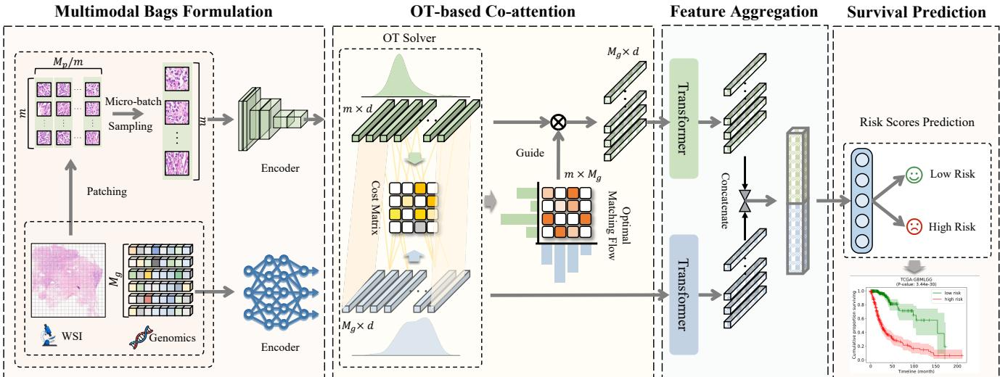
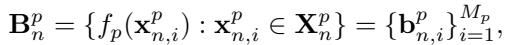
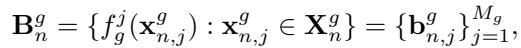
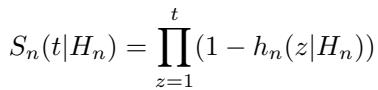
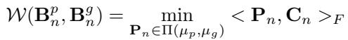
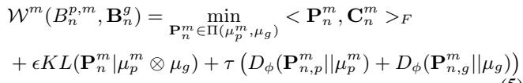
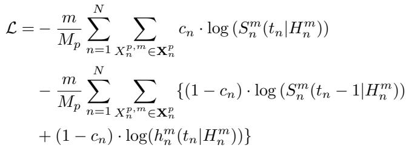

[← 返回 README](../README.md)

# 3. Method 方法

## 📌 预览

方法：两模态各建 bag（WSI patch bag Eq.1；基因按 6 类功能建 bag Eq.2）→ OT-based Co-Attention 求最优匹配流 $P_n^*$（Kantorovich 形式 Eq.4），用 $\hat B_n^p = P_n^\top B_n^p$ 选信息 patch → Transformer 聚合 + 拼接 → 估 hazard（累积生存函数 Eq.3）。为降 OT 复杂度，micro-batch 上用 UMBOT（Eq.5）把 $O(M^3\log M)$ 降到 $O(M\times m)$。NLL 生存损失（Eq.6）。

---

## 3.1. Overview and Problem Formulation

We aim to estimate the hazard functions $h_n(t)$ (risk of death after time t) for n-th patient based on pathology data $X_n^p$ and genomic data $X_n^g$.

*Figure 2: MOTCat 架构。两模态各建 bag，WSI bag 采一个 micro-batch 作病理输入；OT-based Co-attention 算最优匹配流选信息 instance（全局结构一致）；聚合后两模态特征拼接做生存预测。*

**WSI Bags (3.1.1)**: each WSI $X_n^p = \{x_{n,i}^p\}_{i=1}^{M_p}$; CNN encoder $f_p$ extracts instance features:

*Eq. (1): WSI bag 特征 $B_n^p = \{f_p(x_{n,i}^p)\}$。*

**Genomic Bags (3.1.2)**: organized into $M_g$=6 functional categories; each via separate network $f_g^j$:

*Eq. (2): 基因 bag 特征 $B_n^g = \{f_g^j(x_{n,j}^g)\}$，6 类功能（肿瘤抑制/致癌/蛋白激酶/细胞分化/转录/细胞因子生长）。*

**Survival Formulation (3.1.3)**: with censor status $c$ and survival time $t$, estimate hazard $h_n(t|H_n)$, and the ordinal risk via cumulative survival function:

*Eq. (3): 累积生存函数 $S_n(t|H_n) = \prod_{z=1}^{t}(1 - h_n(z|H_n))$。*

> 💡 **公式批读**（Eq. 1–3：两个 bag + 序数生存）（Hao 批注）：关键设计——**基因组也被组织成 bag**（6 个功能类别 instance），与 WSI bag 对称，才能做 OT 匹配。生存预测被建成**序数回归**（估离散时间区间的 hazard，再累乘成生存函数 $S_n$），而非直接回归生存时间——因为有右删失（censoring）数据，序数框架 + NLL 损失能正确处理"只知道活过了 t"的删失样本。

## 3.2. Optimal Transport-based Co-Attention

To identify TME-related instances, we use OT to learn the optimal matching flow between WSI bag $B_n^p$ and genomic bag $B_n^g$, defined by the discrete Kantorovich formulation:

*Eq. (4): OT 目标 $\mathcal{W}(B_n^p, B_n^g) = \min_{P_n \in \Pi(\mu_p,\mu_g)} \langle P_n, C_n\rangle_F$，$C_n$ 为局部成对代价矩阵，$\Pi$ 含总质量守恒的边际约束。*

Once acquiring the optimal matching flow $P_n^*$, informative instances are identified by $\hat{B}_n^p = P_n^\top B_n^p$ to represent the WSI, which also aligns pathology to genomics distribution while preserving cross-modal structure.

> 💡 **公式批读**（Eq. 4：OT 如何"选 patch"）（Hao 批注）：这是全文核心。$C_n^{u,v}$ = patch $u$ 与基因类 $v$ 的距离（局部代价）；OT 求一个匹配流 $P_n$（怎么把 WSI 的"质量"运到基因），使总代价 $\langle P_n, C_n\rangle$ 最小，**且满足边际约束**（$P_n \mathbf{1} = \mu_p$, $P_n^\top \mathbf{1} = \mu_g$，总质量守恒）。边际约束是精髓——它强制 patch 之间"竞争"有限的运输质量，于是选择是**全局协调**的而非逐点独立。选 patch：$\hat B_n^p = P_n^\top B_n^p$（用匹配流加权聚合）。这同时（1）选出信息 patch 表示 WSI、（2）让选出的 patch 与基因结构一致、（3）对齐两模态分布降异质性。

## 3.3. Optimization over Micro-Batch

Due to the large WSI bag, applying OT directly is intractable. We split WSI instances into a Micro-Batch (subset of size m) and use the UMBOT variant [13] to approximate the original OT with theoretical convergence guarantee:

*Eq. (5): UMBOT 目标——OT 项 + 熵正则 $\epsilon KL$ + 边际惩罚 $\tau(D_\phi + D_\phi)$（Csiszár 散度），在 micro-batch 上求解。*

Computational complexity is reduced from $O(M^3 \log(M))$ to $O(M \times m)$ where $m \ll M$. Loss function follows NLL-loss:

*Eq. (6): micro-batch 上的 NLL 生存损失（含删失项）。*

> 💡 **公式批读 + 机制拆解**（Eq. 5–6：UMBOT 为何是关键工程）（Hao 批注）：
> - **动机**：原始 OT 复杂度 $O(M^3\log M)$，WSI 上万 patch 根本跑不动（作者说原始 OT 一张 WSI 就久到测不出时间）。
> - **UMBOT**：在 micro-batch（m=256）上做**unbalanced** mini-batch OT——"unbalanced"（边际惩罚 $\tau$ 而非硬约束 + 熵正则 $\epsilon$）让 sub-sampling 的近似更鲁棒（子集的质量分布不必严格等于全集）。复杂度降到 $O(M\times m)$，训练 6540 patch/s、推理 11885 patch/s，实用化了。
> - **副产品**：micro-batch 策略本身也涨点（增加 bag 数量 = 更多训练信号，呼应 DTFD [48] 的 sub-bag 思想）。消融 Tab.2 显示 MB 单独就比 MCAT 好，OT 再加一层。
> - **对压缩研究**：UMBOT 的"micro-batch 近似全局 OT"思路，对"在预算内做全局最优 patch 选择"是可借鉴的——把昂贵的全局分配问题拆成可负担的子问题近似。
