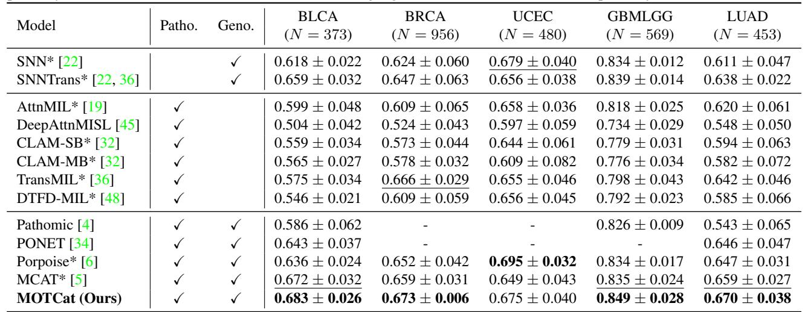
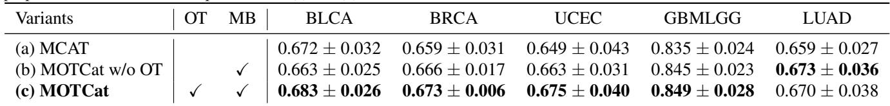
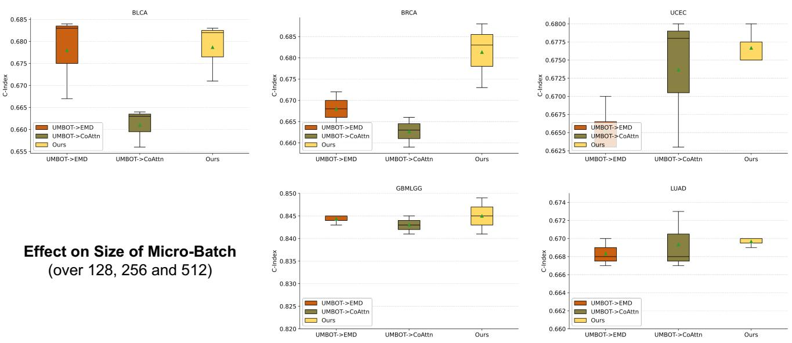
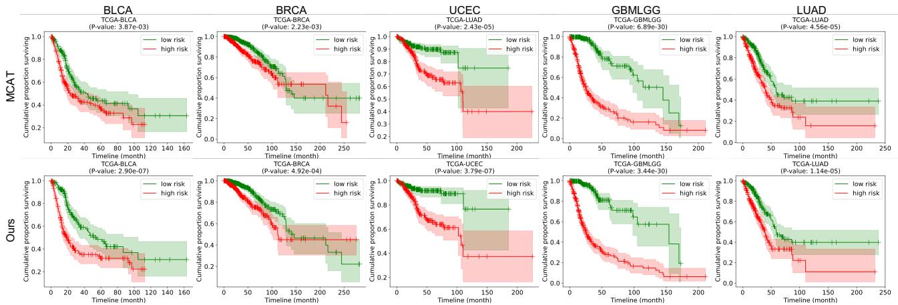

[← 返回 README](../README.md)

# 4. Experiments & Conclusion 实验与结论

## 📌 预览

五个 TCGA 癌种（BLCA/BRCA/UCEC/GBMLGG/LUAD），5-fold CV，报 C-Index。MOTCat 在 4/5 数据集超所有单模态、在多模态 SOTA 上除 UCEC 外全胜（+1.0~2.6%）。消融证明 micro-batch 与 OT 各有贡献；UMBOT 比原始 OT/MCAT co-attention 更鲁棒（对 micro-batch size）。KM 曲线 + Logrank 显示更好的风险分层。

---

## 4.1 Datasets and Settings

Five TCGA cancer datasets with paired WSIs and genomic data: BLCA (N=373), BRCA (N=956), UCEC (N=480), GBMLGG (N=569), LUAD (N=453). Genomic data organized into 6 functional categories. 5-fold CV (4:1 train-val), report C-Index. WSI: OTSU segmentation, 256×256 patches at 20×, ImageNet ResNet-50 (frozen) + FC → 1024-d. Genomic: SNN encoder. Adam lr 2e-4, batch 1 with 32 gradient accumulation, 20 epochs, Micro-Batch m=256, marginal penalization τ=0.5, entropic ε=0.05 (BLCA/LUAD) or 0.1 (others).

*Table 1: 五癌种 C-Index（mean±std）。Patho./Geno. 指模态。加粗最优、下划线次优。*

## 4.2 Results

**Unimodal vs Multimodal**: MOTCat achieves highest performance in 4/5 datasets. Genomic overall outperforms histology (validating using genomics to guide instance selection). On UCEC, most multimodal methods are inferior to genomic unimodal — MOTCat achieves comparative performance.

**Multimodal SOTA vs MOTCat**: MOTCat achieves superior performance on all benchmarks with 1.0%-2.6% gains except UCEC. Compared with the most similar work MCAT, MOTCat is better on all datasets.

> 💡 **Table 1 批读**（主结果 + 一个诚实观察）（Hao 批注）：
> - **战绩**：MOTCat 在 BLCA/BRCA/GBMLGG 都最优，5/5 超 MCAT。
> - **关键诚实点**：**基因组单模态（SNN 0.679）在 UCEC 上超过大多数多模态方法**，MOTCat 在 UCEC 也只是打平基因组单模态（0.675 vs 0.679）。作者直言"多模态融合有严峻挑战"——**并非所有癌种都能从加病理图受益**。这对多模态研究是重要提醒：模态融合不是免费午餐，弱模态可能拖累。
> - **对比 MCAT**：全面超越但幅度温和（1-2.6%），说明"OT 全局 vs 稠密局部"是有效但增量式的改进。

## 4.3 Ablation Study

*Table 2: 消融——(a) MCAT baseline；(b) MOTCat w/o OT（仅 micro-batch）；(c) 完整 MOTCat。*

Multimodal fusion benefits from micro-batch strategy (a→b), and OT-based co-attention further improves (b→c). Recent work [48] validated MIL benefits from sub-bags (increases number of bags → more features).

**Size of Micro-batch** (Fig 3): MOTCat achieves best averaged performance across sizes vs two variants (UMBOT→EMD replacing with original OT; UMBOT→CoAttn replacing with MCAT co-attention). MOTCat gets most robust results on UCEC/LUAD.

*Figure 3: 不同 micro-batch size 下 MOTCat 与两变体的 C-Index 箱线图。*

**Computational Speed**: MOTCat trains at 6540 p/s, infers at 11885 p/s. Original OT is intractable (too slow to measure for one WSI ~20k patches).

> 💡 **Table 2 + Figure 3 消融解读**（拆出 OT 与 MB 各自的功劳）（Hao 批注）：
> - **两个部件都有用**：micro-batch（增 bag 数）单独就让 MCAT→(b) 涨；OT 再让 (b)→(c) 涨。但注意 LUAD 上 (b) 反而略高于 (c)——**OT 不是每个数据集都正收益**（与主表 UCEC 的观察一致，融合有数据依赖）。
> - **鲁棒性**：Fig.3 关键——UMBOT 对 micro-batch size 的鲁棒性优于"原始 OT (EMD)"和"MCAT co-attention"。这印证 UMBOT 的"unbalanced + 熵正则"设计是为子采样鲁棒性服务的，不只是省算力。
> - **实用性**：原始 OT 慢到测不出，UMBOT 让 OT 在病理上首次可跑——这是本文能成立的工程前提。

## 4.4 Statistical Analysis

*Figure 4: 五癌种 Kaplan-Meier 分析，低风险（绿）/高风险（红）分层。P<0.05 为显著，越低越好。*

MOTCat separates low/high risk patients more clearly on all datasets. In Logrank test, MOTCat achieves lower P-value than MCAT on all datasets, especially BLCA/BRCA/UCEC by a large margin.

> 💡 **Figure 4 批读**（KM + Logrank = 临床有效性证据）（Hao 批注）：C-Index 是排序指标，KM 曲线 + Logrank 检验则回答"能否把病人清晰分成高/低危两组"——这是临床更关心的。MOTCat 的两组曲线分离更开、Logrank P 值更低（尤其 BLCA/BRCA/UCEC 低几个数量级），说明其风险分层在统计上更显著。这比单看 C-Index 更有说服力。

## 5. Conclusion

We present MOTCat with global structure consistency to tackle two issues in multimodal survival prediction: (1) OT-based Co-Attention matches instances to select TME-related informative instances (effective gigapixel WSI representation); (2) OT offers global awareness for modeling intra-modal structure (pathological interactions, genomic co-expression). The Micro-Batch implementation makes OT practicable, and might provide a solution to update patch extractor end-to-end instead of offline feature extraction (future work).

> 💡 **结论 + 展望解读**（Hao 批注）：作者展望里埋了一个重要点——**micro-batch 近似让"端到端更新 patch 提取器"成为可能**（不必离线冻结提特征）。这与本主题里 [Revisiting-E2E](../../ckmil-re-attn-mil/) / EXAONE-Path2 的端到端 WSI 训练是同一诉求。
> - **对 ReadySlide/压缩研究的启示**：(1) OT 匹配流是"跨模态引导的全局 patch 重要性"，比单模态注意力更鲁棒、更抗 shortcut——可作为 retention 信号的候选；(2) "micro-batch 近似全局最优分配"的思路可迁移到"预算内全局 patch 选择"；(3) 但主表显示**融合有数据依赖**（UCEC 上多模态不如单基因组），提醒任何"加信息就更好"的假设都需按数据集验证。
> - **可追问点**：OT 的代价矩阵用 L2 距离，是否最优？基因 bag 只有 6 类是否太粗？UCEC 上 OT 不涨的根因（是融合本身难，还是 OT 先验不适配该癌种）？
