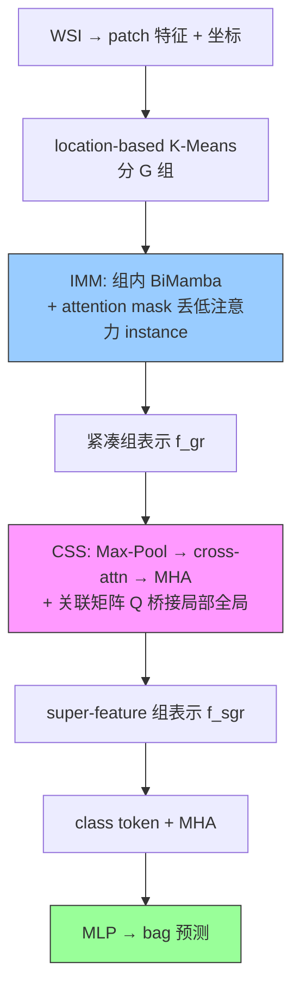

# GMMamba: Group Masking Mamba for Whole Slide Image Classification

**作者**: Tingting Zheng, Hongxun Yao, Kui Jiang, Yi Xiao, Sicheng Zhao（哈工大 / 武大 / 清华）
**会议**: ICCV 2025 (Oral) | **年份**: 2025
**链接**: [ICCV 2025](https://openaccess.thecvf.com/content/ICCV2025/html/Zheng_GMMamba_Group_Masking_Mamba_for_Whole_Slide_Image_Classification_ICCV_2025_paper.html) · [Code](https://github.com/titizheng/GMMamba)

## 一句话总结

在 Mamba-MIL 基础上加**两级去冗余 + 组间聚合**：**IMM（组内掩码 Mamba）** 用 location-based 分组 + 双向 Mamba + 自适应 attention mask 丢弃低注意力（无信息）instance；**CSS（跨组超特征采样）** 从各组采样 super-feature、cross-attention 建模散布肿瘤的长程依赖。超 MambaMIL 平均 +7.15% Acc、超 ACMIL +6.4%(ESCA)。

## 核心贡献

1. **IMM（组内去冗余）**：location-based K-Means 分组（非随机）+ BiMamba + 自适应稀疏 mask 丢弃低注意力 instance → 紧凑局部表示。
2. **CSS（组间聚合）**：Max-Pooling 初始 super-feature → cross-attention → MHA → 关联矩阵 Q 桥接局部全局 → 抓散布肿瘤长程依赖；可移植到多种 MIL。
3. **SOTA + 高效**：4 数据集全面最优，超 MambaMIL +7.15% Acc，推理更快。

## 📖 批读导航

| Section | 内容 |
|---------|------|
| [00 - Abstract & Introduction](sections/00-abstract-intro.md) | 摘要+引言、Mamba 两痛点、location grouping、GMMamba=MambaMIL+evidence selection |
| [01 - Method](sections/01-method.md) | 预备(Eq.1-4)、总览 Fig.3、IMM(Eq.5-7)、CSS(Eq.8-12) Fig.4 |
| [02 - Experiments & Conclusion](sections/02-experiments-conclusion.md) | Table 1/2 主结果、Table 3 CSS 泛化、Table 4/6/8 消融、baseline 定位 |

## 关键数字

| 指标 | 数值 |
|------|------|
| 数据集 | TCGA-BRCA(952)/ESCA(156)/Lung、BRACS，5-fold CV |
| 特征 | ResNet18-ImageNet（BRACS 另 ViT-S/16-SSL） |
| 主结果 | BRCA Acc 0.891、ESCA Acc 0.949（全指标最优） |
| vs ACMIL | +2.2%(BRCA)/+6.4%(ESCA) Acc |
| vs MambaMIL | 平均 +7.15% Acc、+8.2% F1 |
| 消融 | location grouping +5.2%、IMM +2.6%、CSS +2.5%；$M_r$=0→20% +9.4%(ESCA) |
| 最优超参 | G=10，mask 比例 $M_r$=10-20% |

## 数据流：输入 → 中间表示 → 输出

## 优缺点与还能做什么

### 优点
- **两级设计**：IMM 组内去冗余 + CSS 组间抓散布肿瘤，针对 Mamba 两痛点。
- **location-based grouping**：空间坐标分组 > 特征/随机（+5.1%/+3.8%），利用组织空间结构。
- **CSS 可移植**：插各种 MIL 都涨（+1.9~5.1%）。
- **高效**：FLOPs/推理时间优于 TransMIL（Fig.1）。

### 局限 / 风险
- **统一 mask 比例**：所有组用同一 $M_r$，作者承认应学习自适应比例（future work）。
- **需 patch 坐标**：location-based grouping 依赖坐标（部分 pipeline 可能没存）。
- **增益多组件叠加**：GMMamba vs MambaMIL 的提升含分组+masking+CSS 三部分，非单一 evidence selection。

### 还能做什么（对本课题 CKMIL/ReadySlide）
- **MambaMIL 的进阶配对**：GMMamba vs MambaMIL 干净展示"去冗余+组间建模"增益。
- **IMM masking 的倒 U 形**（10-20% 最优）：印证适度保留原则（呼应 PIBD Irr、EAGLE 25 tile）。
- **CSS 可复用**：散布特征的组间聚合插件。
- **location grouping**：空间坐标分组是利用 WSI 空间结构的实用方式（对 Spatial-Blindness 的正面回应）。

## 阅读 Q&A 记录

- **Q: GMMamba 相对 MambaMIL 的净增益来自哪？**
  A: 三部分——location-based grouping（+5.2%，最大）、IMM masking（+2.6%）、CSS（+2.5%）。不全是 masking，空间分组贡献最大。

- **Q: IMM masking 和 ACMIL STKIM 方向相反？**
  A: 是。ACMIL STKIM 遮高注意力（怕过度集中、逼看更多）；GMMamba IMM 丢低注意力（怕冗余稀释、保关键）。WSI 大量背景/相似 patch 时 IMM 的去冗余合理。

- **Q: 为什么 location-based grouping 比特征聚类好？**
  A: 特征聚类只看高维特征相似度，忽略空间结构；location-based（按坐标 K-Means）保留组织空间关系，组内同质性高、便于 BiMamba 建模和去冗余。

- **Q: 能在冻结 FM 特征上跑吗？**
  A: 能，但需 patch 坐标（location-based grouping 用）。换 UNI2/Virchow2 只改特征维度。

## 📊 Citation Landscape

> Semantic Scholar 采集限流，据论文自身引用整理。

**同主题最相关**
- [MambaMIL](../%5BMICCAI%202024%5D%20MambaMIL/)（MICCAI 2024）——GMMamba 的 base-Mamba，配对做 evidence-selection ablation；SSMMIL——另一 SSM MIL。
- [ACMIL](../%5BECCV%202024%5D%20ACMIL/)（ECCV 2024）——主要对照（STKIM masking 方向相反）；[TransMIL](../%5BNeurIPS%202021%5D%20TransMIL/)、DTFD、MHIM、[ILRA-MIL](../%5BICLR%202023%5D%20ILRA-MIL/)——对比基线。
- [PAMoE](../%5BCVPR%202025%5D%20PAMoE/)——同做"聚合器内 evidence selection"（mask vs expert-choice）。

**方法来源**
- Mamba（Gu & Dao 2023）、SSM（Gu et al.）——选择性状态空间；BiMamba（Vim/VMamba）——双向扫描；K-Means——location-based grouping。
