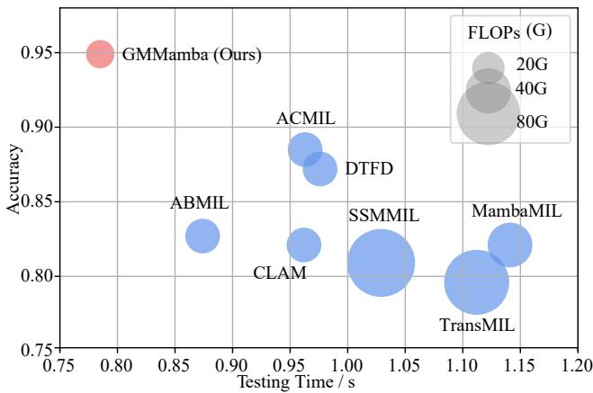
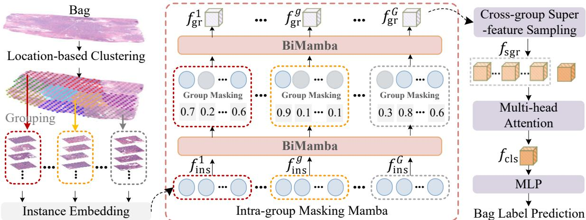
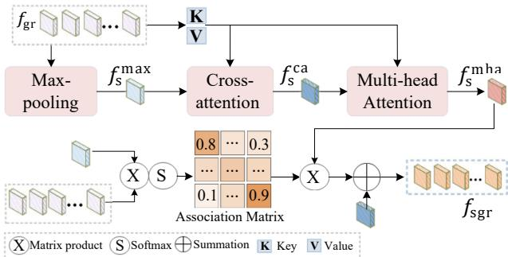
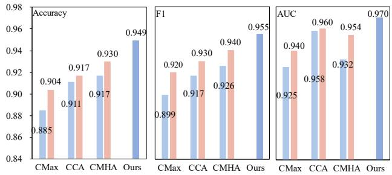

# GMMamba: Group Masking Mamba for Whole Slide Image Classification

Tingting Zheng1,2 Hongxun Yao1,2\* Kui Jiang1 Yi Xiao3 Sicheng Zhao4

1Harbin Institute of Technology

2China Mobile 5G Application Innovation Joint Research, Harbin Institute of Technology 3Wuhan University 4Tsinghua University

{23b903051@stu.hit, jiangkui@hit, xiao yi@whu, schzhao@tsinghua, h.yao@hit}.edu.cn

## Abstract

Recent advances in selective state space model (Mamba) have shown great promise in whole slide image (WSI) classification. Despite this, WSIs contain explicit local redundancy (similar patches) and irrelevant regions (uninformative instances), posing significant challenges for Mambabased multi-instance learning (MIL) methods in capturing global representations. Furthermore, bag-level approaches struggle to extract critical features from all instances, while group-level methods fail to adequately accountfor tumor dispersion and intrinsic correlations across groups, leading to suboptimal global representations. To address these issues, we propose group masking Mamba (GMMamba), a novel framework that combines two elaborate modules: (1) intra-group masking Mamba (IMM)for selective instance exploration within groups, and (2) crossgroup super-feature sampling (CSS) to ameliorate longrange relation learning. Specifically, IMM adaptively predicts sparse masks to filter out features with low attention scores (i.e., uninformative patterns) during bidirectional Mamba modeling, facilitating the removal of instance redundanciesfor compact local representation. For improved bag prediction, the CSS module further aggregates sparse group representations into discriminative features, effectively grasping comprehensive dependencies among dispersed and sparse tumor regions inherent in large-scale WSIs. Extensive experiments on four datasets demonstrate that GMMamba outperforms the state-of-the-art ACMIL by 2.2% and 6.4% in accuracy on the TCGA-BRCA and TCGA-ESCA datasets, respectively.

## 1. Introduction

Histopathology slides are indispensable for cancer diagnosis, providing critical insights into tissue morphology and cellular structures [3, 9, 30]. However, the complexity of biological structures in these slides complicates the detection of subtle pathological variations [26, 34]. Recent advances in digital pathology have enabled the conversion of physical slides into high-resolution whole slide images (WSIs), creating new opportunities for deep learning-driven tumor diagnosis. Despite this progress, the gigapixel resolution and diverse tumor patterns inherent in WSIs make pixel-level manual annotation prohibitively laborious and costly [26, 29, 38]. To alleviate these limitations, multiinstance learning (MIL) addresses this challenge by segmenting WSIs into patches (instances) and leveraging weak bag-level labels for analysis [7, 16, 32, 48, 50]. In general, previous efforts are rooted in exploring instance correlations to construct a global representation for bag prediction.

  
Figure 1. Comparative results of FLOPs, testing time, and accuracy with representative MIL methods on the TCGA-ESCA dataset. Our GMMamba achieves superior performance with higher efficiency. The size of each circle represents the FLOPs.

A mass of studies improve bag-level representation, including Mean-Pooling, attention mechanisms [1, 17, 39, 51], recurrent and graph neural networks [3, 28], and Transformer [29, 31]. Despite their considerable success, these methods face a critical trade-off: computational efficiency versus discriminative bag representation, especially in WSIs with numerous instances and complex tissue patterns. As shown in Figure 1, Transformer-based MIL methods (e.g., TransMIL [31]) suffer from high computational costs when handling massive instances, resulting in suboptimal performance and prolonged inference time.

  
Figure 2. Instances in WSI exhibit explicit local redundancies (i.e., similar and uninformative instances). Our GMMamba enhances the efficiency of Mamba-based MIL methods through intra-group masking Mamba (IMM) and cross-group super-feature sampling (CSS) modules, facilitating the exploration of crucial instances and global representations.

Recently, the emergence of the selective state space model (Mamba) has driven significant progress in modeling long sequences with linear complexity [23, 24, 40, 42, 52]. Despite this advantage, two key limitations impede its application to WSI analysis: local redundancy and suboptimal global representation. 1) Redundant Local Modeling: Bag-based Mamba processes all instances uniformly, leading to unnecessary computational overhead from nondiscriminative features and potential loss of critical diagnostic information, as illustrated in Figure 2. 2) Sparse Global Representation: Tumor regions in WSIs exhibit spatial dispersion and sparsity, mcomplicating the aggregation of discriminative features across groups. Current methods inadequately model inter-group correlations, impairing global representation.

To alleviate these issues, prior attempts have extended the MIL framework by applying random masking [14, 30] or instance selection strategies [13, 20, 47]. However, these approaches often sacrifice critical information or introduce training instability. While feature similarity and attentionbased selection improve bag representation, their computational costs remain prohibitive for large-scale WSI analysis. Moreover, existing approaches overlook the spatial dispersion of tumor instances across groups.

This raises a pivotal question: How to harmonize the advantages ofMamba with local similarity in WSI to eliminate redundancy and ameliorate global representations for more accurate and efficient bag-level label inference?

To answer this question, this paper proposes a novel group masking Mamba (GMMamba) for WSI classification. GMMamba mitigates undesirable local redundancy through an intra-group masking Mamba (IMM) and enhances global representation via cross-group super-feature sampling (CSS) modules. Unlike previous works that perform random groupings, GMMamba employs a locationbased clustering scheme to group semantically related instances, reducing training uncertainty. To eliminate redundant and irrelevant instances within the group, IMM adaptively incorporates learnable sparse masks between bidirectional Mamba (BiMamba) blocks to dynamically prune low-attention features. This enables Mamba to focus on salient instances while enjoying the merit of linear scanning, resulting in efficient yet compact local representations. For improved correlation learning across groups, CSS aggregates discriminative features from spatially dispersed tumor regions by sampling “super-features” from group representations. Moreover, to further enhance bag prediction, we generate the class token using multi-head attention mechanisms, further boosting the robustness of the global bag representation.

Our main contributions are summarized as follows:

• A novel GMMamba framework that harmonizes Mamba’s efficiency with group masking and crossgroup interaction to address redundancy and sparse tumor dispersion in WSIs.

• An intra-group masking Mamba (IMM) is devised to incorporate location-based grouping and feature selection into Mamba for efficient and compact exploration of instance relationships. In addition, we pioneer a cross-group super-feature sampling (CSS) module to aggregate sparse and dispersed tumor features across groups, leading to a more accurate and comprehensive bag representation.

• Extensive experiments on public datasets demonstrate the superiority of our GMMamba over state-of-the-art methods, achieving accuracy improvements of 2.2%, 6.4%, 3.9%, and 1.0% on the TCGA-BRCA, TCGA-ESCA, BRACS, and TCGA-Lung datasets, respectively, while enjoying faster inference times.

## 2. Related Work

This section discusses relevant advancements related to our GMMamba, including multi-instance learning, state space modes, and data redundancy optimization.

## 2.1. Multi-instance Learning

MIL [18] aims to predict WSI labels by exploring relationships among instances and forming global representations for bag-level label prediction. Early approaches often used Mean-Pooling and attention-based weighting to aggregate instances [1, 17]. However, due to the sparse nature of tumor instances in large-scale WSIs, these methods struggle to generate discriminative global representations [7, 35, 50]. While advanced technologies, e.g., graph neural networks [5, 13] and Transformers [31, 37, 39, 44], have improved the capability of global context modeling, they are hindered by limited performance and high computational costs [41, 45]. Recently, Mamba has emerged as an effective yet efficient alternative for capturing longrange dependencies with linear computational complexity [23, 42]. Despite these advancements, previous MILbased methods often overlook the undesirable local redundancy within WSIs [6, 20]. Some approaches attempt to mitigate this issue by selecting key features, with typical efforts in feature clustering, attention scores, and pooling [13, 34, 53]. Nevertheless, they require elaborated modules to identify non-informative patterns, making them less efficient for large-scale WSIs. To overcome these challenges, we propose GMMamba, which effectively reduces redundancy while efficiently modeling long-range dependencies among instances, leading to improved performance and computational efficiency.

  
Figure 3. The architecture of our proposed group masking Mamba network (GMMamba) for WSI classification. GMMamba employs a location-based clustering scheme to divide a bag into multiple groups $\{ f _ { \mathrm { i n s } } ^ { g } \} _ { g = 1 } ^ { G }$ . The intra-group masking Mamba (IMM) module then predicts attention masks for a bidirectional Mamba (BiMamba) to eliminate redundant instances, facilitating more compact local representations $\{ f _ { \mathrm { g r } } ^ { g } \} _ { g = 1 } ^ { G }$ . Subsequently, a cross-group super-feature sampling (CSS) module captures discriminative features from $\{ f _ { \mathrm { g r } } ^ { g } \} _ { g = 1 } ^ { \overline { { G } } }$ to generate comprehensive super-feature group representations $f _ { \mathrm { s g r } }$ . Finally, the class token $f _ { \mathrm { c l s } }$ is aggregated with $f _ { \mathrm { s g r } }$ using multi-head attention mechanisms for final bag-level label prediction.

## 2.2. State Space Model

The state space model (SSM) [33] excels at modeling long-range dependencies but suffers from input-invariant parameterization, limiting its adaptability to dynamic or spatial patterns. To address this limitation, Mamba [11] introduces selective scanning mechanisms and hardwareaware algorithms, achieving improved performance with linear complexity. These advancements have spurred applications in visual tasks [23, 27, 40, 41], where techniques such as bidirectional, four-way, multi-scale, and local-based scanning [15, 24, 42, 54] enhance global representation learning. However, non-unidirectional methods introduce redundant computations and feature interference [19, 49], particularly in WSIs with a massive number of redundant instances. To address this, our GMMamba employs a sparse instance masking scheme, selectively modeling crucial long-range instances while eliminating redundancy, thereby achieving efficient instance-aware exploration.

## 2.3. Data Redundancy Optimization

Reducing data redundancy has drawn widespread attention across various vision and text tasks by eliminating similar or irrelevant data, which in turn improves model performance [14, 20, 34]. To reduce redundancy, previous approaches primarily focused on two strategies: data dropping and similarity replacement [6, 30, 47]. The former randomly discards a proportion of the data, while the latter employs distance metrics and clustering to replace similar data with representative centers [30, 47]. However, both methods risk discarding crucial details, potentially undermining accuracy and stability. To address this, attentionand pooling-based feature selection methods have emerged as popular solutions [1, 13] for filtering out irrelevant features. While they are effective at reducing redundancy, their performance often deteriorates when applied to large-scale and complex datasets, WSIs in particular, where identifying truly informative features becomes increasingly challenging. To this end, our proposed IMM effectively evicts similar and uninformative instances by incorporating attentionbased sparse masks with Mamba, facilitating the representation of key instances for accurate label predictions.

## 3. Method

This section begins with the formulation of MIL and SSM, followed by an overview of the proposed GMMamba network. It then provides a detailed explanation of the intra-group masking Mamba (IMM) and cross-group superfeature sampling (CSS) modules.

## 3.1. Preliminaries

MIL Formulation. Given a WSI $\{ X , Y \}$ , we divide the non-background tissue regions X into B non-overlapping instances $\{ ( x _ { b } ~ \in ~ R ^ { W \times H \times 3 } , y _ { b } ) ~ | ~ 1 ~ \le ~ b ~ \le ~ B \}$ as $\mathrm { ~ a ~ } \ ^ { \bullet } \mathbf { b } \mathrm { a g } ^ { \bullet }$ , where Y, H, W and $y _ { b }$ denote the bag label, height, width and unknown class label of the instance $x _ { b }$ respectively. To enable cost-effective training, the classical pipeline for MIL-based WSI analysis embeds an instance $x _ { b }$ into a 1D-dimensional feature vector $f _ { \mathrm { i n s } } ^ { b }$ using pre-trained encoders [26, 44, 50]. Most existing studies [1, 31, 39] explore the correlations among $\{ f _ { \mathrm { i n s } } ^ { b } \} _ { b = 1 } ^ { B }$ using an aggregator $\phi _ { \mathrm { a g g r } }$ to form a global bag representation, followed by a multi-layer perceptron (MLP) to predict the bag label $\hat { Y }$ In the case of a binary classification task, as expressed in Eq. (1), if $\hat { Y } = 1$ , the bag is labeled as “positive”; otherwise, it is labeled as 0 (negative).

$$
Y = \left\{ \begin{array} { l l } { 1 , } & { \mathrm { i f } \hat { Y } = \mathrm { M L P } ( \phi _ { \mathrm { a g g r } } ( \{ f _ { \mathrm { i n s } } ^ { b } \} _ { b = 1 } ^ { B } ) ) : \hat { Y } = 1 } \\ { 0 , } & { \mathrm { o t h e r w i s e . } } \end{array} \right.\tag{1}
$$

State Space Model. The SSM [33] maps input sequences $x ( t )$ at time t to output sequences $y ( t )$ through latent states $h ( t )$ using a deep learning model. This transformation is mathematically formulated as linear ordinary differential equations:

$$
\begin{array} { r } { h ( t ) = \bar { \bf A } h ( t - 1 ) + \bar { \bf B } x ( t ) , } \end{array}
$$

$$
\begin{array} { r } { h ^ { \prime } ( t ) = \mathbf { A } h ( t ) + \mathbf { B } x ( t ) , } \end{array}\tag{2}
$$

(3)

$$
y ( t ) = \mathbf { C } h ( t ) + \mathbf { D } x ( t ) ,\tag{4}
$$

where A, B, and C are learned parameters, and D serves as a skip connection. $h ^ { \prime } ( t )$ denotes the derivative of $h ( t )$ $\bar { \bf A }$ and B¯ are the discrete counterparts of A and B, defined by a time parameter $\Delta .$ . To overcome the inputinvariant limitations of SSM, Mamba [11] makes $\mathbf { B } , \mathbf { C } ,$ , and ∆ input-dependent via linear projection, enhancing interactions along the sequence. In particular, the hardware-aware algorithms (e.g., parallel scan, kernel fusion, and recomputation) are employed for efficient computation [23, 41]. In this study, we harmonize the merits of Mamba with feature selection schemes, proposing the GMMamba model to address computational complexity and local redundancy interference, leading to improved performance in bag prediction.

## 3.2. Overview of GMMamba

Figure 3 illustrates our proposed GMMamba network. Our primary objective is to effectively capture global dependencies while mitigating redundancy interference for more accurate bag prediction.

Instead of random groupings, which fail to consider spatial and structural similarities between neighboring tissue instances and make it more difficult to establish instance relationships, we propose a location-based clustering scheme.

  
Figure 4. Illustration of our proposed cross-group super-feature sampling (CSS) module.

This method partitions each bag $\{ f _ { \mathrm { i n s } } ^ { b } \} _ { b = 1 } ^ { B }$ into $G$ groups $\begin{array} { r } { \{ f _ { \mathrm { i n s } } ^ { g } = \{ f _ { m } ^ { g } \} _ { m = 1 } ^ { M } | g \in [ 1 , G = \frac { B } { M } ] \} } \end{array}$ , where M is the number of instances in a group and $g$ denotes the g-th group. To effectively model instance dependencies while alleviating computational complexity and redundancy, we propose an IMM module, consisting of a bidirectional Mamba (Bi-Mamba) block and an attention block. The former captures semantic and spatial features within a group $f _ { \mathrm { i n s } } ^ { g }$ , while the latter selects the most informative instances based on their attention scores. These selected instances are then passed into the next BiMamba block to generate a refined group representation $f _ { \mathrm { g r } } ^ { g }$ . Considering the scattered nature of tumor instances and the inadequate inter-group interactions that lead to sparse group representations, we devise a CSS module. This module extracts and aggregates discriminative tumor features across all groups $f _ { \mathrm { g r } } = \{ f _ { \mathrm { g r } } ^ { g } \} _ { g = 1 } ^ { G }$ , producing discriminative and comprehensive “super-feature” group representations $f _ { \mathrm { s g r } } = \{ f _ { \mathrm { s g r } } ^ { g } \} _ { g = 1 } ^ { G }$ . To further enhance the global representation of the bag, we employ multi-head attention mechanisms equipped with a class token (cls) to explore global relationships among $\{ f _ { \mathrm { s g r } } ^ { g } \} _ { g = 1 } ^ { G }$ to generate a consolidated class-level feature $f _ { \mathrm { c l s } }$ . Finally, $f _ { \mathrm { c l s } }$ is passed through an MLP to generate accurate bag predictions $\hat { Y }$

## 3.3. Intra-group Masking Mamba

To effectively and efficiently reduce redundant instance computation and interference, our GMMamba design location-based grouping and IMM modules. The first step uses the K-Means clustering technique, which takes instance coordinates as input to generate groups $\{ f _ { \mathrm { i n s } } ^ { g } \} _ { g = 1 } ^ { G } .$ Within each group $f _ { \mathrm { i n s } } ^ { g }$ , we apply the BiMamba module to explore complex relationships among instances. To further filter out uninformative instances, an attention block is employed to mask $M \times M _ { r }$ instances with low attention scores (AttentionMask), where $M _ { r }$ denotes the mask ratio. The informative instances $\{ \bar { f } _ { m } ^ { g } \} _ { m = 1 } ^ { M \times ( 1 - M _ { r } ) }$ are then processed through the BiMamba and attention block to form the group representation $f _ { \mathrm { g r } } ^ { g }$ . The procedures are expressed as:

$$
\begin{array} { r } { \{ \bar { f } _ { m } ^ { g } \} _ { m = 1 } ^ { M } = \mathrm { B i M a m b a } \left( \{ f _ { m } ^ { g } \} _ { m = 1 } ^ { M } \right) , } \end{array}\tag{5}
$$

$$
\{ \bar { f } _ { m } ^ { g } \} _ { m = 1 } ^ { M \times ( 1 - M _ { r } ) } = \mathrm { A t t e n t i o n M a s k } \left( \{ \bar { f } _ { m } ^ { g } \} _ { m = 1 } ^ { M } , M _ { r } \right)\tag{6}
$$

$$
f _ { \mathrm { g r } } ^ { g } = \mathrm { A t t e n t i o n } \left( \mathrm { B i M a m b a } \left( \{ \bar { f } _ { m } ^ { g } \} _ { m = 1 } ^ { M \times ( 1 - M _ { r } ) } \right) \right) .\tag{7}
$$

## 3.4. Cross-Group Super-Feature Sampling

The goal of our CSS module is to capture dispersed tumor information across groups for comprehensive and discriminative representations, as illustrated in Figure 4. To achieve this, CSS first employs Max-Pooling to extract the most salient features within $f _ { \mathrm { g r } } = \{ f _ { \mathrm { g r } } ^ { g } \} _ { g = 1 } ^ { G } .$ , forming an initial “super-feature” $f _ { \mathrm { s } } ^ { \mathrm { m a x } }$ . The $f _ { \mathrm { s } } ^ { \mathrm { m a x } }$ is then used as a query for cross-attention to aggregate discriminative information from across groups, yielding $f _ { \mathrm { s } } ^ { \mathrm { c a } }$ . Considering that a single softmax score may not effectively aggregate complex inter-group relationships, we employ a multi-head attention (MHA) mechanism to refine the super-feature into a more robust representation $f _ { \mathrm { s } } ^ { \mathrm { m h a } }$ . The processes can be summarized as follows:

$$
f _ { \mathrm { s } } ^ { \operatorname* { m a x } } = \mathrm { M a x - P o o l i n g } \left( \{ f _ { \mathrm { g r } } ^ { g } \} _ { g = 1 } ^ { G } \right) ,\tag{8}
$$

$$
\begin{array} { r } { f _ { \mathrm { s } } ^ { \mathrm { c a } } = \mathrm { C r o s s - A t t e n t i o n } \left( f _ { \mathrm { s } } ^ { \mathrm { m a x } } , \{ f _ { \mathrm { g r } } ^ { g } \} _ { g = 1 } ^ { G } \right) , } \end{array}\tag{9}
$$

$$
f _ { \mathrm { s } } ^ { \mathrm { m h a } } = \mathbf { M H A } \left( \mathbf { \nabla } f _ { \mathrm { s } } ^ { \mathrm { c a } } , \left\{ \mathbf { \nabla } f _ { \mathrm { g r } } ^ { g } \right\} _ { g = 1 } ^ { G } \right) .\tag{10}
$$

While $f _ { \mathrm { s } } ^ { \mathrm { m h a } }$ can capture better global relations, $f _ { \mathrm { s } } ^ { \mathrm { m h a } }$ may lose critical local details within individual groups. Hence, we compute the association matrix $\mathbf { Q } = \{ Q ^ { g } \} _ { g = 1 } ^ { G }$ , which measures the relationship between $f _ { \mathrm { s } } ^ { \mathrm { m a x } }$ and $\{ f _ { \mathrm { g r } } ^ { g } \} _ { g = 1 } ^ { G }$ Based on Q, we bridge local and global information, ensuring comprehensive super-feature group representations $f _ { \mathrm { s g r } } = \{ f _ { \mathrm { s g r } } ^ { g } \} _ { g = 1 } ^ { G }$ for complex WSIs. The steps are described as follows:

$$
\{ Q ^ { g } \} _ { g = 1 } ^ { G } = \mathrm { S o f t m a x } \left( f _ { \mathrm { s } } ^ { \mathrm { m a x } } \times \left\{ f _ { \mathrm { g r } } ^ { g } \right\} _ { g = 1 } ^ { G } \right) ,\tag{11}
$$

$$
\{ f _ { \mathrm { s g r } } ^ { g } \} _ { g = 1 } ^ { G } = f _ { \mathrm { s } } ^ { \mathrm { c a } } + \{ Q ^ { g } \} _ { g = 1 } ^ { G } \times f _ { \mathrm { s } } ^ { \mathrm { m h a } } .\tag{12}
$$

## 4. Experiments

To thoroughly evaluate the performance of our GM-Mamba model, we conduct extensive experiments against mainstream MIL methods on four widely used WSI datasets, including TCGA Breast Cancer (BRCA) [36], TCGA Esophageal Cancer (ESCA) [36], Breast Adenocarcinoma Subtypes (BRACS) [2] and TCGA-Lung Cancer [36]. We further validate the effectiveness of locationbased grouping and cross-group super-feature sampling (CSS) methods by integrating these components into classic MIL frameworks. Ablation studies assess the individual contributions of key components, including the grouping strategies, masking ratios in intra-group masking Mamba (IMM), and CSS variations.

## 4.1. Datasets

TCGA Breast Cancer Dataset. We collect 952 breast slides from the TCGA-BRCA project, comprising 749

WSIs for Invasive Ductal Carcinoma (IDC) and 203 WSIs for Invasive Lobular Carcinoma (ILC). Following [22], the dataset is randomly split into training, validation, and test sets with ratios of 65:10:25. To prepare the data for training, we use CLAM [26] to crop each WSI into non-overlapping 256×256 patches at 10× magnification, yielding approximately 3.1 million instances.

TCGA Esophageal Cancer Dataset. This dataset consists of 156 diagnostic WSIs, including 90 squamous cell carcinoma and 66 adenocarcinoma WSIs [36]. In line with MuRCL [55], we partition the data into training, validation, and test sets with a ratio of 3:1:1. Non-overlapping 256×256 patches at 20× magnification are extracted using CLAM [26], producing approximately 0.5 million instances.

Breast Carcinoma Subtyping Dataset. BRACS consists three categories: 265 benign, 89 atypical, and 193 malignant breast tumors [2]. Adhering to the official split [2, 46], we use 395 WSIs for training, 65 for validation, and 87 for testing. We use CLAM [26] to extract 256×256 instances at 10× magnification (approximately 1.4 million instances).

TCGA-Lung Cancer Dataset. This dataset [36] comprises 541 lung adenocarcinoma (LUAD) and 512 squamous cell carcinoma (LUSC) slides from 956 unique cases. Following the settings in previous works [21, 35, 44], we split the data using a 65:10:25 ratio. CLAM [26] generates nonoverlapping 256×256 patches at 20× magnification (approximately 4.1 million instances).

## 4.2. Implementation Details

Following previous works [21, 22, 55], for the TCGA-BRCA, TCGA-Lung, and TCGA-ESCA datasets, we use a ResNet18 [12] encoder pre-trained on ImageNet [8] (Resnet18-ImageNet) to extract 512-dimensional features. For the BRACS dataset, we use publicly available features from [46], combining 512-dimensional ResNet18- ImageNet features and 384-dimensional ViT-S/16-SSL features (DINO-pretrained [4]). The model is optimized using bag-level cross-entropy loss and the AdamW optimizer [25], with a weight decay of 1e − 5 and an initial learning rate of $1 e - 4$ . We train the GMMamba model for 100 epochs with a batch size of 1 $( i . e . ,$ , one bag per batch) on a single NVIDIA RTX 4090 GPU.

## 4.3. Baseline and Evaluation Metrics

Baseline. We compare our proposed GMMamba against representative MIL methods, including attention-based (ABMIL [17], CLAM [26], DSMIL [1], MHIM-ABMIL [35], IBMIL-ABMIL [21], ILRA-MIL [39], ACMIL [46]), Transformer-based (TransMIL [31], DTFD [44], MHIM-TransMIL [35]), and Mamba-based (SSMMIL [10], MambaMIL [42]). All baselines are reproduced using their official implementations.

Table 1. Quantitative comparison of our results and MIL methods on TCGA-BRCA and TCGA-ESCA datasets using Resnet18-ImageNet feature extractor. The numbers in red and blue indicate the best and second performance.
<table><tr><td rowspan="2">Methods</td><td colspan="3">TCGA-BRCA</td><td colspan="3">TCGA-ESCA</td></tr><tr><td>Accuracy</td><td>AUC</td><td>F1</td><td>Accuracy</td><td>AUC</td><td>F1</td></tr><tr><td>ABMIL [17]</td><td>0.862±0.025</td><td> $\overline { { 0 . 8 8 2 { \pm } 0 . 0 3 8 } }$ </td><td> $\overline { { 0 . 9 1 5 { \scriptstyle \pm 0 . 0 1 5 } } }$ </td><td> $\overline { { 0 . 8 2 7 { \scriptstyle \pm 0 . 0 9 2 } } }$ </td><td>0.914±0.066</td><td>0.859±0.079</td></tr><tr><td>DSMIL [1]</td><td>0.823±0.021</td><td> $0 . 8 2 0 { \scriptstyle \pm 0 . 0 3 3 }$ </td><td> $0 . 8 9 2 { \scriptstyle \pm 0 . 0 1 4 }$ </td><td> $0 . 8 0 8 { \scriptstyle \pm 0 . 0 6 5 }$ </td><td> $0 . 8 8 2 { \pm } 0 . 0 8 4$ </td><td>0.833±0.062</td></tr><tr><td>CLAM-MB [26]</td><td> $0 . 8 6 5 { \scriptstyle \pm 0 . 0 2 0 }$ </td><td> $0 . 8 9 0 { \scriptstyle \pm 0 . 0 2 9 }$ </td><td> $0 . 9 1 7 { \scriptstyle \pm 0 . 0 1 4 }$ </td><td> $0 . 8 2 1 { \scriptstyle \pm 0 . 0 7 8 }$ </td><td> $0 . 9 0 2 { \scriptstyle \pm 0 . 0 8 8 }$ </td><td> $0 . 8 4 3 { \pm } 0 . 0 7 5$ </td></tr><tr><td>CLAM-SB [26]</td><td> $0 . 8 5 8 { \pm } 0 . 0 1 1$ </td><td> $0 . 8 7 7 { \scriptstyle \pm 0 . 0 2 9 }$ </td><td> $0 . 9 1 4 { \scriptstyle \pm 0 . 0 0 6 }$ </td><td> $0 . 8 3 4 { \pm } 0 . 0 6 1$ </td><td> $0 . 9 2 7 { \scriptstyle \pm 0 . 0 6 4 }$ </td><td> $0 . 8 6 1 { \scriptstyle \pm 0 . 0 4 9 }$ </td></tr><tr><td>TransMIL [31]</td><td> $0 . 8 4 7 { \scriptstyle \pm 0 . 0 2 1 }$ </td><td> $0 . 8 4 6 { \pm } 0 . 0 3 6$ </td><td> $0 . 9 0 5 { \scriptstyle \pm 0 . 0 1 3 }$ </td><td> $0 . 7 9 6 { \scriptstyle \pm 0 . 1 0 1 }$ </td><td> $0 . 8 9 5 { \scriptstyle \pm 0 . 0 8 3 }$ </td><td> $0 . 8 3 1 { \pm } 0 . 0 8 3$ </td></tr><tr><td>DTFD-MaxMin [44]</td><td> $0 . 8 1 6 { \pm } 0 . 0 2 3$ </td><td> $0 . 8 1 0 { \scriptstyle \pm 0 . 0 3 3 }$ </td><td> $0 . 8 8 5 { \scriptstyle \pm 0 . 0 1 3 }$ </td><td> $0 . 8 3 4 { \pm } 0 . 1 1 0$ </td><td> $0 . 8 8 1 { \scriptstyle \pm 0 . 1 4 5 }$ </td><td> $0 . 8 7 5 { \scriptstyle \pm 0 . 0 7 4 }$ </td></tr><tr><td>DTFD-AFS [44]</td><td> $0 . 8 2 3 { \pm } 0 . 0 2 8$ </td><td> $0 . 8 2 4 { \scriptstyle \pm 0 . 0 3 4 }$ </td><td> $0 . 8 9 2 { \scriptstyle \pm 0 . 0 1 7 }$ </td><td> $0 . 8 7 2 { \scriptstyle \pm 0 . 0 5 4 }$ </td><td> $0 . 9 1 1 { \scriptstyle \pm 0 . 0 4 6 }$ </td><td> $0 . 8 9 0 { \scriptstyle \pm 0 . 0 5 0 }$ </td></tr><tr><td>DTFD-MaxS [44]</td><td> $0 . 8 2 8 { \pm } 0 . 0 3 8$ </td><td> $0 . 8 2 6 { \scriptstyle \pm 0 . 0 4 9 }$ </td><td> $0 . 8 9 1 { \scriptstyle \pm 0 . 0 2 6 }$ </td><td> $0 . 7 7 7 { \scriptstyle \pm 0 . 1 1 6 }$ </td><td> $0 . 8 2 0 { \scriptstyle \pm 0 . 0 9 2 }$ </td><td> $0 . 8 2 7 { \scriptstyle \pm 0 . 0 8 1 }$ </td></tr><tr><td>MHIM-ABMIL [35]</td><td> $0 . 8 5 8 { \pm } 0 . 0 0 4$ </td><td> $0 . 8 8 3 { \pm } 0 . 0 2 0$ </td><td> $0 . 9 1 2 { \scriptstyle \pm 0 . 0 0 1 }$ </td><td> $0 . 8 5 9 { \pm } 0 . 0 8 2$ </td><td> $0 . 9 4 0 { \scriptstyle \pm 0 . 0 4 6 }$ </td><td>0.889±0.058</td></tr><tr><td>MHIM-TransMIL [35]</td><td> $0 . 8 4 8 { \pm } 0 . 0 2 2$ </td><td> $0 . 8 7 2 { \scriptstyle \pm 0 . 0 1 3 }$ </td><td> $0 . 9 0 5 { \scriptstyle \pm 0 . 0 1 2 }$ </td><td> $0 . 8 5 3 { \scriptstyle \pm 0 . 0 5 4 }$ </td><td> $0 . 9 1 1 { \scriptstyle \pm 0 . 0 4 0 }$ </td><td>0.879±0.044</td></tr><tr><td>ILRA-MIL [39]</td><td> $0 . 8 5 7 { \scriptstyle \pm 0 . 0 3 5 }$ </td><td>0.886±0.026</td><td> $0 . 9 0 8 { \pm } 0 . 0 2 7$ </td><td> $0 . 8 4 1 { \scriptstyle \pm 0 . 0 9 8 }$ </td><td> $0 . 9 0 1 { \scriptstyle \pm 0 . 0 9 1 }$ </td><td>0.857±0.089</td></tr><tr><td>IBMIL-ABMIL [21]</td><td> $0 . 8 5 9 { \pm } 0 . 0 1 8$ </td><td> $0 . 8 9 7 { \scriptstyle \pm 0 . 0 2 8 }$ </td><td> $0 . 9 1 3 { \pm } 0 . 0 1 2$ </td><td> $0 . 8 5 9 { \pm } 0 . 1 1 5$ </td><td> $0 . 9 1 5 { \scriptstyle \pm 0 . 0 8 6 }$ </td><td>0.878±0.103</td></tr><tr><td>SSMMIL [10]</td><td> $0 . 8 6 3 { \scriptstyle \pm 0 . 0 0 6 }$ </td><td> $0 . 8 9 6 { \pm } 0 . 0 3 2$ </td><td> $0 . 9 1 6 { \pm } 0 . 0 0 5$ </td><td> $0 . 8 0 9 { \scriptstyle \pm 0 . 0 9 2 }$ </td><td> $0 . 9 1 0 { \scriptstyle \pm 0 . 0 6 9 }$ </td><td>0.838±0.078</td></tr><tr><td>MambaMIL [42]</td><td> $0 . 8 6 8 { \pm } 0 . 0 1 7$ </td><td> $0 . 8 7 8 { \scriptstyle \pm 0 . 0 3 2 }$ </td><td> $0 . 9 1 7 { \scriptstyle \pm 0 . 0 0 9 }$ </td><td> $0 . 8 2 1 { \scriptstyle \pm 0 . 0 9 8 }$ </td><td> $0 . 9 0 8 { \pm } 0 . 0 7 4$ </td><td>0.838±0.092</td></tr><tr><td>ACMIL [46]</td><td> $\mathbf { 0 . 8 6 9 } \pm \mathbf { 0 . 0 1 7 }$ </td><td> $\mathbf { 0 . 9 0 0 { \overset { \cdot } { = } } 0 . 0 1 9 }$ </td><td> $\mathbf { 0 . 9 2 0 { \overset { . } { = } } 0 . 0 0 9 }$ </td><td> $\mathbf { 0 . 8 8 5 \pm 0 . 0 7 8 }$ </td><td> $\mathbf { 0 . 9 4 8 { \scriptstyle \pm 0 . 0 4 2 } }$ </td><td> $\mathbf { 0 . 9 0 1 } { \scriptstyle \pm 0 . 0 6 7 }$ </td></tr><tr><td>GMMamba (Ours)</td><td> $\mathbf { 0 . 8 9 1 { \pm } 0 . 0 1 3 }$  </td><td> $\mathbf { 0 . 9 0 6 { \scriptstyle \pm 0 . 0 1 6 } }$ </td><td> $\mathbf { 0 . 9 3 2 } \pm \mathbf { 0 . 0 0 8 }$  </td><td> ${ \bf 0 . 9 4 9 2 0 . 0 2 9 }$  </td><td> $\mathbf { 0 . 9 7 0 { \scriptstyle \pm 0 . 0 3 3 } }$  </td><td> $\mathbf { 0 . 9 5 5 } \pm \mathbf { 0 . 0 2 5 }$ </td></tr></table>

Evaluation Metrics. We use the widely adopted performance metrics from [1, 21, 50] for model evaluation, including the area under the receiver operating characteristic curve (AUC), accuracy, and F1 score (F1) with a threshold set at 0.5. Following established protocols [35, 42, 43], we use 5-fold cross-validation to address class imbalance for reliable evaluation. For each experiment, the training and validation data are split at the patient level according to the specified ratios for model selection. The mean classification performance and standard deviation across the five test sets are reported.

## 4.4. Comparison with State-of-the-Art Methods

a discriminative and comprehensive representation, resulting in a 4.6% lower accuracy when using the ResNet18- ImageNet encoder. In particular, compared to the Mambabased MambaMIL [42], GMMamba exhibits excellent performance, with average gains in accuracy and F1 of 7.15% and 8.2% on both encoders, respectively. The primary reason for these improvements is that most comparative methods suffer from inadequate exploration of instance correlations within the bag and local redundancy, leading to suboptimal performance. In addition, we observe that the groupbased DTFD-AFS [44] outperforms bag-label methods in the TCGA-ESCA dataset but lags behind our method by 7.7%, 5.9%, and 6.5% in accuracy, AUC, and F1, respectively. These results further demonstrate the achievements of our IMM and CSS in reducing redundancy and enhancing inter-group interactions for better bag representation.

We evaluate the performance of our GMMamba model against representative methods on four widely used WSI classification datasets. The quantitative results are presented in Tables 1 and 2. As shown, GMMamba outperforms all baseline methods in all metric. For the TCGA-BRCA and TCGA-Lung datasets, GMMamba surpasses attention-based methods, such as ACMIL [46] and MHIM-ABMIL [35], by 2.2%, 1.2%, 1.0%, and 0.8% in accuracy and F1, respectively. Particularly on the TCGA-ESCA dataset, GMMamba excels at outstanding accuracy, AUC, and F1, showing improvements of 6.4%, 2.2%, and 5.4%, respectively. To further validate the effectiveness of GM-Mamba, we conduct a three-class classification experiment on the BRACS dataset, employing two different encoders to assess the robustness of our CMMamba. Our model outperforms the classical CLAM [26] and ABMIL [17] methods, achieving improvements of 3.9% and 2.8% in terms of accuracy. Although ILRA-MIL [39] emphasizes cross-instance correlation modeling, it struggles to achieve

## 4.5. CSS Module Generalizability

To further validate the generalizability and scalability of our proposed CSS, we integrate CSS with five MIL frameworks and evaluate them on the TCGA-ESCA dataset. Quantitative results in Table 3 reveal that CSS significantly improves bag-level methods by 3.9%, 2.6%, 5.1%, and 1.9%, respectively, due to its ability to fully explore instance relationships. In particular, CSS-DTFD outperforms DTFD-AFS [44] by 0.7% in accuracy and 0.3% in F1, demonstrating CSS’s ability to aggregate dispersed tumor features for discriminative global representations.

## 4.6. Ablation Studies

Validation on Basic Components. We conduct ablation studies to assess the contributions of individual components, including location-based grouping (LG), IMM, and CSS, to the overall performance. For simplicity, we start with a baseline model that aggregates the whole bag of instances using a two-layer BiMamba with Max-Pooling (w BMP). To verify the effectiveness of our LG, we compare two models: w BMP and w LG-BMP. Furthermore, to evaluate the contributions of IMM and CSS in eliminating local redundancy and facilitating inter-group interactions, we design three further models: w/o Masking, w IMM, and w CSS, where w/o Masking denotes the removal of the masking scheme from the IMM and CSS modules.

Table 2. Quantitative comparison of our results with MIL results on the BRACS and TCGA-Lung datasets.
<table><tr><td rowspan="3">Methods</td><td colspan="4">BRACS</td><td colspan="2">ICGA-Lung</td></tr><tr><td colspan="2">Resnet18-ImageNet</td><td colspan="2">ViT-S/16-SSL</td><td colspan="2">Resnet18-ImageNet</td></tr><tr><td>Accuracy</td><td>F1</td><td>Accuracy</td><td>F1</td><td>Accuracy</td><td>F1</td></tr><tr><td>ABMIL [17]</td><td> $\overline { { 0 . 6 9 1 { \pm } 0 . 0 4 1 } }$ </td><td> $\overline { { 0 . 6 0 4 { \scriptstyle \pm 0 . 0 5 5 } } }$ </td><td> $\mathbf { 0 . 7 9 1 { \pm } 0 . 0 4 8 }$ </td><td> $\mathbf { 0 . 7 1 5 } { \pm } 0 . 0 8 2$ </td><td>0.844±0.023</td><td>0.849±0.021</td></tr><tr><td>DSMIL [1]</td><td> $0 . 6 5 7 { \scriptstyle \pm 0 . 0 2 6 }$ </td><td> $0 . 5 5 5 { \pm } 0 . 0 1 6$ </td><td> $0 . 7 3 6 { \pm } 0 . 0 4 4$ </td><td> $0 . 6 4 4 { \scriptstyle \pm 0 . 0 5 1 }$ </td><td> $0 . 7 8 3 { \scriptstyle \pm 0 . 0 4 1 }$ </td><td>0.789±0.033</td></tr><tr><td>CLAM-MB [26]</td><td> $0 . 6 8 9 { \pm } 0 . 0 3 6$ </td><td> $0 . 6 0 1 { \scriptstyle \pm 0 . 0 2 4 }$ </td><td> $0 . 7 4 7 { \pm } 0 . 0 3 8$ </td><td> $0 . 6 8 4 { \pm } 0 . 0 4 5$ </td><td> $0 . 8 4 4 { \pm } 0 . 0 2 3$ </td><td>0.849±0.021</td></tr><tr><td>CLAM-SB [26]</td><td> $\mathbf { 0 . 7 3 9 } \pm \mathbf { 0 . 0 5 2 }$ </td><td> $\mathbf { 0 . 6 6 8 { \scriptstyle \pm 0 . 0 6 0 } }$ </td><td> $0 . 7 6 0 { \scriptstyle \pm 0 . 0 5 7 }$ </td><td> $0 . 7 0 0 { \scriptstyle \pm 0 . 0 5 0 }$ </td><td> $0 . 8 3 4 { \pm } 0 . 0 3 0$ </td><td>0.838±0.029</td></tr><tr><td>TransMIL [31]</td><td> $0 . 7 0 6 { \scriptstyle \pm 0 . 0 4 4 }$ </td><td> $0 . 5 9 6 { \pm } 0 . 0 3 6$ </td><td> $0 . 7 6 7 { \scriptstyle \pm 0 . 0 2 9 }$ </td><td> $0 . 6 7 1 { \scriptstyle \pm 0 . 0 4 2 }$ </td><td> $0 . 8 1 9 { \pm } 0 . 0 3 8$ </td><td>0.823±0.032</td></tr><tr><td>DTFD-MaxMin [44]</td><td> $0 . 6 9 8 { \pm } 0 . 0 3 0$ </td><td> $0 . 6 1 0 { \scriptstyle \pm 0 . 0 4 4 }$ </td><td> $0 . 7 6 0 { \scriptstyle \pm 0 . 0 4 6 }$ </td><td> $0 . 6 8 7 { \scriptstyle \pm 0 . 0 5 7 }$ </td><td> $0 . 8 3 2 { \scriptstyle \pm 0 . 0 3 1 }$ </td><td>0.833±0.034</td></tr><tr><td>DTFD-AFS [44]</td><td> $0 . 6 7 6 { \scriptstyle \pm 0 . 0 5 6 }$ </td><td> $0 . 6 1 4 { \scriptstyle \pm 0 . 0 5 4 }$ </td><td> $0 . 7 7 6 { \pm } 0 . 0 3 8$ </td><td> $0 . 7 0 7 { \scriptstyle \pm 0 . 0 4 9 }$ </td><td> $0 . 8 5 2 { \scriptstyle \pm 0 . 0 2 0 }$ </td><td> $0 . 8 5 5 { \scriptstyle \pm 0 . 0 2 1 }$ </td></tr><tr><td>DTFD-MaxS [44]</td><td> $0 . 7 0 8 { \pm } 0 . 0 5 2$ </td><td> $0 . 6 1 4 { \scriptstyle \pm 0 . 0 9 4 }$ </td><td> $0 . 7 5 6 { \pm } 0 . 0 3 2$ </td><td> $0 . 6 7 8 { \scriptstyle \pm 0 . 0 3 4 }$ </td><td> $0 . 7 6 4 { \scriptstyle \pm 0 . 0 1 0 }$ </td><td> $0 . 7 6 2 { \pm } 0 . 0 1 9$ </td></tr><tr><td>MHIM-ABMIL [35]</td><td> $0 . 7 1 5 { \pm } 0 . 0 3 5$ </td><td> $0 . 6 2 4 { \pm } 0 . 0 3 9$ </td><td> $0 . 7 5 4 { \pm } 0 . 0 3 3$ </td><td> $0 . 6 5 0 { \scriptstyle \pm 0 . 0 3 1 }$ </td><td> $\mathbf { 0 . 8 6 7 \pm 0 . 0 3 1 }$ </td><td> $\mathbf { 0 . 8 7 2 { \scriptstyle \pm 0 . 0 2 7 } }$ </td></tr><tr><td>MHIM-TransMIL [35]</td><td> $0 . 6 8 9 { \pm } 0 . 0 2 6$ </td><td> $0 . 6 1 3 { \pm } 0 . 0 1 6$ </td><td> $0 . 7 5 2 { \scriptstyle \pm 0 . 0 2 5 }$ </td><td> $0 . 6 7 0 { \scriptstyle \pm 0 . 0 4 7 }$ </td><td> $0 . 8 3 2 { \pm } 0 . 0 3 5$ </td><td> $0 . 8 3 1 { \pm } 0 . 0 4 4$ </td></tr><tr><td>IBMIL-ABMIL [21]</td><td> $0 . 7 0 2 { \scriptstyle \pm 0 . 0 4 0 }$ </td><td> $0 . 6 0 7 { \scriptstyle \pm 0 . 0 4 5 }$ </td><td> $0 . 7 7 3 { \scriptstyle \pm 0 . 0 4 0 }$ </td><td> $0 . 6 8 8 { \pm } 0 . 0 5 7$ </td><td> $0 . 8 1 6 { \scriptstyle \pm 0 . 0 2 7 }$ </td><td> $0 . 8 2 1 { \scriptstyle \pm 0 . 0 2 5 }$ </td></tr><tr><td>ILRA-MIL [39]</td><td> $0 . 7 3 2 { \scriptstyle \pm 0 . 0 7 6 }$ </td><td> $0 . 6 5 0 { \scriptstyle \pm 0 . 0 9 4 }$ </td><td> $0 . 7 7 3 { \scriptstyle \pm 0 . 0 5 0 }$ </td><td> $0 . 7 0 2 { \scriptstyle \pm 0 . 0 7 0 }$ </td><td> $0 . 8 2 3 { \scriptstyle \pm 0 . 0 3 5 }$ </td><td> $0 . 8 2 8 { \scriptstyle \pm 0 . 0 4 1 }$ </td></tr><tr><td>SSMMIL [10]</td><td> $0 . 7 2 1 { \scriptstyle \pm 0 . 0 3 7 }$ </td><td> $0 . 6 2 0 { \scriptstyle \pm 0 . 0 4 8 }$ </td><td> $0 . 7 6 0 { \scriptstyle \pm 0 . 0 5 6 }$ </td><td> $0 . 6 7 6 { \scriptstyle \pm 0 . 0 6 2 }$ </td><td> $0 . 8 4 3 { \pm } 0 . 0 3 3$ </td><td> $0 . 8 4 7 { \scriptstyle \pm 0 . 0 3 4 }$ </td></tr><tr><td>MambaMIL [42]</td><td> $0 . 7 0 6 { \scriptstyle \pm 0 . 0 6 6 }$ </td><td> $0 . 6 3 6 { \scriptstyle \pm 0 . 0 7 1 }$ </td><td> $0 . 7 4 8 { \pm } 0 . 0 4 2$ </td><td> $0 . 6 4 6 { \scriptstyle \pm 0 . 0 6 4 }$ </td><td> $0 . 8 5 6 { \scriptstyle \pm 0 . 0 2 7 }$ </td><td> $0 . 8 6 4 { \scriptstyle \pm 0 . 0 2 2 }$ </td></tr><tr><td>ACMIL [46]</td><td> $0 . 6 9 8 { \pm } 0 . 0 4 1$ </td><td> $0 . 6 3 3 { \scriptstyle \pm 0 . 0 4 4 }$ </td><td> $0 . 7 7 3 { \scriptstyle \pm 0 . 0 2 3 }$ </td><td> $0 . 6 9 2 { \scriptstyle \pm 0 . 0 3 5 }$ </td><td> $0 . 8 4 4 { \pm } 0 . 0 2 3$ </td><td> $0 . 8 4 9 { \pm } 0 . 0 2 1$ </td></tr><tr><td>GMMamba (Ours)</td><td> $\mathbf { 0 . 7 7 8 { \pm } 0 . 0 2 5 }$  </td><td> ${ \bf 0 . 6 9 9 } \pm { \bf 0 . 0 3 7 }$  </td><td> ${ \bf 0 . 8 1 9 2 0 . 0 2 2 }$ </td><td> ${ \bf 0 . 7 4 7 { \scriptstyle \pm 0 . 0 4 9 } }$ </td><td> $\mathbf { 0 . 8 7 7 { \scriptstyle \pm 0 . 0 2 0 } }$ </td><td> $\mathbf { 0 . 8 8 0 \pm 0 . 0 1 8 }$ </td></tr></table>

Table 3. Quantitative evaluation of the CSS scheme with four MIL methods on the TCGA-ESCA dataset. ↑Bold indicates an improvement over previous results. We set $G = 1 0$ and $M _ { r } = 0 .$
<table><tr><td>Methods</td><td>Accuracy F1</td></tr><tr><td>ABMIL [17]</td><td> $\overline { { 0 . 8 2 7 { \pm } 0 . 0 9 2 } }$   $\overline { { 0 . 8 5 9 { \pm 0 . 0 7 9 } } }$ </td></tr><tr><td> $\mathrm { C S S + A B M I L }$ </td><td> $0 . 8 6 6 { \pm } 0 . 0 8 6 ( \uparrow 3 . 9 \% )$   $0 . 8 8 3 { \pm } 0 . 0 7 4 ( \uparrow 2 . 4 \% )$ </td></tr><tr><td> $\overline { { \mathrm { T r a n s M I L } \left[ 3 1 \right] } }$ </td><td> $\overline { { 0 . 7 9 6 { \pm } 0 . 1 0 1 } }$   $\overline { { 0 . 8 3 1 { \pm } 0 . 0 8 3 } }$ </td></tr><tr><td>CSS+TransMIL</td><td> $0 . 8 2 2 { \pm } 0 . 1 3 5 ( \uparrow 2 . 6 \% )$  0.840±0.127 (↑ 0.9%)</td></tr><tr><td>DTFD-AFS [44]</td><td> $\overline { { 0 . 8 7 2 { \scriptstyle \pm 0 . 0 5 4 } } }$   $\overline { { 0 . 8 9 0 { \pm } 0 . 0 5 0 } }$ </td></tr><tr><td>CSS+DTFD</td><td> $0 . 8 7 9 { \pm } 0 . 0 7 2 ( \uparrow 0 . 7 \% )$   $0 . 8 9 3 { \pm } 0 . 0 6 7 ( \uparrow 0 . 3 \% )$ </td></tr><tr><td>SSMMIL [10]</td><td> $\overline { { 0 . 8 0 9 { \pm } 0 . 0 9 2 } }$   $\overline { { 0 . 8 3 8 { \pm } 0 . 0 7 8 } }$ </td></tr><tr><td> $\mathrm { C S S + S S M M L }$ </td><td> $0 . 8 6 0 { \pm } 0 . 0 9 9 ( \uparrow 5 . 1 \% )$   $0 . 8 7 6 { \pm } 0 . 0 9 7 ( \uparrow 3 . 8 \% )$ </td></tr><tr><td> $\overline { { \mathbf { M a m b a M I L } \left[ 4 2 \right] } }$   $\mathbf { C S S + M a m b a M I L }$ </td><td> $\overline { { 0 . 8 2 1 { \pm } 0 . 0 9 8 } }$   $\overline { { 0 . 8 3 8 { \pm } 0 . 0 9 2 } }$  (↑1.9%)</td></tr></table>

The quantitative results listed in Table 4 demonstrates that our complete GMMamba model significantly outperforms its incomplete variants. Specifically, the LG strategy facilitates BiMamba’s instance dependency modeling by clustering more relevant instances in a group, boosting accuracy and F1 improvements by 5.2%, 2.2% and 3.7%, respectively, when comparing w BMP and w LG-BMP. In addition, MHA with $f _ { \mathrm { c l s } }$ enhances inter-group communication, leading to a 1.3% accuracy improvement of w/o Masking over w LG-BMP. Due to local redundancy within the group, w/o Masking lags behind w IMM by 2.6% and 2.3% in accuracy and F1. On the other hand, the CSS scheme effectively aggregates dispersed tumor information across groups for discriminative and comprehensive group representations, yielding improvements of 2.5% in accuracy, 3.1% in AUC, and 2.5% in F1 (comparing GMMamba and w IMM). While CSS significantly contributes to the improvement of model inference accuracy by 3.8% (comparing w CSS and w/o Masking), w CSS model falls behind our GMMamba by 1.3%, due to uninformative instances impairing the accuracy of the global representation.

Table 4. Validation of basic components on the TCGA-ESCA dataset. We set $G = 1 0$ and $M _ { r } = 2 0 \%$ . The gray denotes the settings used in our method.
<table><tr><td>Model</td><td>LG</td><td>IMM</td><td>CSS</td><td>Accuracy</td><td>AUC</td><td>F1</td></tr><tr><td>w BMP</td><td>x</td><td>x</td><td>x</td><td></td><td>0.833±0.0560.903±0.0530.862±0.046</td><td></td></tr><tr><td>w LG-BMP</td><td>√</td><td>x</td><td>x</td><td>0.885±0.057 0.925±0.057 0.899±0.048</td><td></td><td></td></tr><tr><td>w/o Masking</td><td>√</td><td>x</td><td>x</td><td> $0 . 8 9 8 { \pm } 0 . 0 5 1$ </td><td>0.930±0.047 0.907±0.051</td><td></td></tr><tr><td>w IMM</td><td>√</td><td>√</td><td>x</td><td> $0 . 9 2 4 { \pm } 0 . 0 5 5$ </td><td>0.939±0.052 0.930±0.055</td><td></td></tr><tr><td>w CSS</td><td>√</td><td>x</td><td>√</td><td>0.936±0.028</td><td>0.965±0.0320.945±0.025</td><td></td></tr><tr><td>GMMamba</td><td>V</td><td>√</td><td>√</td><td>0.949±0.029 0.970±0.033 0.955±0.025</td><td></td><td></td></tr></table>

Table 5. Ablation analysis for cross-group feature sampling (CSS) on the TCGA-ESCA dataset. We set $G = 1 0$ and $\begin{array} { r } { M _ { r } = 2 0 \% . } \end{array}$
<table><tr><td>Model</td><td>CMax</td><td>CCA</td><td>CMHA</td><td>Q</td><td>Accuracy</td><td>F1</td></tr><tr><td> $\overline { { w \operatorname { C M a x } } }$ </td><td>√</td><td>x</td><td>x</td><td>x</td><td>0.885±0.057 0.899±0.048</td><td></td></tr><tr><td>w CMax×Q</td><td>√</td><td>x</td><td>x</td><td>√</td><td>0.904±0.1060.920±0.089</td><td></td></tr><tr><td>w CCA</td><td>√</td><td>√</td><td>x</td><td></td><td> $\pmb { \chi } _ { \mathrm { ~ \scriptsize ~ 0 . 9 1 1 \pm 0 . 0 4 6 ~ \hbar 0 . 9 1 7 \pm 0 . 0 5 0 } }$ </td><td></td></tr><tr><td> $w \operatorname { C C A } \times \mathbf { Q }$ </td><td>√</td><td>√</td><td>x</td><td></td><td> $\sim \sim \ 0 . 9 1 7 { \pm } 0 . 0 6 4 \ \ : 0 . 9 3 0 { \pm } 0 . 0 5 4$ </td><td></td></tr><tr><td> $w \mathrm { C M H A }$ </td><td>√</td><td>√</td><td>√</td><td>x</td><td>0.917±0.0480.926±0.045</td><td></td></tr><tr><td> $w \mathbf { C M H A } { \times } \mathbf { Q }$ </td><td>√</td><td>√</td><td>√</td><td>√</td><td>0.930±0.062</td><td>0.940±0.053</td></tr><tr><td> $w \mathbf { C S S } \left( \mathbf { O u r s } \right)$ </td><td>√</td><td>√</td><td>√</td><td>√</td><td>0.949±0.029</td><td>0.955±0.025</td></tr></table>

  
Figure 5. Ablation analysis for cross-group feature sampling (CSS) on the TCGA-ESCA dataset. The pink bar represents the outputs of the w CMax, w CCA, and w CMHA models for the super-features, each of which integrates the association matrix Q.

Table 6. Analyzing the effects of different group methods on GM-Mamba. We set $G = 1 0$ and $M _ { r } = 2 0 \% .$
<table><tr><td>Methods</td><td>Accuracy</td><td>AUC</td><td>F1</td></tr><tr><td>Random</td><td> $\overline { { 0 . 8 9 8 { \pm } 0 . 0 7 2 } }$ </td><td> $\overline { { 0 . 9 3 4 \pm 0 . 0 6 1 } }$  一</td><td> $\overline { { 0 . 9 1 4 \pm 0 . 0 6 2 } }$ </td></tr><tr><td>Feature-based</td><td> $0 . 9 1 1 { \scriptstyle \pm 0 . 0 7 2 }$ </td><td> $0 . 9 4 6 { \pm } 0 . 0 5 2$ </td><td> $0 . 9 2 1 { \scriptstyle \pm 0 . 0 6 6 }$ </td></tr><tr><td>Local-based (Ours)</td><td> $0 . 9 4 9 { \pm } 0 . 0 2 9$ </td><td> $0 . 9 7 0 { \scriptstyle \pm 0 . 0 3 3 }$  </td><td> $0 . 9 5 5 { \pm } 0 . 0 2 5$ </td></tr></table>

Table 7. Effects of grouping number (G) for our GMMamba on the TCGA-ESCA dataset. $\underline { { M _ { r } } }$ is set to 0.
<table><tr><td>G</td><td>Accuracy</td><td>AUC</td><td>F1</td></tr><tr><td>2</td><td> $\overline { { 0 . 8 6 0 { \pm } 0 . 0 9 1 } }$ </td><td> $\overline { { 0 . 8 9 0 { \pm } 0 . 0 8 3 } }$ </td><td> $\overline { { 0 . 8 7 6 { \pm } 0 . 0 8 1 } }$ </td></tr><tr><td>5</td><td> $0 . 9 1 7 { \scriptstyle \pm 0 . 0 4 4 }$ </td><td> $0 . 9 3 3 { \pm } 0 . 0 3 5$ </td><td> $0 . 9 3 1 { \pm } 0 . 0 3 6$ </td></tr><tr><td>10</td><td> $0 . 9 3 6 { \pm } 0 . 0 2 8$  </td><td> $0 . 9 6 5 { \scriptstyle \pm 0 . 0 3 2 }$  </td><td> $0 . 9 4 5 { \pm } 0 . 0 2 5$  </td></tr><tr><td>20</td><td> $0 . 9 1 0 { \scriptstyle \pm 0 . 0 3 7 }$ </td><td> $0 . 9 4 8 { \pm } 0 . 0 3 2$ </td><td> $0 . 9 2 6 { \pm } 0 . 0 3 0$ </td></tr></table>

CSS Variants. To further investigate the impact of our CSS, Table 5 and Figure 5 present quantitative comparisons against different super-feature sampling schemes, including cross-group Max-Pooling (w CMax in Eq. (8)), cross-group cross-attention (w CCA in Eq. (9)), and crossgroup multi-head attention (w CMHA in Eq. (10)), where the super-feature group representation $f _ { \mathrm { s g r } }$ is denoted as $\times \mathbf { Q } .$ . Notably, our CSS consistently outperforms its variants, with methods incorporating the association matrix Q showing significant advantages over those that do not use Q. These results demonstrate that Q effectively bridges local and global communication for better group representation. Furthermore, the performance of w CMax, w CCA, and w CMHA improves progressively, indicating that our CSS successfully extracts dispersed and sparse tumor features across groups, leading to better bag predictions.

Grouping Strategies. The grouping methods are crucial for identifying and reducing redundant instances. As reported in Table 6, our location-based grouping strategy demonstrates remarkable superiority, surpassing random grouping (RG) and instance feature-based clustering grouping (FCG) by 5.1% and 3.8% in accuracy. Since RG and FCG disrupt intra-group instance homogeneity, they struggle to effectively address the redundancy challenge. While FCG outperforms $\mathrm { R G } ,$ it fails to surpass our GMMamba. Because it prioritizes high-dimensional feature similarity, it ignores spatial structure relationships among instances.

Table 8. Effects of the mask ratio $( M _ { r } )$ for our GMMamba on the TCGA-ESCA and TCGA-Lung datasets. G is set to 10.
<table><tr><td rowspan="2">Mr (%)</td><td colspan="2">TCGA-ESCA</td><td colspan="2">TCGA-Lung</td></tr><tr><td>Accuracy</td><td>F1</td><td>Accuracy</td><td>F1</td></tr><tr><td>0.0</td><td>0.844</td><td>0.872</td><td>0.792</td><td>0.798</td></tr><tr><td>1.0</td><td>0.875</td><td>0.895</td><td>0.802</td><td>0.798</td></tr><tr><td>5.0</td><td>0.875</td><td>0.900</td><td>0.830</td><td>0.842</td></tr><tr><td>10.0</td><td>0.938</td><td>0.941</td><td>0.797</td><td>0.814</td></tr><tr><td>15.0</td><td>0.875</td><td>0.895</td><td>0.816</td><td>0.822</td></tr><tr><td>20.0</td><td>0.938</td><td>0.947</td><td>0.807</td><td>0.806</td></tr><tr><td>30.0</td><td>0.906</td><td>0.914</td><td>0.807</td><td>0.818</td></tr></table>

Hyperparameter Analysis. To investigate the impact of the grouping number G and mask ratio $M _ { r }$ , we conduct extensive experiments on GMMamba. The results in Tables 7 and 8 illustrate that both G and $M _ { r }$ substantially improve classification performance. The main reason is the clustering of instances with similar tissues and structures into a group, which helps GMMamba reduce redundant and uninformative instances, leading to more precise bag representations. Furthermore, we observe that integrating the masking scheme greatly boosts model accuracy, yielding improvements of 9.4% and 3.8% in accuracy, and 7.5% and 4.4% in F1, compared to $M _ { r } = 0$

## 5. Conclusion

In this study, we propose a novel group masking Mamba (GMMamba) framework to facilitate global modeling and reduce redundancy for improved WSI classification. The core innovation of GMMamba is the intra-group masking Mamba (IMM), which addresses local redundancy and enhances group representations. To further improve bag predictions, we introduce a cross-group super-feature sampling (CSS) module to extract and aggregate dispersed tumor information, leading to more comprehensive and discriminative bag representations. Extensive experiments on multiple benchmark datasets demonstrate that GMMamba outperforms state-of-the-art methods, achieving significant accuracy improvements. While GMMamba effectively eliminates local redundancy and promotes global representations, its performance is limited by applying the same masking ratio across different groups. Future work could explore learnable ratio networks to optimize this setting. In addition, more effective instance selection methods warrant further investigation.

## Acknowledgements

This research was supported by the National Science Foundation of China (No. 62476069), the Natural Science Foundation of Heilongjiang Province of China for Excellent Youth Project (YQ2024F006), and the Open Research Fund from Guangdong Laboratory of Artificial Intelligence and Digital Economy (SZ) (GML-KF-24-09).

## References

[1] Kevin W. Eliceiri Bin, Li. Yin Li. Dual-stream multiple instance learning network for whole slide image classification with self-supervised contrastive learning. In CVPR, pages 14318–14328, 2021. 1, 2, 3, 4, 5, 6, 7

[2] Nadia Brancati, Anna Maria Anniciello, Pushpak Pati, Daniel Riccio, Giosue Scognamiglio, Guillaume Jaume,\` Giuseppe De Pietro, Maurizio Di Bonito, Antonio Foncubierta, Gerardo Botti, et al. Bracs: A dataset for breast carcinoma subtyping in h&e histology images. Database, 2022:baac093, 2022. 5

[3] Gabriele Campanella, Matthew G. Hanna, Luke Geneslaw, Allen Miraflor, Vitor Werneck Krauss Silva, Klaus J. Busam, Edi Brogi, Victor E. Reuter, David S. Klimstra, and Thomas J. Fuchs. Clinical-grade computational pathology using weakly supervised deep learning on whole slide images. Nat. Med, 25(8):1301–1309, 2019. 1

[4] Mathilde Caron, Hugo Touvron, Ishan Misra, Herve J´ egou,´ Julien Mairal, Piotr Bojanowski, and Armand Joulin. Emerging properties in self-supervised vision transformers. In CVPR, pages 9650–9660, 2021. 5

[5] Tsai Hor Chan, Fernando Julio Cendra, Lan Ma, Guosheng Yin, and Lequan Yu. Histopathology whole slide image analysis with heterogeneous graph representation learning. In CVPR, pages 15661–15670, 2023. 2

[6] Jou-An Chen, Wei Niu, Bin Ren, Yanzhi Wang, and Xipeng Shen. Survey: Exploiting data redundancy for optimization of deep learning. ACM Comput. Surv, 55(10):1–38, 2023. 3

[7] Richard J. Chen, Ming Y. Lu, Wei-Hung Weng, Tiffany Y. Chen, Drew F.K. Williamson, Trevor Manz, Maha Shady, and Faisal Mahmood. Multimodal co-attention transformer for survival prediction in gigapixel whole slide images. In ICCV, pages 4015–4025, October 2021. 1, 2

[8] Jia Deng, Wei Dong, Richard Socher, Li-Jia Li, Kai Li, and Li Fei-Fei. Imagenet: A large-scale hierarchical image database. In CVPR, pages 248–255, 2009. 5

[9] Donglin Di, Changqing Zou, Yifan Feng, Haiyan Zhou, Rongrong Ji, Qionghai Dai, and Yue Gao. Generating hypergraph-based high-order representations of whole-slide histopathological images for survival prediction. TPAMI, 45(5):5800–5815, 2022. 1

[10] Leo Fillioux, Joseph Boyd, Maria Vakalopoulou, Paul-Henry Cournede, and Stergios Christodoulidis. Structured state\` space models for multiple instance learning in digital pathology. In MICCAI, pages 594–604, 2023. 5, 6, 7

[11] Albert Gu and Tri Dao. Mamba: Linear-time sequence modeling with selective state spaces. arXiv:2312.00752, 2023. 3, 4

[12] Kaiming He, Xiangyu Zhang, Shaoqing Ren, and Jian Sun. Deep residual learning for image recognition. In CVPR, pages 770–778, 2016. 5

[13] Wentai Hou, Lequan Yu, Chengxuan Lin, Helong Huang, Rongshan Yu, Jing Qin, and Liansheng Wang. Hˆ 2-mil: exploring hierarchical representation with heterogeneous multiple instance learning for whole slide image analysis. In AAAI, pages 933–941, 2022. 2, 3

[14] Xinhai Hou, Cheng Jiang, Akhil Kondepudi, Yiwei Lyu, Asadur Chowdury, Honglak Lee, and Todd C Hollon. A self-supervised framework for learning whole slide representations. arXiv:2402.06188, 2024. 2, 3

[15] Tao Huang, Xiaohuan Pei, Shan You, Fei Wang, Chen Qian, and Chang Xu. Localmamba: Visual state space model with windowed selective scan. arXiv:2403.09338, 2024. 3

[16] Yanyan Huang, Weiqin Zhao, Shujun Wang, Yu Fu, Yuming Jiang, and Lequan Yu. Conslide: Asynchronous hierarchical interaction transformer with breakup-reorganize rehearsal for continual whole slide image analysis. In ICCV, pages 21349–21360, October 2023. 1

[17] Maximilian Ilse, Jakub Tomczak, and Max Welling. Attention-based deep multiple instance learning. In ICML, pages 2127–2136, 2018. 1, 2, 5, 6, 7

[18] Maximilian Ilse, Jakub M Tomczak, and Max Welling. Deep multiple instance learning for digital histopathology. In MIC-CAI, pages 521–546. 2020. 2

[19] Saarthak Kapse, Robin Betz, and Srinivasan Sivanandan. Fast vision mamba: Pooling spatial dimensions for accelerated processing. arXiv:2502.00594, 2025. 3

[20] JongWoo Kim, Bryan Wong, YoungSin Ko, and MunYong Yi. Micromil: Graph-based contextual multiple instance learning for patient diagnosis using microscopy images. arXiv:2407.21604, 2024. 2, 3

[21] Tiancheng Lin, Zhimiao Yu, Hongyu Hu, Yi Xu, and Chang Wen Chen. Interventional bag multi-instance learning on whole-slide pathological images. In CVPR, pages 19830– 19839, 2023. 5, 6, 7

[22] Pei Liu, Luping Ji, Xinyu Zhang, and Feng Ye. Pseudo-bag mixup augmentation for multiple instance learning-based whole slide image classification. TMI, 2024. 5

[23] Xiao Liu, Chenxu Zhang, and Lei Zhang. Vision mamba: A comprehensive survey and taxonomy. arXiv:2405.04404, 2024. 2, 3, 4

[24] Yue Liu, Yunjie Tian, Yuzhong Zhao, Hongtian Yu, Lingxi Xie, Yaowei Wang, Qixiang Ye, Jianbin Jiao, and Yunfan Liu. Vmamba: Visual state space model. NeurIPS, 37:103031–103063, 2025. 2, 3

[25] Ilya Loshchilov and Frank Hutter. Decoupled weight decay regularization. In ICLR, 2018. 5

[26] Ming Y. Lu, Drew FK Williamson, Tiffany Y. Chen, Richard J. Chen, Matteo Barbieri, and Faisal Mahmood. Data-efficient and weakly supervised computational pathology on whole-slide images. Nat. Biomed. Eng, 5(6):555– 570, 2021. 1, 4, 5, 6, 7

[27] Jun Ma, Feifei Li, and Bo Wang. U-mamba: Enhancing long-range dependency for biomedical image segmentation. arXiv:2401.04722, 2024. 3

[28] Ramin Nakhli, Allen Zhang, Ali Mirabadi, Katherine Rich, Maryam Asadi, Blake Gilks, Hossein Farahani, and Ali Bashashati. Co-pilot: Dynamic top-down point cloud with conditional neighborhood aggregation for multi-gigapixel histopathology image representation. In ICCV, pages 21063– 21073, October 2023. 1

[29] Linhao Qu, Zhiwei Yang, Minghong Duan, Yingfan Ma, Shuo Wang, Manning Wang, and Zhijian Song. Boosting

whole slide image classification from the perspectives of distribution, correlation and magnification. In ICCV, pages 21463–21473, October 2023. 1

[30] Hao Quan, Xingyu Li, Weixing Chen, Qun Bai, Mingchen Zou, Ruijie Yang, Tingting Zheng, Ruiqun Qi, Xinghua Gao, and Xiaoyu Cui. Global contrast-masked autoencoders are powerful pathological representation learners. PR, 156:110745, 2024. 1, 2, 3

[31] Zhuchen Shao, Hao Bian, Yang Chen, Yifeng Wang, Jian Zhang, and Xiangyang Ji. Transmil: Transformer based correlated multiple instance learning for whole slide image classification. NeurIPS, 34:2136–2147, 2021. 1, 2, 4, 5, 6, 7

[32] Zhuchen Shao, Yifeng Wang, Yang Chen, Hao Bian, Shaohui Liu, Haoqian Wang, and Yongbing Zhang. Lnpl-mil: Learning from noisy pseudo labels for promoting multiple instance learning in whole slide image. In ICCV, pages 21495–21505, October 2023. 1

[33] Jimmy TH Smith, Andrew Warrington, and Scott Linderman. Simplified state space layers for sequence modeling. In ICLR, 2022. 3, 4

[34] Andrew H Song, Richard J Chen, Tong Ding, Drew FK Williamson, Guillaume Jaume, and Faisal Mahmood. Morphological prototyping for unsupervised slide representation learning in computational pathology. In CVPR, pages 11566–11578, 2024. 1, 3

[35] Wenhao Tang, Sheng Huang, Xiaoxian Zhang, Fengtao Zhou, Yi Zhang, and Bo Liu. Multiple instance learning framework with masked hard instance mining for whole slide image classification. In ICCV, pages 4078–4087, 2023. 2, 5, $6 , 7$

[36] Katarzyna Tomczak, Patrycja Czerwinska, and Maciej Wiz-´ nerowicz. Review the cancer genome atlas (tcga): an immeasurable source of knowledge. Contemporary oncology onkologia, 2015(1):68–77, 2015. 5

[37] Ashish Vaswani, Noam Shazeer, Niki Parmar, Jakob Uszkoreit, Llion Jones, Aidan N Gomez, Łukasz Kaiser, and Illia Polosukhin. Attention is all you need. NeurIPS, 30, 2017. 2

[38] Weiyi Wu, Chongyang Gao, Joseph DiPalma, Soroush Vosoughi, and Saeed Hassanpour. Improving representation learning for histopathologic images with cluster constraints. In ICCV, pages 21404–21414, October 2023. 1

[39] Jinxi Xiang and Jun Zhang. Exploring low-rank property in multiple instance learning for whole slide image classification. In ICLR, 2023. 1, 2, 4, 5, 6, 7

[40] Yi Xiao, Qiangqiang Yuan, Kui Jiang, Yuzeng Chen, Qiang Zhang, and Chia-Wen Lin. Frequency-assisted mamba for remote sensing image super-resolution. TMM, 27:1–14, 2024. 2, 3

[41] Rui Xu, Shu Yang, Yihui Wang, Yu Cai, Bo Du, and Hao Chen. Visual mamba: A survey and new outlooks. arXiv:2404.18861, 2024. 3, 4

[42] Shu Yang, Yihui Wang, and Hao Chen. Mambamil: Enhancing long sequence modeling with sequence reordering in computational pathology. In MICCAI, pages 296–306, 2024. 2, 3, 5, 6, 7

[43] Jin-Gang Yu, Zihao Wu, Yu Ming, Shule Deng, Qihang Wu, Zhongtang Xiong, Tianyou Yu, Gui-Song Xia, Qingping

Jiang, and Yuanqing Li. Bayesian collaborative learning for whole-slide image classification. TMI, 2023. 6

[44] Hongrun Zhang, Yanda Meng, Yitian Zhao, Yihong Qiao, Xiaoyun Yang, Sarah E. Coupland, and Yalin Zheng. DTFD-MIL: double-tier feature distillation multiple instance learning for histopathology whole slide image classification. In CVPR, pages 18780–18790, 2022. 2, 4, 5, 6, 7

[45] Ruijie Zhang, Qiaozhe Zhang, Yingzhuang Liu, Hao Xin, Yan Liu, and Xinggang Wang. Multi-level multiple instance learning with transformer for whole slide image classification. arXiv, 2023. 3

[46] Yunlong Zhang, Honglin Li, Yunxuan Sun, Sunyi Zheng, Chenglu Zhu, and Lin Yang. Attention-challenging multiple instance learning for whole slide image classification. In ECCV, pages 125–143, 2025. 5, 6, 7

[47] Yu Zhao, Fan Yang, Yuqi Fang, Hailing Liu, Niyun Zhou, Jun Zhang, Jiarui Sun, Sen Yang, Bjoern Menze, Xinjuan Fan, et al. Predicting lymph node metastasis using histopathological images based on multiple instance learning with deep graph convolution. In CVPR, pages 4837–4846, 2020. 2, 3

[48] Tingting Zheng, Weixing Chen, Shuqin Li, Hao Quan, Mingchen Zou, Song Zheng, Yue Zhao, Xinghua Gao, and Xiaoyu Cui. Learning how to detect: A deep reinforcement learning method for whole-slide melanoma histopathology images. CMIG, 108:102275, 2023. 1

[49] Tingting Zheng, Kui Jiang, Yi Xiao, Sicheng Zhao, and Hongxun Yao. M3amba: Memory mamba is all you need for whole slide image classification. In CVPR, pages 15601– 15610, 2025. 3

[50] Tingting Zheng, Kui Jiang, and Hongxun Yao. Dynamic policy-driven adaptive multi-instance learning for whole slide image classification. In CVPR, pages 8028–8037, June 2024. 1, 2, 4, 6

[51] Tingting Zheng, Kui Jiang, Hongxun Yao, Yi Xiao, and Zhongyuan Wang. Oodml: Whole slide image classification meets online pseudo-supervision and dynamic mutual learning. In AAAI, volume 39, pages 10626–10634, 2025. 1

[52] Tingting Zheng, Hongxun Yao, Sicheng Zhao, Kui Jiang, and Yi Xiao. Graphmamba: Whole slide image classification meets graph-driven selective state space model. PR, page 111768, 2025. 2

[53] Yanning Zhou, Simon Graham, Navid Alemi Koohbanani, Muhammad Shaban, Pheng-Ann Heng, and Nasir Rajpoot. Cgc-net: Cell graph convolutional network for grading of colorectal cancer histology images. In CVPR, pages 0–0, 2019. 3

[54] Lianghui Zhu, Bencheng Liao, Qian Zhang, Xinlong Wang, Wenyu Liu, and Xinggang Wang. Vision mamba: Efficient visual representation learning with bidirectional state space model. arXiv:2401.09417, 2024. 3

[55] Zhonghang Zhu, Lequan Yu, Wei Wu, Rongshan Yu, Defu Zhang, and Liansheng Wang. Murcl: Multi-instance reinforcement contrastive learning for whole slide image classification. TMI, 2022. 5