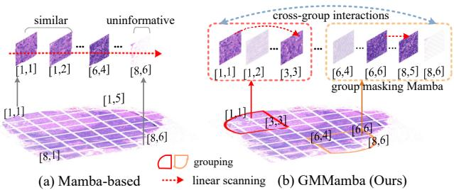

[← 返回 README](../README.md)

# Abstract & Introduction 摘要与引言

## 📌 预览

GMMamba 针对 Mamba-MIL 的两个痛点——**局部冗余**（相似/无信息 patch）和**稀疏全局表示**（肿瘤散布、组间相关不足）——提出两模块：**(1) IMM（Intra-group Masking Mamba）** 在双向 Mamba 建模中自适应预测稀疏 mask、过滤低注意力（无信息）特征，得到紧凑局部表示；**(2) CSS（Cross-group Super-feature Sampling）** 从各组采样判别性 super-feature、建模散布肿瘤区的长程依赖。在 baseline set 里对应"关键只是 evidence selection / redundancy removal"竞争解释，且是 MambaMIL 的进阶（Mamba + evidence selection）。

---

## Abstract

Recent advances in selective state space model (Mamba) have shown great promise in WSI classification. Despite this, WSIs contain explicit local redundancy (similar patches) and irrelevant regions (uninformative instances), posing significant challenges for Mamba-based MIL methods in capturing global representations. Furthermore, bag-level approaches struggle to extract critical features from all instances, while group-level methods fail to adequately account for tumor dispersion and intrinsic correlations across groups. To address these issues, we propose group masking Mamba (GMMamba), combining two modules: (1) intra-group masking Mamba (IMM) for selective instance exploration within groups, and (2) cross-group super-feature sampling (CSS) to ameliorate long-range relation learning. IMM adaptively predicts sparse masks to filter out features with low attention scores during bidirectional Mamba modeling. CSS aggregates sparse group representations into discriminative features, grasping dependencies among dispersed and sparse tumor regions. Experiments on four datasets demonstrate GMMamba outperforms ACMIL by 2.2% and 6.4% in accuracy on TCGA-BRCA and TCGA-ESCA.

> 💡 **问题动机（GMMamba = MambaMIL + evidence selection）**（Hao 批注）：GMMamba 直接建在 [MambaMIL](../../%5BMICCAI%202024%5D%20MambaMIL/) 之上，针对其两个未解问题：
> 1. **局部冗余**：vanilla/Bi-Mamba 均匀处理所有 instance → 无信息特征浪费算力、还可能干扰。GMMamba 用 **IMM 的稀疏 mask** 过滤低注意力 instance（evidence selection）。
> 2. **稀疏全局表示**：肿瘤散布，组间相关建模不足。GMMamba 用 **CSS** 跨组采样 super-feature 建模散布肿瘤的长程依赖。
>
> **对 baseline set 的关键定位**：GMMamba 是 MambaMIL 的 base-control 配对——**GMMamba(Mamba+evidence selection) vs MambaMIL(纯 Mamba)** 的对比能干净拆出"evidence selection / redundancy removal"的增益。若新方法超不过 GMMamba，说明增益不只来自去冗余。

> 💡 **机制拆解（IMM + CSS 两模块）**（Hao 批注）：
> - **IMM（组内去冗余）**：先 location-based K-Means 聚类把 bag 分成 G 组（语义相关的 instance 一组，非随机分组）→ 组内双向 Mamba 建模 → attention block 预测 mask、丢弃低注意力的 $M\times M_r$ 个 instance → 剩余 instance 再过 Bi-Mamba + attention 得组表示。
> - **CSS（组间聚合）**：Max-Pooling 提各组最显著特征作初始 super-feature → cross-attention 跨组聚合 → MHA 精炼 → 关联矩阵 Q 桥接局部与全局 → super-feature 组表示。
> - **class token + MHA** 最终聚合成 bag 表示。
>
> 核心是"**组内去冗余（IMM）+ 组间抓散布（CSS）**"的两级设计——比 MambaMIL 的 SR-Mamba 多了显式的 evidence selection 和 cross-group 建模。

## 1. Introduction

MIL improves bag representation via Mean-Pooling, attention, RNN/GNN, Transformer. Critical trade-off: computational efficiency vs discriminative bag representation. Transformer-based MIL (TransMIL) suffers high cost with massive instances. Mamba models long sequences with linear complexity, but two limitations: **1) Redundant Local Modeling** (bag-based Mamba processes all instances uniformly → overhead + potential loss of critical info); **2) Sparse Global Representation** (tumor regions dispersed/sparse → hard to aggregate across groups).

GMMamba uses **location-based clustering** (not random grouping) to group semantically related instances; IMM adaptively incorporates learnable sparse masks between BiMamba blocks to prune low-attention features; CSS aggregates discriminative features from dispersed tumor regions by sampling "super-features".

*Figure 2: WSI 中的显式局部冗余（相似/无信息 instance）。GMMamba 用 IMM + CSS 提升 Mamba-MIL 效率，探索关键 instance 与全局表示。*

> 💡 **Figure 2 批读 + location-based grouping**（Hao 批注）：Fig.2 直观展示"局部冗余"——大量相似/背景 patch。GMMamba 的一个重要设计是 **location-based clustering（按坐标 K-Means 分组）** 而非随机分组——把空间相邻/语义相关的 instance 分到一组，降低训练不确定性、便于建立 instance 关系。这与 [MambaMIL](../../%5BMICCAI%202024%5D%20MambaMIL/) 的 segment 切分（按序列位置）、[RetMIL](../../%5BMICCAI%202024%5D%20RetMIL/) 的子序列切分不同——GMMamba 用**空间坐标**分组，更符合组织的空间结构。对 CKMIL/ReadySlide：空间感知的分组是利用 WSI 空间结构的一种方式（与 [Spatial-Blindness](../../../ckmil-re-attn-mil/) 关切的"空间是否被用到"呼应）。
