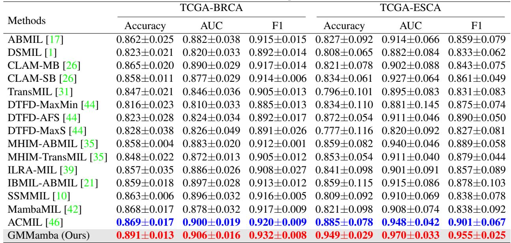
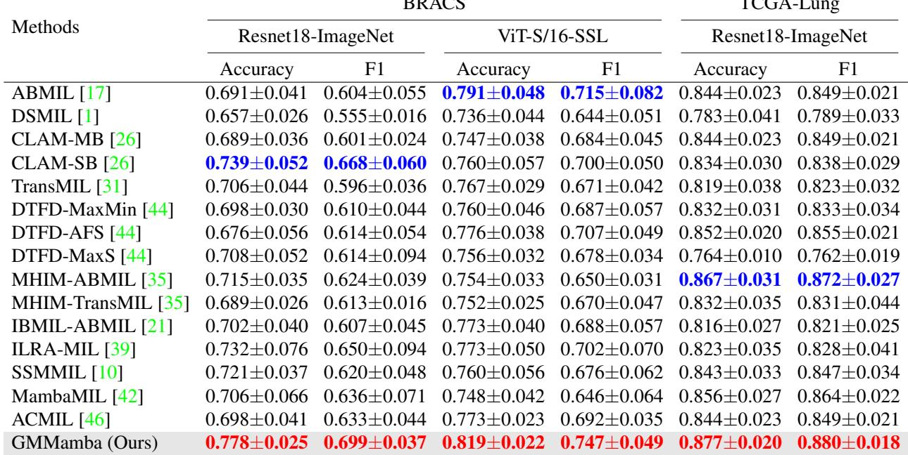
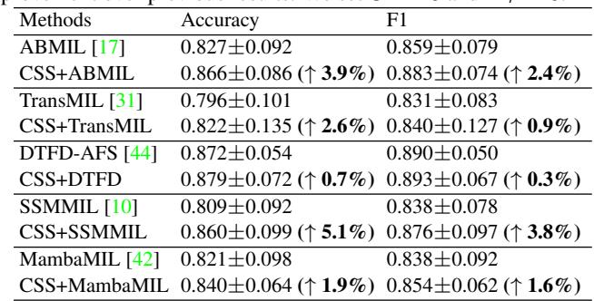
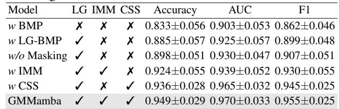
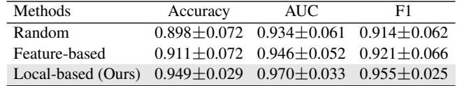

[← 返回 README](../README.md)

# 4-5. Experiments & Conclusion 实验与结论

## 📌 预览

4 数据集（TCGA-BRCA/ESCA/Lung、BRACS）。GMMamba 全面 SOTA：超 ACMIL +2.2%(BRCA)/+6.4%(ESCA)、超 MambaMIL 平均 +7.15% Acc。丰富消融：location-based grouping > 随机/特征聚类（+5.1%/+3.8%）、IMM masking 有效（$M_r$=0→20% 提升 9.4% Acc）、CSS 各组件递进有效、G=10 最优、CSS 可泛化到多个 MIL（+1.9~5.1%）。

---

## 4. Experiments

Four datasets: TCGA-BRCA (952 slides, IDC vs ILC), TCGA-ESCA (156 slides), BRACS (3-class), TCGA-Lung (LUAD vs LUSC). ResNet18-ImageNet features (BRACS also ViT-S/16-SSL). Baselines: attention-based (ABMIL/CLAM/DSMIL/MHIM-ABMIL/IBMIL/ILRA-MIL/ACMIL), Transformer (TransMIL/DTFD/MHIM-TransMIL), Mamba (SSMMIL/MambaMIL).

*Table 1: TCGA-BRCA / TCGA-ESCA 结果（ResNet18-ImageNet）。GMMamba 全指标最优：BRCA Acc 0.891、ESCA Acc 0.949。*

GMMamba outperforms all baselines. vs ACMIL: +2.2% (BRCA), +6.4% (ESCA) accuracy. vs MambaMIL: average gains 7.15% accuracy, 8.2% F1 on both encoders. On BRACS 3-class: +3.9%/+2.8% over CLAM/ABMIL.

*Table 2: BRACS / TCGA-Lung 结果。GMMamba 在 BRACS 两特征下均最优（除 ViT-S/16 ABMIL 略高）。*

> 💡 **Table 1/2 批读（GMMamba vs MambaMIL = evidence selection 的价值）**（Hao 批注）：最关键的对比是 **GMMamba vs MambaMIL**——GMMamba 平均超 MambaMIL +7.15% Acc。因为 GMMamba = MambaMIL 的思路（SSM）+ **evidence selection（IMM masking）+ cross-group（CSS）**。这个大幅提升说明"**在 Mamba 上加 evidence selection + 组间建模**"很有效。但要注意：GMMamba 也换了分组方式（location-based）、加了 CSS——增益是多个组件叠加，不全是 masking。消融（下）才能拆清。**ESCA 上提升尤其大（+6.4%）**——ESCA 数据小（156 片），去冗余/选证据对小数据更关键。

## 4.5 CSS Module Generalizability

*Table 3: CSS 插入 5 个 MIL 框架（TCGA-ESCA）。CSS 提升 bag-level 方法 1.9~5.1% Acc。*

CSS integrated with 5 MIL frameworks improves bag-level methods by 3.9%/2.6%/5.1%/1.9%. CSS-DTFD outperforms DTFD-AFS by 0.7% accuracy.

> 💡 **Table 3 批读（CSS 是可移植的组间聚合器）**（Hao 批注）：CSS 单独插到 ABMIL/TransMIL/DTFD/SSMMIL/MambaMIL 上都涨（+1.9~5.1%）——说明 **CSS 是一个可移植的"组间散布肿瘤聚合"模块**，不依赖 Mamba。这对 CKMIL/ReadySlide 有直接价值：CSS 的"super-feature 采样 + 关联矩阵桥接局部全局"可作为通用的组间聚合插件。

## 4.6 Ablation Studies

*Table 4: 基础组件消融（TCGA-ESCA）。LG（location grouping）+ IMM + CSS 逐级验证。*

Component ablation: **LG** (location-based grouping) over w BMP baseline: +5.2% accuracy (clustering relevant instances helps BiMamba). **IMM** over w/o Masking: +2.6% accuracy, +2.3% F1 (local redundancy removal). **CSS** over w IMM: +2.5% accuracy, +3.1% AUC (aggregates dispersed tumor info). Full GMMamba best.

*Table 6/7/8: 分组策略（location > feature > random）、分组数 G（G=10 最优）、mask 比例 $M_r$（10-20% 最优）消融。*

**Grouping strategies (Table 6)**: location-based > feature-based clustering > random (+5.1%/+3.8% accuracy). Feature-based ignores spatial structure. **Grouping number G (Table 7)**: G=10 optimal. **Mask ratio $M_r$ (Table 8)**: masking greatly boosts accuracy — $M_r$=0→10-20% gives +9.4% (ESCA) / +3.8% (Lung) accuracy.

> 💡 **Table 4/6/8 消融解读（拆清各组件增益）**（Hao 批注）：这组消融很扎实，拆清了 GMMamba 的增益来源：
> 1. **location-based grouping 是最大功臣之一**（+5.2%）：按空间坐标分组 > 特征聚类 > 随机。原因——空间相邻的 instance 组织同质性高，便于 BiMamba 建模、也便于去冗余。**这是对 [Spatial-Blindness](../../../ckmil-re-attn-mil/) 的一个正面回应——空间信息（坐标分组）确实有用**。
> 2. **IMM masking 有效**（+2.6%，$M_r$=0→20% 达 +9.4%）：去冗余确实提升，且 mask 比例 10-20% 最优（太高丢关键信息）。
> 3. **CSS 有效**（+2.5%）：组间散布肿瘤聚合。
> - **对 baseline set/CKMIL**：GMMamba 作为 MambaMIL 的进阶，其 clean ablation 证明"evidence selection（masking）+ 空间分组 + 组间聚合"各有贡献。新方法若声称去冗余，需与 GMMamba 比。**mask 比例的倒 U 形**（10-20% 最优、太高变差）再次印证"适度保留"原则（呼应 [PIBD](../../%5BICLR%202024%5D%20PIBD/) 的 Irr、[EAGLE](../../%5BNat%20Commun%202026%5D%20DL-Efficient-Pathology/) 的 25 tile）。

## 5. Conclusion

GMMamba facilitates global modeling and reduces redundancy via IMM (intra-group masking, addresses local redundancy) + CSS (cross-group super-feature sampling, aggregates dispersed tumor info). SOTA on multiple benchmarks. **Limitation**: same masking ratio across groups (future: learnable ratio networks).

> 💡 **总结 + 对 baseline set 的定位**（Hao 批注）：GMMamba 在 baseline set 里：
> - **排除的竞争解释**："关键只是 evidence selection / redundancy removal"——但 GMMamba 实为 MambaMIL + IMM(masking) + CSS(cross-group) 的组合，增益是多组件叠加。
> - **是 MambaMIL 的进阶配对**：GMMamba vs MambaMIL 的 +7.15% 展示了"在 SSM 上加去冗余+组间建模"的价值。
> - **CSS 可移植**（Table 3 插各种 MIL 都涨）——可作通用组间聚合插件。
> - **对 CKMIL/ReadySlide**：(1) location-based grouping 证明空间坐标分组有用；(2) IMM masking 的倒 U 形（10-20% 最优）印证适度保留；(3) CSS 是可复用的散布特征聚合；(4) 与 [PAMoE](../../%5BCVPR%202025%5D%20PAMoE/) 都做"聚合器内 evidence selection"但机制不同（mask vs expert-choice）。

> 💡 **Q&A 批注记录**（Hao 批注）：
> - Q：GMMamba 相对 MambaMIL 的净增益来自哪？
> - A：三部分——location-based grouping（+5.2%）、IMM masking（+2.6%）、CSS（+2.5%）。不全是 masking，空间分组贡献最大。
> - Q：IMM 的 masking 和 ACMIL 的 STKIM 方向相反？
> - A：是。ACMIL STKIM 遮**高**注意力（怕过度集中、逼看更多）；GMMamba IMM 丢**低**注意力（怕冗余稀释、保关键）。取决于问题是"过度集中"还是"冗余过多"——WSI 大量背景/相似 patch 时 IMM 的去冗余合理。
> - Q：能在冻结 FM 特征上跑吗？
> - A：能。输入 patch 特征 + 坐标（location-based grouping 需要坐标）。换 UNI2/Virchow2 只改特征维度。注意它需要 patch 坐标做空间分组。
