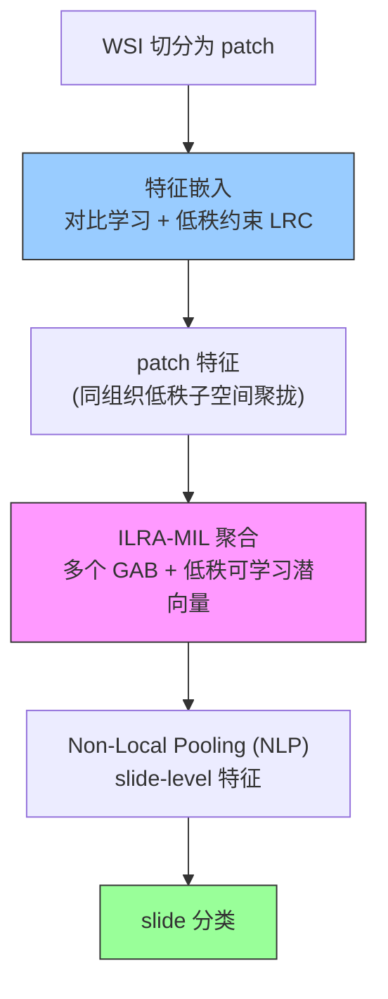

# ILRA-MIL: Exploring Low-Rank Property in Multiple Instance Learning for Whole Slide Image Classification

> ⚠️ **说明（Hao 批注）**：本篇发表于 **ICLR 2023，仅在 OpenReview 托管**（无 arXiv 版本）。OpenReview 的 PDF 接口对自动抓取做了 challenge 校验，MinerU / 直接下载 / WebFetch 在当前环境**均无法获取 PDF 原文**，作者个人主页也只回链到同一个被封的 OpenReview PDF。因此本目录暂为**基于公开摘要/官方信息整理的速览卡**，尚未做"原文完整保留 + 内嵌批注"的标准批读。**如需完整批读，请把 `paper.pdf` 手动放入本目录**（可从 https://openreview.net/pdf?id=01KmhBsEPFO 浏览器下载），我会用 MinerU 解析后补齐 sections/。

**作者**: Jinxi Xiang, Xiyue Wang, Jun Zhang, Sen Yang, Xiao Han, Wei Yang（Tencent AI Lab）
**会议**: ICLR 2023 (The Eleventh International Conference on Learning Representations, Kigali, Rwanda)
**链接**: [OpenReview](https://openreview.net/forum?id=01KmhBsEPFO) · [PDF](https://openreview.net/pdf?id=01KmhBsEPFO) · [Code](https://github.com/jinxixiang/low_rank_wsi) · [作者主页](https://jinxixiang.com/publication/conference-ilra/)

## 一句话总结

利用高分辨率 WSI 中 patch 之间"高度相似 → 数据流形低秩"的性质，从**特征嵌入**（低秩约束对比学习 LRC）和**特征聚合**（迭代低秩注意力 ILRA-MIL）两端同时改进 MIL：在避免 Transformer $O(n^2)$ 复杂度的前提下建模全局 instance 交互。

## 核心贡献

1. **Low-Rank Constraint (LRC) 特征嵌入**：在对比学习中加入病理特定的低秩约束——把属于同一病理组织的 patch 在低秩子空间里拉近，把不同潜在子空间的 patch 推远，得到更判别的 patch 表征。
2. **Iterative Low-Rank Attention MIL (ILRA-MIL) 聚合器**：用**低秩可学习潜向量**聚合特征来建模所有 instance 间的全局交互；由多个 **Gated Attention Block (GAB)** + **Non-Local Pooling (NLP)** 组成，避免直接用 Transformer encoder 的 $O(n^2)$ 复杂度。
3. **强调 instance 相关性建模的重要性**，同时给出低秩这一"既省算力又保全局交互"的折中方案。

## 关键数字（来自公开信息）

| 数据集 | 任务 | 结果 |
|--------|------|------|
| CAMELYON16 | 二分类转移检测 | **96.49% AUC** |
| TCGA-NSCLC | 肺癌亚型分型 | **97.63% AUC** |
| PANDA（大规模） | 前列腺癌分级 | **0.6562 kappa** |

## 数据流：输入 → 中间表示 → 输出

## 与本主题（Whole Slide Image Analysis）的关系（Hao 批注）

- **低秩 = 一种"信息压缩"视角**：ILRA 显式假设 WSI 的 patch 集合在流形上低秩（大量冗余相似 patch）。这与本主题里 [ACMIL](../%5BECCV%202024%5D%20ACMIL/)（注意力过度集中→过拟合）、以及压缩/保留研究（importance-based retention）是同一枚硬币的两面：**冗余可压、关键需留**。ILRA 用低秩潜向量做全局交互，本质是在"少数代表方向"上聚合信息。
- **对比对象**：ILRA 的 GAB+NLP 是"低秩注意力"，而 CKMIL / Transformer-MIL 走全 $O(n^2)$ 交互；[Spatial-Blindness](../../ckmil-re-attn-mil/) 那一线则质疑这些复杂交互是否被优化真正利用。ILRA 值得作为"低秩高效 MIL"的基线锚点。

## 阅读 Q&A 记录（基于公开信息，待 PDF 核对）

- **Q: ILRA 为什么不用标准 Transformer 做 instance 交互？**
  A: WSI 一张有上万 patch，Transformer 自注意力 $O(n^2)$ 不可承受。ILRA 用低秩可学习潜向量做"瓶颈式"全局交互，复杂度大幅降低。
- **Q: LRC 和 ILRA-MIL 是两个独立阶段吗？**
  A: 是。LRC 作用在**特征嵌入/对比预训练**阶段（得到更好的 patch 特征），ILRA-MIL 作用在**聚合**阶段。二者可组合，也可单独消融。
- **Q: 待 PDF 补齐的内容？**
  A: GAB/NLP 的精确公式、低秩秩数的选择与消融、LRC 损失的具体形式、以及各数据集完整对比表。

---

*⚠️ 本 README 为公开信息速览；`sections/` 标准批读待补（需手动提供 `paper.pdf`）。*
