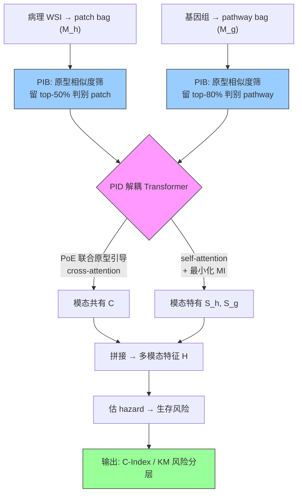

# PIBD: Prototypical Information Bottlenecking and Disentangling for Multimodal Cancer Survival Prediction

**作者**: Yilan Zhang, Yingxue Xu, Jianqi Chen, Fengying Xie, Hao Chen（HKUST & Beihang University）
**会议**: ICLR 2024 | **年份**: 2024（arXiv 2401.01646）
**链接**: [arXiv](https://arxiv.org/abs/2401.01646) · [OpenReview](https://openreview.net/forum?id=otHZ8JAIgh)

## 一句话总结

用**信息论**治多模态（病理 WSI + 基因组）癌症生存预测的两种冗余：**PIB（原型信息瓶颈）** 用风险等级原型近似 bag 分布、按相似度筛判别 instance 去"模态内冗余"；**PID（原型信息解耦）** 在联合原型分布引导下把特征解耦成模态共有+模态特有、用互信息最小化去"模态间冗余"并保护模态特有信息。

## 核心贡献

1. **两冗余框架**：首次从信息论视角把多模态生存预测的冗余分成 intra-modal（单模态任务无关信息）+ inter-modal（跨模态重复信息压制特有信息），并分别对症。
2. **PIB**：IB 变体，用 $2N_t$ 个风险等级原型（高斯）近似 bag 级分布，绕开逐 instance $p(z|\mathbf{x})$ 的高维不可算；按与正原型的相似度筛 instance（信息保留率 Irr 控制压缩）。
3. **PID**：解耦 transformer + Product-of-Experts 联合原型引导共有信息 C，CLUB 最小化 MI 保护模态特有 $S_h/S_g$。
4. **五癌种 SOTA + 强可解释性**：总体 0.699（超次优 1.6%）；原型干预实验证明正原型是预测核心（删除后 C-Index<0.5）。

## 📖 批读导航

| Section | 内容 |
|---------|------|
| [00 - Abstract](sections/00-abstract.md) | 摘要 + 两冗余 + 与 MOTCat 姊妹关系 + Irr 压缩旋钮 |
| [01 - Introduction & Related Work](sections/01-introduction.md) | 两个问题定义 PIB/PID、三条相关工作线 |
| [02 - Method](sections/02-method.md) | Fig.1 框架、PIB（Eq.2-9）、PID（Eq.10-13）、Fig.2 解耦 transformer |
| [03 - Experiments & Conclusion](sections/03-experiments.md) | Table 1 主结果、Table 2/3 消融+原型干预、Fig.4 t-SNE、Irr、结论、附录 |

## 关键数字

| 指标 | 数值 |
|------|------|
| 数据集 | 5 TCGA：BRCA(869)/BLCA(359)/COADREAD(296)/HNSC(392)/STAD(317)，预测 DSS |
| Backbone | CTransPath (Swin SSL, 14M+ patch) 768-d；pathways SNN |
| pathway | MSigDB Hallmarks 50 + Reactome 281 |
| 原型数 | 8（4 时间区间 × 删失状态） |
| **信息保留率 Irr** | 病理 50%（可低至 25-40%）、基因 80%（可低至 55-70%）→ 减 60-75% 数据 |
| 主结果 | 总体 C-Index 0.699（超次优 SurvPath/CLAM-SB-FT 0.683 约 1.6pp） |
| 原型干预 | 删正原型 → C-Index<0.5；删负原型微降 |
| 超参 | α=0.1, β=0.01, γ=1, λ=0.1 |

## 数据流：输入 → 中间表示 → 输出

## 优缺点与还能做什么

### 优点
- **信息论原理化**：PIB 用 IB 保证"留任务相关、压无关"，比启发式 Top-k 更有依据；Irr 是显式压缩旋钮。
- **保护模态特有信息**：PID 的 MI 最小化直击"对齐式融合淹没特有信息"的通病。
- **强可解释性**：原型干预（删正原型 C-Index<0.5）+ t-SNE 直接证明原型承载判别信息。
- **严谨**：主动做抗数据污染实验（换 ImageNet 特征仍赢）。

### 局限 / 风险
- **相似度度量**（cosine）作者自承需 further study。
- **Irr 全局固定**，非内容自适应（每张 slide 同一保留率）。
- **提升温和**（总体 +1.6pp），且未做分层去混杂验证——判别原型是否也学到 grade/TMB proxy 未知（与 [Confounders](../%5BNat%20Biomed%20Eng%202026%5D%20Confounders-Biomarker-Prediction/) 的关切呼应）。

### 还能做什么（对本课题 ReadySlide）
- **IB 原型相似度作 retention 信号**：PIB 的"保留与正原型相似的 instance"是原理化的 patch 保留法，可对标/超越 Top-k；Irr↔retention 率直接同构。
- **内容自适应 Irr**：把全局固定保留率改成 per-slide 自适应（信息量高的 slide 多留）。
- **压缩 + 去混杂**：结合 Confounders 的分层协议，验证压缩保留的是因果诊断信号而非 proxy。

## 阅读 Q&A 记录

- **Q: PIB 相对标准 VIB 的关键改进？**
  A: VIB 要为每个 instance 学 $q_\theta(z|x)$ 再合成 bag 分布，上万 instance 高维不可算。PIB 改为**为每个风险等级建一个原型高斯 $p(\hat z|y)$**，用相似度拉近同标签 instance，只需优化少数原型 + encoder，绕开高维难题。

- **Q: PID 如何避免共有信息淹没模态特有信息？**
  A: 用 PoE 把两模态正原型相乘得联合后验、cross-attention 提共有 C；self-attention 提特有 $S_h/S_g$；再**最小化 $I(S,C)$ 和 $I(S_h,S_g)$**（CLUB 上界）强制独立，为特有信息"腾空间"。

- **Q: 怎么证明原型不是摆设？**
  A: 原型干预实验（Table 3）——删正原型 C-Index 掉到 <0.5（比随机差），删负原型几乎不变。说明正原型承载了该病人风险等级的判别信息，且错误原型会连锁误导 PID。

- **Q: 对 WSI 压缩/ReadySlide 最大启示？**
  A: 病理只留 25-40% patch 就保持性能（减 60-75% 数据），且 PIB 给出"按 IB 原型相似度决定保留"的原理化方法——比启发式 Top-k 更有依据，Irr 直接对应 retention 率。

## 📊 Citation Landscape

> Semantic Scholar 采集限流，据论文自身引用整理。

**同主题最相关**
- [MOTCat](../%5BICCV%202023%5D%20MOTCat/)（Xu & Chen, ICCV 2023）——同课题组姊妹作，OT 全局匹配选 patch，本目录已批读。
- MCAT（Chen et al., ICCV 2021）——gene-guided co-attention 基线。
- SurvPath（Jaume et al., 2023）——cross-attention dense pathway-patch，主要竞品（次优）。
- Porpoise（Chen et al., Cancer Cell 2022）、Pathomic（TMI 2020）——多模态生存基线。

**方法来源**
- IB / VIB（Tishby 2000；Alemi et al. 2016）——信息瓶颈基础。
- CLUB（Cheng et al., ICML 2020）——MI 上界估计器。
- Product-of-Experts（Cao & Fleet 2014）——高斯专家融合。
- CTransPath（Wang et al., MedIA 2022）——Swin SSL 病理 encoder；SNN（Klambauer et al. 2017）——基因 encoder。
- MIB/DeepIMV/L-MIB——信息论多模态对照方法。
