[← 返回 README](../README.md)

# 3. Method 方法

## 📌 预览

框架（Fig.1）：两模态各建 bag → PIB 选判别 instance（去 intra-modal 冗余）→ PID 解耦成模态共有 C + 模态特有 $S_h/S_g$（去 inter-modal 冗余）→ 拼接做生存预测（NLL 损失 Eq.1）。PIB（3.2）：IB 原理（Eq.2-3）→ 用原型近似 bag 分布（Eq.5）→ 相似度筛 instance（Eq.6）+ 原型对比损失（Eq.7）→ PIB 损失（Eq.8-9）。PID（3.3）：解耦 transformer（Fig.2）+ PoE 联合原型引导共有信息（Eq.11-12）+ CLUB 最小化 MI（Eq.10）。总损失 Eq.13。

---

## 3.1 Overall Framework and Problem Formulation

Given patient pathology data $\mathbf{x}_h^{(i)}$ and genomic data $\mathbf{x}_g^{(i)}$, we predict survival by estimating a hazard function. Both are formulated as MIL "bags": $\mathbf{x}_h^{(i)} = \{x_{h,j}^{(i)}\}_{j=1}^{M_h}$ ($M_h$ patches) and $\mathbf{x}_g^{(i)} = \{x_{g,j}^{(i)}\}_{j=1}^{M_g}$ ($M_g$ pathways).

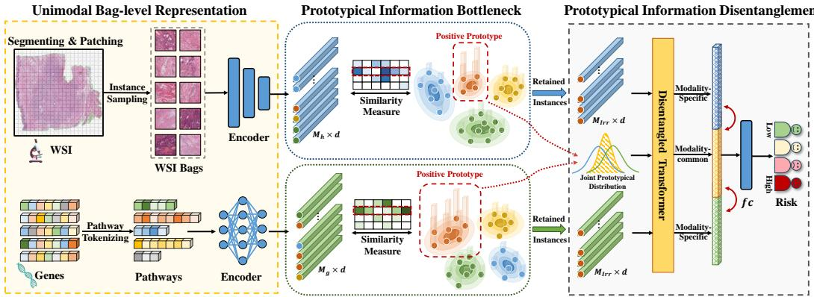

*Figure 1: PIBD 框架。两模态先建 bag；PIB 选判别特征去"模态内冗余"；PID 解耦特有/共有信息去"模态间冗余"。*

With censorship $c \in \{0,1\}$ and discrete survival time $t$, using NLL survival loss:

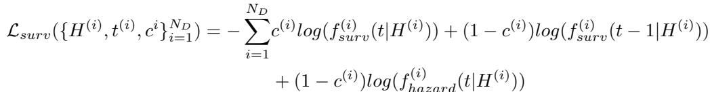

*Eq. (1): NLL 生存损失 $\mathcal{L}_{surv}$，含删失项。*

> 💡 **Figure 1 批读**（数据流全景）（Hao 批注）：两条模态并行——各自建 bag → 各自过 PIB 筛 instance → 进 PID 解耦 → 拼接 H → 估 hazard。关键：**PID 复用 PIB 建好的联合原型分布**（不是两个独立模块，PIB 的原型是 PID 提取共有信息的"引导信号"）。这个复用是设计精髓，也是"Prototypical"贯穿两模块的原因。

## 3.2 Prototypical Information Bottleneck (PIB)

**Preliminary of IB**: introduce representation $Z$ maximally expressive about target $Y$ while compressing input $X$:

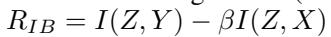

*Eq. (2): IB 目标 $R_{IB} = I(Z,Y) - \beta I(Z,X)$。*

MI is intractable; VIB minimizes a variational bound:

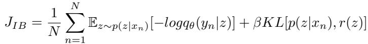

*Eq. (3): VIB 损失 $J_{IB}$——重构项 + $\beta$ KL 压缩项。*

**Prototypical IB**: for bag structure, deriving $p(z|\mathbf{x})$ from many instances is high-dimensional/intractable. PIB directly approximates bag-level distribution with a group of prototypes $\mathbf{P} = \{\mathcal{N}(\hat z; \mu_y, \Sigma_y)\}_{y=1}^{2N_t}$, each representing a risk band's conditional $p(\hat z|y)$:

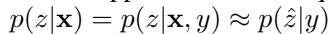

*Eq. (5): 用原型近似 bag 分布 $p(z|\mathbf{x}) = p(z|\mathbf{x},y) \approx p(\hat z|y)$。*

Measure similarity between prototype $\hat z_n$ and bag $\mathbf{z}$:

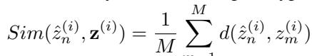

*Eq. (6): 相似度 $Sim(\hat z_n, \mathbf{z}) = \frac1M\sum_m d(\hat z_n, z_m)$（d 用 cosine）。*

Select instances with higher similarity (discard the rest = redundancy removal). Prototype contrastive loss:

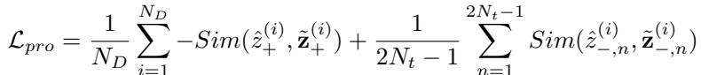

*Eq. (7): 原型近似损失 $\mathcal{L}_{pro}$——拉近正原型与相关 instance、推远负原型。保留数由信息保留率 Irr 控制。*

Total PIB loss:

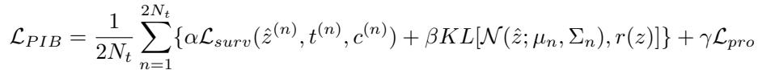

*Eq. (9): $\mathcal{L}_{PIB} = \frac{1}{2N_t}\sum \{\alpha\mathcal{L}_{surv} + \beta KL[\mathcal{N}(\hat z;\mu_n,\Sigma_n), r(z)]\} + \gamma\mathcal{L}_{pro}$。*

> 💡 **公式批读**（PIB 的核心巧思：原型代替逐 instance 分布）（Hao 批注）：
> - **痛点**：标准 VIB 要为每个 instance 学 $q_\theta(z|x)$，再合成 bag 分布 $p(z|\mathbf{x})$——上万 instance 高维不可算，且难捕获 bag 级信息。
> - **PIB 解法**：**为每个风险等级建一个原型高斯 $p(\hat z|y)$**（$2N_t$ 个原型，$N_t$ 个时间区间 × 删失状态）。用相似度（Eq.6，cosine）衡量 instance 与原型的接近度，拉近同标签、推远异标签（Eq.7 对比损失）。于是**只需优化少数原型 + encoder $f_E$，不必为每 instance 建分布**。
> - **去冗余 = 筛 instance**：只保留与正原型相似度高的 top-Irr 比例 instance，其余（冗余）丢弃不参与学习。**Irr 就是压缩率旋钮**（病理 50%、基因 80%）。
> - **对压缩研究**：这是"信息瓶颈驱动的 patch 保留"的干净范例——原型 = 风险等级的判别中心，保留 = 靠近某原型的 instance。比单纯注意力 Top-K 更有理论依据（IB 保证保留任务相关、压缩无关）。

## 3.3 Prototypical Information Disentanglement (PID)

Decompose entangled multimodal features into modality-common $C$ and modality-specific $S_h, S_g$. Minimize MI to ensure independence:

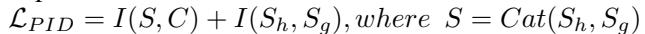

*Eq. (10): PID 损失 $\mathcal{L}_{PID} = I(S,C) + I(S_h,S_g)$，$S = Cat(S_h,S_g)$；MI 用 CLUB 上界估计。*

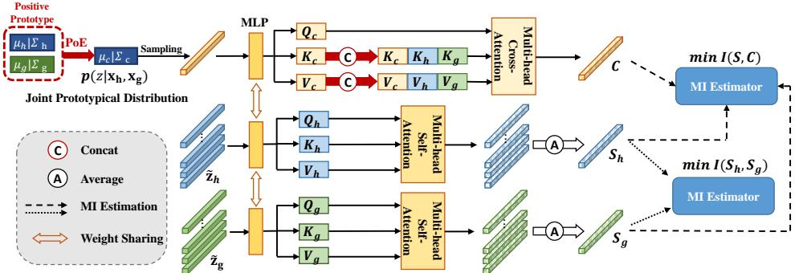

*Figure 2: 解耦 Transformer。self-attention 建模模态内交互得 $S_h/S_g$；从联合原型分布采样的 token 经 cross-attention 引导共有信息 C 提取。*

Common information guided by joint prototypical distribution via Product-of-Experts (PoE):

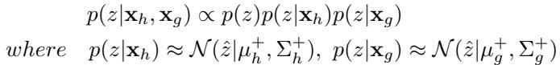

*Eq. (11): 联合后验 $p(z|\mathbf{x}_h,\mathbf{x}_g) \propto p(z)p(z|\mathbf{x}_h)p(z|\mathbf{x}_g)$，$p(z|\mathbf{x})$ 用正原型近似。*

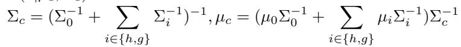

*Eq. (12): 高斯乘积仍为高斯，$\Sigma_c, \mu_c$ 的闭式解（精度相加）。*

Overall loss:

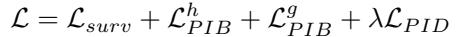

*Eq. (13): 总损失 $\mathcal{L} = \mathcal{L}_{surv} + \mathcal{L}_{PIB}^h + \mathcal{L}_{PIB}^g + \lambda\mathcal{L}_{PID}$。*

> 💡 **公式批读 + 机制拆解**（PID 如何解耦而不丢特有信息）（Hao 批注）：
> - **共有 C 的提取**：用 **Product-of-Experts**（Eq.11-12）把两模态的正原型分布相乘得联合后验（高斯乘积仍高斯，精度相加）→ 采样出一个"引导 token"→ 经 cross-attention 提取模态共有信息 C。**复用 PIB 原型**是关键：原型已建好风险等级分布，正好当共有信息的先验引导。
> - **特有 $S_h/S_g$ 的保护**：self-attention 建模模态内交互（patch-to-patch、pathway-to-pathway），再**最小化 $I(S,C)$ 和 $I(S_h,S_g)$**（Eq.10，用 CLUB 上界估计 MI）→ 强制特有信息与共有信息、以及两模态特有信息之间相互独立 → 防止共有信息淹没特有信息。
> - **为什么重要**：这直接回应引言"问题二"——对齐式融合的通病是共有信息主导。PID 用 MI 最小化显式"腾出空间"给模态特有的独特视角。CLUB（附录 B.3）预测低维条件高维以避免 mode collapse。
