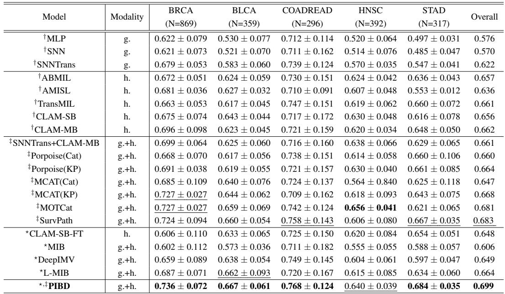
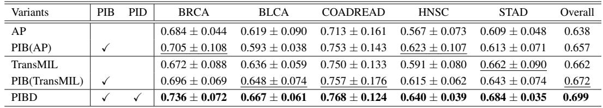
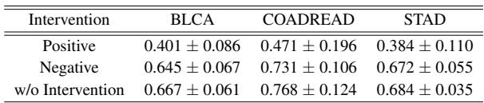
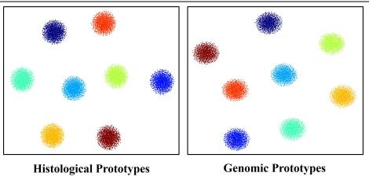

[← 返回 README](../README.md)

# 4. Experiments & Conclusion 实验与结论

## 📌 预览

五 TCGA 癌种（BRCA/BLCA/COADREAD/HNSC/STAD），5-fold CV，C-Index。PIBD 总体 0.699，4/5 数据集最优、超次优 1.6%，在信息论类方法上 +0.5~4.9%。消融证明 PIB、PID 各有贡献（0.638→0.657/0.672→0.699）。原型干预实验：删正原型 C-Index 掉到 <0.5（丧失预测力），删负原型仅微降 → 证明原型确实建模了判别性风险分布。信息保留率 Irr：病理留 25-40%、基因留 55-70% 即保持性能。

---

## 4.1 Dataset and Implementation

Five TCGA cancer datasets: BRCA (869), BLCA (359), COADREAD (296), HNSC (392), STAD (317). Predict disease-specific survival (DSS). Pathways from MSigDB Hallmarks (50) + Reactome (281). 5-fold CV, C-Index. Bag: 224×224 patches at 20×, CTransPath (Swin, SSL on 14M+ patches) → 768-d; pathways via SNN. 8 prototypes (4 time intervals × censorship). Hyperparameters α=0.1, β=0.01, γ=1, λ=0.1. **Retain top 50% (histology) / 80% (genomics) instances**. 4096 patches sampled, sub-bags of 512.

## 4.2 Comparisons with SOTA

*Table 1: 五癌种 C-Index。† 单模态，‡ 多模态，⋆ 信息论类。加粗最优、下划线次优。PIBD 总体 0.699。*

PIBD achieves best overall performance (0.699) across five datasets. Among multimodal methods, PIBD is superior in 4/5 benchmarks, outperforming second-best (SurvPath/CLAM-SB-FT 0.683) by 1.6% overall. Among IB-based methods, PIBD wins on all datasets with 0.5%-4.9% gains.

> 💡 **Table 1 批读**（主结果）（Hao 批注）：PIBD 总体 0.699，超所有单模态、多模态、信息论类方法。相对姊妹作 [MOTCat](../%5BICCV%202023%5D%20MOTCat/)（0.681 overall，注意数据集不完全相同）和 SurvPath（0.683）提升约 1.6pp。**关键对比**：PIBD 击败其他 IB 类方法（MIB/DeepIMV/L-MIB）0.5-4.9pp——说明"为 bag 结构 + 弱监督专门设计的 PIB"比通用 IB 更适配病理生存任务。这印证了"原型近似 bag 分布"的必要性。

## 4.3 Ablation Study

*Table 2: 消融。AP=平均池化 baseline，加 PIB / PID 逐级验证。*

PIB added to both AP baseline (0.638→0.657) and TransMIL (0.662→0.672) improves C-index (prototypes filter task-related features, mitigate intra-modal redundancy). Adding PID (PIB+PID = full PIBD, 0.672→0.699) eliminates inter-modal redundancy, preventing loss of modality-specific info.

*Table 3: 原型干预实验。删除正原型 / 随机删负原型。*

Intervention: **removing the positive prototype drops C-Index below 0.5** (complete loss of predictive ability); removing a random negative prototype causes only slight decline. This underscores effective modeling of discriminative risk-level distributions.

*Figure 4: 原型 t-SNE 可视化，不同风险等级分布可分性好。*

> 💡 **Table 2/3 + Figure 4 消融解读**（两个模块 + 原型有效性的三重验证）（Hao 批注）：
> - **Tab.2**：PIB 单独在两个 baseline 上都涨（去 intra 冗余有效），PID 再加一层（去 inter 冗余、保特有信息）→ 完整 PIBD 0.699。两模块正交有效。
> - **Tab.3（最有说服力）**：**删正原型 → C-Index 掉到 <0.5（比随机还差）**，删负原型几乎不变。这直接证明"正原型承载了该病人风险等级的判别信息"——原型不是摆设，而是预测的核心载体。掉到 <0.5 是因为错误的原型还会误导 PID 的共有信息提取（连锁错误）。
> - **Fig.4**：t-SNE 显示不同风险原型分布可分 → 原型确实学到了判别性的风险等级结构。
> - **对压缩研究**：原型干预是一种优雅的"重要性归因"——比注意力可视化更严格（直接消融因果部件）。可借鉴到验证"压缩保留的 instance 是否真承载诊断信息"。

## Information Retention Rate (Appendix C.2)

When Irr decreases from 100% (retain all), performance improves (removing intra-modal redundancy extracts discriminative info); too low Irr deteriorates (task-related instances discarded). Histology: comparable performance with only ~25-40% instances (60-75% data reduction); genomics: equivalent with ~55-70% pathways. Final: Irr 50% (histology), 80% (genomics).

> 💡 **信息保留率解读**（Irr = 压缩率旋钮，对 ReadySlide 直接相关）（Hao 批注）：这是 PIBD 对压缩研究**最直接可迁移**的结果——**病理只留 25-40% patch 就能保持甚至提升生存预测性能**（减 60-75% 数据）。呈倒 U 形：留太多（冗余稀释判别）和留太少（丢任务信息）都不好，中间有最优。这与 ReadySlide 的"retention 是杠杆"高度一致，且 PIBD 给出了"用 IB 原型相似度决定保留哪些"的一种原理化方法（比启发式 Top-k 更有依据）。**可追问**：PIBD 的 Irr 是全局固定比例，能否内容自适应（每张 slide 不同保留率）？

## 5 Conclusion

We propose PIBD addressing both "intra-modal redundancy" (via PIB modeling prototypes of risk bands to select discriminative features) and "inter-modal redundancy" (via PID decoupling modality-common and modality-specific features guided by joint prototypical distribution). The choice of similarity metric for aligning spatial distributions warrants further investigation.

## 附录要点（Appendix B–D）

- **PIB 推导（B.2）**：从 VIB（Eq.14-21）到 PIB（Eq.23-30）——引入 $Y\to\hat Z$ 链，用原型 $p(\hat z|y)$ 替换 $p(z|\mathbf{x})$，得可优化的原型对比 + KL 损失。
- **PID 的 CLUB（B.3）**：MI 用 vCLUB（Eq.31-34）上界估计；预测低维 C 条件高维 S 以防 mode collapse。
- **抗数据污染（C.3, Table 5）**：担心 CTransPath 在 TCGA 上预训练造成泄漏，额外用 ImageNet-ResNet50 特征重测，PIBD 仍领先（0.671 overall）——说明优势非来自预训练泄漏。

> 💡 **附录亮点 + 局限**（Hao 批注）：**C.3 的抗污染实验**值得关注——作者主动排除"CTransPath 见过 TCGA → 泄漏"的质疑，换 ImageNet 特征仍赢。这与本目录 [Confounders](../%5BNat%20Biomed%20Eng%202026%5D%20Confounders-Biomarker-Prediction/) 的关切（数据泄漏/混杂）呼应，是难得的严谨。**局限**：(1) 相似度度量（cosine）的选择作者自承需further study；(2) Irr 全局固定，非自适应；(3) 生存预测 C-Index 提升温和（1.6pp），且未做 [Confounders](../%5BNat%20Biomed%20Eng%202026%5D%20Confounders-Biomarker-Prediction/) 式的分层去混杂验证——PIBD 的"判别原型"是否也可能学到 grade/TMB proxy？这是可追问的交叉点。
