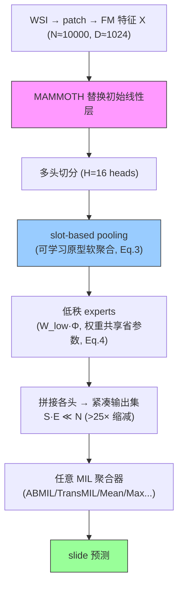

# MAMMOTH: Mixture of Mini Experts — Overcoming the Linear Layer Bottleneck in MIL

**作者**: Daniel Shao, Joel Runevic, Richard J. Chen, Drew F.K. Williamson, Ahrong Kim, Andrew H. Song, Faisal Mahmood（MIT / Harvard / Emory / MD Anderson，Mahmood Lab）
**会议**: ICLR 2026 | **年份**: 2026（arXiv 2603.22198）
**链接**: [arXiv](https://arxiv.org/abs/2603.22198) · [OpenReview](https://openreview.net/forum?id=S5Io33pc78) · [Code](https://github.com/mahmoodlab/MAMMOTH)

## 一句话总结

指出 MIL 被所有人忽略的瓶颈——**把通用 FM 特征变成任务特定特征的初始线性层**（所有 patch 一刀切）。MAMMOTH 用参数高效的**多头 soft mixture-of-experts** 替换它，按每个 patch 的表型做低秩变换。**决定性发现：任务特定特征变换对性能的影响 > 聚合器选择**——装上 MAMMOTH 后 mean/max pooling 就超过任何用标准线性层的复杂 MIL（8 MIL × 19 任务，130/152 配置提升，平均 +3.8%）。

## 核心贡献

1. **识别线性层瓶颈**：MIL 三步里第 2 步（特征变换）从未被研究，MAMMOTH 证明它是比聚合器更大的性能瓶颈。
2. **MAMMOTH 模块**：多头 soft MoE + slot-based pooling（可学习原型软聚合）+ 低秩 experts（权重共享，参数不变）+ 紧凑输出（$S\cdot E\ll N$，>25× 缩减）。
3. **plug-and-play**：替换任何 MIL 的初始线性层，8 个 MIL 都涨；mean/max pooling 装上超过 ABMIL baseline。
4. **可解释**：experts 学到不同形态概念；扩展消融证明优于其他 CPath MoE 变体。

## 📖 批读导航

| Section | 内容 |
|---------|------|
| [00 - Abstract & Introduction](sections/00-abstract-intro.md) | 摘要+引言、被忽略的瓶颈、Fig.1 结构化嵌入、对 CKMIL 的冲击 |
| [01 - Related Work & Method](sections/01-related-method.md) | Soft MoE、MAMMOTH vs PAMoE、多头/slot-pooling(Eq.3)/低秩(Eq.4)/紧凑输出 |
| [02 - Experiments & Results](sections/02-experiments-conclusion.md) | Table 1/2/3 三类任务、决定性发现、可解释、baseline/CKMIL 定位 |

## 关键数字

| 指标 | 数值 |
|------|------|
| 任务 | 19 任务（6 形态学 + 13 分子 biomarker + 4 生存）× 8 MIL |
| 特征 | UNI (ViT-L/16 DINOv2) |
| 配置 | E=30 experts, H=16 heads, S=9 slots，参数≈原线性层 |
| 总体 | 130/152 配置提升，平均 +3.8% |
| 形态学 | +7.36%（46/48 提升） |
| 分子 biomarker | 每数据集平均都升；individual 84/104，+2.1% |
| 生存 | 30/32 提升，+2.78 C-index |
| **决定性** | MAMMOTH+MeanPool 超 ABMIL +2.0%、+MaxPool +0.3% |

## 数据流：输入 → 中间表示 → 输出

## 优缺点与还能做什么

### 优点
- **识别真瓶颈**：证明特征变换 > 聚合器，挑战整个"设计聚合器"方向。
- **plug-and-play + 参数不变**：可与任何 MIL 组合（含本 baseline set 所有方法）。
- **让简单方法变强**：MeanPool+MAMMOTH 超复杂聚合器——又强又省。
- **软 MoE + 低秩**解决 CPath 的 MoE 训练不稳/过拟合；experts 可解释。

### 局限 / 风险
- **低基线 biomarker 增益不稳**（PIK3CA/KRAS——形态学本就难预测这些，signal 不足）。
- **简单高基线任务增益小**（NSCLC 二分类唯二下降）。
- **按特征相似度而非空间**融合——放弃空间结构信息（vs GMMamba location grouping）。
- **未做去混杂验证**：形态学特征变换是否也放大 shortcut？未验（与 Confounders 呼应）。

### 还能做什么（对本课题 CKMIL/ReadySlide）
- **必比对照**：CKMIL 若动特征变换/适配，必须与 MAMMOTH 正面对比；至少测 MeanPool/MAMMOTH+MeanPool/ABMIL/MAMMOTH+ABMIL 拆分"变换 vs 聚合"增益。
- **MeanPool+MAMMOTH 作强 baseline**：又强又省，ReadySlide 评估应纳入。
- **depth-selection vs feature-transformation**：MAMMOTH 做 per-patch 变换、CKMIL 探索多层 depth selection——都在"聚合前处理特征"，需说清 depth 的独特性。
- **slot-pooling 蒸馏**：$S\cdot E\ll N$ 的紧凑输出是"特征级压缩"的一种（vs ReadySlide 的 patch 级压缩），可对比/结合。

## 阅读 Q&A 记录

- **Q: MAMMOTH 最核心的发现是什么？**
  A: 任务特定特征变换（MIL 第 2 步的线性层）对性能的影响 > 聚合器选择。装 MAMMOTH 的 mean/max pooling 超过任何用标准线性层的复杂 MIL——线性层是被忽略的瓶颈。

- **Q: MAMMOTH 和 PAMoE 区别？**
  A: PAMoE 替换 transformer 块 FFN（稀疏路由、需 CONCH 原型监督）；MAMMOTH 替换 MIL 普适初始线性层（软路由、可学习 slot 原型）。MAMMOTH 更普适（任何 MIL 都有线性层，连 mean pooling 都能装）。

- **Q: 为什么装 MAMMOTH 的 mean pooling 能超 ABMIL？**
  A: MAMMOTH 在聚合前把特征按形态结构化（Fig.1A 从连续空间变成分簇空间），聚合器只需简单汇总。"好特征+笨聚合" > "标准特征+强聚合"。

- **Q: 对 CKMIL/ReadySlide 最大启示？**
  A: 真正杠杆在聚合前的 task-specific 特征变换，不是聚合器。CKMIL 新方法必须与 MAMMOTH 对比、论证增益独立性；MeanPool+MAMMOTH 是又强又省的 baseline。

## 📊 Citation Landscape

> Semantic Scholar 采集限流，据论文自身引用整理。Mahmood Lab（UNI/CONCH/TITAN 作者组）出品。

**同主题最相关**
- [PAMoE](../%5BCVPR%202025%5D%20PAMoE/)（CVPR 2025）——CPath MoE 的另一路线（transformer FFN + 稀疏路由），MAMMOTH 明确对比。
- 被 MAMMOTH 增强的 8 个 MIL：ABMIL / CLAM / [TransMIL](../%5BNeurIPS%202021%5D%20TransMIL/) / Transformer / [ILRA](../%5BICLR%202023%5D%20ILRA-MIL/) / DSMIL / [MeanMIL](../%5BNeurIPS%202017%5D%20DeepSets/) / MaxMIL。
- [EAGLE](../%5BNat%20Commun%202026%5D%20DL-Efficient-Pathology/)——pre-aggregation 采样子集（MAMMOTH 提及为对比）。

**方法来源**
- Soft MoE（Puigcerver et al. 2024）、Sparse MoE（Shazeer et al. 2017）、Multihead MoE（Wu et al. 2024）——MoE 基础；低秩/矩阵分解（LoRA, Hu et al. 2021）——参数高效；UNI（Chen et al., Nat Med 2024）——FM 特征。
