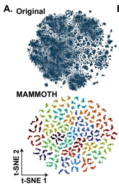

[← 返回 README](../README.md)

# Abstract & Introduction 摘要与引言

## 📌 预览

MAMMOTH 指出 MIL 被忽略的瓶颈：**把通用 FM 特征变成任务特定特征的那个线性层**。MIL 三步（提特征 → **线性层变任务特定** → 聚合）里，第 1、3 步被大量研究，唯独第 2 步（所有 patch 共用一个线性层）没人碰。MAMMOTH 用**参数高效的多头 mixture-of-experts** 替换这个线性层，按每个 patch 的表型（phenotype）做低秩变换。**核心发现：这个任务特定变换对性能的影响 > 聚合器的选择**——装上 MAMMOTH 后，连 max/mean pooling 都超过任何用标准线性层的方法。8 个 MIL × 19 任务、130/152 配置提升、平均 +3.8%。

---

## Abstract

Multiple Instance Learning (MIL) is the predominant framework for classifying gigapixel WSIs. MIL follows: 1) extracting patch features, 2) applying a linear layer to obtain task-specific patch features, and 3) aggregating the patches into a slide feature for classification. While substantial efforts have been devoted to optimizing patch feature extraction and aggregation, **none have yet addressed the second point, the critical layer which transforms general-purpose features into task-specific features**. We hypothesize that this layer constitutes an overlooked performance bottleneck and that stronger representations can be achieved with a low-rank transformation tailored to each patch's phenotype, yielding synergistic effects with any existing MIL approach. We introduce MAMMOTH, a parameter-efficient, multi-head mixture of experts module designed to improve the performance of any MIL model with minimal alterations to the total number of parameters. Across eight MIL methods and 19 different classification tasks, we find that such task-specific transformation has a larger effect on performance than the choice of aggregation method. For instance, when equipped with MAMMOTH, even simple methods such as max or mean pooling attain higher average performance than any method with the standard linear layer. Overall, MAMMOTH improves performance in 130 of the 152 examined configurations, with an average +3.8% change in performance.

> 💡 **问题动机（一个被所有人忽略的瓶颈）**（Hao 批注）：这是 baseline set 里**最高优先级、对 CKMIL 主线最重要**的论文。它的洞察极其锋利——整个 MIL 社区都在卷"提特征"（FM）和"聚合器"（ABMIL/TransMIL/Mamba...），但**没人管中间那个把通用特征变成任务特定特征的线性层**。所有 MIL 都对所有 patch 用**同一个**线性层，不管 patch 是肿瘤、间质还是免疫。MAMMOTH 假设：**这个"一刀切"线性层才是被忽略的瓶颈**——不同表型的 patch 应该有不同的特征变换。
> - **炸裂的结论**：任务特定变换（这个线性层）对性能的影响 **> 聚合器的选择**。装 MAMMOTH 后 **mean/max pooling 超过任何用标准线性层的复杂方法**。
> - **对 CKMIL/ReadySlide 的直接冲击**：这直接挑战"设计更好聚合器"的整个研究方向——**也许 FM 时代根本不需要新聚合器，需要的是更好的 task-specific feature transformation**。如果 CKMIL 的新方法涉及特征变换/适配，**必须与 MAMMOTH 正面对比**（这也是 baseline set 文档把它列为"最高优先级"的原因）。

> 💡 **机制拆解（MAMMOTH 如何解决 MoE 在 CPath 的难题）**（Hao 批注）：直接用 MoE 替换线性层有三个 CPath 特有难题，MAMMOTH 逐一破解：
> 1. **训练不稳定**（硬分配 → 梯度差、专家负载不均）→ 用 **Soft MoE 软分配**（每个 expert 处理所有 patch 的一个线性组合，梯度流好）。
> 2. **patch 多样本少**（~10,000 patch/片，<1,000 片）+ **特征维度大**（>1024，远超自然图像 token）→ **多头处理**（把 patch embedding 切成多个 head 并行）。
> 3. **加 expert 易过拟合**（参数涨）→ **低秩分解 + 权重共享**（保持与原线性层相同参数量）。
> 4. **额外红利**：输出一个**紧凑的 embedding 集**（$S\cdot E \ll N$，>25× 缩减）——把大而噪的 patch 集蒸馏成少量代表性形态聚合，类似 prototype-based aggregation。

## 1 Introduction

The MIL framework consists of three stages: 1) dividing WSI into patches encoded into general-purpose features, 2) transforming general-purpose features into task-specific features with a **linear layer**, 3) aggregating into slide-level representation. Stages 1 and 3 studied substantially (foundation models, aggregation architectures). **However, the critical intermediate step of encoding task-specific patch features remains unexplored.** Most MIL models apply the same linear layer to all patch embeddings regardless of morphological content.

Applying a single transformation to all patches limits capturing diverse morphological features. In breast cancer subtyping, diverse concepts (epithelial morphology, spatial arrangement, stromal architecture) are collectively important. The task-specific transformation would ideally separate patch embeddings into clusters of distinct morphological concepts; in practice, the linear layer output forms a relatively continuous embedding space (Fig. 1A). MoE presents a solution: specialized linear layers (experts), each processing a different morphological pattern, with dynamic routing. But MoE has training instability (hard assignments → poor gradient flow, imbalanced expert utilization), especially hard in CPath (≈10,000 patches, <1,000 patients).

*Figure 1: plug-and-play MoE module for MIL。(a) MAMMOTH 产生结构化嵌入空间（每 expert 一种颜色），对比原线性层的连续空间；(b) 无论哪个 MIL 模型，装 MAMMOTH 都提升 slide 分类性能。*

> 💡 **Figure 1 批读（结构化 vs 连续嵌入空间）**（Hao 批注）：Fig.1A 是 MAMMOTH 立论的关键可视化——**原线性层把所有 patch 映射到一个连续的嵌入空间**（不同形态混在一起，聚合器难区分）；**MAMMOTH 产生结构化空间**（不同 expert 对应不同形态 cluster，每色一个 expert）。含义：MAMMOTH 让"聚合前"的特征就按形态分好了组，聚合器更容易抓判别信息。Fig.1B 则显示无论什么 MIL 模型（ABMIL/TransMIL/Mean/Max...）装上都涨——这是 plug-and-play 的证据。对 CKMIL：这个"聚合前先按表型结构化特征"的思路，是相对"设计聚合器"完全正交的一条增益来源。
