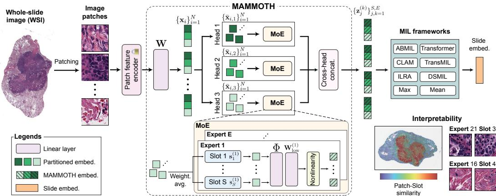
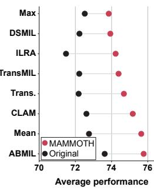

[← 返回 README](../README.md)

# 2-3. Related Work & Method 相关工作与方法

## 📌 预览

相关工作：Soft MoE（可微门控、软路由，稳定训练）、参数高效 MoE（低秩/权重共享）、CPath 中的 MoE（含 **PAMoE** — 但 PAMoE 替换 transformer 块的 FFN、用稀疏路由；MAMMOTH 替换普适的初始线性层、用软路由）、pre-aggregation 模块。方法：MAMMOTH = MAtrix-factorized Mixture Module of Transformation Heads——(3.1) 多头切分 patch embedding；(3.2) slot-based pooling（原型软聚合，Eq.3）；(3.3) 低秩 experts（Eq.4，权重共享省参数）；(3.4) 输出紧凑集合（$S\cdot E \ll N$）给聚合器。

---

## 2 Related Works

**Soft MoE**: differentiable gating routing weighted combinations of inputs across experts → stable training (vs Sparse MoE's hard assignment → representation collapse, expert under-utilization). **Sparse multihead MoE** allows granular specialization via partitioned inputs.

**Parameter-efficient MoE**: low-rank adaptors, smaller experts, matrix factorization reduce parameter count; weight sharing reuses matrices between experts. MAMMOTH combines these to enable more experts within the same parameter budget as the linear layer.

**MoE for CPath**: existing works tailored to specific tasks (multitask mutation prediction, tissue artifact detection). **PaMOE (PAMoE)** uses pre-extracted patch prototypes to encourage experts to specialize, replacing feedforward layers in the transformer encoder block with standard sparse MoE. **In contrast, MAMMOTH is a plug-and-play MoE module built to replace the initial linear layer that universally exists in MIL frameworks.**

> 💡 **相关工作批读（MAMMOTH vs PAMoE 的关键区别）**（Hao 批注）：MAMMOTH 明确对比了本 topic 已批读的 [PAMoE](../%5BCVPR%202025%5D%20PAMoE/)（论文里叫 PaMOE），两者都是 CPath 的 MoE，但**定位完全不同**：
> - **PAMoE**：替换 **transformer encoder block 的 FFN**，用**稀疏路由**（expert-choice），需 CONCH 预提原型监督，只适用于有 transformer block 的模型。
> - **MAMMOTH**：替换 **MIL 里普适存在的初始线性层**（第 2 步），用**软路由**（Soft MoE），可插**任何** MIL（连 mean/max pooling 都能装），无需外部原型监督（slot 原型是可学习的）。
> - **本质差异**：PAMoE 改"聚合器内部"，MAMMOTH 改"聚合器之前的特征变换"。MAMMOTH 更普适（任何 MIL 都有那个线性层）。这个对比对 CKMIL 定位很重要——如果新方法也动"特征变换/路由"，要说清相对这两者的位置。

**Pre-aggregation modules**: (1) sampling a subset of patches (regularization/efficiency, e.g. [EAGLE](../%5BNat%20Commun%202026%5D%20DL-Efficient-Pathology/)); (2) re-embedding patches spatially-aware (regional Transformer, local self-attention). **MAMMOTH fuses global information based on feature similarity rather than spatial proximity**, performing MoE-based processing without additional parameter burden.

> 💡 **相关工作批读（feature-similarity vs spatial-proximity）**（Hao 批注）：MAMMOTH 的 pre-aggregation 定位——它按**特征相似度**（slot 原型的软聚合）融合全局信息，而非**空间邻近**（如 [GMMamba](../%5BICCV%202025%5D%20GMMamba/) 的 location-based grouping、TransMIL 的 PPEG）。这是一个重要区分：MAMMOTH 不依赖 patch 坐标，纯靠特征——对无坐标的 pipeline 更通用，但放弃了空间结构信息。对 CKMIL：feature-similarity vs spatial 是两条聚合前处理的路线，可对比/结合。

## 3 Methods

MAMMOTH = **MAtrix-factorized Mixture Module of Transformation Heads**. Replaces standard linear layer of any MIL architecture with a mixture of small, specialized multi-head experts, same parameter count.

MIL decomposition (Eq.1): $x_{WSI} = f_{MIL}^{agg.}(\{f_{MIL}^{linear}(x_i)\}_{i=1}^N)$. MAMMOTH replaces $f_{MIL}^{linear}(\cdot)$ with: (1) input partitioning into segments, (2) slot-based pooling on patch prototypes, (3) low-rank projection with matrix factorization, (4) concatenation.

*Figure 2: MAMMOTH 架构。替换 MIL 初始线性层，用多头 soft MoE 把通用特征变成任务优化特征；patch 路由到不同 slot/expert 组合做任务+形态特定处理，输出拼接后喂给 MIL 聚合器。*

**3.1 Multi-head processing**: reduce embedding via W, divide into H non-overlapping partitions, h-th head processes h-th partition (Eq.2). Handles large patch embedding (>1024) vs natural image tokens (196/256).

**3.2 Slot-based pooling**: for expert k, pool embeddings to S slots via weighted averaging based on similarity to trainable prototypes $s_j^{(k)}$:

*Eq. (3): slot 嵌入 $u_j^{(k)}=\sum_i \alpha_{j,i}^{(k)}\bar{x}_i$，$\alpha$ 为 patch 与 slot 原型的 softmax 相似度。非零 $\alpha$ = 软分配（所有 patch 都贡献给每个 slot）。*

**3.3 Low-rank experts**: approximate full weight $W_{full}^{(k)}$ as composition of expert-specific low-rank $W_{low}^{(k)}$ and shared $\Phi$: $z_j^{(k)}=\text{LayerNorm}(\text{ReLU}(W_{low}^{(k)}\cdot\Phi u_j^{(k)}))$ (Eq.4). Scales experts while maintaining fixed parameters.

**3.4 Output**: concatenate across heads → output set $\{z_j^{(k)}\}_{j,k=1}^{S\cdot E}$ (instead of original $\{x_i\}_{i=1}^N$) processed by $f_{MIL}^{agg.}$. **Condenses to $S\cdot E \ll N$ task-specific embeddings** (>25× reduction), facilitating stable training like prototype-based approaches.

> 💡 **公式批读（三个设计点如何协同）**（Hao 批注）：
> - **Slot-based pooling（Eq.3，软分配核心）**：不是把 patch 硬分给 expert，而是每个 slot（=一种形态概念）对所有 patch 做**相似度加权平均**——所有 patch 都贡献给每个 slot（非零 $\alpha$）。这是 Soft MoE 的精髓：软分配 → 梯度流好、无专家饿死。每个 slot embedding $u_j^{(k)}$ = 一种形态特征的 WSI 级摘要。
> - **低秩 experts（Eq.4，省参数核心）**：$W_{full}\approx W_{low}\cdot\Phi$（expert 专属低秩 + 共享 $\Phi$）——让 expert 数量可扩展而参数不涨。这是"用同样参数换更多 expert"的关键。
> - **输出紧凑集合（3.4，稳定训练核心）**：输出 $S\cdot E$ 个（远小于 N≈10000）task-specific embedding 给聚合器——**把大而噪的 patch 集蒸馏成少量形态代表**。这一步同时：(1) 简化聚合（少 token）；(2) 类似 prototype aggregation 的正则效果。
> - **对 CKMIL/ReadySlide 的启示**：MAMMOTH 揭示"**聚合前的特征变换**"是巨大且被忽略的杠杆。它的 slot-pooling（软原型聚合）+ 低秩 experts + 紧凑输出，三者是"参数不变下提升特征质量"的范式。若 ReadySlide 做特征适配/变换，这是必比且可借鉴的。
