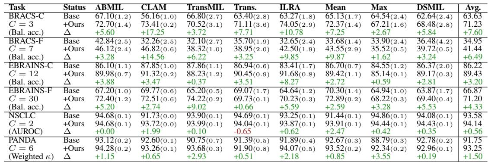
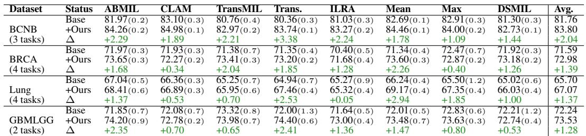
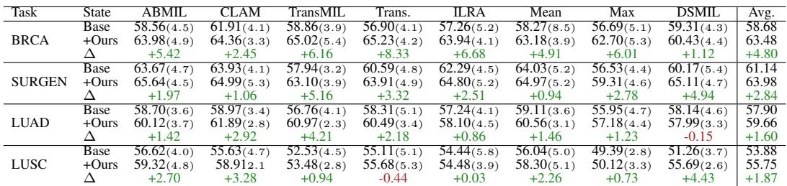

[← 返回 README](../README.md)

# 4-5. Experiments & Results 实验与结果

## 📌 预览

19 任务（6 形态学 + 13 分子 biomarker + 4 生存）× 8 MIL 方法。UNI 特征，E=30 experts、H=16 heads、S=9 slots。核心结果：形态学平均 +7.36%（46/48 配置提升）、分子每个数据集平均都提升、生存 30/32 配置提升 +2.78。**决定性发现：装 MAMMOTH 的 mean/max pooling 超过任何用标准线性层的复杂 MIL**——证明线性层是瓶颈、任务特定变换 > 聚合器选择。可解释性：experts 学到不同形态概念。

---

## 4 Experiments

**Datasets**: 6 morphological (EBRAINS-F/C brain, NSCLC, PANDA ISUP grading, BRACS-C/F), 13 molecular biomarker (GBMLGG IDH1, lung TP53/KRAS/STK11/EGFR, breast HER2/ER/PIK3CA/PR, BCNB), 4 survival (BRCA/Surgen/LUAD/LUSC). **Baselines**: MAMMOTH replaces initial linear layer for ABMIL, CLAM, TransMIL, Transformer, ILRA, DSMIL, MeanMIL, MaxMIL. **Implementation**: UNI (ViT-L/16 DINOv2) features, E=30 experts, H=16 heads, S=9 slots, parameters kept close to original linear layer.

## 5 Results

*Table 1: 组织分型。8 个 MIL 有/无 MAMMOTH 对比。形态学 6 任务平均 +7.36%，46/48 配置提升。*

**Morphological**: average +7.36%, 46/48 configurations improved (both decreases in NSCLC — simple binary, high baseline). **Molecular biomarker** (Table 2): dataset-level improves in every configuration; individual-biomarker 84/104 configs, +2.1% average (low-baseline biomarkers like BRCA PIK3CA/Lung KRAS variable — may lack morphology signal). **Survival** (Table 3): 30/32 configs improved, +2.78 C-index average.

*Table 2: 分子 biomarker 预测（各数据集平均）。MAMMOTH 在每个数据集配置都提升。*

> 💡 **Table 1/2/3 批读（决定性发现）**（Hao 批注）：这组结果对 CKMIL 主线是**决定性的**：
> - **最关键的一句**：装 MAMMOTH 的 **mean pooling 超过 ABMIL baseline +2.0%、max pooling +0.3%**——即"最笨的聚合器 + 好的特征变换" > "最强聚合器 + 标准线性层"。**这直接证明：线性层（特征变换）是比聚合器更大的瓶颈**。
> - **任务分层**：形态学任务提升最大（+7.36%，H&E 形态直接相关）；分子 biomarker 提升较小（+2.1%，且低基线 biomarker 如 PIK3CA/KRAS 变化大——因为这些从形态学本就难预测，[Confounders](../../%5BNat%20Biomed%20Eng%202026%5D%20Confounders-Biomarker-Prediction/) 也指出过）；生存 +2.78。
> - **对 ReadySlide/CKMIL 的冲击**：如果新方法的增益来自"更好的聚合"，MAMMOTH 说明这可能是次要的——**真正的杠杆在聚合前的 task-specific 特征变换**。任何 CKMIL 新方法都应：(1) 报告 +MAMMOTH 的组合结果；(2) 论证自己的增益是否独立于 MAMMOTH 式的特征变换。

*Table 3: 生存预测。MAMMOTH 在 30/32 配置提升，平均 +2.78 C-index。*

## 5.x Interpretability & Ablations

Interpretability confirms MAMMOTH experts learn to specialize in distinct morphological concepts (Fig.3, A3-A7 — each slot summarizes a distinct histomorphological feature). Extensive ablations reveal MAMMOTH surpasses other MoE adaptations in CPath (Soft MoE, sparse MoE, multihead variants).

> 💡 **可解释性 + 消融解读**（Hao 批注）：可解释性证明 MAMMOTH 的 experts/slots **真的学到了不同形态概念**（不是黑盒）——每个 slot 是一种组织形态的 WSI 级摘要。这与 [PAMoE](../../%5BCVPR%202025%5D%20PAMoE/) 的 expert 专精组织类型呼应，但 MAMMOTH 的 slot 原型是**可学习的**（无需 CONCH 监督），更自动。消融显示 MAMMOTH 优于其他 MoE 变体（Soft/sparse/multihead）——说明其"多头 + slot-pooling + 低秩"的组合是为 CPath 特调的。

## 关键洞察总结

- **MAMMOTH 让 mean/max pooling 超过所有标准线性层方法** → 线性层是被忽略的瓶颈。
- **任务特定特征变换 > 聚合器选择** → 挑战"设计更好聚合器"的整个研究方向。
- **plug-and-play + 参数不变** → 可与任何 MIL（含本 baseline set 所有方法）组合。
- **软 MoE + 低秩 + 紧凑输出** → 解决 CPath 的 MoE 训练不稳定/过拟合难题。

> 💡 **总结 + 对 baseline set / CKMIL 的定位**（Hao 批注）：MAMMOTH 是 baseline set 里**最高优先级**，因为它提供了最强的竞争解释：**"真正瓶颈不是 aggregator，而是 task-specific feature transformation"**。
> - **对 CKMIL 的行动指令**（呼应 baseline set 文档）：至少测 MeanPool / MAMMOTH+MeanPool / ABMIL / MAMMOTH+ABMIL，区分"feature transformation 增益 vs aggregation architecture 增益"。若 CKMIL 新方法涉及 FM representation selection/adaptation，**必须与 MAMMOTH 正面对比**。
> - **与 depth-selection 主线的关系**：MAMMOTH 做"同一层特征的 per-patch 变换"，而 CKMIL/ReadySlide 探索的是"多层 FM 特征的 depth selection"——两者都在"聚合前处理特征"，但一个动 per-patch 变换、一个动 depth。MAMMOTH 是这个方向最强的既有工作，CKMIL 需说清 depth-selection 相对 MAMMOTH 式 transformation 的独特性。
> - **最实用的一条**：装 MAMMOTH 后简单方法就很强 → **MeanPool + MAMMOTH 可能是比很多复杂聚合器更强也更省的 baseline**，ReadySlide 评估应纳入。

> 💡 **Q&A 批注记录**（Hao 批注）：
> - Q：MAMMOTH 和 PAMoE 都是 CPath MoE，选哪个对比？
> - A：都要。PAMoE 替换 transformer 块 FFN（稀疏路由、需 CONCH 原型），MAMMOTH 替换普适初始线性层（软路由、可学习 slot）。MAMMOTH 更普适（任何 MIL 都有线性层）。CKMIL 若动特征变换，两者都是对照。
> - Q：为什么装 MAMMOTH 的 mean pooling 能超过 ABMIL？
> - A：因为 MAMMOTH 在聚合前就把特征按形态结构化了（Fig.1A），聚合器只需简单汇总。说明"好特征 + 笨聚合" > "标准特征 + 强聚合"——瓶颈在特征变换。
> - Q：能在冻结 FM 特征上跑吗？
> - A：能，这正是它的场景。输入 UNI 等 FM 的 patch 特征，MAMMOTH 替换 MIL 的初始线性层。参数与原线性层相当（低秩+权重共享）。
