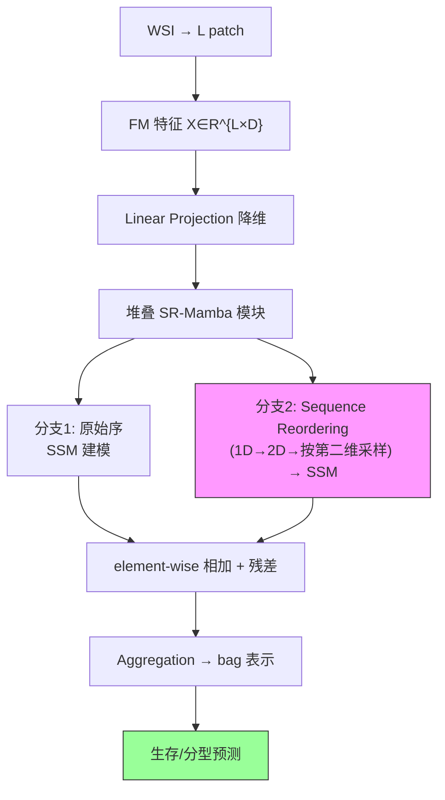

# MambaMIL: Enhancing Long Sequence Modeling with Sequence Reordering in Computational Pathology

**作者**: Shu Yang, Yihui Wang, Hao Chen（HKUST）
**会议**: MICCAI 2024 | **年份**: 2024（arXiv 2403.06800）
**链接**: [arXiv](https://arxiv.org/abs/2403.06800) · [Code](https://github.com/isyangshu/MambaMIL)

## 一句话总结

首次把 **Mamba（选择性状态空间模型）** 引入 WSI MIL，用**线性复杂度**建模上万 patch 长序列；核心 **SR-Mamba** 用两个并行分支建模"原始序 + 跨步重排序"两种排序，破解 vanilla Mamba 单向扫描的感受野限制，从散布稀疏的阳性 patch 里捕获判别特征。

## 核心贡献

1. **首个病理 Mamba**：把 Mamba 的线性复杂度长序列建模引入 MIL，解决 TransMIL 的 $O(n^2)$/过拟合与 ABMIL 的 i.i.d. 局限。
2. **SR-Mamba**：Sequence Reordering（1D→2D→按第二维采样）生成新排序，两分支（原序+重排）各带独立隐状态、element-wise 融合 + 残差，缓解单向感受野。
3. **9 数据集验证**：生存预测（7 TCGA）+ 分型（BRACS/NSCLC），两特征（ResNet-50/PLIP）全面最优。

## 📖 批读导航

| Section | 内容 |
|---------|------|
| [00 - Abstract & Introduction](sections/00-abstract-intro.md) | 摘要+引言、为何 SSM 适合 WSI、三条长序列路线、SR-Mamba 动机 |
| [01 - Method](sections/01-method.md) | S4/Mamba 预备(Eq.1-4)、总览、SR-Mamba 两分支(Eq.5-9)、Fig.2 重排序 |
| [02 - Experiments & Conclusion](sections/02-experiments-conclusion.md) | Table 1/2 主结果、Table 3 变体消融、baseline 定位 |

## 关键数字

| 指标 | 数值 |
|------|------|
| 任务/数据 | 生存预测 7 TCGA + 分型 BRACS/NSCLC，共 9 数据集 |
| 特征 | ResNet-50-ImageNet / PLIP-200k |
| 复杂度 | 线性 $O(L)$（无近似，对比 TransMIL Nyström） |
| 生存 mean C-Index | 0.680(ResNet)/0.693(PLIP)，超次优 +2.6%/+2.7% |
| 分型 mean AUC | 0.845(ResNet)/0.822(PLIP) |
| 消融 | SR-Mamba 0.680 > Bi-Mamba 0.665 > vanilla Mamba 0.662 |

## 数据流：输入 → 中间表示 → 输出

## 优缺点与还能做什么

### 优点
- **线性复杂度**、无近似（对比 TransMIL 的 Nyström），可上上万 patch。
- **SR-Mamba 重排序**针对 WSI 散布稀疏结构，消融证明 > Bi-Mamba > vanilla Mamba。
- **抗过拟合**：小数据分型上比 TransMIL 稳（TransMIL 在 BRACS 上甚至低于 Mean-Pooling）。

### 局限 / 风险
- **顺序依赖**：Mamba 本质序列模型，引入 patch 顺序（与 [DeepSets](../%5BNeurIPS%202017%5D%20DeepSets/) 可交换性有张力）；SR-Mamba 用两种排序部分缓解但非排列不变。
- **需按数据集调学习率**（SR-Mamba 反向传播的原子操作引入随机性）——可复现性有额外要求。
- **增益温和**（+2.6%）：相对最强基线不是压倒性。

### 还能做什么（对本课题）
- **GMMamba 的 base control**：与 [GMMamba](../%5BICCV%202025%5D%20GMMamba/) 成对做 clean ablation，拆"SSM 建模 vs evidence selection"增益。
- **排序作为杠杆**：SR-Mamba 揭示 patch 排序影响 SSM 建模，排序策略可设计（GMMamba 用 grouping 进一步利用）。
- **FM-era 高效长序列 baseline**：换 UNI2/Virchow2 特征后，作"efficient long-sequence modeling"竞争解释。

## 阅读 Q&A 记录

- **Q: Mamba 为何线性复杂度？**
  A: SSM 用压缩隐状态 $h_t$ 传递历史，每个 token 只与压缩历史交互（递归模式 $O(L)$），不像 self-attention 每对 token 都算（$O(L^2)$）。Mamba 加输入依赖选择机制，保持线性又有内容自适应。

- **Q: SR-Mamba 的 Sequence Reordering 解决什么？**
  A: vanilla Mamba 单向扫描，patch 只看到之前扫过的位置（感受野受限）。重排序把 1D 序列 reshape 成 2D 再按另一维采样，让原序里相隔远的 patch 变相邻——换扫描视角。两分支（原序+重排）互补。

- **Q: 为什么 TransMIL 在分型任务上反而差？**
  A: TransMIL 参数多，小数据集（BRACS 分型）易过拟合，AUC 甚至低于 Mean-Pooling。MambaMIL/简单 pooling 更稳。印证"没有普适赢家、方法-任务-数据规模匹配很重要"。

- **Q: 能在冻结 FM 特征上跑吗？**
  A: 能。输入是 patch 特征序列 $X∈R^{L×D}$，换 FM 只改 D。原文用 ResNet-50 和 PLIP 两种特征。

## 📊 Citation Landscape

> Semantic Scholar 采集限流，据论文自身引用整理。

**同主题最相关**
- [TransMIL](../%5BNeurIPS%202021%5D%20TransMIL/)（NeurIPS 2021）——Transformer 长序列对照；S4MIL——直接套 S4 的前辈（MambaMIL 相对它加 SR）。
- [GMMamba](../%5BICCV%202025%5D%20GMMamba/)（ICCV 2025）——Mamba + evidence selection，MambaMIL 是其 base control。
- [RetMIL](../%5BMICCAI%202024%5D%20RetMIL/)——retention 长序列的第三条路线；ABMIL/DSMIL/CLAM/DTFDMIL——注意力 MIL 基线；[DeepSets](../%5BNeurIPS%202017%5D%20DeepSets/)——集合函数理论。

**方法来源**
- S4（Gu et al.）、Mamba（Gu & Dao, 2023）——选择性状态空间模型；PLIP（Huang et al., Nat Med 2023）——病理 vision-language encoder。
