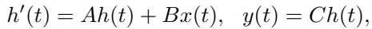
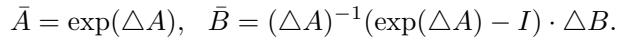
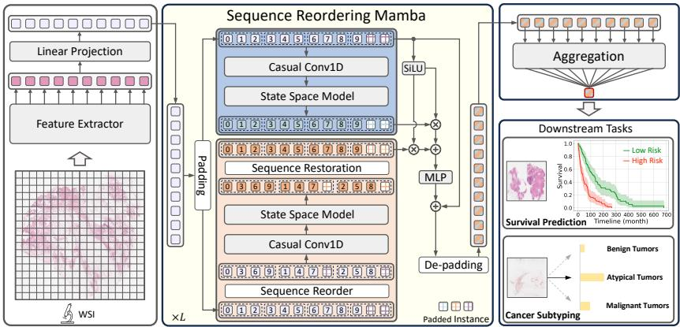
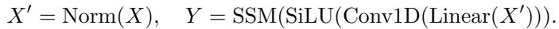
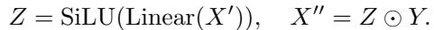
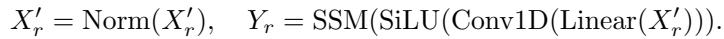
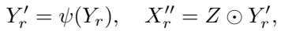
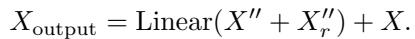
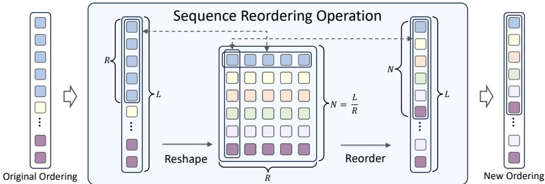

[← 返回 README](../README.md)

# 2. Method 方法

## 📌 预览

方法：**(2.1) S4/Mamba 预备**——状态空间模型 (Δ,A,B,C) 的连续式(Eq.1)、离散化(Eq.2)、递归模式(Eq.3)、卷积模式(Eq.4)；Mamba 加输入依赖的选择机制。**(2.2) MambaMIL 总览**——patch → FM 特征 → 线性投影 → 堆叠 SR-Mamba → 聚合。**(2.3) SR-Mamba**——两个并行分支：分支1 原始序过 SSM(Eq.5-6)，分支2 Sequence Reordering（1D→2D→按第二维采样重排）后过 SSM(Eq.7-8)，两分支 element-wise 相加(Eq.9)。

---

## 2.1 Preliminaries (State Space Models)

S4 models are defined with four parameters $(\triangle, A, B, C)$ as linear time-invariant systems mapping $x(t)\in\mathbb{R}^L$ to $y(t)\in\mathbb{R}^L$ through latent state $h(t)\in\mathbb{R}^N$:

*Eq. (1): 连续状态空间 $h'(t)=Ah(t)+Bx(t),\; y(t)=Ch(t)$。*

*Eq. (2): 离散化 $\bar{A}=\exp(\triangle A),\; \bar{B}=(\triangle A)^{-1}(\exp(\triangle A)-I)\cdot\triangle B$。*

Discrete recurrent mode (Eq.3): $h_t=\bar{A}h_{t-1}+\bar{B}x_t,\; y_t=Ch_t$ (efficient autoregressive inference). Convolutional mode (Eq.4): $\bar{K}=(C\bar{B},C\bar{A}\bar{B},\ldots),\; y=x*\bar{K}$ (parallelizable training). **Mamba** integrates selection mechanisms making parameters input-dependent, with hardware-aware parallel algorithm — selectively propagating/forgetting info along the sequence.

> 💡 **公式批读（SSM 为何线性复杂度）**（Hao 批注）：SSM 的精髓在**两种等价计算模式**：递归模式（Eq.3，推理时 $O(1)$ per step、总 $O(L)$）+ 卷积模式（Eq.4，训练时可并行）。相比 self-attention 的 $O(L^2)$（每对 token 都算），SSM 用一个**压缩的隐状态 $h_t$** 传递历史信息——每个 token 只与"压缩后的历史"交互，故 $O(L)$。**Mamba 的关键升级**：让 (Δ,B,C) 输入依赖（选择机制），能"选择性记住/遗忘"——这让它在保持线性复杂度的同时有了内容自适应的能力。对 WSI（上万 patch）：$O(L)$ vs TransMIL 的 Nyström 近似，MambaMIL 是无近似的线性。

## 2.2 Overview of MambaMIL

*Fig. 1: MambaMIL 总览。patch → Feature Extractor → Linear Projection → 堆叠 SR-Mamba 模块 → Aggregation → WSI 分析。*

Given a WSI, partition into $L$ patches → instance features $X\in\mathbb{R}^{L\times D}$ by Feature Extractor → Linear Projection (reduce dim) → stacked SR-Mamba modules (long sequence modeling) → Aggregation for bag-level representation. Each instance interacts with any previously scanned instance through a compressed hidden state.

## 2.3 Sequence Reordering Mamba (SR-Mamba)

Partition sequence into non-overlapping segments of size R, obtain $N=L/R$ segments (pad with zeros if not divisible). Feed X into two branches.

**Branch 1 (original ordering)**:

*Eq. (5): $X'=\text{Norm}(X),\; Y=\text{SSM}(\text{SiLU}(\text{Conv1D}(\text{Linear}(X'))))$。*

*Eq. (6): 门控 $Z=\text{SiLU}(\text{Linear}(X')),\; X''=Z\odot Y$。*

**Branch 2 (Sequence Reordering)**: reshape $X'\in\mathbb{R}^{L\times D}\to X_{2d}\in\mathbb{R}^{R\times N\times D}$, sample instances from each segment successively along the 2nd dim (feature re-embedding), generating new ordering $X_r$:

*Eq. (7): $Y_r=\text{SSM}(\text{SiLU}(\text{Conv1D}(\text{Linear}(X_r'))))$。*

*Eq. (8): 恢复原序 $Y_r'=\psi(Y_r),\; X_r''=Z\odot Y_r'$，$\psi$ 为序列还原。*

*Eq. (9): 聚合 $X_{output}=\text{Linear}(X''+X_r'')+X$（两分支 element-wise 相加 + 残差）。*

*Fig. 2: Sequence Reordering 操作示意——1D 序列分段 reshape 成 2D，按另一维采样得到新排序。*

> 💡 **机制拆解（SR-Mamba：两种排序破单向感受野）**（Hao 批注）：SR-Mamba 的设计精髓在 **Sequence Reordering**（Fig.2、Eq.7）：
> - **问题**：vanilla Mamba 单向因果扫描，patch $i$ 只能看到 $1..i-1$。对无序 WSI patch，这意味着相邻 patch 在原序里可能相隔很远、扫不到彼此。
> - **解法**：把序列分成 $N=L/R$ 段、reshape 成 $R\times N$、**按第二维采样**——原来相隔 $N$ 的 patch 现在变成相邻。等于换一个"跨步扫描"视角，让原序里远的 patch 在新序里近。
> - **两分支互补**：分支1（原序）+ 分支2（重排序）各有一个独立隐状态，捕获两种"扫描邻接关系"，相加融合（Eq.9）+ 残差。
> - **对比 Bi-Mamba**：双向 Mamba 是"正扫+反扫"，SR-Mamba 是"原序+跨步重排序"——消融（Tab.3）显示 SR-Mamba (0.680) > Bi-Mamba (0.665) > vanilla Mamba (0.662)。**重排序比单纯双向更能利用 WSI 的散布结构**。
> - **对 CKMIL/ReadySlide**：SR-Mamba 揭示"patch 排序影响 SSM 建模"——若用 Mamba 类方法，排序策略是可设计的杠杆（这也是 [GMMamba](../../%5BICCV%202025%5D%20GMMamba/) 进一步用 grouping + masking 做文章的起点）。
