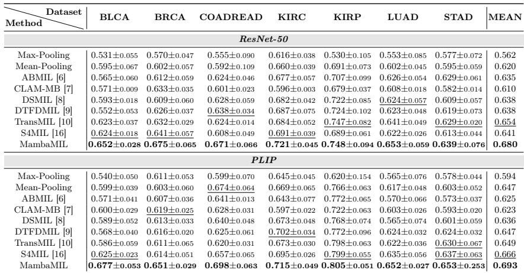
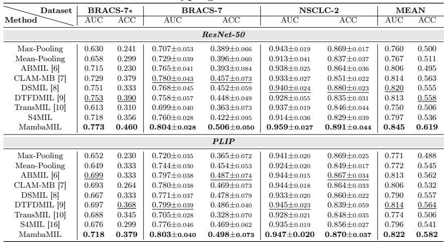
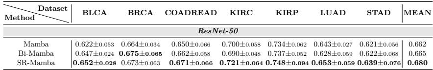

[← 返回 README](../README.md)

# 3. Experiments & Conclusion 实验与结论

## 📌 预览

两任务（生存预测 7 TCGA 数据集、癌症分型 BRACS/NSCLC）× 两特征（ResNet-50 / PLIP）× 9 数据集。MambaMIL 全面最优：生存预测 mean C-Index 超次优 2.6%(ResNet)/2.7%(PLIP)；分型 mean AUC 0.845/0.822。消融（Tab.3）：SR-Mamba > Bi-Mamba > vanilla Mamba，证明重排序有效。

---

## 3.1 Datasets

Two tasks, nine datasets, two feature sets (ResNet-50-ImageNet, PLIP-200k pathology image-text). **Survival Prediction**: 7 TCGA datasets (BLCA/BRCA/COADREAD/KIRC/KIRP/LUAD/STAD), 5-fold CV, C-Index. **Cancer Subtyping**: BRACS + NSCLC, 10-fold Monte Carlo CV, AUC + ACC.

## 3.2-3.3 Results

*Table 1: 7 数据集生存预测 C-Index。MambaMIL 在 ResNet-50 与 PLIP 两特征下均最优，mean 0.680 / 0.693。*

Survival: MambaMIL best on all benchmarks, outperforming 2nd-best by **2.6% (ResNet) and 2.7% (PLIP)** mean C-Index. Compared baselines: Max/Mean-Pooling, ABMIL, CLAM-MB, DSMIL, DTFDMIL, TransMIL, S4MIL.

*Table 2: BRACS/NSCLC 分型 AUC+ACC。MambaMIL mean AUC 0.845(ResNet)/0.822(PLIP)、ACC 0.619/0.582 均最优。*

> 💡 **Table 1/2 批读（一个对 baseline set 极重要的观察）**（Hao 批注）：
> - **MambaMIL 全面最优**，但幅度温和（2.6-2.7% C-Index）。关键对比对象是 **TransMIL 和 S4MIL**：MambaMIL(0.680) > S4MIL(0.641) > TransMIL(0.654, ResNet 生存)。说明"针对 WSI 特性设计的 SSM（SR-Mamba）" > "直接套 S4" > "近似 self-attention"。
> - **一个反直觉点**：**TransMIL 在分型任务上表现差**（BRACS-7* AUC 0.613，甚至低于 Mean-Pooling 0.658！）。原因：TransMIL 参数多易过拟合，小数据集（BRACS 分型）上崩。而 MambaMIL/简单 pooling 更稳。**这印证了 baseline set 的核心逻辑——不同方法在不同任务/数据规模上各有胜负，没有普适赢家**（呼应 [PathBench](../../%5BArxiv%202025%5D%20PathBench/)）。
> - **对 CKMIL**：小数据分型任务上，复杂方法（TransMIL）可能不如简单方法——这是新方法必须小心的过拟合陷阱，也是 MeanPool sanity control 的价值所在。

*Table 3: Mamba 变体消融（7 数据集生存）。vanilla Mamba 0.662 < Bi-Mamba 0.665 < SR-Mamba 0.680。*

> 💡 **Table 3 消融解读（SR-Mamba 的增益来源）**（Hao 批注）：三个 Mamba 变体对比是本文最关键的消融——**SR-Mamba (0.680) > Bi-Mamba (0.665) > vanilla Mamba (0.662)**。含义：(1) vanilla Mamba 单向扫描已不错（0.662，超 TransMIL）；(2) Bi-Mamba（双向）小幅提升（+0.3pp）；(3) **SR-Mamba 的重排序增益最大（+1.8pp over vanilla）**——证明"针对 WSI 散布结构的跨步重排序"比单纯双向扫描更有效。这个 clean ablation 正是 baseline set 强调的——MambaMIL 是 [GMMamba](../../%5BICCV%202025%5D%20GMMamba/) 的 base control，GMMamba 需在此基础上证明 evidence selection 的额外增益。

## Conclusion

MambaMIL is the first application of Mamba in computational pathology, using SR-Mamba (aware of order and distribution) to capture long-range dependencies among scattered positive instances with linear complexity, mitigating overfitting and high computational overhead. Superior performance on 2 tasks across 9 datasets.

> 💡 **总结 + 对 baseline set 的定位**（Hao 批注）：MambaMIL 在 baseline set 里：
> - **排除的竞争解释**："关键只是 efficient long-sequence modeling"——若新方法超不过 MambaMIL，说明增益不只来自高效长序列建模。
> - **是 GMMamba 的 base-Mamba control**：GMMamba = Mamba + group masking evidence selection，必须与 MambaMIL 成对出现才能拆分"SSM 建模增益 vs evidence selection 增益"。
> - **线性复杂度**是相对 TransMIL 的核心优势（无 Nyström 近似）；SR-Mamba 的重排序是相对 S4MIL/vanilla Mamba 的核心创新。
> - **对 CKMIL/ReadySlide**：SSM 的 patch 排序敏感性揭示"排序是可设计杠杆"；小数据上 Mamba 比 Transformer 更抗过拟合，是 FM-era 长序列聚合的有力候选。

> 💡 **Q&A 批注记录**（Hao 批注）：
> - Q：MambaMIL 能直接在冻结 FM 特征上跑吗？
> - A：能。输入 $X\in\mathbb{R}^{L\times D}$ 就是 patch 特征序列，换 UNI2/Virchow2 只改 D。原文已用 ResNet-50 和 PLIP 两种特征验证。
> - Q：SR-Mamba 的排序会破坏可交换性吗？
> - A：会引入顺序依赖（Mamba 本质是序列模型）。SR-Mamba 用两种排序（原序+重排）部分缓解——不押注单一顺序，而是让模型从两个扫描视角看。但严格来说仍不是排列不变的（与 [DeepSets](../../%5BNeurIPS%202017%5D%20DeepSets/) 的可交换性有张力）——这是 SSM 类方法的固有取舍。
