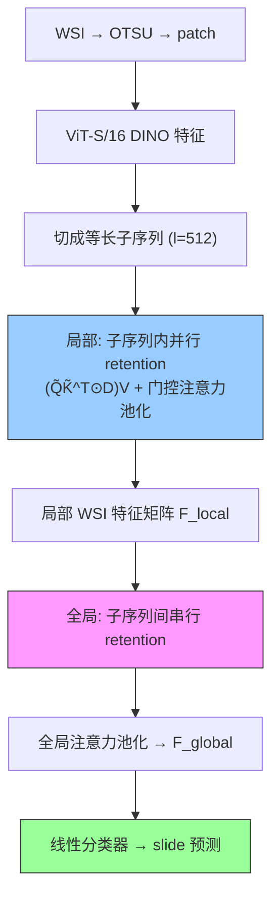

# RetMIL: Retentive Multiple Instance Learning for Histopathological WSI Classification

**作者**: Hongbo Chu, Qiehe Sun, Jiawen Li, Yuxuan Chen, Lizhong Zhang, Tian Guan, Anjia Han, Yonghong He（清华深研院 / 中山大学附一院）
**会议**: MICCAI 2024 | **年份**: 2024（arXiv 2403.10858）
**链接**: [arXiv](https://arxiv.org/abs/2403.10858) · [Code](https://github.com/Hongbo-Chu/RetMIL)

## 一句话总结

用 **retention 机制（借自 RetNet/LLM）替代非线性 self-attention**，配**层次结构**（局部子序列并行 retention + 注意力池化 → 全局串行 retention + 全局注意力池化），在保持 SOTA/competitive 性能的同时**大幅降低内存（近常数）、提升吞吐（1.5× 于轻量 TransMIL）**，超长 WSI 序列上优势最大。

## 核心贡献

1. **retention 替代 self-attention**：用逐元素距离衰减矩阵 $D=\gamma^{n-m}$ 替代 softmax，线性复杂度、训练并行 + 推理递归双形式。
2. **层次 retentive 聚合**：局部（子序列内并行 retention + 门控注意力池化）+ 全局（子序列间串行 retention + 全局注意力池化）→ 内存近常数。
3. **效率 + 稳定**：三数据集 cross-cohort 测试 SOTA/competitive、BRACS 方差最小；超长序列（>15000）优势最大，吞吐 1.5× 于 TransMIL。

## 📖 批读导航

| Section | 内容 |
|---------|------|
| [00 - Abstract & Introduction](sections/00-abstract-intro.md) | 摘要+引言、retention 第三条路线、层次结构动机 |
| [01 - Methodology](sections/01-method.md) | WSI→序列切分、retention 机制(Eq.1-3)、层次聚合(Eq.4-9)、Fig.1 |
| [02 - Experiments & Conclusion](sections/02-experiments-conclusion.md) | Table 1 主结果、Table 2 长度分析、效率、可解释性、baseline 定位 |

## 关键数字

| 指标 | 数值 |
|------|------|
| 数据集 | CAMELYON(C16→C17)、BRACS、LUNG(TCGA→医院)，均跨中心 |
| 特征 | ViT-S/16 DINO；子序列长度 512 |
| CAMELYON | 超次优 TransMIL +3.18% F1 / +3.43% B-Acc；AUC +1.36% |
| BRACS | 超 CLAM-MB +1.52% F1，方差最小（0.54/0.71） |
| 效率 | GPU 内存近常数（vs Transformer 线性增）；吞吐 1.5× 于轻量 TransMIL |
| 超长序列 | >15000 patch：RetMIL 82.63 F1 vs TransMIL 79.29 |

## 数据流：输入 → 中间表示 → 输出

## 优缺点与还能做什么

### 优点
- **内存近常数**：层次结构（固定长子序列 + 短全局序列）让内存几乎不随 patch 数增长。
- **retention 双形式**：训练并行、推理递归，兼顾速度与省内存。
- **超长序列主场**：序列越长相对 Transformer 优势越大；跨中心方差小。
- **两级可解释**：注意力分数 = 局部 × 全局注意力（Eq.10）。

### 局限 / 风险
- **因果距离衰减假设**：$D=\gamma^{n-m}$ 引入顺序/距离偏置，对无序 WSI patch 有张力（层次结构 + 注意力池化缓和但未消除）。
- **性能领先温和**：多数任务 competitive 而非压倒（LUNG F1 略次 TransMIL）——价值主要在效率。
- **子序列长度 $l$ 是超参**：切分粒度可能影响局部/全局的信息平衡。

### 还能做什么（对本课题）
- **高效长上下文 baseline**：与 TransMIL/MambaMIL 三方对比（近似 attention / SSM / retention）。
- **层次结构范式**：局部并行 + 全局串行对超长 WSI 实用，可借鉴到 CKMIL 的聚合设计。
- **与压缩正交结合**：RetMIL 高效聚合全部 patch vs ReadySlide 减少 patch 数——可先压缩再 RetMIL 聚合。

## 阅读 Q&A 记录

- **Q: retention 相对 self-attention 的核心区别？**
  A: self-attention 有 softmax（$O(n^2)$、不可递归）；retention 用逐元素距离衰减矩阵 $D_{nm}=\gamma^{n-m}$（因果 + 指数衰减）替代 softmax → 线性、训练并行 + 推理递归双形式。

- **Q: 层次结构为何让内存近常数？**
  A: 局部层每个子序列固定长 512（内存固定），全局层序列长度 = patch数/512（增长慢）。总内存几乎不随 patch 数增长，而 Transformer 的 attention 矩阵随 $N^2$ 增。

- **Q: 因果距离衰减对无序 WSI patch 合理吗？**
  A: 有张力（WSI patch 无内在顺序）。RetMIL 靠层次结构 + 注意力池化缓和，但仍引入顺序假设——与 MambaMIL 顺序依赖、DeepSets 可交换性是同类取舍。

- **Q: RetMIL 的主要价值是性能还是效率？**
  A: 效率。性能多为 competitive（超长序列上性能优势才明显）；核心卖点是内存近常数 + 高吞吐 + 跨中心稳定，面向临床部署。

## 📊 Citation Landscape

> Semantic Scholar 采集限流，据论文自身引用整理。

**同主题最相关**
- [TransMIL](../%5BNeurIPS%202021%5D%20TransMIL/)（NeurIPS 2021）——主要对照（Transformer-MIL）；[MambaMIL](../%5BMICCAI%202024%5D%20MambaMIL/)——SSM 长序列的另一路线。
- ABMIL/DSMIL/CLAM-MB——注意力 MIL 基线；HIPT（Chen et al., CVPR 2022）、HAG-MIL——层次 Transformer MIL 对照；[DeepSets](../%5BNeurIPS%202017%5D%20DeepSets/)——集合函数理论。

**方法来源**
- RetNet（Sun et al., 2023, "Retentive Network: successor to Transformer"）——retention 机制来源；RoPE（Su et al.）——旋转位置编码；GroupNorm（Wu & He, ECCV 2018）；Swish（Ramachandran et al.）。
