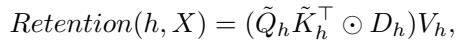
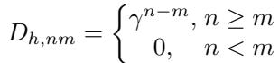
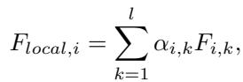
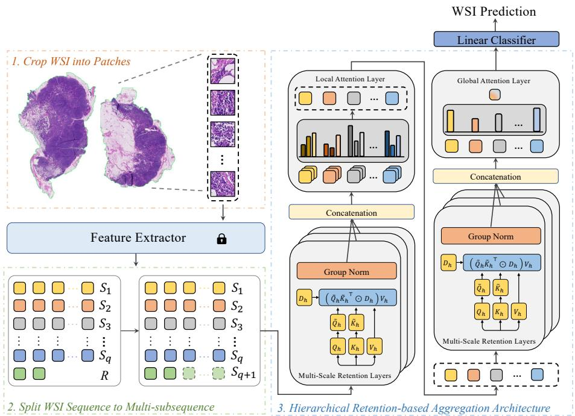

[← 返回 README](../README.md)

# 2. Methodology 方法

## 📌 预览

方法三步：**(2.1) WSI→序列**——OTSU 分割 + ViT-S/16(DINO) 提特征 → 序列切成等长子序列（不整除则按规则 pad）；**(2.2) Retention 机制**——QKV 投影 + 多头 + 旋转位置编码 + retention 层（$\tilde Q\tilde K^\top\odot D)V$，$D$ 为相对距离衰减矩阵）+ GroupNorm/swish 门控；**(2.3) 层次聚合**——局部并行 retention + 注意力池化子序列，全局串行 retention + 全局注意力池化。

---

## 2.1 From WSI to Sequence

Preprocess: OTSU foreground segmentation → sliding window crop patches → ViT-S/16 (DINO-pretrained on large WSIs) encodes each patch to $x_i\in\mathbb{R}^{d\times1}$ → sequence $X=\{x_1,\ldots,x_N\}$ → split into subsequences $\{S_1,\ldots,S_q,R\}$ where $N=ql+r$, each $S_j$ has length $l$. Extend remainder $R$ to $S_{q+1}$ (length $l$) so all subsequences equal length for parallel computation, ensuring each $x_i$ exists in only one subsequence.

> 💡 **机制拆解（子序列切分为何重要）**（Hao 批注）：把长度 $N$（上万）的序列切成 $q+1$ 个长度 $l=512$ 的子序列是 RetMIL 层次结构的基础。关键设计：**每个 patch 只属于一个子序列**（不重叠），且余数 $R$ 按规则 pad 到等长（$r=0$/小余数重复/大余数直接补）——这保证了并行计算的规整性。这与 [MambaMIL](../%5BMICCAI%202024%5D%20MambaMIL/) 的 segment 切分思路类似，都是"化超长为多个可并行短序列"。

## 2.2 Retention Mechanism

Project input sequence $\bar{S}\in\mathbb{R}^{|S|\times d}$ into Q, K, V via linear layers (Eq.1), split into heads, apply rotational position encoding to get $\tilde{Q}_h, \tilde{K}_h$. Retention layer:

*Eq. (2): $\text{Retention}(h,X) = (\tilde{Q}_h\tilde{K}_h^\top \odot D_h)V_h$，$D_h$ 为相对距离衰减矩阵。*

*Eq. (3): 衰减矩阵 $D_{h,nm}=\gamma^{n-m}$ (若 $n\ge m$)，否则 0。*

GroupNorm + swish gate normalize output, concatenate all retention heads. Denote batch update as $MSR(B; S)$.

> 💡 **公式批读（retention vs self-attention）**（Hao 批注）：retention（Eq.2）形式上像 self-attention（$QK^\top V$），但两个关键区别：
> 1. **无 softmax**：self-attention 有非线性 softmax（导致 $O(n^2)$ 且不可递归）；retention 用**逐元素的衰减矩阵 $D$**（Eq.3，$\gamma^{n-m}$ 指数衰减）替代——**线性、可并行也可递归**。
> 2. **显式距离衰减**：$D_{nm}=\gamma^{n-m}$ 表示位置 $n$ 对位置 $m$（$m\le n$）的关注随距离指数衰减、且**因果**（$n<m$ 时为 0）。这是一个内置的"近的 token 更重要"归纳偏置。
>
> **对 WSI 的取舍**：因果 + 距离衰减对文本合理（近词更相关），但对**无序的 WSI patch**是否合理？RetMIL 靠层次结构（局部子序列内衰减、全局子序列间衰减）+ 注意力池化来缓和这个假设。这是 retention 移植到 WSI 的核心张力（与 Mamba 的顺序依赖类似）。

## 2.3 Hierarchical Retentive Aggregation

**Local level**: update all subsequences in parallel (Eq.4): $(F_1,\ldots,F_{q+1})=MSR(q+1; (S_1,\ldots,S_{q+1}))$. Then attention pooling aggregates each subsequence (Eq.5-6): $F_{local,i}=\sum_k \alpha_{i,k}F_{i,k}$ with gated attention $\alpha$.

**Global level**: form local WSI feature matrix $F_{local}\in\mathbb{R}^{(q+1)\times d}$, update via retention (Eq.7): $G=MSR(1; F_{local})$. Then global attention pooling (Eq.8-9): $F_{global}=\sum_p \beta_p G_p$. Linear classifier on $F_{global}$, trained with cross-entropy.

*Eq. (5): 局部注意力池化 $F_{local,i}=\sum_{k=1}^{l}\alpha_{i,k}F_{i,k}$。*

*Fig. 1: RetMIL 总框架。WSI→序列→切子序列→局部并行 retention + 注意力池化→全局串行 retention + 全局注意力池化→分类头。*

> 💡 **Figure 1 + 机制拆解（两级 retention 的分工）**（Hao 批注）：层次聚合是 RetMIL 的精髓：
> - **局部层（并行）**：$q+1$ 个子序列**同时**过 retention（batch 并行，$MSR(q+1; \cdot)$）——每个子序列内部 token 相互更新 + 门控注意力池化成 1 个向量。并行 = 快。
> - **全局层（串行）**：$q+1$ 个子序列向量组成短序列（长度 = 子序列数，通常几十）→ 串行 retention 建模子序列间关系 + 全局注意力池化。序列短 = 串行也不慢。
> - **为何内存近常数**（Fig.3b）：局部层每个子序列固定长 512（内存固定），全局层序列长度 = $N/512$（增长慢）。所以总内存几乎不随 $N$ 增长，而 TransMIL 的 attention 矩阵随 $N$ 增。
> - **对 CKMIL/ReadySlide**：这个"分块局部 + 全局"的两级结构对超长 WSI 很实用，且注意力池化（Eq.5/8）提供了可解释的 patch/子序列重要性（Eq.10 的 $s_{i,k}=\alpha_{i,k}\cdot\beta_i$ 组合了局部+全局注意力）。
