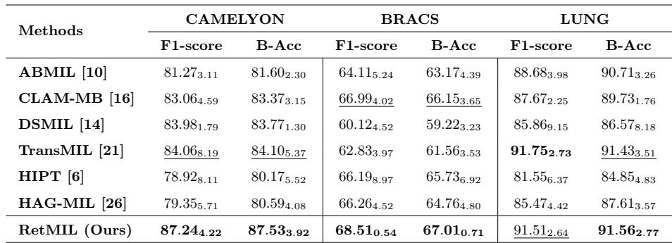
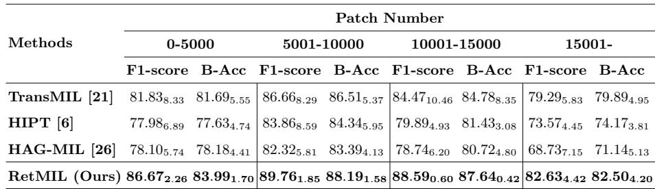

[← 返回 README](../README.md)

# 3-4. Experiments & Conclusion 实验与结论

## 📌 预览

三数据集（CAMELYON 转移、BRACS 分型、LUNG 亚型，均跨中心测试）。RetMIL 性能 SOTA/competitive（CAMELYON 超次优 TransMIL +3.2~3.4%、BRACS 超 CLAM-MB +1.5%、方差最小），且**效率大幅优于 Transformer**：内存近常数、吞吐量比轻量 TransMIL 还快 1.5×，超长序列（>15000 patch）优势最大。

---

## 3.1-3.2 Datasets & Setup

**CAMELYON**: 399 WSIs (C16) + 500 (C17), 4-fold CV on C16, test on C17 (cross-cohort). **BRACS**: breast subtyping, official split. **LUNG**: NSCLC subtyping, train on TCGA, test on cooperative hospital (public-internal). Patches 224×224 @20×, subsequence length 512, ViT-S/16 DINO features. Metrics: Balanced Accuracy (B-Acc) + Weighted F1.

## 3.3 Results

*Table 1: RetMIL vs 6 SOTA（ABMIL/CLAM-MB/DSMIL/TransMIL/HIPT/HAG-MIL）在三数据集的 F1 + B-Acc。RetMIL 最优（LUNG F1 略次 TransMIL）。*

CAMELYON: RetMIL surpasses 2nd-best TransMIL by 3.18% F1 and 3.43% B-Acc. BRACS: leads CLAM-MB by 1.52% F1 and 0.86% B-Acc, with **minimum variance** among all models. LUNG: +0.13% B-Acc. AUC on CAMELYON: +1.36% over Transformer-based models.

> 💡 **Table 1 批读（性能 + 稳定性）**（Hao 批注）：RetMIL 的性能领先温和但**跨中心稳定**——三个数据集都是 cross-cohort 测试（C16→C17、TCGA→医院），RetMIL 在 BRACS 上方差最小（0.54/0.71 vs 其他 3-5）。这个"低方差"对临床部署很重要（跨中心泛化稳）。注意 **TransMIL 在 LUNG 上 F1 略高于 RetMIL**（91.75 vs 91.51）——再次说明没有普适赢家。RetMIL 的真正卖点在下面的效率。

*Table 2: 不同序列长度下 RetMIL vs Transformer 类。RetMIL 在所有长度区间领先，超长序列（>15000）优势最大。*

**Performance at different sequence lengths**: RetMIL always significantly outperforms Transformer-based methods regardless of length, **especially for ultra-long sequences (oversized WSI)**. **Inference**: HIPT/HAG-MIL GPU memory increases nearly linearly with length; RetMIL maintains **almost constant GPU memory**. RetMIL throughput has nearly **1.5× lead** even over lightweight TransMIL.

> 💡 **Table 2 + 效率批读（RetMIL 的真正价值）**（Hao 批注）：这是 RetMIL 最有说服力的部分——**序列越长，RetMIL 相对 Transformer 优势越大**（>15000 patch 时 TransMIL 掉到 79.29 F1，RetMIL 保持 82.63）。原因：Transformer 在超长序列上既慢又易过拟合，而 RetMIL 的层次结构 + 线性 retention 内存近常数、性能稳。**效率数字**：内存近常数（vs Transformer 线性增）、吞吐 1.5× 于轻量 TransMIL。
> - **对 ReadySlide/CKMIL**：RetMIL 证明"超长 WSI 序列"是 Transformer 的软肋、是高效方法（retention/Mamba）的主场。这与压缩/保留研究互补——RetMIL 是"高效聚合全部 patch"，压缩是"减少 patch 数"，两者是应对 gigapixel 的两种正交策略（可结合：先压缩再高效聚合）。

## 3.4 Visualization

Attention score $s_{i,k}=\alpha_{i,k}\cdot\beta_i$ (local × global attention). For both macro- and micro-metastatic cancer, RetMIL accurately and comprehensively attends to pathologist-marked cancer areas.

> 💡 **可解释性批读**（Hao 批注）：RetMIL 的注意力分数是**局部 × 全局两级注意力的乘积**（Eq.10）——$\alpha_{i,k}$（patch 在子序列内的权重）× $\beta_i$（子序列在全局的权重）。这个分解让重要性归因更细粒度（既看 patch 局部显著性、又看其所在子序列的全局重要性）。micro-metastasis（微转移，小病灶）也能定位，说明层次结构没丢失细粒度信号——这对 CAMELYON 式稀疏阳性任务很关键。

## 4 Conclusion

RetMIL uses linear retention mechanisms to reduce computational overhead while modeling patch correlation, with hierarchical retentive aggregation updating local subsequences and characterizing global WSI sequence. Superior on three datasets with lower computational consumption than Transformer-based methods.

> 💡 **总结 + 对 baseline set 的定位**（Hao 批注）：RetMIL 在 baseline set 里：
> - **排除的竞争解释**："更合适的 retention-style long-context aggregation 就足够"——若新方法超不过 RetMIL，说明增益不只来自高效长上下文聚合。
> - **三方对比的一员**：TransMIL(近似 attention) / MambaMIL(SSM) / RetMIL(retention) 是长序列聚合的三条路线，都线性化了 self-attention 但机制不同（Nyström landmark / 选择性扫描 / 距离衰减 retention）。
> - **部署导向**：内存近常数 + 高吞吐是相对 TransMIL 的核心优势，超长序列主场；跨中心方差小。
> - **对 CKMIL/ReadySlide**：层次结构（局部并行 + 全局串行）是处理超长 WSI 的实用范式；两级注意力可解释；与压缩正交可结合。

> 💡 **Q&A 批注记录**（Hao 批注）：
> - Q：retention 和 self-attention / Mamba 的本质区别？
> - A：self-attention 有 softmax（$O(n^2)$、不可递归）；retention 用逐元素距离衰减矩阵 $D=\gamma^{n-m}$ 替代 softmax（线性、并行+递归双形式）；Mamba 用选择性状态空间（输入依赖的 A/B/C）。三者都线性化，retention 的特点是显式因果距离衰减。
> - Q：因果距离衰减对无序 WSI patch 合理吗？
> - A：有张力（WSI patch 无内在顺序/距离）。RetMIL 靠层次结构（子序列内/间衰减）+ 注意力池化缓和，但严格说仍引入了顺序假设——与 [MambaMIL](../%5BMICCAI%202024%5D%20MambaMIL/) 的顺序依赖、[DeepSets](../%5BNeurIPS%202017%5D%20DeepSets/) 的可交换性是同一类取舍。
> - Q：能在冻结 FM 特征上跑吗？
> - A：能。输入 patch 特征序列，原文用 ViT-S/16 DINO 特征，换 UNI2/Virchow2 只改维度。
