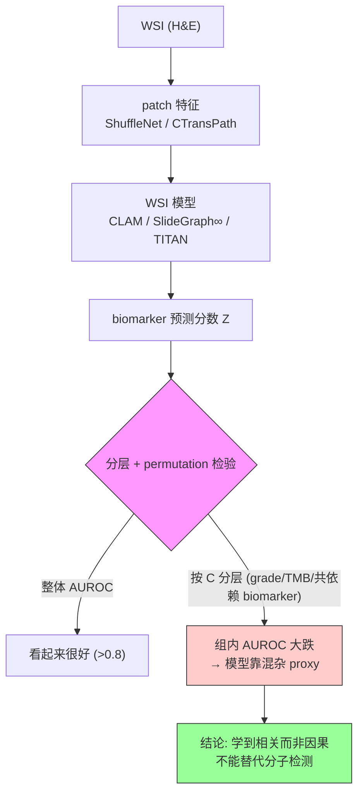

# Confounding factors and biases abound when predicting molecular biomarkers from histological images

**作者**: Muhammad Dawood, Kim Branson, Sabine Tejpar, Nasir Rajpoot, Fayyaz ul Amir Afsar Minhas（University of Warwick / TIA Centre 等）
**期刊**: Nature Biomedical Engineering | **年份**: 2026（received 2024-08, accepted 2026-01）
**链接**: [Nature](https://www.nature.com/articles/s41551-026-01616-8) · [Code](https://github.com/imuhdawood/HistBiases)

## 一句话总结

一篇**批判性/警示**研究：从 H&E WSI 预测分子 biomarker 的深度模型看似 AUROC>0.8，实则学到的是被 **grade / TMB / 共依赖 biomarker** 混杂的信号——按这些变量分层后 AUROC 大跌（ER 0.89→0.57，UCEC-TP53 甚至跌到 0.36 反向），因此**尚不能替代分子检测**；需用因果、分层校准的评估与建模。

## 核心贡献

1. **确立"混杂"是范式无关的系统性问题**：在 CLAM（注意力）/ SlideGraph∞（图）/ TITAN（基础模型）三范式 × 两 encoder 上，混杂一致存在。
2. **三条混杂路径全部实证**：共依赖 biomarker（Fig.4）、histology grade（Fig.5）、TMB（Fig.7）——分层后 AUROC 显著下降甚至反向。
3. **grade 基线暴击**：仅用 grade 的 SVM 就能预测很多 biomarker（TP53 0.75 vs ML 0.81），ML 增量有限。
4. **提供可复用的诊断协议**：分层分析 + 10,000 次 permutation 检验 + BH 校正，作为 bias-aware 评估标准。
5. **临床后果论证**：BRAF-MSI 混淆会误导用药（两者治疗方案相反），把统计混杂翻译成临床风险。

## 📖 批读导航

| Section | 内容 |
|---------|------|
| [00 - Abstract](sections/00-abstract.md) | 摘要 + confounded signal 是什么 + 对压缩研究的冲击 |
| [01 - Introduction](sections/01-introduction.md) | 三条混杂路径框架、比"域偏移"更深一层、分层+permutation 武器 |
| [02 - Results](sections/02-results.md) | Fig.1-7：依赖存在且漂移 → 模型训练良好 → 分层后崩（共依赖/grade/TMB）→ grade 增量 |
| [03 - Discussion](sections/03-discussion.md) | BRAF-MSI 临床后果、外部验证陷阱、临床定位、因果 ML 方向 |
| [04 - Methods](sections/04-methods.md) | 队列、LOR+Fisher、CLAM/SlideGraph/TITAN、分层+permutation p 值、grade 基线 |

## 关键数字

| 指标 | 数值 |
|------|------|
| 样本 | 8,221 例；4 癌种（BRCA/CRC/UCEC/LUAD）；6 cohort（TCGA/METABRIC/MSK/DFCI/CPTAC/ABCTB） |
| 模型 | CLAM、SlideGraph∞（×CTransPath/ShuffleNet）、TITAN（单/多输出） |
| 整体 AUROC | 多 biomarker >0.80（ER 0.87-0.90，MSI 0.89） |
| **分层后崩塌** | ER 0.89→0.57（共依赖分层）；MSI 0.88→0.72（hypermutation 分层） |
| **跨 cohort 反向** | UCEC-TP53 高 grade：TCGA 0.70 → CPTAC 0.36 |
| grade 基线 | grade-SVM 预测 TP53 0.75（ML 仅 0.81） |
| permutation | Q=10,000 次，BH 校正 FDR<0.05 |

## 数据流：输入 → 中间表示 → 输出

## 优缺点与还能做什么

### 优点
- **方法论严谨**：先证明模型训得好，再用范式无关的证据拆解，堵死"实现差"反驳。
- **可复用协议**：分层+permutation 检验是现成的 shortcut/bias 检测器。
- **临床落地**：把统计混杂翻译成用药风险（BRAF-MSI），并给出务实的临床定位（分诊而非替代）。

### 局限 / 风险
- **只诊断不治疗**：提出因果结构化多标签学习等方向，但未实现验证。
- **数据瓶颈**：真正去混杂需"共突变组合被穷尽覆盖"的数据集，curation 成本极高。
- **限于 H&E + WSI 级粗标签**：未评估 IHC / 空间组学监督。

### 还能做什么（对本课题）
- **压缩方法的 shortcut 检验**：把本文 (Z,Y,C) + permutation 协议里的 C 换成"压缩策略/码率/中心/扫描仪"，检验压缩是否引入 codec-signature 类 shortcut（比只看 AUROC 严格得多）。
- **分层验证跨 FM/跨中心迁移**：ReadySlide 的 cross-FM transfer 若只报聚合 AUROC，可能被关联漂移欺骗——必须补分层。
- **retention 的因果性**：验证"内容自适应保留"保住的是因果诊断信号还是 grade/TMB proxy。

## 阅读 Q&A 记录

- **Q: 为什么高 AUROC 不能说明模型学到了 biomarker 的形态？**
  A: 因为训练集里 biomarker 之间、biomarker 与 grade/TMB 之间强相关。模型可只学 grade/共依赖 biomarker 的形态当 proxy 就刷高 AUROC。分层（固定混杂变量）后 AUROC 大跌（ER 0.89→0.57）证明 biomarker 特异信号很弱。

- **Q: 分层 + permutation 检验具体怎么判定混杂？**
  A: 按混杂变量 C 分组算组内 AUROC；打乱 C 与标签的关联 10,000 次构造零分布；若观测组内 AUROC 落在零分布尾部（p 小），说明 C 影响了预测 = 靠 proxy。

- **Q: 为什么 UCEC-TP53 在 CPTAC 上 AUROC 只有 0.36（低于随机）？**
  A: TP53-grade 关联在 TCGA（训练）是共现、在 CPTAC（测试）是互斥（方向相反）。模型学的是 grade 形态当 TP53 proxy，关联一反就系统性错 → 低于随机。Simpson 悖论。

- **Q: 对 WSI 压缩/ReadySlide 的最大启示？**
  A: 光看"压缩后 AUROC 不掉"不够——必须做分层验证，确认压缩保住的是因果诊断信号而非 shortcut（染色/grade/TMB 形态）。本文的 permutation 协议是现成检验工具。

## 📊 Citation Landscape

> Nature 论文，Semantic Scholar 未必收录/采集限流，据论文自身引用整理。

**方法/概念来源**
- CLAM [32]（Lu et al., Nat BME 2021）、SlideGraph+ [2/33]（Lu/Dawood）、TITAN [22]（Ding et al., Nat Med 2025）——被测的三个 WSI 模型。
- CTransPath [34]（Wang et al., MedIA 2022）——病理 SSL encoder。
- 互斥/共现分析 [20,21,23,29]（Babur/Ciriello/Canisius）——基因依赖分析的方法来源。
- Simpson 悖论 [39,40]、因果推断 [45]（Schölkopf/Pearl）、site-specific signatures [44]（Howard et al., Nat Commun 2021）——混杂/因果理论基础。

**被批判的范式（WSI→biomarker 预测）**
- Kather et al. [4]（MSI，Nat Med 2019）、Bilal et al. [1]（CRC pathways，Lancet Digit Health 2021）、Wagner et al. [3]（CRC transformer，Cancer Cell 2023）、Coudray et al. [9]（NSCLC，Nat Med 2018）——本文警示这些"高 AUROC"结论需分层复核。

**与本主题的关系**
- 与 [PathBench](../%5BArxiv%202025%5D%20PathBench/) 互补：PathBench 管"防泄漏的评测标准"，本文管"去混杂的评测维度"。
- 与 [ACMIL](../%5BECCV%202024%5D%20ACMIL/)/[MHIM-MIL](../%5BICCV%202023%5D%20MHIM-MIL/) 呼应：那两篇说"注意力≠可靠重要性"，本文说"高 AUROC≠学到生物学"——都在戳"表面指标好≠真的对"。
