# Confounding factors and biases abound when predicting molecular biomarkers from histological images

Received: 30 August 2024

Accepted: 16 January 2026

Published online: xx xx xxxx

Muhammad Dawood  1,2,3 , Kim Branson4, Sabine Tejpar  5, Nasir Rajpoot  2,6 & Fayyaz ul Amir Afsar Minhas  1,2,7

Check for updates

Deep learning models that infer clinically relevant biomarker status from tissue images are being explored as rapid and low-cost alternatives to molecular testing. Here we show, through statistical analysis across multiple cancer types, datasets and modelling approaches, that the datasets used to train these models contain strong dependencies between biomarkers and clinicopathological features, which prevent models from isolating the efect of a single biomarker and lead them to learn confounded signals. Consequently, their prediction accuracy varies substantially with the status of codependent biomarkers and clinicopathological variables, and for several biomarkers, the gain over what a pathologist can already infer from routine histopathological features, such as grade, remains modest. These findings indicate that current approaches are not yet suitable as substitutes for molecular testing but can support triage or complementary decision-making with caution. Unconfounded biomarker prediction will require models that learn causal rather than correlational relationships between biomarkers and tissue morphology.

Fuelled by developments in computational pathology, several studies have proposed methods to predict clinically relevant biomarkers1–9, such as gene mutations and expression levels, directly from routine haematoxylin and eosin (H&E)-stained whole-slide images (WSIs)1–4,10. These approaches take a WSI as input and predict the status of clinically relevant biomarkers such as microsatellite instability (MSI), hormonal receptors or mutations in TP53, BRAF, KRAS, EGFR and other genes, as their target. Such methods are typically motivated by two main objectives: first, to identify or mine histological patterns associated with specific biomarkers11, and second, to rule out certain biomarkers from routine WSIs, avoiding the need for additional stains or molecular testing, which can be tissue-destructive, costly and associated with longer turnaround time12. For example, the accurate prediction of

MSI1,4,13 and mutations in genes such as BRAF1 and KRAS/NRAS10 from WSIs can inform personalized treatment decisions while reducing cost and waiting time compared with sequencing12.

Several methods have demonstrated that, in specific cancers10,14,15, biomarker status2,3,16 and alterations in certain genes are predictable from WSIs using deep learning pipelines trained in a weakly supervised fashion on imaging and molecular data from The Cancer Genome Atlas (TCGA) or other similar data repositories, such as the Clinical Proteomic Tumour Analysis Consortium (CPTAC)17. However, for most biomarkers, the prediction accuracy of these methods remains low, with the area under the receiver operating characteristic curve (AUROC) values ranging from 0.50 to 0.90. Moreover, the true generalization of such methods to external datasets is further challenged by factors such as mutation prevalence, limited multicentric data, class imbalance between positive (mutated or high expression) and negative (wild-type or low expression) cases, quality of WSIs (such as pen markings and tissue tears) and domain shifts18. In this Article, we demonstrate that even if these challenges have been handled, there are underlying fundamental issues that require addressing.

In a WSI, disease phenotypes manifest as different visual patterns arising from the interaction of multiple codependent genes rather than from a single factor. These interactions are often characterized by patterns of mutual exclusivity or co-occurrence among molecular factors19–21. A detailed discussion of the pathobiological origins of these interactions is provided in Section 1.1 of the Supplementary Information. Despite this, current approaches primarily focus on predicting the status of individual biomarker or gene mutation from WSIs, neglecting codependencies between covariates. Although several recent studies5,22 have used multi-output models and leveraged representations from multimodal foundation models to predict biomarker status from WSIs; these studies remain limited to optimizing aggregated accuracies and do not extend to assessing the stability of model performance across patient groups stratified by the status of a codependent biomarker.

In this study, we show that overlooking interdependencies among biomarkers can influence the predictive performance of machine learning (ML) models. We argue that interdependencies among biomarker statuses in the training data, when ignored during model development, can lead to models capturing the aggregated influence of multiple interdependent biomarkers rather than patterns linked to a single biomarker. Moreover, this could also spuriously inflate or deflate models’ apparent performance in certain subgroups when the interdependency structure among molecular factors shifts in the test cohorts. Finally, when clinicopathological variables (for example, tumour mutational burden (TMB) or tumour grade) are themselves associated with biomarker status, models may rely on phenotypes associated with these correlated variables as predictive proxies, instead of capturing the intended biological signal.

To illustrate these effects, we first analysed interdependencies among biomarkers by assessing their patterns of mutual exclusivity and co-occurrence23. We then use permutation testing and stratification analysis to demonstrate failure modes of WSI-based predictors by showing that their accuracy for a given biomarker varies substantially when conditioned on the status of other biomarkers. We also highlight the need for appropriate causal adjustments in WSI-based predictors to ensure reliable inferences necessary for informing clinical decisions, such as treatment selection and pathobiological understanding. To this end, we propose a stratification-based evaluation framework to report bias and support the development of more transparent and trustworthy ML models to advance WSI-based precision diagnostics.

## Results

## Data and study design

We analysed the limitations of existing ML approaches for predicting molecular biomarkers (for example, mutations, genomic instability indicators and protein expression) from H&E stained WSIs. A high-level concept diagram of these approaches is provided in Fig. 1. We hypothesize that interdependencies among biomarker statuses and clinicopathological variables in the training data, and the disregard of such associations during model development, bias ML models towards relying on aggregated influences of multiple factors in WSIs rather than patterns linked to individual biomarkers. To illustrate this, we retrospectively analysed n = 8,221 patients with breast cancer (BRCA), colorectal cancer (CRC), endometrial cancer (UCEC) and lung cancer across four cohorts for which WSIs and/or molecular information (for example, receptor status, gene mutations and so on) were available (Methods). These include: TCGA (n = 2,683), Molecular Taxonomy of Breast Cancer International Consortium $( \mathsf { M E T A B R I C } ; n = 2 , 4 3 3 ) ^ { 2 4 , 2 5 }$ Memorial Sloan Kettering Cancer Centre (MSK; n = 2,486)26,27 and DFCI $( n = 6 1 9 ) ^ { 2 8 }$ . Using these datasets, we performed the four major steps listed below:

(1) An analysis of the interdependency among biomarkers and somatic mutation status of genes in samples;

(2) Training deep learning models to predict biomarker status from WSIs;

(3) Stratification analysis and permutation testing to assess wheth er the model trained to predict a certain biomarker is biased by the status of other biomarkers or clinicopathological variables;

(4) An analysis of the added value of using ML models in predicting various biomarkers over and above the pathologist-assigned grade.

Drawing from established methods in gene functional analysis20,21,29–31, we quantified the interdependency among molecular factor labels across patients by evaluating their pattern of co-occurrence and mutual exclusivity. We used log odds ratios (LOR) to quantify these relationships, where positive LOR values indicate co-occurrence, and negative values indicate mutual exclusivity. Statistical significance was assessed with a two-sided Fisher’s exact test, and the resulting P values were corrected for multiple hypothesis testing.

To assess whether biomarker interdependencies introduce bias into WSI-based models, we analysed three deep learning algorithms with different principles of operation: attention-based (CLAM32), graph neural network-based (SlideGraph∞33) and a WSI-level multimodal foundation model (TITAN22). These algorithms represent existing ML approaches that do not explicitly consider interdependencies between prediction variables. As CLAM and SlideGraph∞ rely on a patch-level encoder, we trained them with two different encoders: CTransPath34 (trained on histology images) and ShuffleNet35 (trained on ImageNet)36 to minimize encoder-specific bias. For each biomarker, we train these models with both encoders on the TCGA cohort using fourfold cross-validation and report AUROC as a performance metric. We further evaluated the trained models on two independent validation cohorts, CPTAC37 and the Australian Breast Cancer Tissue Bank (ABCTB)38. Finally, we used WSI-level representation from a multimodal foundation model (TITAN)22, trained on 330,000 image–text pairs, under the hypothesis that these embeddings better capture biomarker-related morphology, and trained both single-output and multi-output biomarker predictors on them.

To investigate whether WSI-based biomarker prediction models are confounded by the interdependency among molecular factors or clinicopathological variables (for example, histological grade or TMB), we performed a stratification analysis and permutation testing. For each model, we define two types of variable: the prediction variable, which is the biomarker the model is trained to predict, and stratification variables, which are biomarkers or clinicopathological features showing significant mutual exclusivity or co-occurrence with the prediction variable and may act as confounders (identified in step 1). The motivation for considering interdependent variables as confounders is that they may be associated with a shared phenotypic pattern in WSIs, which the model can exploit as proxies for the prediction variable, potentially leading to biased predictions when such signals are absent or decoupled at test time. To detect such confounders, we evaluate model performance at two levels: (1) across the entire cohort and (2) within subgroups defined by stratification variables. Examining model performance within these subgroups allows us to isolate the effect of the prediction variable from confounders. If the model truly captures prediction variable specific patterns in WSIs, its subgroup-level performance should closely match the cohort-level performance. By contrast, substantial differences between subgroups and overall performance indicate the influence of confounding effects or Simpson’s paradox39,40. To quantify these effects, we perform permutation testing and report their statistical significance.

For example, to evaluate whether the performance of a WSIbased predictor for oestrogen receptor (ER) status (prediction variable) is influenced by TP53 mutation status (stratification variable), we first divide the cohort into two subgroups on the basis of the stratification variable: patients with a TP53-mutant status and patients with a TP53 wild-type status. We then compute the AUROC of the ER predictor within each of these subgroups. Finally, we compare these subgroup-level AUROCs to the model’s overall AUROC across the entire cohort. A substantial difference between subgroup and cohort-level AUROCs indicates a potential bias, suggesting the model captures the combined effects of ER and TP53 rather than ER-specific features alone. To establish statistical significance, we run a permutation test with 10,000 trials (see Methods for more details). This definition of the ‘prediction variable’ (ER status in this example) and the ‘stratification variable’ (TP53 status in this example) will be used consistently in subsequent results and figures to ensure clarity. Repeating this across alternative stratification variables (for example, grade and TMB) provides a systematic way of detecting the influence of confounding factors on different WSI-based models.

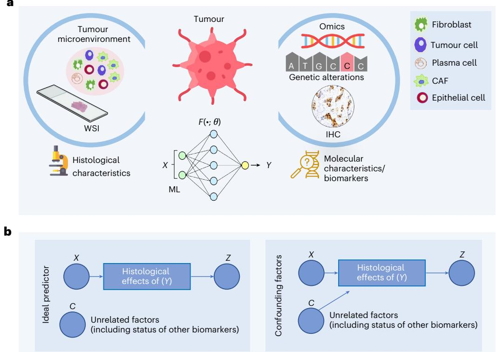  
Fig. 1 | Conceptual framework of ML methods that infer molecular biomarker status from histology WSIs. a, The ML-based prediction of molecular biomarkers from WSIs involves using training data of WSIs with known biomarker statuses. The ML model accepts the representation of a WSI (X) as input and predicts the status of a certain biomarker (Y) as the target. b, An ideal predictor should be able to predict the status of a molecular biomarker from histological effects of that biomarker contained in the WSI, and its output (Z) should be  
independent of unrelated confounding factors (lumped into a variable C) as shown in the simplified causal diagram. Conversely, if the predictor’s output is dependent not only on the histological effects of (Y) but also on other confounding factors (for example, histological grade, TMB or status of other biomarkers), then the prediction is confounded because the model is relying on these additional covariates rather than solely on the effects of (Y). Credit: icons in a, Flaticon.com.

To assess the added value of ML models in predicting various biomarkers over and above pathologist-assigned grades, we used a support vector machine with one-hot encoded histological grades to predict various clinical biomarkers following the same protocols used for weakly supervised models.

## Biomarker statuses show significant interdependencies and variations

Our analysis revealed significant interdependencies (P ≪ 0.05) among biomarkers across cancer types (Fig. 2 and Supplementary Fig. 1). In BRCA, elevated ER and progesterone receptor (PR) expression co-occur with mutations in CDH1, MAP3K1 and PIK3CA, but not with TP53, which is mutually exclusive with CDH1, GATA3, MAP3K1 and PIK3CA41. In CRC, MSI-high (MSI-H) cases frequently carry BRAF, ATM, ARID1A and RNF43 mutations and are less likely to harbour KRAS mutations; BRAF-mutant tumours also show higher TMB and show co-occurrence with ATM, RNF43 and ARID1A. Similar patterns of interdependencies are also observed in UCEC and lung adenocarcinoma (LUAD) (Supplementary Fig. 1). For instance, in UCEC, PTEN mutations co-occur with APC, ATM, JAK1, KRAS and ARIDA, whereas in LUAD, STK11 mutations co-occur with KEAP1 but rarely with EGFR.

Our analysis further showed that, within the same tissue type, biomarker associations can vary across datasets, showing sampling variations. In the TCGA-BRCA cohort, MAP3K1 mutations showed mutual exclusivity with AKT1 and ARID1A, whereas in the METABRIC cohort, they showed a tendency towards co-occurrence (Fig. 2). ER status and high TMB showed mild co-occurrence in the TCGA-BRCA cohort but mutual exclusivity in the METABRIC cohort. In the TCGA-CRC cohort, BRAF-mutant tumours were significantly less likely to harbour TP53 mutations, whereas this association is less pronounced in the DFCI cohort and lacks statistical significance. Similar cross-dataset differences were observed in UCEC and LUAD (Supplementary Fig. 1). For instance, in TCGA-LUAD, BRAF and STK11 showed a weak tendency towards mutual exclusivity, whereas in the MSK cohort, they showed a weak tendency towards co-occurrence.

These results show that biomarker statuses are significantly inter dependent and that their association patterns can vary across datasets. Consequently, ML models trained on WSIs may learn composite phenotypes driven by multiple interdependent biomarkers, introducing cohort-specific biases and limiting their generalizability to unseen cases.

## Prediction of biomarkers and gene alterations from WSIs

To demonstrate that the ML models analysed in the study were properly trained, we report biomarker prediction performance across

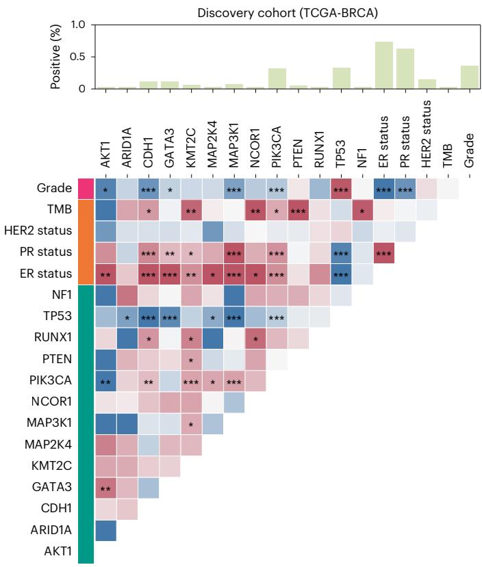

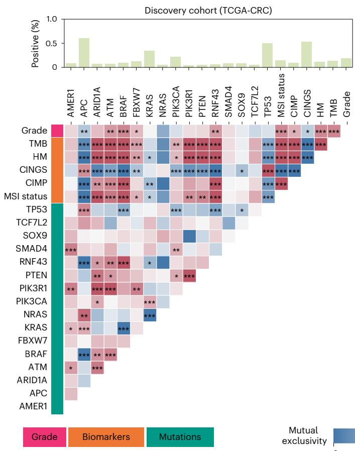  
Fig. 2 | Heat maps showing associations of biomarkers and gene mutation statuses across tissue types and datasets. The heat maps display a set of biomarkers and genes along the axes, with cell colours within the heat map showing the strength of association (dark red colours for co-occurrence and dark blue for mutual exclusivity). Cells marked with asterisks indicate statistically significant associations (Benjamini–Hochberg FDR-corrected P values from

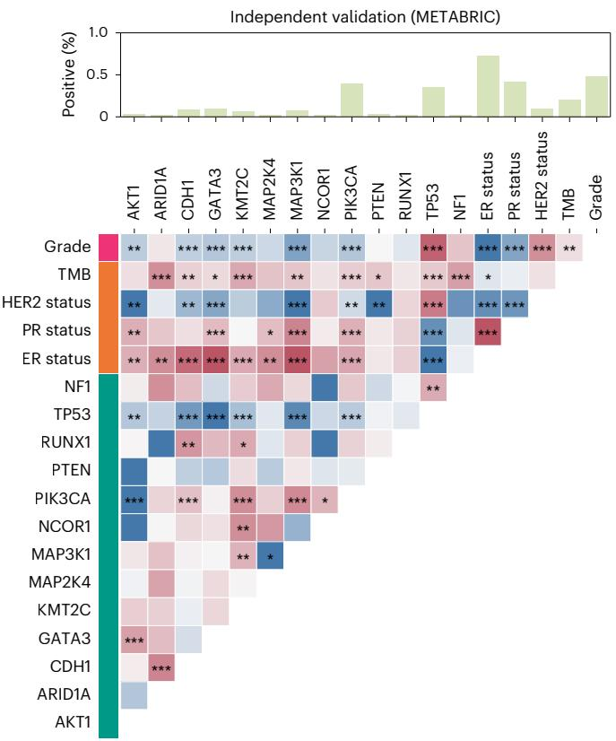  
two-sided Fisher’s exact test P ≪ 0.05). The top bar above each heat map shows the percentage of cases mutated for a specific gene in case of gene mutations, whereas for biomarkers, it indicates the percentage of patients with elevated ER, PR and HER2 in case of breast tumours, high MSI, hypermutation and CIMP activity and CIN for colorectal tumours. CINGS, chromosomally instable versus genome stable; HM, hypermutated.

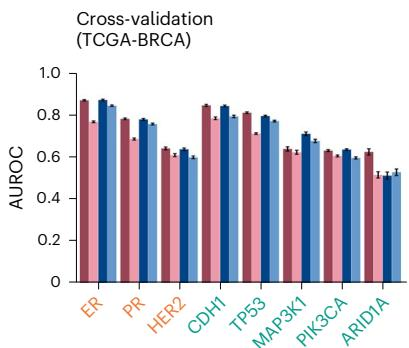

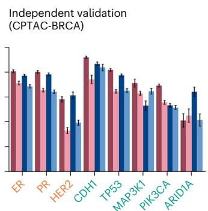

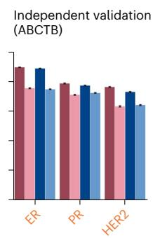

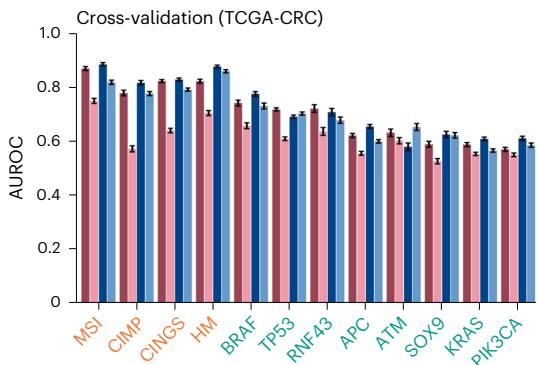

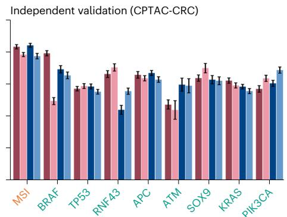

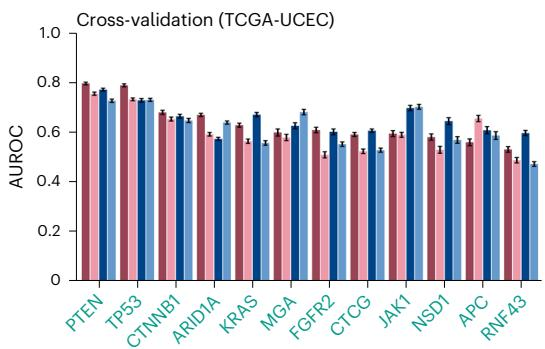  
SlideGraph∞ (CTransPath)

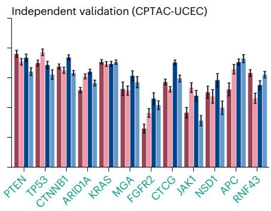

Fig. 3 | Quantitative results of weakly supervised models in predicting biomarkers/mutations from WSIs across different cancer types. The plots show the AUROC for two weakly supervised models (CLAM and SlideGraph∞), each trained with two different patch-level encoders: ShuffleNet, a convolutional neural network-based encoder pretrained on natural images, and CTransPath, a transformer-based model pretrained on WSIs through self-supervised learning. For each biomarker or gene mutation, the comparative predictive performance

algorithms, feature embeddings and modelling approaches (Fig. 3 and Supplementary Figs. 1 and 2). Different model configurations achieved AUROCs >0.80 for multiple biomarkers in both cross-validation and independent validation cohorts.

In BRCA, CLAM with CTransPath features predicts receptor status with average AUROCs of 0.87 and 0.90 for ER and 0.79 and 0.78 for PR, in cross-validation (TCGA-BRCA) and independent validation (ABCTB) cohorts, respectively. Similar AUROCs were observed for SlideGraph (CTransPath). These models also inferred gene mutations with high accuracy; for example, CLAM (CTransPath) predicted CDH1 and TP53 mutations with AUROCs of 0.88 and 0.82 in TCGA-BRCA and 0.91 and 0.82 in CPTAC-BRCA, respectively.

Beyond breast tumours, these models also achieved high AUROC values for predicting biomarkers and gene mutations in CRC, lung cancer and UCEC (Fig. 3 and Supplementary Fig. 2). For instance, SlideGraph∞ (CTransPath) predicted MSI status in CRC with an AUROC of 0.89 in TCGA-CRC (cross-validation) and 0.84 in CPTAC-CRC (independent validation). A strong predictive performance was also for these four model-encoder combinations is shown. Dark and light red bars correspond to CLAM with CTransPath and ShuffleNet, respectively, whereas dark and light blue bars correspond to SlideGraph∞ with CTransPath and ShuffleNet, respectively. Bar heights represent mean AUROC values, whereas error bars indicate the 95% confidence (two-sided, using Student’s t-distribution) calculated across 100 class-stratified bootstrap sampling runs. Bar labels are colour-coded, with yellow denoting biomarkers and green denoting mutations.

observed for other biomarkers, including BRAF, CpG island methylator phenotype pathway (CIMP), CINGS and hypermutation status (Fig. 3).

Apart from weakly supervised approaches, single-output and multi-output models trained on TITAN WSI-level feature representation showed roughly similar performance (Supplementary Fig. 3). For example, the multi-output model predicts the ER and PR status of TCGA-BRCA cases with an AUROC of 0.89 and 0.81, respectively, closely matching the AUROC values of models trained under the single-output setting (ER 0.89 and PR 0.79).

These results confirm the proper training of these models. Next, on the basis of AUROC, we selected the best model for each biomarker and assessed the influence of biomarker interdependencies through permutation testing and stratification analysis.

## Interdependence in biomarker status leads to entangled histology phenotypes captured from WSIs

Our confounding factor analysis reveals that WSI-based predictors are strongly influenced by biomarker interdependencies. Across multiple biomarkers, the higher cohort-level AUROCs achieved by these models drop substantially in subgroups defined by the statuses of various stratification variables (Fig. 4 and Supplementary Figs. 4–7). For example, SlideGraph predicts colorectal tumours’ MSI status (the ‘prediction variable’) with an AUROC of 0.88 (0.873–0.886). However, when the same patient set is divided into hypermutated and nonhypermutated subgroups (the ‘stratification variable’), the AUROC for MSI status prediction drops to 0.72 within each subgroup. A similar effect is observed in stratification by other biomarkers showing co-occurrence with MSI (for example, CIMP activity, hypermutation and APC statuses) and those showing mutual exclusivity (for example, BRAF and CINGS) (Fig. 4).

These observations extend beyond colorectal tumours and are evident in biomarker predictors of breast and endometrial tumours, irrespective of the specific model architecture, feature embeddings or training methodology used. For instance, in breast tumours, the performance of the ER predictor substantially declines in cases with GATA3, CDH1 and PIK3CA mutations (Fig. 4). Likewise, the ER predictor’s AUROC drops substantially in both PR-positive and negative cases, as well as in TP53-mutant and wild-type cases. Similar trends are apparent for PR, TP53, CDH1 and PIK3CA predictors (Fig. 4). This trend of inconsistent subgroup performance is also observed for other single- and multi-output models, such as those utilizing TITAN WSI-level feature representation (Supplementary Figs. 5–7). For example, the AUROC of the ER predictor drops from 0.89 to 0.57 in single-output settings, whereas it drops from 0.88 to 0.58 under multi-output settings.

These results suggest that the biomarker prediction from ML models is contingent on the status of other interdependent biomarkers, and these models are probably relying on composite phenotypes arising from potentially interacting biomarkers rather than learning biomarker-specific morphology.

## WSI-based biomarker prediction is confounded by histology grade

WSI-based models predict breast tumour receptor status (ER, PR) with high cohort-level AUROCs of 0.87 and 0.79 in the TCGA-BRCA cohort, and 0.90 and 0.78 in the ABCTB cohort, respectively. However, the stratification analysis by tumour grade reveals marked subgroup-level performance drops (Fig. 5). The ER predictor AUROC drops to 0.76 for medium-grade cases in both cohorts, and the PR predictor AUROCs in low and medium-grade cases drop to 0.59 and 0.69 in the TCGA-BRCA cohort and to 0.65 and 0.73 in the ABCTB cohort. Mutation predictors show similar grade-specific performance declines; for example, AUROC of the TP53 predictor drops from 0.81 (cohort-level) to 0.73, 0.73 and 0.72 for low-, medium- and high-grade cases. These patterns extend beyond breast tumours and are evident in the mutation predictors of endometrial tumours, irrespective of model architecture, feature embeddings or training methodology (Fig. 5 and Supplementary Fig. 8). For example, TP53 predictors trained on TITAN WSI-level embeddings also show performance drops in high-grade cases, with AUROCs decreasing from 0.83 to 0.77 in single-output settings and from 0.86 to 0.77 in multi-output settings.

Our analysis further shows that the apparent AUROCs of WSI-based models are sensitive to shifts in biomarker-grade associations between training and test cohorts. For example, in high-grade UCEC cases, the TP53 predictor attains an AUROC of 0.70 in the TCGA cohort but only 0.36 in the CPTAC cohort, a pattern consistent with a shift in TP53-grade relationship from strong co-occurrence in the training cohort to moderate mutual exclusivity in the test cohort. Similarly, in low-grade cases, the ER predictor achieves an AUROC of 0.96 in the ABCTB cohort compared with a cross-validation AUROC of 0.90 in TCGA-BRCA, probably reflecting a stronger ER-grade association in ABCTB than in TCGA. Consistent with these, single- and multi-output models trained on TITAN WSI-level feature representations showed similar sensitivity (Supplementary Fig. 8). For example, in TCGA-UCEC, TP53 AUROC drops from 0.83 to 0.77 in high-grade cases for the single-output mode and from 0.86 to 0.77 for the multi-output model. In CPTAC-UCEC, where the grade–mutation association differs, the drop in AUROC is more pronounced, from 0.61 to 0.53 for the single-output model and from 0.74 to 0.60 for the multi-output model.

The confounding influence of grade is further supported by exper iments in which, for selected biomarkers, we trained separate models for grade 1, 2 and 3 patients; these grade-specific models attained lower AUROCs than the pooled model (Supplementary Table 1). For example, in TCGA-BRCA, the TP53 grade-specific predictors achieved AUROCs of \~0.73 compared with 0.84 for the pooled model, and ER and PR showed similar reductions. To evaluate whether these disparities could be attributed to demographic differences, we examined the demographic balance between biomarker-positive and biomarker-negative cases and found moderate racial differences (Supplementary Table 2). We therefore repeated the grade-stratified experiment only on patients in a single racial subgroup (white). The same trends persisted (Supplementary Table 3); for example, the ER predictor trained only on grade 1 cases achieved an AUROC of 0.66, substantially lower than the pooled AUROC of 0.85, suggesting that demographic factors are unlikely to drive these performance differences (Supplementary Table 3).

These results, reminiscent of Simpson’s paradox, indicate that WSI-based biomarker prediction models rely heavily on grade-associated morphology rather than biomarker-specific phenotypic signatures, making them less generalizable to external cohorts where grade–biomarker associations differ from those in the training data.

## The added predictive power of biomarker predictors beyond pathologist grade assignments

Our analysis shows that the status of several biomarkers across cancer types can be inferred with accuracy higher than expected from pathologist-assigned grade, and in several cases, approaches the performance of deep learning models. In BRCA, grade-based ER and PR classifiers achieved AUROCs of 0.76 and 0.70 in the TCGA-BRCA cohort and 0.79 and 0.71 in the ABCTB cohort, respectively (Fig. 6). Grade also predicts TP53 mutations with an AUROC of 0.75, nearly matching the 0.81 achieved by weakly supervised ML models. Similar AUROC patterns were seen for TP53 and PTEN predictors in the TCGA-UCEC and CPTAC-UCEC cohorts. These results suggest that, for some biomarkers, ML algorithms offer limited additional predictive value over pathologist-assigned grade (Fig. 3). The strong grade–biomarker association also risks ML models linking grade-associated phenotypic differences to biomarker status; therefore, WSI-based models are expected to exceed this grade-derived baseline and establish robust phenotype–genotype associations that are independent of tumour grade.

## WSI-based biomarker prediction is confounded by the density of mutations in other genes

WSI-based models infer BRAF and TP53 mutations in colorectal tumours (TCGA-CRC) from WSIs with high confidence, achieving AUROCs 0.774 (0.764–0.785) and 0.717 (0.711–0.722), respectively (Fig. 7a). However, stratification analysis reveals a significant challenge: for cases with low mutation density in genes other than BRAF (denoted as $\mathtt { T M B } _ { \overline { { B R A F } } } )$ , the BRAF predictor accuracy drops to an AUROC of 0.65 (Fig. 7a). Similarly, the TP53 predictor AUROC drops to 0.50 for high TMB cases. In the CPTAC-CRC cohort, similar trends were observed, with BRAF and TP53 predictors’ performance dropping in low and high TMB cases, respectively. In addition, APC and KRAS mutation predictors are also influenced by TMB. This observation also extends to UCEC, where the PTEN predictor achieved AUROCs of 0.803 in TCGA-UCEC and 0.731 in CPTAC-UCEC but drops to 0.63 and 0.32 for low TMB cases in the respective cohorts (Fig. 7a).

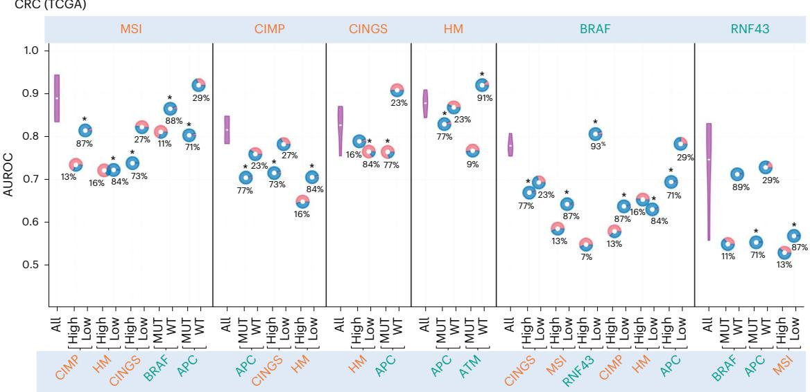

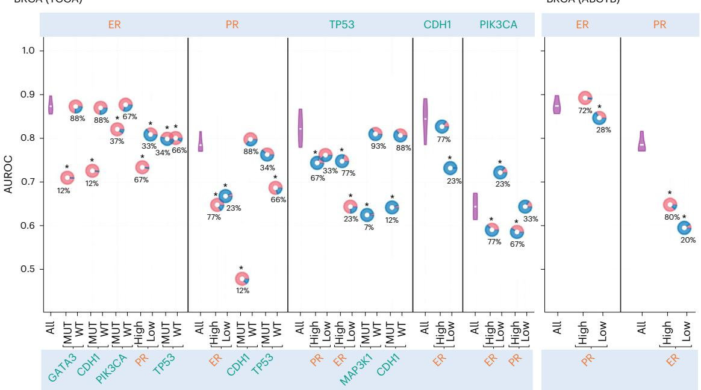  
Fig. 4 | Plots showcasing stratification analysis of several WSI-based biomarker predictors concerning other interdependent biomarkers. AUROC values are illustrated on the y axis, with the top x axis indicating the prediction variables and the bottom x axis showing the stratification variables. The predictive performance of each predictor on all the cases in the cohort (denoted by ‘All’ in the plot) over 100 bootstrap runs is shown using a violin plot, whereas its performance in different stratification groups is depicted with a doughnut chart, with the centre representing the AUROC values. The horizontal white line inside each violin marks the mean of the distribution.

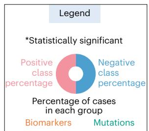  
Doughnuts marked with an asterisk at the top indicate statistically significant variation in results in the stratification analysis (Benjamini–Hochberg FDR-corrected P values from two-sided permutation testing $P \ll 0 . 0 5 ) .$ . The percentage values at the bottom of the doughnut indicate the proportion of positive (MUT/high) or negative (WT/low) cases relative to the status of the stratification variables. Red and blue colours in each doughnut indicate the proportion of positive and negative cases in each stratified group concerning prediction variables. MUT, mutated; WT, wild-type.

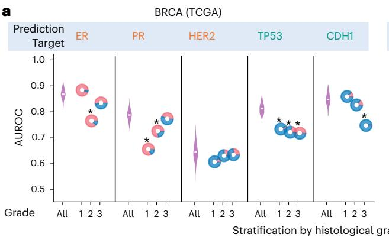

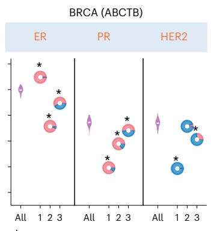

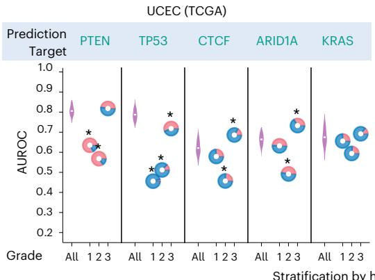

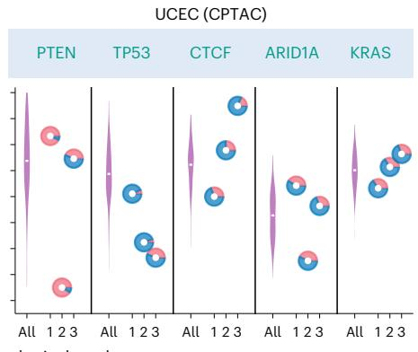

b  
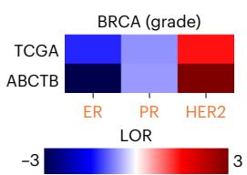

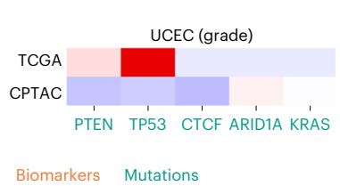  
Fig. 5 | Plots illustrating the biased predictive performance of WSI-based biomarker predictors across patients with different histological grades through stratification analysis. a, In the plots, AUROC values are illustrated on the y axis, with the top x axis indicating the prediction variables and the bottom x axis showing the patient stratification with respect to histological grade. The predictive performance of each predictor on all the cases in the cohort (denoted by ‘All’ in the plot) over 100 bootstrap runs is shown using a violin plot, whereas its performance in a group of patients with a certain histological grade is depicted with a doughnut chart, with the centre representing the AUROC values. The horizontal white line inside each violin marks the mean of the distribution.

We further show that varying associations between TMB and biomarker status across datasets significantly influence the prediction accuracy of WSI-based predictors. In CRC, the association between KRAS mutation and TMB is slightly stronger in the CPTAC-CRC cohort compared with the TCGA-CRC cohort (Fig. 7b). This stronger association could explain the KRAS predictor’s significantly improved prediction accuracy (AUROC: 0.83) in high TMB cases in the CPTAC-UCEC cohort, compared with an AUROC of 0.63 for high TMB cases in the TCGA-CRC cohort. This analysis suggests that the model’s predictions are not only influenced by the KRAS mutation status, which is the target prediction variable, but also by the overall TMB, which affects the prediction accuracy.

## Discussion

Deep learning models trained on routine WSIs of H&E-stained tissue sections are increasingly discussed as rapid and cost-effective tools to infer molecular biomarker status in patients with cancer. In this study, we identified key limitations of these approaches for clinical and preclinical use, in particular, their failure to account for biomarker interdependencies during model training and inference. Through statistical analysis, we first demonstrated significant interdependencies among molecular factors across tissue types and datasets (TCGA, META-BRIC, MSK and DFCI), manifested as patterns of mutual exclusivity and co-occurrence that reflect both pathobiological and spurious associations. Subsequently, using permutation testing and stratification analysis, we showed that these associations in the training data lead to models whose predictions for a given biomarker are contingent on the status of other codependent biomarkers. For example, the PR predictor showed a marked drop in performance in CDH1-mutant cases, with AUROC decreasing from 0.79 to 0.50. This decline in subgroup performance suggests that the current ML models cannot fully disentangle biomarker-specific signals from the multifaceted influence of molecular characteristics and other factors on tissue phenotypes in WSIs.

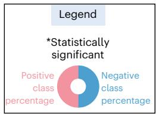  
Doughnuts marked with an asterisk at the top indicate statistically significant differences in results (Benjamini–Hochberg FDR-corrected P values from two-sided permutation testing P ≪ 0.05). Red and blue colours in each doughnut indicate the proportion of positive and negative cases in each stratified group in relation to prediction variables. b, Heat maps highlighting the shift in the association structure between histological grade and biomarker status across two distinct datasets. The colour intensity reflects the strength of association, with dark red indicating strong co-occurrence and dark blue indicating strong mutual exclusivity.

AUROC values, whereas error bars indicate the 95% confidence (two-sided, using Student’s t-distribution) calculated across 100 class-stratified bootstrap sampling runs. Bar labels are colour-coded, with yellow denoting biomarkers and green denoting mutations.

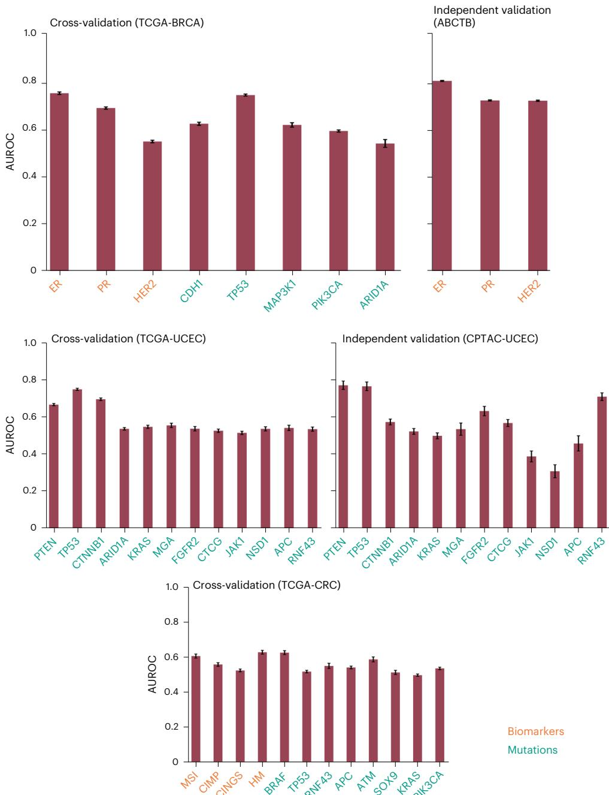  
Fig. 6 | Quantitative results of prediction of biomarkers/mutations using pathologists’ assigned grade. The plots illustrate the AUROC achieved by a support vector machine classifier trained to predict a biomarker/gene mutation from one-hot encoded histological grades. Bar heights represent mean

The inability of WSI-based models to discern biomarker-specific signals has direct clinical implications when codependent biomarkers have divergent therapeutic roles. An example is the BRAF-MSI association in CRC. Our analysis shows that MSI predictions from WSI-based models are contingent on BRAF status, with AUROCs dropping in both BRAF-mutant and wild-type subgroups, and a similar pattern was observed for the BRAF predictor when stratified by MSI status (Figs. 2 and 4 and Supplementary Fig. 7). This reflects their well-known biological co-occurrence: MSI-H CRCs frequently harbour BRAF V600E mutations, whereas MSI-stable CRCs rarely harbour BRAF mutations. Crucially, however, MSI-H and BRAF mutations have distinct therapeutic implications. MSI-H is a strong predictor of the response to immune checkpoint inhibitors such as pembrolizumab or nivolumab, whereas BRAF V600E mutations are targeted using BRAF and MEK inhibitors in combination with EGFR blockade. Combinations of immunotherapy and BRAF inhibitors are currently being tested for the double mutant. A model that cannot disentangle MSI-H from BRAF status may achieve high aggregate AUROC but lacks clinical utility, as confusing the two would misguide treatment selection. This example underscores the broader need for bias-aware evaluation: predictors must be assessed not only for overall accuracy but also for their ability to distinguish correlated biomarkers with divergent therapeutic pathways42.

Beyond the influence of biomarker interdependencies, we showed that these models exploit prominent grade- or TMBassociated features in WSIs as proxies for biomarker prediction (Figs. 5 and 7). In breast tumours, AUROCs of ER and TP53 predictors drop markedly within grade-stratified subgroups and shifts in the grade–biomarker association across cohorts lead to apparent improvements or declines in accuracy. Likewise, TMB-stratified analysis shows substantial AUROC declines for BRAF, TP53 and other markers, with shifts in TMB–biomarker association across cohorts influencing apparent accuracy. These patterns, observed across different ML models and feature representations, reflect a broader challenge in computational pathology: models tend to exploit confounding variables (grade, TMB) and conflate them with biomarkers of interest (for example, ER, PR, TP53 and PTEN status), thereby obscuring true genotype–phenotype relationships, limiting generalizability and introducing bias. This also raises concerns about their suitability for routine clinical use, because substantial heterogeneity in biomarker profiles can exist among tumours with the same grade or TMB, and both grade and TMB can evolve over the disease course or treatment. Consequently, models that rely on these prominent features are vulnerable to distribution shifts and may produce inconsistent predictions for the same patient at different time points, irrespective of the true biomarker status.

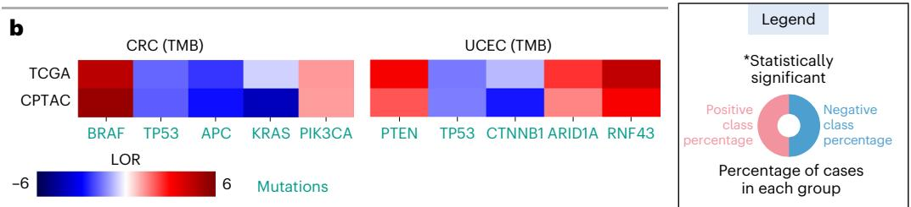

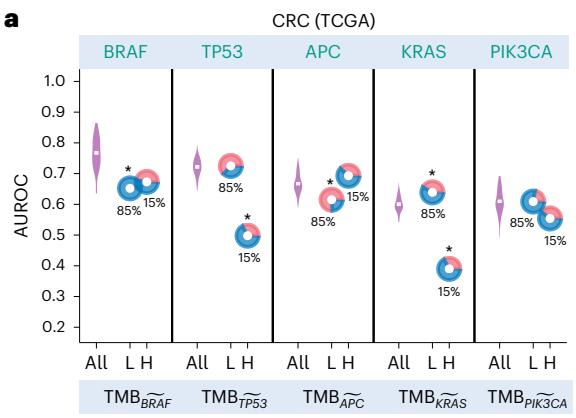

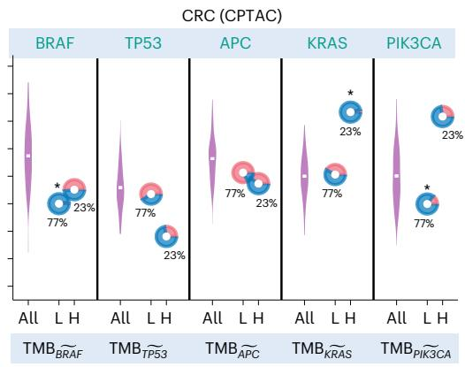

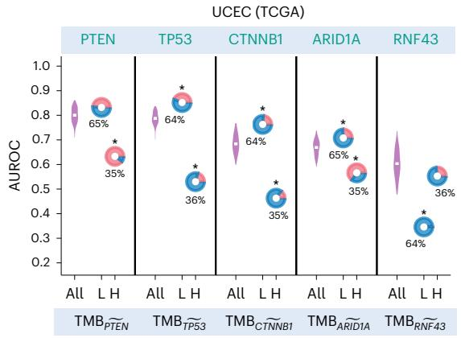

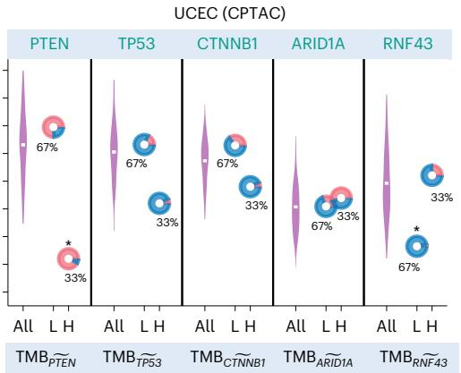  
Fig. 7 | Plots illustrating the biased predictive performance of WSI-based biomarker predictors across patients with different TMBs through stratification analysis. a, AUROC values are plotted on the y axis, with the top x axis indicating the prediction variables and the bottom x axis showing patients stratification with respect to TMB. The predictive performance of each predictor on all the cases in the cohort (denoted by ‘All’ in the plot) over 100 bootstrap runs is shown using a violin plot, whereas its performance in patients with high and low TMB is depicted with a doughnut chart, with the centre representing the AUROC values. The horizontal white line inside each violin marks the mean of the  
distribution. Doughnuts marked with an asterisk at the top indicate statistically significant variation in results (Benjamini–Hochberg FDR-corrected P values from two-sided permutation testing P ≪ 0.05). Red and blue colours in each doughnut indicate the proportion of positive and negative cases in each stratified group based on prediction variables. b, Heat maps highlighting the shift in the association structure between TMB and gene mutations across two distinct datasets. The colour intensity reflects the strength of association, with dark red indicating strong co-occurrence and dark blue indicating strong mutual exclusivity.

These findings underscore the need to interpret external validation results with caution. In our analysis, the ER predictor achieved a high AUROC of 0.87 in cross-validation on TCGA-BRCA and 0.90 in a larger independent cohort (ABCTB), which could be interpreted as an excellent generalizability of the model. However, upon closer examination, we found that the apparent improvement in AUROC was largely driven by a stronger grade-ER association in the ABCTB than in the training cohort. Moreover, within grade-stratified subgroups, the predictive performance of this sophisticated ER predictor was not substantially more informative than a simple grade-based classifier. This illustrates that external validation must be complemented by bias-aware evaluations, such as grade- and TMB-stratified analyses, before claiming clinical utility.

The confounding influence of biomarker interdependencies and clinicopathological variables (for example, grade and TMB) on current WSI-based biomarker prediction suggests that current models are not yet ready to replace genomic testing in routine care. Instead, they are better positioned for triaging, screening or supplementary decision support, provided that their performance is rigorously assessed and key clinical decisions remain supported by confirmatory testing. To ensure true clinical utility, we suggest bias-aware evaluation, including reporting grade- and TMB-stratified metrics and subgroup calibration rather than relying solely on aggregate AUROC (Figs. 4, 5 and 7 and Fig. 8). Our findings also have implications for studies and trials that link disease phenotypes to biomarkers or assess treatment response conditioned on biomarker status. In both contexts, establishing robust relationships requires that the biomarker of interest is not tightly coupled to cohort-specific covariates, as such dependencies can lead to false conclusions. To mitigate this risk, we recommend: (1) preserving variation in the target biomarker relative to correlated variables during enrolment; (2) prespecifying stratification factors (for example, grade, TMB, site, key comutations) and conducting prospective subgroup analyses; (3) including a dependency-aware analysis plan (for example, stratified permutation tests, subgroup confidence intervals, comparison with simple clinical baselines such as grade-only models); and (4) conducting per stratum power calculations rather than only aggregate targets.

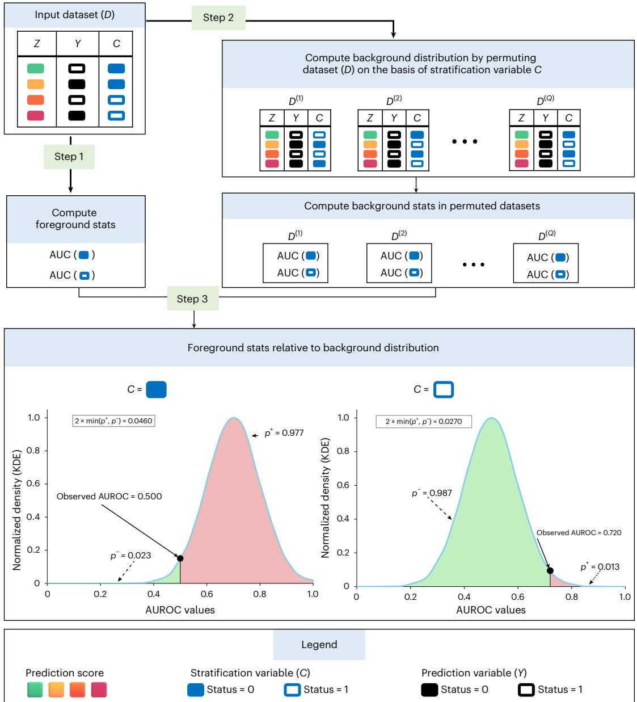  
Fig. 8 | Conceptual diagram showing the workflow of permutation testing and stratification analysis to assess bias in WSI-based models. The algorithm takes as input a dataset containing prediction scores (Z), ground truth labels (Y) and a confounding or stratification variable (C). In step 1, the algorithm computes foreground statistics, such as AUROC within each stratum defined by the values of C. In step 2, the algorithm permutes C multiple times (represented by Q), generating permuted datasets $D ^ { ( 1 ) } , D ^ { ( 2 ) } . . . , D ^ { ( Q ) }$ . AUROCs are computed in each  
permuted dataset, where any association C and Y has been randomized to form a null distribution reflecting expected model performance under the assumption of no association between C and Y. In step 3, the algorithm compares the observed AUROCs against null distributions to assess how extreme they are. If they lie in the tails, the effect of C is considered statistically significant, and a two-sided multiple hypothesis corrected P value is computed. KDE, kerne density estimation.

Although ML methods for predicting biomarker status from WSI have limitations, they can still provide substantial value. They can facili tate research and hypothesis generation by uncovering associations between histology and molecular factors, particularly in tissue-limited or retrospective scenarios where running additional assays is not feasible. WSI-based models also offer a scalable and cost-effective surrogate for large-scale preclinical and translational studies and can serve as rapid prescreening tools in early phase trials or resource-constrained settings43. In drug development, they can help narrow the pool of candidates for more resource-intensive molecular analyses and, with appropriate safeguards and clinician oversight, can support triage by guiding decisions on when confirmatory testing is essential43. To support safe use, we recommend bias-aware evaluation and interpretation of prediction results, including subgroup-stratified metrics and permutation-based checks, and comparisons against simple baselines such as grade-based classifiers.

Although predicting biomarker status from routine H&E WSIs may appear to be a simple image-to-label mapping, it is considerably more complex because phenotypes in WSIs are rarely driven by a single factor and instead reflect combined effects of multiple codependent molecular factors. Our analyses show that current approaches, including single and multi-output models, as well as ML and graph-based methods across different feature representations, fail to reliably learn biomarker-specific genotype–phenotype mapping; instead, they exploit aggregated phenotypes of interdependent biomarkers or cohort-specific association as proxies for prediction. This results in biased models whose performance drops across patients’ strata defined by codependent variables. These findings motivate the need for methods that formalize the problem as causal, structured multilabel learning: explicitly encode dependencies among biomarkers in the label space, learn disentangled image representations guided by conditional-independence objectives, mitigate confounding via causal adjustment and counterfactual data augmentation and optimize for invariance and distributional robustness, coupled with evaluation protocols based on conditional metrics and subgroup calibration44,45.

Although we demonstrated the generalizability of our findings across multiple cancer types, datasets and modelling approaches, this study still has limitations. First, our analyses were limited to H&E WSIs with WSI-level (coarse) labels, and we did not evaluate immunohistochemistry (IHC) slides or models trained with fine-grained labels (for example, spatial omics supervision). Second, although we used a large multicentre dataset (n = 8,221), prospective studies are needed to define clinical and deployment guidelines. Third, we note that learning disentangled genotype–phenotype mapping using ML will probably require combinatorially richer datasets with the exhaustive coverage of comutation or biomarker-pair combinations than current cohorts; however, curating such datasets would necessitate significant long-term efforts. Last, we suggested several methodological directions for ML researchers to explore and words of caution for clinicians, but their effectiveness remains to be established; it is premature to recommend definitive clinical guidelines.

## Methods

## Ethics statement

All samples used in the study were obtained with research consent and ethics approvals as indicated in the consent and ethics statements for TCGA, METABRIC, COAD-DFCI, MSK-LUAD, CPTAC and ABCTB.

## Patient cohorts

We analysed data of four cancer types (BRCA, CRC, LUAD and UCEC), sourced from six cohorts: TCGA46, METABRIC24,25, COAD-DFCI28, MSK-LUAD26, CPTAC and ABCTB. Biomarkers and gene mutation status information, except for the ABCTB cohort, were collected from cBioportal30. WSIs of formalin-fixed paraffin-embedded (FFPE) H&E-stained tissue for TCGA atlas cases were collected from TCGA46,47, whereas for CPTAC atlas cases, they were retrieved from The Cancer Imaging Archive (TCIA)17. Within the ABCTB cohort, WSIs and receptor status (ER, PR and human epidermal growth factor receptor 2 (HER2) status) information were available for 2,303 patients. In terms of biomarkers, for breast tumours, ER, PR and HER2 status were recorded. For colorectal cases, MSI, hypermutation (HM), chromosomal instability (CIN) and CIMP activity statuses were documented. TMB information was available for all cases across all cancer types and cohorts.

## Intergene mutational dependency analysis

We analysed the interdependency between the mutational status of genes using the LOR. Given the status of two biomarkers A and B, in a given dataset, we calculated the LOR as follows:

$$
\mathrm { L O R } = \log _ { 2 } \left( ( ( n _ { \mathrm { A } } + n _ { \mathrm { B } } ) ( n _ { \mathrm { \sim A } } + n _ { \mathrm { \sim B } } ) ) / \left( ( n _ { \mathrm { A } } + n _ { \mathrm { \sim B } } ) ( n _ { \mathrm { \sim A } } + n _ { \mathrm { B } } ) \right) \right) .
$$

In the above equation, $n _ { \mathrm { A } }$ and $n _ { \mathrm { B } }$ denote the number of cases that are positive for A and B, respectively, whereas $n _ { \mathrm { \sim A } }$ and $n _ { \sim \tt B }$ denote the number of cases that are negative for those biomarkers. A higher positive LOR between gene pairs indicates mutation co-occurrence (that is, if one gene is mutated, the other is likely to be mutated), whereas a negative value signifies mutual exclusivity of mutation (that is, if one gene is mutated, the other is less likely to be mutated).

In addition to the LOR analysis, we statistically assessed the interdependence among the mutational status of different genes using a two-sided Fisher’s exact test. All gene pairs were enumerated, and a Fisher’s exact test was performed on each pair. Subsequently, we reported the multi-hypothesis corrected P values for each pair using the Benjamini–Hochberg method, with a significance threshold set at P ≪ 0.05.

## Prediction of biomarkers and gene alteration from WSI

We assessed the predictability of biomarkers and gene alteration status from WSIs within their respective cohorts using two algorithms with different principles of operation: CLAM32 and SlideGraph∞33. To avoid drawing conclusions specific to a certain approach or type of features, the predictive performance of both algorithms was evaluated over different types of feature: deep features (a convolutional neural network-based encoder trained on ImageNet)36 and self-supervised features (a transformer-based model trained on histology images in a self-supervised manner)34. Our predictive pipeline comprises three main steps: (1) preprocessing of WSIs, (2) embedding of WSI patches, (3) biomarkers and gene mutation prediction from WSIs using CLAM and SlideGraph∞.

Preprocessing. In our preprocessing pipeline, utilizing a U-Net-based segmentation model from TIAToolbox48, we first segment viable tissue areas of each WSI and exclude regions with artefacts (pen-marking, tissue folding and so on). The model-generated tissue mask highlights informative tissue areas within the WSI using a pixel value of 1, whereas those with a value of 0 represent background or regions with artefacts. Leveraging these tissue masks, from each WSI, we extract patches of size 512 pixels × 512 pixels and 1, 024 pixels × 1, 024 pixels at a spatial resolution of 0.50 microns-per-pixel. We selectively keep patches (both benign and tumour) that have more than 40% viable tissue in terms of pixel proportion.

Feature representation. We utilized various encoders to extract fea ture representation from WSI patches. Specifically, we used ShuffleNet35 pretrained on ImageNet36 as a patch-level encoder to extract the 1,024-dimensional feature representation (deep features) from WSI patches of size 512 pixels × 512 pixels. Moreover, we also extracted a 768-dimensional self-supervised feature representation from each patch of size 1, 024 pixels × 1, 024 pixels using CTransPath (a transformerbased self-supervised model trained on histology images)34.

Predictive models. We trained SlideGraph∞ and CLAM for predicting the status of different clinical biomarkers using both deep features and self-supervised features. In case of SlideGraph∞, we first construct a graph representation of the WSI and then pass the WSI graph to a graph neural network for predicting the status of a certain biomarker as output. In cases where patients had multiple WSIs, we constructed a serial graph incorporating all WSIs and predicted the target label accordingly. In the case of CLAM, we bag all the WSIs belonging to the same patient and then predict the target label from the WSI bag.

Apart from these weakly supervised models, we also analysed alternative modelling approaches using feature representations from $\mathsf { T I T A N } ^ { 2 2 }$ , a state-of-the-art multimodal foundation model trained on more than 330,000 WSIs paired with pathology reports. We leveraged TITAN-derived features to train both single-output and multi-output models for biomarker prediction. In the single-output settings, WSI-level features were fed into a logistic regression model to predict the status of a single biomarker. In the multi-output settings, we used a multilayer perceptron (MLP) model that takes WSI-level representations as input and simultaneously predicts the status of all biomarkers as output. The model architecture consists of a single hidden layer that projects the input to half its dimension, followed by a rectified linear unit activation function and then an output layer. The model was trained using a pairwise ranking loss function33.

## Training and validation of image-based predictors

We trained and evaluated the performance of both SlideGraph∞ and CLAM using fourfold cross-validation, in which the dataset is partitioned into four 75/25 non-overlapping splits. In each cross-validation run, the model is trained on 75% data, and the performance of the trained model is then assessed on the 25% test set. From the training dataset, we randomly select 10% of the data for validation. We trained the model for 300 epochs on the training set, with a batch size of 8 and a learning rate of 0.001 using the adaptive momentum-based optimizer49. To limit overfitting, we stop the model training if its performance on the validation cohort is not improving over ten consecutive epochs. We quantitatively assess model performance on the test set using AUROC as a performance metric. Our motivation for using AUROC as the primary metric was twofold: (1) it allows us to maintain comparability with existing literature and align with established benchmarking practices, and (2) it serves as a threshold-free, rank-based statistic for bias detection, enabling subgroup evaluation and stratified permutation testing. We used the same train, validation and test splits for both SlideGraph∞ and CLAM.

## Baseline predictors based on histology grade

To assess the predictability of biomarkers and gene mutation status on the basis of histology grade, we used a linear model (specifically, a support vector machine). This model uses the one-hot encoded histological grade as input to predict the status of a certain clinical biomarker as the target. We followed the same training and evaluation protocols used for our weakly supervised models. We quantify the model’s predictive performance using AUROC as a performance metric.

## Stratification analysis and permutation testing for evaluating confounding effects

To investigate whether WSI-based biomarker prediction models are confounded by biomarker interdependency or clinicopathological variables (for example, histology grade or TMB), we used a stratification-based permutation testing approach. A high-level conceptual overview of the approach is shown in Fig. 8, and complete algorithmic details are presented in Supplementary Table 4. Using the procedure outlined in that table, we evaluate the robustness of model performance to confounding influence from biomarkers or clinicopathological features that exhibit mutual exclusivity or co-occurrence with the prediction variable (hereafter referred to as stratification variables).

Let $D = \{ ( Z _ { i } , Y _ { i } , C _ { i } ) | i = 1 , \ldots , N \}$ denote the dataset for a given test cohort, where $Z _ { i } \in \mathbb { R }$ is the score generated by a WSI-based model trained to infer the prediction variable $Y _ { i } \in \{ 0 , 1 \}$ . The variable $C _ { i } \in V _ { C }$ denotes the stratification variable (for example, status of a codependent biomarker or clinicopathological feature), and $V _ { C }$ is the set of all unique values that C can take (for example, mutant or wild-type for mutation status). The objective is to assess whether the model’s performance in predicting Y is conditionally independent of the strati fication variable C.

For each subgroup $\nu \in V _ { C }$ , we compute a stratified performance measure using AUROC as a performance metric. We define the foreground metric as $M _ { C = v } = \mathrm { A U R O C } \left( \{ ( Z _ { i } , Y _ { i } ) , | , C _ { i } = v \} \right)$ , which reflects model performance restricted to a subgroup where $C = \nu$

To determine whether $M _ { C = v }$ significantly deviates from what would be expected under the null hypothesis, that is, when the model predictions Z are independent of $^ { c , }$ we conduct a stratified permutation test. Let $Q = 1 0$ , 000 be the number of permutations. For each permutation trial $q = 1 , \ldots , Q$ , we define a permutation function $\pi _ { q } : \{ 1 , \ldots , N \} $ $\{ 1 , \ldots , N \} ,$ which randomly shuffles the assignment of C while preserving the correspondence between Z and Y. A permuted dataset is constructed as: $D ^ { ( q ) } = \{ \left( Z _ { i } , Y _ { i } , C _ { \pi _ { a } ( i ) } \right) | i = 1 , \ldots , N \}$ and for each v ∈ $V _ { C } ,$ we compute the permuted AUROC: M(q) = AUROC $\left( \{ ( Z _ { i } , Y _ { i } ) | C _ { \pi _ { q } ( i ) } = v \} \right)$ . The collection $\{ M _ { C = v } ^ { ( q ) } \} _ { q = 1 } ^ { Q }$ forms the empirical null distribution of AUROC values under the assumption of no dependence between the prediction variable Z and stratification variable C.

To quantify whether the observed stratified performance $M _ { C = \upsilon }$ is significantly different from the null distribution, we compute a two-sided P value:

$$
p _ { v } ^ { + } = \frac { 1 } { Q } \sum _ { q = 1 } ^ { Q } I \bigl ( M _ { C = v } ^ { ( q ) } \geq M _ { C = v } \bigr ) ,
$$

$$
p _ { v } ^ { - } = \frac { 1 } { Q } \sum _ { q = 1 } ^ { Q } I \bigl ( M _ { C = v } ^ { ( q ) } \leq M _ { C = v } \bigr ) ,
$$

$$
\begin{array} { r } { p _ { v } = 2 \times \operatorname* { m i n } \left( p _ { v } ^ { + } , p _ { v } ^ { - } \right) . } \end{array}
$$

In the above equations $I ( \cdot )$ is the indicator function. The term $p _ { v } ^ { + }$ captures the upper-tail P value (the proportion of permuted AUROCs greater than or equal to the observed value), and $p _ { v } ^ { - }$ captures the lower-tail P value (the proportion of permuted AUROCs less than or equal to the observed value). The final P value $p _ { v }$ quantifies the statistical evidence that the model’s predictive performance in the subgroup $c = v$ differs from what would be expected under the null hypothesis (no association between the model predictions and the stratification variable). A lower value of $p _ { \upsilon }$ suggests that the model’s predictions are influenced by the stratification variable, implying reliance on proxy features rather than those directly linked with the prediction variable50,51.

Using the stratified permutation test discussed above, we examined three key factors that could introduce bias into an ML model: first, the bias due to interdependency among biomarkers and the somatic mutation status of genes in the training dataset; second, a likely bias due to patients’ tumour histological grades; and third, an expected bias due to the TMB of a patient with cancer. To assess the influence of interdependence among biomarker statuses on model predictive performance, we select the model with the highest AUROC score for each biomarker and run a permutation test, treating other biomarkers with codependent statuses as confounding variables. Subsequently, to analyse the influence of histological grade on WSI-based biomarker predictors, we use a similar approach, utilizing histology grade as a confounding variable. Finally, to evaluate the impact of TMB on histology image-based biomarker predictors, we first calculate patient-level TMB excluding genetic alterations of the gene of interest used for prediction, then use this $\mathrm { T M B } _ { \mathrm { v o i } }$ as a confounding variable. On the basis of $\mathrm { T M B } _ { \mathrm { v o i } } ,$ we divide the patients into low and high TMB cases using a threshold of ten mutations per megabase.

As this procedure is repeated across multiple stratification variables and subgroups, all P values $p _ { \nu }$ are corrected for multiple hypothesis testing using the Benjamini–Hochberg procedure. Adjusted P values below a false discovery rate (FDR) threshold of 0.05 are considered statistically significant.

## Reporting summary

Further information on research design is available in the Nature Portfolio Reporting Summary linked to this article.

## Data availability

WSIs of TCGA patients used in the study can be downloaded from the NIH Genomic Data Commons Portal at this link: https://portal.gdc. cancer.gov/. The genomic data and clinical data of patients in TCGA, METABRIC, COAD-DFCI, MSK-LUAD and CPTAC cohorts can be downloaded from cBioPortal at https://www.cbioportal.org/. ABCTB data and images were obtained from the ABCTB. The corresponding author can be contacted to facilitate access to ABCTB data.

## Code availability

All the experiments were conducted using Python using PyTorch Geometric library and TIAToolbox. Code and documentation of all Python scripts used in the study are available via GitHub at https://github. com/imuhdawood/HistBiases. Any additional information required to reproduce the data reported in this work is available from the corresponding author upon request.

## References

1. Bilal, M. et al. Development and validation of a weakly supervised deep learning framework to predict the status of molecular pathways and key mutations in colorectal cancer from routine histology images: a retrospective study. Lancet Digit. Health 3, e763–e772 (2021).

2. Lu, W. et al. SlideGraph+: whole slide image level graphs to predict HER2 status in breast cancer. Med. Image Anal. 80, 102486 (2022).

3. Wagner, S. J. et al. Transformer-based biomarker prediction from colorectal cancer histology: a large-scale multicentric study. Cancer Cell 41, 1650–1661 (2023).

4. Kather, J. N. et al. Deep learning can predict microsatellite instability directly from histology in gastrointestinal cancer. Nat. Med. 25, 1054–1056 (2019).

5. McCaw, Z. et al. Machine learning enabled prediction of digital biomarkers from whole slide histopathology image. Preprint at medRxiv https://doi.org/10.1101/2024.01.06.24300926 (2024).

6. Zhao, Y. et al. Deep learning using histological images for gene mutation prediction in lung cancer: a multicentre retrospective study. Lancet Oncol. 26, 136–146 (2025).

7. Campanella, G. et al. Real-world deployment of a fine-tuned pathology foundation model for lung cancer biomarker detection. Nat. Med. 31, 3002–3010 (2025).

8. Echle, A. et al. Deep learning in cancer pathology: a new generation of clinical biomarkers. Br. J. Cancer 124, 686–696 (2021).

9. Coudray, N. et al. Classification and mutation prediction from non-small cell lung cancer histopathology images using deep learning. Nat. Med. 24, 1559–1567 (2018).

10. Saldanha, O. L. et al. Self-supervised attention-based deep learning for pan-cancer mutation prediction from histopathology. NPJ Precis. Oncol. 7, 1–5 (2023).

11. Fu, Y. et al. Pan-cancer computational histopathology reveals mutations, tumor composition and prognosis. Nat. Cancer 1, 800–810 (2020).

12. Lim, C. et al. Biomarker testing and time to treatment decision in patients with advanced nonsmall-cell lung cancer†. Ann. Oncol. 26, 1415–1421 (2015).

13. Echle, A. et al. Clinical-grade detection of microsatellite instability in colorectal tumors by deep learning. Gastroenterology 159, 1406–1416 (2020).

14. Kather, J. N. et al. Pan-cancer image-based detection of clinically actionable genetic alterations. Nat. Cancer 1, 789–799 (2020).

15. Keller, P., Dawood, M. & Minhas, F. U. A. A. Maximum mean discrepancy kernels for predictive and prognostic modeling of whole slide images. In 2023 IEEE 20th International Symposium on Biomedical Imaging (ISBI) 1–5 (IEEE, 2023); https://doi.org/10.1109/ ISBI53787.2023.10230578

16. Rawat, R. R. et al. Deep learned tissue ‘fingerprints’ classify breast cancers by ER/PR/Her2 status from H&E images. Sci. Rep. 10, 7275 (2020).

17. Clark, K. et al. The Cancer Imaging Archive (TCIA): maintaining and operating a public information repository. J. Digit. Imaging 26, 1045–1057 (2013).

18. Jahanifar, M. et al. Domain generalization in computational pathology: survey and guidelines. ACM Comput. Surv. 57, 285:1–285:37 (2025).

19. Sanchez-Vega, F. et al. Oncogenic signaling pathways in The Cancer Genome Atlas. Cell 173, 321–337 (2018).

20. Babur, Ö et al. Systematic identification of cancer driving signaling pathways based on mutual exclusivity of genomic alterations. Genome Biol. 16, 45 (2015).

21. Ciriello, G., Cerami, E., Sander, C. & Schultz, N. Mutual exclusivity analysis identifies oncogenic network modules. Genome Res. 22, 398–406 (2012).

22. Ding, T. et al. A multimodal whole-slide foundation model for pathology. Nat. Med. 31, 3749–3761 (2025).

23. Tekle, G. E. et al. Co-occurrence and mutual exclusivity: what cross-cancer mutation patterns can tell us. Trends Cancer 7, 823–836 (2021).

24. Curtis, C. et al. The genomic and transcriptomic architecture of 2,000 breast tumours reveals novel subgroups. Nature 486, 346–352 (2012).

25. Pereira, B. et al. The somatic mutation profiles of 2,433 breast cancers refines their genomic and transcriptomic landscapes. Nat. Commun. 7, 11479 (2016).

26. Caso, R. et al. The underlying tumor genomics of predominant histologic subtypes in lung adenocarcinoma. J. Thorac. Oncol. 15, 1844–1856 (2020).

27. Weigelt, B. et al. Molecular characterization of endometrial carcinomas in black and white patients reveals disparate drivers with therapeutic implications. Cancer Discov. 13, 2356–2369 (2023).

28. Giannakis, M. et al. Genomic correlates of immune-cell infiltrates in colorectal carcinoma. Cell Rep. 15, 857–865 (2016).

29. Canisius, S., Martens, J. W. M. & Wessels, L. F. A. A novel independence test for somatic alterations in cancer shows that biology drives mutual exclusivity but chance explains most co-occurrence. Genome Biol. 17, 261 (2016).

30. Cerami, E. et al. The cBio cancer genomics portal: an open platform for exploring multidimensional cancer genomics data. Cancer Discov. 2, 401–404 (2012).

31. Gao, J. et al. Integrative analysis of complex cancer genomics and clinical profiles using the cBioPortal. Sci. Signal. 6, pl1 (2013).

32. Lu, M. Y. et al. Data-eficient and weakly supervised computational pathology on whole-slide images. Nat. Biomed. Eng. 5, 555–570 (2021).

33. Dawood, M. et al. Cross-linking breast tumor transcriptomic states and tissue histology. Cell Rep. Med. 4, 101313 (2023).

34. Wang, X. et al. Transformer-based unsupervised contrastive learning for histopathological image classification. Med. Image Anal. 81, 102559 (2022).

35. Zhang, X., Zhou, X., Lin, M. & Sun, J. ShufleNet: an extremely eficient convolutional neural network for mobile devices. In 2018 IEEE/CVF Conference on Computer Vision and Pattern Recognition 6848–6856 (IEEE, 2018); https://doi.org/10.1109/ CVPR.2018.00716.

36. Russakovsky, O. et al. ImageNet large scale visual recognition challenge. Int. J. Comput. Vis. 115, 211–252 (2015).

37. Mertins, P. et al. Proteogenomics connects somatic mutations to signaling in breast cancer. Nature 534, 55–62 (2016).

38. Carpenter, J. E. & Clarke, C. L. Biobanking sustainability— experiences of the Australian Breast Cancer Tissue Bank (ABCTB). Biopreserv. Biobank. 12, 395–401 (2014).

39. Yule, G. U. Notes on the theory of association of attributes in statistics. Biometrika 2, 121–134 (1903).

40. Bonovas, S. & Piovani, D. Simpson’s paradox in clinical research: a cautionary tale. J. Clin. Med. 12, 1633 (2023).

41. Pan, J.-W. et al. The molecular landscape of Asian breast cancers reveals clinically relevant population-specific diferences. Nat. Commun. 11, 6433 (2020).

42. Morris, V. K. et al. Phase 1/2 trial of encorafenib, cetuximab, and nivolumab in microsatellite stable BRAFV600E metastatic colorectal cancer. Cancer Cell 43, 2106–2118.e3 (2025).

43. Graham, S. et al. Screening of normal endoscopic large bowel biopsies with interpretable graph learning: a retrospective study. Gut 72, 1709–1721 (2023).

44. Howard, F. M. et al. The impact of site-specific digital histology signatures on deep learning model accuracy and bias. Nat. Commun. 12, 4423 (2021).

45. Schölkopf, B. in Probabilistic and Causal Inference: The Works of Judea Pearl 765–804 (Association for Computing Machinery, 2022).

46. Koboldt, D. C. et al. Comprehensive molecular portraits of human breast tumours. Nature 490, 61–70 (2012).

47. Hoadley, K. A. et al. Cell-of-origin patterns dominate the molecular classification of 10,000 tumors from 33 types of cancer. Cell 173, 291–304 (2018).

48. Pocock, J. et al. TIAToolbox as an end-to-end library for advanced tissue image analytics. Commun. Med. 2, 1–14 (2022).

49. Kingma, D. P. & Ba, J. Adam: A method for stochastic optimization. In International Conference on Learning Representations (ICLR, 2015).

50. Ojala, M. & Garriga, G. C. Permutation tests for studying classifier performance. In 2009 Ninth IEEE International Conference on Data Mining 908–913 (IEEE, 2009); https://doi.org/10.1109/ ICDM.2009.108

51. Chaibub Neto, E. et al. A permutation approach to assess confounding in machine learning applications for digital health. In Proc. 25th ACM SIGKDD International Conference on Knowledge Discovery and Data Mining 54–64 (Association for Computing Machinery, 2019); https://doi.org/10.1145 3292500.3330903

## Acknowledgements

M.D. acknowledges support from the GSK-Warwick PhD Studentship and the Department of Computer Science, University of Warwick. F.M. and N.R. were partially supported by the PathLAKE consortium, which was funded by the Data to Early Diagnosis and Precision Medicine strand of the government’s Industrial Strategy Challenge Fund, managed and delivered by UK Research and Innovation (UKRI).

F.M. also acknowledges funding support from EPSRC grant no. EP/ W02909X/1. The funders had no role in study design, data collection and analysis, decision to publish or preparation of the manuscript.

## Author contributions

F.M. and M.D. designed the study with support from co-authors. F.M. and M.D. wrote the code and analysed the experimental results. N.R., K.B. and F.M. secured the funding. F.M. and N.R. supervised the study. S.T. provided pathological and oncological input. M.D. and F.M. visualized and verified the underlying data. M.D. and F.M. drafted the manuscript with input from co-authors. All authors had full access to all the data in the study and had the final decision to submit for publication.

## Competing interests

M.D. conducted this study during his PhD at the University of Warwick, UK. M.D. received PhD studentship support from GSK. K.B. is an employee of GSK. N.R. is the founding Director, CEO and CSO of Histofy Ltd. FM holds shares in Histofy Ltd with no operational involvement. The other authors declare no competing interests.

## Additional information

Supplementary information The online version contains supplementary material available at https://doi.org/10.1038/s41551-026-01616-8.

Correspondence and requests for materials should be addressed to Muhammad Dawood or Fayyaz ul Amir Afsar Minhas.

Peer review information Nature Biomedical Engineering thanks Lee Cooper, Nikos Paragios and the other, anonymous, reviewer(s) for their contribution to the peer review of this work. Peer reviewer reports are available.

Reprints and permissions information is available at www.nature.com/reprints.

Publisher’s note Springer Nature remains neutral with regard to jurisdictional claims in published maps and institutional afiliations.

Open Access This article is licensed under a Creative Commons Attribution 4.0 International License, which permits use, sharing, adaptation, distribution and reproduction in any medium or format, as long as you give appropriate credit to the original author(s) and the source, provide a link to the Creative Commons licence, and indicate if changes were made. The images or other third party material in this article are included in the article’s Creative Commons licence, unless indicated otherwise in a credit line to the material. If material is not included in the article’s Creative Commons licence and your intended use is not permitted by statutory regulation or exceeds the permitted use, you will need to obtain permission directly from the copyright holder. To view a copy of this licence, visit http://creativecommons. org/licenses/by/4.0/.

© The Author(s) 2026

# natureportfolio

Corresponding author(s): Muhammad Dawood

Last updated by author(s): Jan 14, 2026

# Reporting Summary

Nature Portfolio wishes to improve the reproducibility of the work that we publish. This form provides structure for consistency and transparency in reporting. For further information on Nature Portfolio policies, see our Editorial Policies and the Editorial Policy Checklist

## Statistics

For all statistical analyses, confirm that the following items are present in the figure legend, table legend, main text, or Methods section

n/a | Confirmed

The exact sample size (n) for each experimental group/condition, given as a discrete number and unit of measurement

A statement on whether measurements were taken from distinct samples or whether the same sample was measured repeatedly

□ The statistical test(s) used AND whether they are one- or two-sided Only common tests should be described solely by name; describe more complex techniques in the Methods section

A description of all covariates tested

A description of any assumptions or corrections, such as tests of normality and adjustment for multiple comparisons

Aint) AND variation (e.g. standard deviation) or associated estimates of uncertainty (e.g. confidence intervals)

Give P values as exact values whenever suitable.

For Bayesian analysis, information on the choice of priors and Markov chain Monte Carlo settings

For hierarchical and complex designs, identification of the appropriate level for tests and full reporting of outcomes

Estimates of effect sizes (e.g. Cohen's d, Pearson's r), indicating how they were calculated

Our web collection on statistics for biologists contains articles on many of the points above

## Software and code

Policy information about availability of computer code

<table><tr><td rowspan=4 colspan=1>Data collectionData analysis</td><td></td></tr><tr><td rowspan=1 colspan=1>• Whole slide images (WSIs) of TCGA patients used in the study can be downloaded from the NIH Genomic Data Common Portal at this link:https://portal.gdc.cancer.gov/.• The genomic data and clinical data of patients in TCGA, METABRIC, COAD-DFCI, MSK-LUAD and CPTAC cohorts can be downloaded fromcBioPortal https://www.cbioportal.org/.• ABCTB data and images were obtained from the Australian Breast Cancer Tissue Bank. The corresponding author could be contacted tofacilitate access to ABCTB data.</td></tr><tr><td rowspan=1 colspan=1>tiatoolbox (1.3.0)- https://github.com/TissuelmageAnalytics/tiatoolbox/torch geometric (2.1.0.post1) - https://pytorch-geometric.readthedocs.io/en/latest/install/installation.htmlPyTorch (1.12.1+cu102) - https://pytorch.org/PRID: SCR_018536Scipy (1.7.3) - http://www.scipy.org/ PRID: SCR_008058NumPy (1.22.4) - http://www.numpy.org/ PRID: SCR_008633Pandas (1.5.3) - https://pandas.pydata.org/ PRID: SCR_018214Matplotlib (3.3.4) - https://matplotlib.org/ PRID: SCR_008624OpenCV (4.5.5) - https://opencv.org/statsmodels (0.12.2) - https://www.statsmodels.org/ PRID: SCR_016074</td></tr><tr><td rowspan=1 colspan=2>For manuscripts utilizing custom algorithms or software that are central to the research but not yet described in published literature, software must be made available to editors andreviewers. We strongly encourage code deposition in a community repository (e.g. GitHub). See the Nature Portfolio guidelines for submitting code &amp; software for further information.</td></tr></table>

## Data

Policy information about availability of data All manuscripts must include a data availability statement. This statement should provide the following information, where applicable: - Accession codes, unique identifiers, or web links for publicly available datasets - A description of any restrictions on data availability - For clinical datasets or third party data, please ensure that the statement adheres to our policy

All data used in this study—including histological and molecular information for TCGA and CPTAC cohorts are primarily obtained from the cBioPortal. Detailec manifest files containing unique TCGA or CPTAC identifiers for each sample are provided in our Project GitHub repository: https://github.com/engrodawood/ HistBiases. Additional information on data access and usage can be found in the repository documentation.

## Research involving human participants, their data, or biological material

Policy information about studies withhuman participants or human data. See also policy information about sex, gender (identity/presentation) and sexual orientation and race, ethnicity and racism

<table><tr><td>Reporting on sex and gender</td><td>Not applicable</td></tr><tr><td>Reporting on race, ethnicity, or other socially relevant groupings</td><td>Not applicable</td></tr><tr><td>Population characteristics</td><td>Detailed population characteristics (e.g., genotypic information, age, etc.) for the samples analyzed in the study can be accessed through cBioportal.</td></tr><tr><td>Recruitment</td><td>We do not recruit any participants. Instead, we retrospectively analyzed data from 8,221 patients with breast, colorectal, endometrial, and lung cancers across four cohorts: The Cancer Genome Atlas (TCGA), the Molecular Taxonomy of Breast Cancer International Consortium (METABRIC), Memorial Sloan Kettering Cancer Centre (MSK), and Dana-Farber Cancer Institute (DFCI).</td></tr><tr><td>Ethics oversight</td><td>Biomedical and Scientific Research Ethics Committee (BSREC) University of Warwick Approved the study under application ID BSREC 16/21-22.</td></tr></table>

Note that full information on the approval of the study protocol must also be provided in the manuscript

## Field-specific reporting

<table><tr><td colspan="2">Please select the one below that is the best fit for your research. If you are not sure, read the appropriate sections before making your selection.</td></tr><tr><td>Life sciences</td><td>Behavioural &amp; social sciencesEcological, evolutionary &amp; environmental sciences</td></tr><tr><td>For a reference copy of the document with all sections, see nature.com/documents/nr-reporting-summary-flat.pdf</td><td></td></tr></table>

## Life sciences study design

<table><tr><td colspan="2">All studies must disclose on these points even when the disclosure is negative</td></tr><tr><td>Sample size</td><td>We analyzed samples from existing datasets and demonstrated the validity of our findings across a large sample size of n = 8,221, derived from multiple datasets</td></tr><tr><td>Data exclusions</td><td>We excluded Whole Slide Images with missing meta data. The exclusion criteria is clearly explained in the manuscript.</td></tr><tr><td>Replication</td><td>The results reported in the manuscript can be easily reproduced using the project&#x27;s GitHub repository: https://github.com/imuhdawood/ HistBiases. The repository includes source code for codependency analysis, machine learning models, as well as permutation testing and stratification analysis, along with detailed documentation. These resources can be used to explore potential biases in machine learning models. Additionally, predictions from the models on both training and test datasets are provided, enabling downstream bias analysis without the need to rerun the entire pipeline for each model.</td></tr><tr><td>Randomization</td><td>Randomization of sample for cross-validation folds (4-folds) was performed at random with stratification. The model is trained on 3 folds and the performance is evaluated on the held out fold,</td></tr><tr><td>Blinding</td><td>Data of all patients were analyzed anonymously. Not additional blinding was done.</td></tr></table>

## Reporting for specific materials, systems and methods

<table><tr><td>Seed stocks</td><td>Not applicable</td></tr><tr><td>Novel plant genotypes</td><td>Not applicable</td></tr><tr><td></td><td></td></tr><tr><td></td><td></td></tr><tr><td>Authentication</td><td>Not applicable</td></tr><tr><td></td><td></td></tr></table>

We require information from authors about some types of materials, experimental systems and methods used in many studies. Here, indicate whether each material, system or method listed is relevant to your study. If you are not sure if a list item applies to your research, read the appropriate section before selecting a response.

<table><tr><td colspan="2">Materials &amp; experimental systems</td><td>Methods</td><td colspan="2"></td></tr><tr><td>n/a</td><td>Involved in the study</td><td></td><td>n/a</td><td>Involved in the study</td></tr><tr><td></td><td></td><td>Antibodies</td><td></td><td>ChIP-seq</td></tr><tr><td></td><td></td><td>Eukaryotic cell lines</td><td></td><td>Flow cytometry</td></tr><tr><td></td><td></td><td>Palaeontology and archaeology</td><td></td><td>MRI-based neuroimaging</td></tr><tr><td></td><td></td><td>Animals and other organisms</td><td></td><td></td></tr><tr><td></td><td></td><td>Clinical data</td><td></td><td></td></tr><tr><td></td><td></td><td>Dual use research of concern</td><td></td><td></td></tr><tr><td></td><td></td><td>Plants</td><td></td><td></td></tr></table>

## Clinical data

All manuscripts should comply with the ICMJE guidelines for publication of clinical research and a completed CONSORT checklist must be included with all submissions

<table><tr><td>Clinical trial registration</td><td>Not applicable</td></tr><tr><td>Study protocol</td><td>Not applicable</td></tr><tr><td>Data collection</td><td>Not applicable</td></tr><tr><td>Outcomes</td><td>Not applicable</td></tr></table>

## Plants