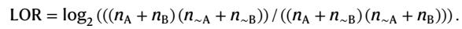
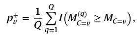
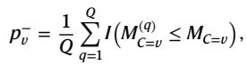
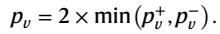

[← 返回 README](../README.md)

# Methods 方法

## 📌 预览

方法四块：队列（4 癌种、6 cohort、8221 例）→ 基因间依赖分析（LOR + Fisher 精确检验）→ WSI 预测流程（CLAM/SlideGraph∞ + 两 encoder + TITAN 单/多输出）→ 分层 + permutation 检验混杂（Fig.8 工作流 + p 值公式）。

---

## Patient cohorts

We analysed data of four cancer types (BRCA, CRC, LUAD, UCEC), sourced from six cohorts: TCGA, METABRIC, COAD-DFCI, MSK-LUAD, CPTAC and ABCTB. Biomarker and gene mutation status (except ABCTB) were collected from cBioportal. For breast tumours, ER, PR and HER2 status were recorded. For colorectal cases, MSI, hypermutation (HM), chromosomal instability (CIN) and CIMP activity statuses were documented. TMB was available for all cases.

## Intergene mutational dependency analysis

We analysed the interdependency between the mutational status of genes using the log odds ratio (LOR):

*LOR 公式：$n_A, n_B$ 为 A/B 阳性数，$n_{\sim A}, n_{\sim B}$ 为阴性数。正 LOR = 共现，负 LOR = 互斥。*

A higher positive LOR indicates mutation co-occurrence, whereas a negative value signifies mutual exclusivity. We statistically assessed interdependence using a two-sided Fisher's exact test, with Benjamini–Hochberg multiple-hypothesis correction (P ≪ 0.05).

> 💡 **公式批读**（LOR 为何是对的工具）（Hao 批注）：LOR = log odds ratio，衡量"A 阳性时 B 也阳性"相对"独立"的偏离。>0 共现、<0 互斥、=0 独立。配 Fisher 精确检验（小样本稳健）+ BH 校正（控 FDR，因为要检验大量基因对）。这套是基因功能分析的成熟工具（借自 [20,21]），本文把它用来**量化 biomarker 依赖结构**，作为后续判断"哪些变量该当混杂"的依据。

## Prediction of biomarkers from WSI

Predictive pipeline: (1) preprocess WSIs (U-Net tissue segmentation via TIAToolbox, exclude pen-marking/folding artefacts; extract 512×512 and 1024×1024 patches at 0.50 microns-per-pixel, keep patches with >40% viable tissue); (2) embed patches (ShuffleNet-ImageNet 1024-dim from 512px patches; CTransPath self-supervised 768-dim from 1024px patches); (3) predict with SlideGraph∞ (graph over WSI) and CLAM (bag over WSIs). Also TITAN (multimodal FM trained on 330,000+ WSI-report pairs): single-output (logistic regression) and multi-output (MLP with pairwise ranking loss). Trained with 4-fold CV (75/25 splits), 300 epochs, batch 8, lr 0.001, Adam, early stopping on validation.

> 💡 **方法论批读**（三范式 × 两 encoder = 排除"实现细节"反驳）（Hao 批注）：作者刻意用**注意力（CLAM）、图（SlideGraph）、基础模型（TITAN）三种范式** × **ImageNet/病理 SSL 两种 encoder**，就是为堵住"你的结论只对某个模型/特征成立"这条退路。结果三范式都被同一混杂问题击中 → 结论的普适性大增。这是批判性论文提升说服力的标准做法。

## Stratification analysis and permutation testing

*Fig. 8: 分层 + permutation 检验混杂的工作流。输入 (Z 预测分, Y 真标签, C 混杂变量)；step1 算各分层 AUROC；step2 打乱 C 得零分布；step3 比较观测 AUROC 与零分布得 p 值。*

Let $D = \{(Z_i, Y_i, C_i)\}$ where $Z_i$ is the model score, $Y_i \in \{0,1\}$ the prediction variable, $C_i$ the stratification variable. For each subgroup $v$, compute foreground metric $M_{C=v} = \text{AUROC}(\{(Z_i, Y_i) | C_i = v\})$. Run $Q=10{,}000$ permutations shuffling C (preserving Z-Y correspondence) to build a null distribution, then compute a two-sided P value:

*permutation p 值：$p_v^+$ 上尾、$p_v^-$ 下尾、$p_v = 2\min(p_v^+, p_v^-)$。低 $p_v$ 说明模型预测受混杂变量 C 影响（依赖 proxy 而非目标 biomarker）。*

We examined three bias factors: (1) interdependency among biomarkers; (2) histological grade; (3) TMB (computed excluding the gene of interest, TMB_voi, threshold 10 mutations/megabase for low/high). All P values corrected via Benjamini–Hochberg (FDR < 0.05).

> 💡 **公式批读 + 机制拆解**（permutation 检验的逻辑）（Hao 批注）：这套检验的精髓——**零假设 = "模型分数 Z 与混杂变量 C 无关"**。做法：保持 (Z,Y) 配对不动，只打乱 C 的分配 10,000 次 → 得到"若 C 与预测无关时，各分层 AUROC 该长什么样"的零分布。若观测的分层 AUROC 落在零分布尾部（$p_v$ 小），说明**C 确实影响了模型预测** = 模型在用 C 当 proxy。
> - **TMB_voi 的巧思**：算 TMB 时**排除目标基因本身**，避免"用目标基因的突变去预测目标基因"的循环 → 干净地检验"其他基因的突变密度"是否混杂。
> - **对 ReadySlide 可复用**：这套 (Z, Y, C) + permutation 协议是现成的 shortcut 检验器。把 C 换成"压缩策略/码率/中心/扫描仪"，就能检验压缩方法是否引入了 codec-signature 类 shortcut（呼应 memory 里 codec-policy 那条已 STOP 的探索——本文提供了更严格的统计检验框架）。

## Baseline predictors based on histology grade

To assess predictability from grade, we used a linear SVM with one-hot encoded histological grade to predict biomarker status, following the same protocols. This grade-only baseline quantifies the "added value" of ML models over what a pathologist's grade already provides.

> 💡 **方法论批读**（grade 基线 = 最朴素但最有力的对照）（Hao 批注）：用一个只吃 one-hot grade 的 SVM 当基线，是本文最锋利的一刀——它直接量化"ML 相对病理医生已有信息的增量"。若复杂 WSI 模型只比 grade-SVM 高一点点（如 TP53：0.81 vs 0.75），那"替代分子检测"的价值主张就站不住。**这个基线值得所有 WSI 预测研究标配**，包括压缩研究应报"压缩后模型 vs grade 基线"的增量。
