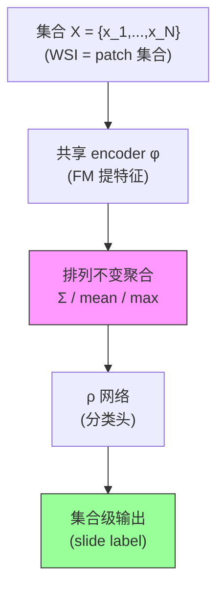

# Deep Sets (MeanPool 的理论根据)

**作者**: Manzil Zaheer, Satwik Kottur, Siamak Ravanbhakhsh, Barnabás Póczos, Ruslan Salakhutdinov, Alexander J. Smola（CMU & Amazon）
**会议**: NeurIPS 2017 | **年份**: 2017（arXiv 1703.06114）
**链接**: [arXiv](https://arxiv.org/abs/1703.06114)

## 一句话总结

证明**任何排列不变的集合函数都能分解为 $\rho\left(\sum_{x\in X}\phi(x)\right)$**（Theorem 2，充要条件），并给出排列等变层的参数共享形式（Lemma 3）——这是 WSI MIL 里 **MeanPool / SumPool baseline 的理论身份证**：`patch → φ(FM 特征) → Σ/mean → ρ(分类头)` 是集合函数族里最简的合法实例。

## 核心贡献

1. **通用性定理（Theorem 2）**：排列不变集合函数 ⟺ $\rho(\sum\phi)$ 形式；关联 de Finetti 定理、核方法、谱方法。
2. **等变层（Lemma 3）**：排列等变神经层 ⟺ $\Theta=\lambda I+\gamma\mathbf{11}^T$（个体变换 + 全局共享）。
3. **DeepSets 架构**：共享 encoder $\phi$ + 求和聚合 + $\rho$，天然处理变长输入。
4. **广泛验证**：population statistics、sum-of-digits（变长泛化超 RNN）、点云分类、红移估计、异常检测、集合扩展。

## 📖 批读导航

| Section | 内容 |
|---------|------|
| [00 - Abstract](sections/00-abstract.md) | 摘要 + 为何是 MeanPool 的理论根据 + invariance/equivariance |
| [01 - Introduction & Theory](sections/01-introduction.md) | 变长输入、Theorem 2（MIL 宪法）、Lemma 3、de Finetti 联系 |
| [02 - Architecture & Experiments](sections/02-method-and-experiments.md) | 不变/等变模型、sum/mean/max 取舍、点云/变长泛化、对 baseline set 定位 |

## 关键数字

| 指标 | 数值 |
|------|------|
| 核心定理 | 不变集合函数 = $\rho(\sum_{x}\phi(x))$（充要） |
| 等变层 | $\Theta=\lambda I+\gamma\mathbf{11}^T$ |
| 变长泛化 | 训练 ≤10 元素、测试到 100（超 LSTM/GRU） |
| 点云 | ModelNet40 90%（5000×3 点） |

## 数据流：输入 → 中间表示 → 输出

## 优缺点与还能做什么

### 优点
- **理论奠基**：给出集合函数的充要形式，是所有排列不变 MIL 聚合器的理论框架。
- **变长鲁棒**：对集合大小泛化天然优于序列模型（对 WSI 的变长 patch 数关键）。
- **简单通用**：共享 encoder + 求和，跨领域（点云/统计/集合扩展）都有效。

### 局限 / 风险
- **求和聚合信息有限**：$\sum\phi$ 是"民主平均"，难自适应突出少数关键 instance（→ ABMIL 的注意力、MIL 的各种加权是对此的推广）。
- **可交换性假设**：假设元素顺序无关；若集合有内在结构（空间/序列），纯求和会丢失（→ TransMIL 位置编码、MambaMIL reordering 在补这个）。
- **理论 vs 实践 gap**：Theorem 2 保证存在 $\phi,\rho$，但不保证易学到；复杂集合可能需很宽的 $\phi$。

### 还能做什么（对本课题）
- **MeanPool sanity control 的理论背书**：新 MIL 方法必须显著超过 FM+MeanPool，否则增益来自 FM 特征而非聚合。
- **理解聚合器谱系**：ABMIL/TransMIL/Mamba/RetMIL 都是 $\rho(\sum\phi)$ 的更复杂参数化——增益 = 比最简形式多学到的（自适应权重/实例相关/长上下文）。
- **可交换性作为设计原则**：依赖 patch 顺序的方法（Mamba 扫描）与可交换性有张力，需显式处理（reordering）。

## 阅读 Q&A 记录

- **Q: DeepSets 为什么放进 WSI MIL baseline set？**
  A: 它是 MeanPool 这个 sanity control 的理论出处。Theorem 2 证明 MeanPool（`FM → mean → 线性头`）是集合函数族里最简合法实例，不是随手的弱基线——所以它在强 FM 下往往出奇地强。

- **Q: 所有 MIL 聚合器都逃不出这个框架吗？**
  A: 排列不变的都逃不出 $\rho(\sum\phi)$ 族（Theorem 2 是充要）。ABMIL/TransMIL/Mamba 是更复杂的参数化，增益必须解释为"比最简 $\sum\phi$ 多学到什么"。

- **Q: sum / mean / max 怎么选？**
  A: sum 严格符合定理但对 N 敏感；mean 对 N 鲁棒（WSI patch 数差异大→MeanPool 用它）；max 适合稀疏关键信号（Eq.4 变体）。三者都在函数族内，选择看信号稀疏度和 N 分布。

- **Q: WSI 该用集合还是序列建模？**
  A: 组织切片无内在 patch 顺序（可交换性成立），集合函数变长泛化更好。序列模型（Mamba/RNN）需赌"顺序含信息"或显式处理（reordering/位置编码），否则违背可交换性。

## 📊 Citation Landscape

> Semantic Scholar 采集限流，据论文自身与领域关联整理。Deep Sets 是被引上万次的奠基工作。

**理论关联**
- de Finetti 定理（可交换性）、Representer 定理 / 核方法、谱方法——Theorem 2 的跨领域联系。
- PointNet（Qi et al., CVPR 2017）——同期点云集合学习，与 DeepSets 互为印证。

**在 WSI MIL 中的下游**
- ABMIL（Ilse et al., ICML 2018）——注意力加权推广了 DeepSets 的求和聚合，本 topic 已批读。
- 本 topic 所有 MIL 聚合器（[TransMIL](../%5BNeurIPS%202021%5D%20TransMIL/)/[MambaMIL](../%5BMICCAI%202024%5D%20MambaMIL/)/[RetMIL](../%5BMICCAI%202024%5D%20RetMIL/)/[PAMoE](../%5BCVPR%202025%5D%20PAMoE/)/[GMMamba](../%5BICCV%202025%5D%20GMMamba/)/[MAMMOTH](../%5BICLR%202026%5D%20MAMMOTH/)）都是此框架内的不同参数化。
- [SiMLP](../../ckmil-re-attn-mil/)、[EAGLE](../%5BNat%20Commun%202026%5D%20DL-Efficient-Pathology/)——实证 mean/简单聚合在强 FM 下的强度。
