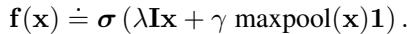

[← 返回 README](../README.md)

# 1-2. Introduction & Permutation Invariance/Equivariance 引言与排列不变/等变理论

## 📌 预览

引言把机器学习从"固定维向量"推广到"集合"输入，分监督（集合→标签，不变）、无监督（学集合结构）、transductive（每元素一标签，等变）三种范式。第 2 节是全文理论核心：Theorem 2（不变函数 = $\rho(\sum\phi)$）、Lemma 3（等变层的参数共享形式），并联系 de Finetti 定理、核方法、谱方法。

---

## 1 Introduction

A typical machine learning algorithm is designed for fixed dimensional data instances. Their extensions to handle the case when the inputs or outputs are permutation invariant sets rather than fixed dimensional vectors is not trivial. In this paper, we present a generic framework to deal with the setting where input and possibly output instances in a machine learning task are sets.

Main contributions: (i) we propose a fundamental architecture, DeepSets, to deal with sets as inputs and show that the properties of this architecture are both necessary and sufficient; (ii) we extend this architecture to allow for conditioning on arbitrary objects; (iii) we develop a deep network that can operate on sets with possibly different sizes; (iv) we demonstrate the wide applicability of our framework.

> 💡 **机制拆解（为何"变长输入"对 WSI 天然合适）**（Hao 批注）：集合框架的一个关键红利——**天然处理变长输入**。每张 WSI 的 patch 数 $N$ 都不同（几千到几万），固定维向量模型处理不了，但集合函数 $\rho(\sum_{x}\phi(x))$ 对任意 $N$ 都成立（求和/平均自动归一）。这就是为什么所有 MIL 方法本质都在集合框架内——WSI = 变长 patch 集合是 MIL 的根本设定。

## 2 Permutation Invariance and Equivariance

**Property 1**: A function $f$ acting on sets must be permutation invariant: $f(\{x_1,\ldots,x_M\}) = f(\{x_{\pi(1)},\ldots,x_{\pi(M)}\})$ for any permutation $\pi$.

**Theorem 2**: A function $f(X)$ operating on a set $X$ (elements from a countable universe) is a valid set function (invariant to permutation) **iff** it can be decomposed as $\rho\left(\sum_{x\in X}\phi(x)\right)$ for suitable transformations $\phi$ and $\rho$.

> 💡 **公式批读（Theorem 2 = MIL 的宪法）**（Hao 批注）：这是全文最重要的定理，也是所有 MIL 聚合器的"宪法"。**"iff"（充要条件）** 很关键——它说：不是"$\rho(\sum\phi)$ 恰好排列不变"，而是"**所有**排列不变函数**必须**长这样"。含义：
> - **MeanPool**：$\phi$=FM 特征、$\rho$=线性头、聚合=mean（=归一化的 sum）→ 最朴素实例。
> - **ABMIL**：注意力加权 $\sum a_n h_n$ 也是这个形式的推广（$a_n$ 依赖整个集合，稍超出严格 $\sum\phi$ 但仍不变）。
> - **含义**：任何 MIL 聚合器（TransMIL/Mamba/RetMIL）都在这个函数族内，区别只在**如何参数化 $\phi$、聚合、$\rho$**。所以问"复杂聚合器比 MeanPool 强多少"= 问"在集合函数族内，比最简参数化多学到多少"。

**Lemma 3**: A neural layer $\mathbf{f}_\Theta(\mathbf{x})=\sigma(\Theta\mathbf{x})$ is permutation equivariant **iff** $\Theta = \lambda\mathbf{I} + \gamma(\mathbf{11}^T)$, $\lambda,\gamma\in\mathbb{R}$ (all diagonal elements equal, all off-diagonal tied).

*Eq. (4): 等变层变体 $\mathbf{f}(\mathbf{x}) = \sigma(\lambda\mathbf{I}\mathbf{x} + \gamma\,\text{maxpool}(\mathbf{x})\mathbf{1})$。*

> 💡 **公式批读（Lemma 3 + Eq.4：等变层为何是"个体 + 全局"）**（Hao 批注）：等变层的参数矩阵被限制成 $\lambda I + \gamma\mathbf{11}^T$——直觉是**"每个元素自己的变换（$\lambda I$）+ 全集合的共享信息（$\gamma\mathbf{11}^T$=对所有元素求和）"**。Eq.4 的变体把 sum 换成 maxpool 效果更好（max-normalized 输入）。**对 MIL 的启示**：好的 instance-level 处理 = 个体特征 + 全局上下文的线性组合——这正是后续 TransMIL（self-attention 提供全局上下文）、PAMoE（路由提供全局分组）等方法在做的事，只是把 $\gamma\mathbf{11}^T$ 的"均匀全局"换成了"学习的、内容自适应的全局"。

### 2.3 Related Results

**de Finetti theorem**: any exchangeable model factors as $p(X|\alpha,M_0)=\int d\theta[\prod_m p(x_m|\theta)]p(\theta|\alpha,M_0)$. For exponential families with conjugate priors, marginalizing $\theta$ gives a form matching Theorem 2. **Kernel machines / spectral methods** also fit the $\rho\circ\phi(X)$ structure.

> 💡 **理论联系解读**（Hao 批注）：作者把 Theorem 2 联系到贝叶斯统计的可交换性（de Finetti）、核方法、谱方法——说明"对集合元素求和/平均再变换"是一个**跨领域反复出现的正确结构**，不是深度学习的偶然。对 WSI 的启示：MeanPool 的有效性有深厚理论根基（可交换性假设 = patch 顺序无关，正是 WSI 的合理假设——组织没有内在的 patch 排列顺序）。这也提醒：如果一个 MIL 方法依赖 patch **顺序**（如某些 Mamba 变体的扫描顺序），它其实在赌"顺序含信息"，与可交换性假设有张力（MambaMIL 的 sequence reordering 正是在处理这个张力）。
