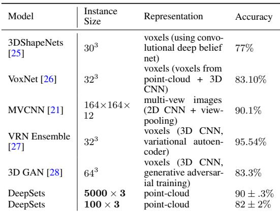

[← 返回 README](../README.md)

# 3. Deep Sets Architecture 架构

## 📌 预览

DeepSets 架构直接落地 Theorem 2：**不变模型**——每个元素过 $\phi$、相加、再过 $\rho$（可选条件 $z$）；**等变模型**——按 Lemma 3 堆叠 $\sigma(\lambda I x + \gamma\,\text{pool}(x)\mathbf{1})$ 层。参数共享是关键：整个集合共用一套 $\phi$，天然处理变长输入。

---

## 3.1 Architecture

**Invariant model** — The structure of permutation invariant functions in Theorem 2 hints at a general strategy, DeepSets:
- Each instance $x_m$ is transformed (possibly by several layers) into a representation $\phi(x_m)$.
- The representations $\phi(x_m)$ are **added up** and the output is processed using the $\rho$ network (fully connected layers, nonlinearities, etc.).
- Optionally: with additional meta-information $z$, the networks can be conditioned to obtain $\phi(x_m|z)$.

In other words, the key is to add up all representations and then apply nonlinear transformations.

**Equivariant model** — Based on Lemma 3, a layer $\mathbf{f}_\Theta(\mathbf{x})$ is permutation equivariant iff $\Theta=\lambda\mathbf{I}+\gamma(\mathbf{11}^T)$. This is a nonlinearity applied to a weighted combination of (i) its input $\mathbf{Ix}$ and (ii) the sum of input values $(\mathbf{11}^T)\mathbf{x}$. Since summation is permutation-independent, the layer is equivariant. A variant uses maxpool (Eq. 4). Composition of equivariant functions is equivariant, so we build DeepSets by stacking such layers.

> 💡 **机制拆解（参数共享 = MIL 的 patch encoder 共享）**（Hao 批注）：不变模型的三步 `φ → sum → ρ` 里，**参数共享**是核心——整个集合用**同一套** $\phi$（不是每个位置一套参数）。映射到 WSI MIL：**所有 patch 共享同一个 FM encoder $\phi$**，这正是为什么 FM 特征可以离线一次性提取、然后任意聚合。DeepSets 从理论上保证了"共享 encoder + 求和聚合"既是必要也是充分的——所以 FM-era MIL 的标准范式（冻结 FM 提特征 + 轻量聚合器）不是工程妥协，而是集合函数的正确结构。

> 💡 **公式批读（sum vs mean vs max 的取舍）**（Hao 批注）：Theorem 2 用 **sum**，但实践中 mean（归一化 sum）和 max 都常用：
> - **sum**：严格符合定理，但对集合大小 $N$ 敏感（WSI patch 数差异大 → sum 量级漂移）。
> - **mean**：sum 归一化，对 $N$ 鲁棒 → **WSI MIL 的 MeanPool 用这个**，适合 patch 数变化大的场景。
> - **max**：Eq.4 变体，作者说某些应用更好（max-normalized 输入）→ 对应 MaxPool，适合"少数关键 instance 决定 bag"的稀疏信号（但 [ACMIL](../%5BECCV%202024%5D%20ACMIL/) 显示 max 在 SSL 特征上有时反优于 mean，取决于信号稀疏度）。
> 三者都在 Theorem 2 的函数族内，选择取决于信号的稀疏性与 $N$ 的分布。

## 4. Applications (选摘)

DeepSets is applied to: population statistic estimation (entropy/MI of Gaussians, beating Support Distribution Machines at high dim), sum-of-digits (generalizes better than LSTM/GRU — trained on length ≤10, tested up to 100), point-cloud classification (ModelNet40, 90% with 5000 points, competitive with voxel/multi-view CNNs), red-shift estimation with clustering, outlier detection (equivariant variant), and set expansion (concept-set retrieval, image tagging).

*Table 1: ModelNet40 点云分类。DeepSets 用 5000×3 点云达 90%，与体素/多视角 CNN 竞争，但表示更紧凑。*

> 💡 **实验解读（对 WSI 最相关的两个发现）**（Hao 批注）：DeepSets 的应用五花八门，但两个发现对 WSI MIL 有直接启示：
> 1. **变长泛化**（sum-of-digits）：训练用 ≤10 个元素、测试到 100 个仍好，远超 LSTM/GRU。**含义**：集合函数（求和聚合）对集合大小的泛化天然优于序列模型（RNN）。这对 WSI（训练/测试 patch 数差异大）是关键优势，也暗示**把 WSI patch 当"序列"（如某些 Mamba/Transformer 的顺序建模）可能损失这种变长泛化性**——除非显式处理（MambaMIL 的 sequence reordering、TransMIL 的 PPEG）。
> 2. **点云分类**（ModelNet40）：点云 = 3D 点的集合，和 WSI = patch 的集合同构。DeepSets 用简单求和聚合就达 90%——再次印证"集合函数 + 共享 encoder"的威力。

## 5 Conclusion（要点）

DeepSets provides: (i) a universality result (Theorem 2) characterizing all permutation-invariant set functions as $\rho(\sum\phi)$, relating DeepSets to de Finetti / kernel / spectral methods; (ii) the permutation-equivariant layer (Lemma 3) identifying necessary & sufficient parameter-sharing; (iii) diverse applications.

> 💡 **总结 + 对 WSI MIL baseline set 的定位**（Hao 批注）：DeepSets 在这个 baseline set 里的角色是**MeanPool 的理论身份证**。它告诉我们：
> - **MeanPool 不是"没方法的弱基线"**，而是集合函数族里最简的合法实例——所以它在强 FM 特征下能打（[SiMLP](../../ckmil-re-attn-mil/)、[EAGLE](../%5BNat%20Commun%202026%5D%20DL-Efficient-Pathology/) 都验证了简单聚合的强度）。
> - **所有 MIL 聚合器（ABMIL/TransMIL/Mamba/RetMIL）都是 Theorem 2 的更复杂参数化**——它们的增益必须解释为"比 $\rho(\sum\phi)$ 的最简形式多学到什么"（如 ABMIL 的自适应权重、TransMIL 的实例相关性）。
> - **对 ReadySlide/CKMIL 的论证价值**：把 MeanPool 作为 sanity control 有坚实理论依据——**如果新方法超不过 FM+MeanPool，说明增益来自 FM 特征而非聚合设计**。这正是 baseline set 文档里 MeanPool "必须保留"的深层原因。

> 💡 **Q&A 批注记录**（Hao 批注）：
> - Q：DeepSets 和 MIL 是什么关系？
> - A：MIL 是集合函数学习的一个特例（bag=集合、instance=元素、bag label=集合标签）。DeepSets 提供了 MIL 聚合的理论框架：所有排列不变 MIL 聚合器 ⊆ $\rho(\sum\phi)$ 族。ABMIL/TransMIL 等是在此框架内的不同参数化。
> - Q：为什么 WSI 适合用集合而非序列建模？
> - A：组织切片没有内在的 patch 排列顺序（可交换性成立），集合函数对变长输入泛化更好。序列模型（RNN/Mamba）需赌"顺序含信息"或显式处理顺序（reordering/位置编码），否则违背可交换性。
