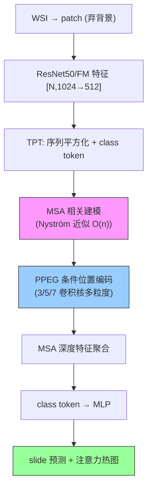

# TransMIL: Transformer based Correlated Multiple Instance Learning for WSI Classification

**作者**: Zhuchen Shao, Hao Bian, Yang Chen, Yifeng Wang, Jian Zhang, Xiangyang Ji, Yongbing Zhang（清华深研院 / 哈工大深圳 / 北大 / 清华自动化）
**会议**: NeurIPS 2021 | **年份**: 2021（arXiv 2106.00908）
**链接**: [arXiv](https://arxiv.org/abs/2106.00908) · [Code](https://github.com/szc19990412/TransMIL)

## 一句话总结

打破现有 MIL 的 i.i.d. 假设，提出 **correlated MIL 框架**（含收敛证明 + 信息熵优势），用 **Transformer self-attention 建模 instance 两两相关**（morphological + spatial），配 Nyström 近似（$O(n^2)\to O(n)$）+ PPEG 多粒度条件位置编码，在 3 个病理数据集全面超越 pooling/ABMIL/DSMIL/CLAM。

## 核心贡献

1. **correlated MIL 框架**：Theorem 1（连续集合函数逼近）+ Theorem 2（相关性假设信息熵更小 → 更少不确定性），理论论证建模 instance 相关性有收益。
2. **Pooling Matrix 统一视角**：Max/Mean/ABMIL 的 P 是对角阵（i.i.d.），self-attention 的 P 有非对角元素（correlated）。
3. **TPT 模块**：2 层 Transformer + PPEG；Nyström 近似降复杂度、序列平方化 + PPEG（3/5/7 卷积核）多粒度空间编码。
4. **SOTA + 快收敛**：CAMELYON16 93.09% / NSCLC 96.03% / RCC 98.82% AUC，2-3× 更快收敛，注意力热图可解释。

## 📖 批读导航

| Section | 内容 |
|---------|------|
| [00 - Abstract](sections/00-abstract.md) | 摘要 + i.i.d. 假设破除 + 三技术支点 |
| [01 - Introduction & Related Work](sections/01-introduction.md) | Fig.1 i.i.d. vs correlated、MIL 两类、self-attention 发展 |
| [02 - Method](sections/02-method.md) | Theorem 1/2、Fig.2 Pooling Matrix 视角、TPT/Nyström/PPEG |
| [03 - Experiments & Conclusion](sections/03-experiments-conclusion.md) | Table 1 主结果、Table 2 PPEG 消融、可解释性、快收敛、baseline 定位 |

## 关键数字

| 指标 | 数值 |
|------|------|
| 数据集 | CAMELYON16（~8800 patch/bag，阳性<10%）/ TCGA-NSCLC（~15371）/ TCGA-RCC（3 亚型不平衡） |
| Backbone | ResNet50-ImageNet 1024→512 |
| 主结果 AUC | CAMELYON16 0.9309 / NSCLC 0.9603 / RCC 0.9882（均最优） |
| 领先幅度 | CAMELYON16 +5%（稀疏阳性最大）、NSCLC +1.4% |
| PPEG 消融 | 无编码 0.8416 → PPEG 0.9309（+8.9pp） |
| 复杂度 | Nyström 近似 $O(n^2)\to O(n)$；参数 ~2.67M |
| 收敛 | 比 ABMIL/DSMIL/CLAM 快 2-3× |

## 数据流：输入 → 中间表示 → 输出

## 优缺点与还能做什么

### 优点
- **建模 instance 相关性**（correlated MIL），有理论（信息熵）+ 实证支撑，稀疏阳性任务收益最大（+5%）。
- **Pooling Matrix 统一视角**：优雅地把所有聚合器谱系化。
- **高效可上 WSI**：Nyström 近似让 self-attention 能处理上万 patch。
- **快收敛 + 可解释**：2-3× 更快，热图对齐标注。

### 局限 / 风险
- **效率靠近似**：Nyström 有近似误差，未对比精确 vs 近似精度（精确版 OOM）。
- **序列平方化 + PPEG 是工程技巧**：把无序 patch 临时当 2D 图，空间编码的合理性依赖 patch 布局。
- **高倍率挑战**：作者承认更高倍率 → 更长序列 → 更大计算/内存压力（未解决）。

### 还能做什么（对本课题）
- **FM-era 必比 contextual baseline**：换 UNI2/Virchow2 特征后，TransMIL 是"self-attention 相关建模"的强对照。
- **Pooling Matrix 定位新方法**：CKMIL/新方法的 P 长什么样（对角？稀疏？低秩？）——这个视角很有用。
- **与 MambaMIL/RetMIL 三方对比**：近似 self-attention vs SSM vs retention，三种长序列聚合路线的 Pareto。

## 阅读 Q&A 记录

- **Q: TransMIL 相对 ABMIL 的本质区别？**
  A: ABMIL 独立给每个 instance 打分（Pooling Matrix 是对角阵，i.i.d.）；TransMIL 用 self-attention 建模 instance 两两相关（Pooling Matrix 有非对角元素，correlated）。理论上（Theorem 2）相关性降低信息熵。

- **Q: 为什么 TransMIL 在 CAMELYON16 领先最多？**
  A: CAMELYON16 阳性区 <10%，判断需综合大量分散区域的关联——self-attention 的两两相关正好擅长；阳性区大的任务（NSCLC/RCC >80%）简单聚合就够，相关建模增量小。相关建模价值任务依赖。

- **Q: Nyström 近似是什么，为何需要？**
  A: 标准 self-attention $O(n^2)$ 对 WSI（8000+ patch）会 OOM。Nyström 用 m 个 landmark token 近似完整 attention 矩阵，降到 $O(n)$。代价是近似误差，但让 Transformer 能上 WSI。

- **Q: 能在冻结 FM 特征上跑吗？**
  A: 能，embedding-level MIL，输入是 patch 特征序列。换 FM 只需改特征维度，PPEG 的 squaring 对任意 patch 数适用。

## 📊 Citation Landscape

> Semantic Scholar 采集限流，据论文自身引用整理。TransMIL 是 WSI MIL 高被引经典。

**同主题最相关**
- ABMIL（Ilse et al., ICML 2018）——i.i.d. attention 前辈，本 topic 已批读；[DeepSets](../%5BNeurIPS%202017%5D%20DeepSets/)——集合函数理论根据。
- DSMIL（Li et al., CVPR 2021）、CLAM（Lu et al., Nat BME 2021）——对比的注意力 MIL。
- [MambaMIL](../%5BMICCAI%202024%5D%20MambaMIL/)/[RetMIL](../%5BMICCAI%202024%5D%20RetMIL/)——长序列聚合的另两条路线（SSM / retention），与 TransMIL 的 Nyström-attention 三方对比。
- [GMMamba](../%5BICCV%202025%5D%20GMMamba/)/[PAMoE](../%5BCVPR%202025%5D%20PAMoE/)——官方提供 TransMIL integration，把 TransMIL 当骨架。

**方法来源**
- Transformer（Vaswani et al., NeurIPS 2017）、ViT（Dosovitskiy et al., ICLR 2021）；Nyströmformer（Xiong et al., AAAI 2021）——高效近似；CPVT（Chu et al.）——条件位置编码灵感。
