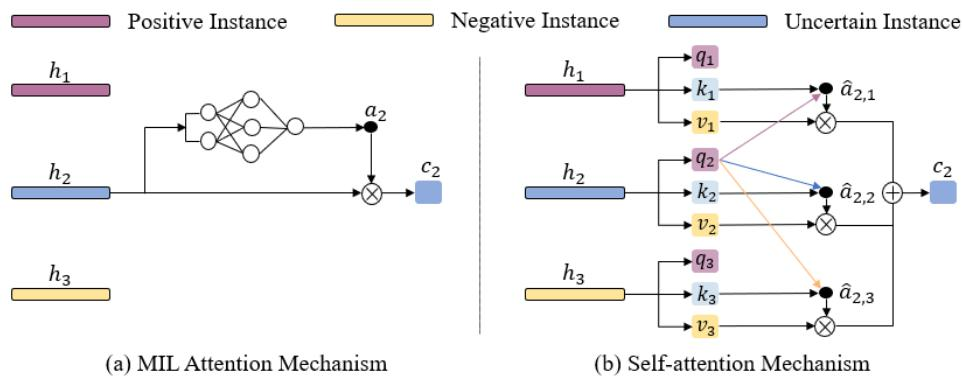

[← 返回 README](../README.md)

# 1-2. Introduction & Related Work 引言与相关工作

## 📌 预览

引言指出现有 MIL（pooling / bypass attention）都基于 i.i.d. 假设、忽略 instance 相关性，而病理学家诊断依赖上下文与区域间关联。Transformer 的 self-attention 能建模 token 两两相关，但标准 Transformer $O(n^2)$ 只能处理 <1000 的短序列，不适合 WSI。相关工作分 MIL 两类（instance-level / embedding-level）与 attention/self-attention 发展。

---

## 1 Introduction

The advent of whole slide image (WSI) scanners provides a good opportunity for deep learning in digital pathology. However, deep learning based biopsy diagnosis in WSI has to face great challenges due to the huge size and the lack of pixel-level annotations. To address this, multiple instance learning (MIL) is usually adopted as a weakly supervised learning problem.

In deep learning based MIL, one straightforward idea is to perform pooling on instance feature embeddings extracted by CNN. Ilse et al. proposed an attention based aggregation operator (ABMIL), giving each instance additional contribution information through trainable attention weights. Li et al. introduced non-local attention (DSMIL). However, all these methods are based on the assumption that all instances in each bag are **independent and identically distributed (i.i.d.)**. While achieving some improvements, this i.i.d. assumption was not entirely valid in many cases. Actually, pathologists often consider both the contextual information around a single area and the correlation information between different areas when making a diagnostic decision.

*Figure 1: 决策过程对比。MIL Attention Mechanism：遵循 i.i.d. 假设；Self-attention Mechanism：在 correlated MIL 框架下（关注 token 间两两相关）。*

> 💡 **Figure 1 批读（i.i.d. attention vs correlated self-attention）**（Hao 批注）：这张图点破 ABMIL 与 TransMIL 的本质区别。**ABMIL 的 bypass attention**：每个 instance 独立算一个权重 $a_n$（只看自己），聚合时 instance 间无交互 → i.i.d.。**self-attention**：每个 instance 的表示由它与**所有其他 instance** 的两两相关决定 → correlated。这正是后文 Fig.2 用 "Pooling Matrix P" 统一表达的——ABMIL 的 P 是对角阵（无 instance 交互），self-attention 的 P 有非对角元素（instance 相关）。

At present, Transformer is widely used due to its strong ability of describing correlation between different tokens as well as modelling long distance information. However, traditional Transformer sequences are limited by their computational complexity and can only tackle shorter sequences (e.g., less than 1000). Therefore, it is not suitable for large size images such as WSIs. To address these challenges, we proposed a correlated MIL framework, including the convergence proof and a generic three-step algorithm, and devised TransMIL to explore both morphological and spatial information.

> 💡 **机制拆解（为何需要 correlated MIL）**（Hao 批注）：作者的动机链——(1) i.i.d. 假设不符合病理诊断实际（区域间有关联）；(2) Transformer 能建模相关但 $O(n^2)$ 对 WSI（8000+ patch）不可行。所以贡献 = correlated MIL 理论框架 + 高效 Transformer 实现（Nyström + PPEG）。这解释了 TransMIL 不是简单的"ViT for WSI",而是"让 self-attention 在超长 patch 序列上可行且有理论支撑"。

## 2 Related Work

**2.1 MIL in WSI classification** — divided into: **instance-level** (CNN trained with pseudo-labels from bag-label, then top-k instances aggregated; needs many WSIs since only few instances participate) and **embedding-level** (each patch → fixed-length embedding, then aggregated by operators e.g. max-pooling; MIL-attention adds trainable weights; feature clustering uses centroids; non-local attention relates highest-score instance to others).

**2.2 Attention and Self-attention** — Attention initially for machine translation, then to vision (channel/spatial weights). Transformer (Vaswani et al.) is the typical self-attention framework. This paper, for the first time, proposes a Transformer based WSI classification comprehensively considering correlations among instances.

> 💡 **相关工作定位**（Hao 批注）：TransMIL 归到 **embedding-level MIL**（冻结特征 + 聚合器），这也是 FM-era 的主流范式，所以 TransMIL 能直接在冻结 FM 特征 [N,D] 上跑。它相对 embedding-level 前辈（ABMIL/DSMIL）的创新点：ABMIL 是"独立打分"、DSMIL 是"只关联最高分 instance 与其他"，而 TransMIL 是"**所有 instance 两两相关**"（全 self-attention）。这个"全相关"是更彻底的 contextual modeling，也是它在 CAMELYON16（阳性区 <10%、需综合大量负区判断）上大幅超越的原因。
