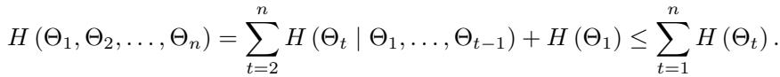
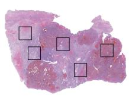
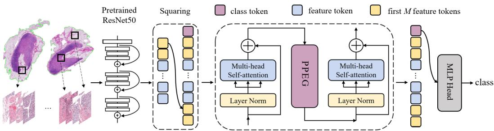
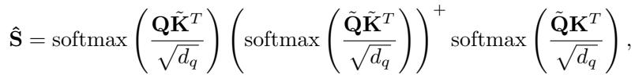
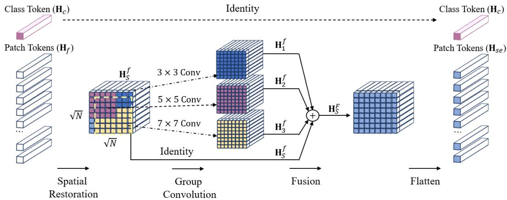

[← 返回 README](../README.md)

# 3. Method 方法

## 📌 预览

方法两部分：**(3.1) correlated MIL 理论**——Theorem 1（连续集合函数可被 $g(P\{\sigma(x)\})$ 任意逼近）、Inference（morphological $f$ + spatial $h$ 分解形式）、Theorem 2（相关性假设的信息熵更小 → 更少不确定性）、通用三步算法（提取 $f/h$ → Pooling Matrix P 聚合 → $g$ 输出）；**(3.2-3.3) TransMIL 实现**——TPT 模块（squaring + MSA 相关建模 + PPEG 位置编码 + 深度聚合）、Nyström 近似降 $O(n^2)\to O(n)$、PPEG 多粒度卷积位置编码。

---

## 3.1 Correlated Multiple Instance Learning

Binary MIL: predict $Y_i \in \{0,1\}$ given a bag $\mathbf{X}_i = \{x_{i,1},\ldots,x_{i,n}\}$ that exhibit **both dependency and ordering** among each other. $\hat{Y}_i = S(\mathbf{X}_i)$ where $S$ is a scoring function.

**Theorem 1**: A Hausdorff continuous set function $S(\mathbf{X})$ can be arbitrarily approximated by a function in the form $g\left(P\{\sigma(x): x\in\mathbf{X}\}\right)$.

**Inference**: $S(\mathbf{X})$ can be arbitrarily approximated by $g\left(P\{f(x)+h(x): x\in\mathbf{X}\}\right)$ — i.e. decompose into **morphological** $f$ + **spatial** $h$.

*Theorem 2: 相关性假设下的信息熵 $H(\Theta_1,\ldots,\Theta_n)=\sum_{t=2}^n H(\Theta_t|\Theta_1,\ldots,\Theta_{t-1})+H(\Theta_1) \le \sum_{t=1}^n H(\Theta_t)$（i.i.d. 假设）。*

> 💡 **公式批读（Theorem 2 = correlated MIL 的理论卖点）**（Hao 批注）：这是 TransMIL 论证"为何要建模相关性"的核心。信息论不等式：**相关性假设下的联合熵 ≤ i.i.d. 假设下的熵之和**（因为条件熵 $H(\Theta_t|\Theta_{<t}) \le H(\Theta_t)$——知道其他 instance 会减少当前 instance 的不确定性）。含义：**建模 instance 相关性 = 降低 bag 的不确定性 = 带来更多有用信息**。这给 self-attention 的引入提供了信息论依据，而非纯经验。对比 [DeepSets](../../%5BNeurIPS%202017%5D%20DeepSets/)：DeepSets 证明 $\rho(\sum\phi)$ 是充要（i.i.d. 求和），TransMIL 则论证放松 i.i.d. 到 correlated 有信息增益——两者在集合函数框架内递进。

*Figure 2: 不同 Pooling Matrix P 的差异（5 个 instance，P∈R^{5×5}，对角=自注意力权重、非对角=instance 间相关）。(b) Max-pooling：对角只一个非零；(c) Mean-pooling：对角全相等；(d) MIL Attention：对角可变但仍对角阵；(e) Self-attention：有非对角元素（建模相关）。*

> 💡 **Figure 2 批读（Pooling Matrix 统一视角）**（Hao 批注）：这张图是理解整个 MIL 聚合器谱系的最佳工具——**所有聚合都可写成一个 Pooling Matrix P 作用在 instance 上**：
> - **Max-pool**：P 对角只一个 1（选最高分 instance）；
> - **Mean-pool**：P 对角全 $1/n$（[DeepSets](../../%5BNeurIPS%202017%5D%20DeepSets/) 的求和）；
> - **ABMIL**：P 对角可变（自适应权重）但**仍是对角阵**（无 instance 交互，i.i.d.）；
> - **Self-attention (TransMIL)**：P **有非对角元素**（instance 两两相关）。
>
> 一图说清：从 Max→Mean→ABMIL→TransMIL 是"P 从稀疏对角 → 稠密全矩阵"的演进，对应"i.i.d. → correlated"。这个视角对 CKMIL/新方法定位极有用——你的方法的 P 长什么样？

**Algorithm 1 (generic three-step)**: (1) Extract morphological & spatial info by $f$ and $h$: $\mathbf{X}_{fh} = f(\mathbf{X}_i) + h(\mathbf{X}_i)$; (2) Aggregate by Pooling Matrix P: $\mathbf{X}_P = \mathbf{P}\mathbf{X}_{fh}$; (3) Transform by $g$: $\hat{Y}_i = g(\mathbf{X}_P)$.

## 3.2-3.3 TransMIL Architecture

*Figure 3: TransMIL 总览。WSI 切 patch（弃背景）→ ResNet50 提特征 → TPT 模块：1) 序列平方化；2) 序列相关建模；3) 条件位置编码 + 局部信息融合；4) 深度特征聚合；5) T→Y 映射。*

The TPT module has two Transformer layers and a position encoding layer. **Long Instances Sequence Modelling with TPT** (Algorithm 2): 1) Squaring of sequence (pad to $N=\lceil\sqrt{n}\rceil^2$, concat class token); 2) Correlation modelling via MSA; 3) Conditional position encoding via PPEG; 4) Deep feature aggregation via MSA; 5) MLP on class token.

To handle $O(n^2)$ complexity, TPT adopts the **Nyström Method**:

*Eq. (9): Nyström 近似自注意力——用 m 个 landmark 近似，复杂度从 $O(n^2)$ 降到 $O(n)$。*

**PPEG (Pyramid Position Encoding Generator)**: patch tokens reshaped to 2-D, encoded by different-sized conv kernels ($k=3,5,7$) with zero-padding (provides absolute position info), fused, flattened back.

*Figure 4: PPEG。序列拆 patch token / class token → patch token reshape 到 2D → 不同大小卷积核编码空间信息 → 融合 → flatten 回序列 → 接回 class token。*

> 💡 **机制拆解（TPT + Nyström + PPEG 三件套）**（Hao 批注）：
> - **Squaring（平方化）**：把 1D patch 序列 pad 成 $\sqrt N \times \sqrt N$ 的近似方形——为 PPEG 把 token 重排成 2D 图做准备（这样卷积才能编码空间邻域）。这是一个巧妙的"把无序列 patch 序列临时当 2D 图"的技巧。
> - **Nyström 近似（Eq.9）**：用 m 个 landmark token 近似完整 attention 矩阵，$O(n^2)\to O(n)$。**这是 TransMIL 能上 WSI（8000+ patch）的关键**——标准 self-attention 会 OOM。代价是近似误差。
> - **PPEG（条件位置编码）**：不同大小卷积核（3/5/7）多粒度编码空间位置；因为 WSI patch 数变长，不能用固定长度绝对位置编码（消融 Tab.2 证明 PPEG > sin-cos > 无编码）。
> - **class token**：借鉴 ViT，用 class token 聚合全局做最终预测。
>
> **对 CKMIL 的启示**：TransMIL 的"全 self-attention 相关建模"是最强的 contextual baseline，但 Nyström 近似 + PPEG 都是为效率/变长妥协的工程手段——新方法若能在不损失相关建模的前提下更高效/更少近似，就有故事。
