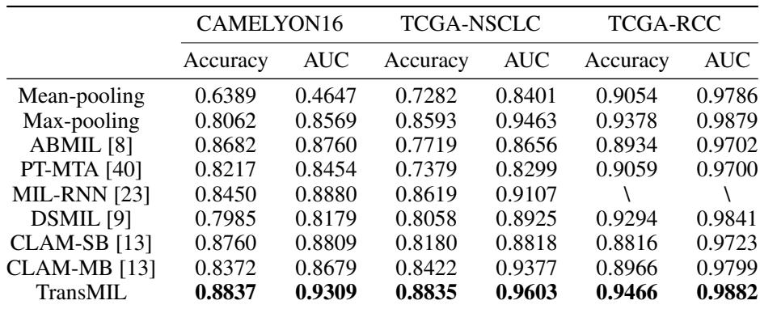
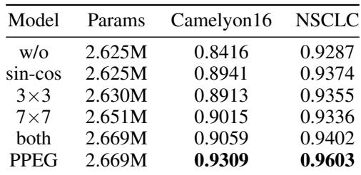

[← 返回 README](../README.md)

# 4-5. Experiments & Conclusion 实验与结论

## 📌 预览

三数据集（CAMELYON16 转移检测、TCGA-NSCLC 肺癌亚型、TCGA-RCC 肾癌亚型）。TransMIL 全面最优：CAMELYON16 AUC 93.09%、NSCLC 96.03%、RCC 98.82%。消融证明 PPEG > sin-cos > 无位置编码、条件位置编码有效。另有注意力热图可解释性 + 2-3× 更快收敛。

---

## 4.1 Results on WSI classification

*Table 1: CAMELYON16 / TCGA-NSCLC / TCGA-RCC 结果。TransMIL 在三数据集 Accuracy 与 AUC 均最优。*

Datasets: CAMELYON16 (270 train/130 test, ~8,800 patches/bag, cancer area <10%), TCGA-NSCLC (993 WSIs, ~15,371 patches/slide, cancer area >80%), TCGA-RCC (884 WSIs, 3 subtypes, unbalanced). ResNet50-ImageNet features (1024→512), Lookahead optimizer, batch=1, 4-fold CV on TCGA.

Key results: CAMELYON16 TransMIL AUC 0.9309 (vs 2nd-best CLAM-SB 0.8809, +5%); TCGA-NSCLC 0.9603 (+1.4% over 2nd); TCGA-RCC 0.9882. On CAMELYON16 (cancer <10%), bypass-attention and TransMIL beat pooling; TransMIL ≥5% higher AUC than ABMIL/PT-MTA/CLAM (which neglect correlation).

> 💡 **Table 1 批读（相关建模在稀疏阳性任务上收益最大）**（Hao 批注）：关键观察——**TransMIL 的领先幅度在 CAMELYON16（阳性区 <10%）最大（+5% AUC），在 NSCLC/RCC（阳性区 >80%）较小（+1.4%）**。原因：稀疏阳性任务里，判断需要综合大量分散区域的关联（"这一小块可疑 + 周围正常 → 转移"），self-attention 的两两相关建模正好擅长；而阳性区大的任务里，简单 pooling 就能抓住主体，相关建模增量小。
> - **对 CKMIL/压缩的启示**：相关建模（TransMIL）的价值**任务依赖**——稀疏阳性（CAMELYON16 式转移检测）最需要，密集阳性（分型）需求小。这与 [Confounders](../%5BNat%20Biomed%20Eng%202026%5D%20Confounders-Biomarker-Prediction/)/[EAGLE](../%5BNat%20Commun%202026%5D%20DL-Efficient-Pathology/) 的"任务分层"一致。也提醒：在强 FM 特征下，稀疏阳性任务仍是复杂聚合器（vs MeanPool）证明价值的最佳战场。
> - **Mean-pooling 在 CAMELYON16 崩盘**（AUC 0.4647，比随机还差）——稀疏阳性被大量负区稀释，印证 [DeepSets](../%5BNeurIPS%202017%5D%20DeepSets/) 里"mean 对稀疏信号不利"。

## 4.2 Ablation Study

*Table 2: PPEG 消融。无位置编码 0.8416 → sin-cos 0.8941 → 3×3 0.8913 → 7×7 0.9015 → both 0.9059 → PPEG 0.9309（CAMELYON16 AUC）。*

Effects of PPEG: both sinusoidal and conditional position encoding improve; PPEG (multi-level conditional) is most effective. Different-sized kernels in the same layer enable multi-level positional encoding. Conditional position encoding (vs disrupting sequence order) improves up to 0.9% on CAMELYON16.

> 💡 **Table 2 消融解读（位置编码对 WSI 的价值）**（Hao 批注）：PPEG 从 0.8416（无编码）提到 0.9309（+8.9pp！），且 PPEG > sin-cos（0.8941）> 单一卷积核。含义：**空间位置信息对 WSI 诊断重要**，且多粒度（3/5/7 卷积核）比单粒度好。这与 [Spatial-Blindness](../../ckmil-re-attn-mil/) 那条线形成有趣对话——Spatial-Blindness 质疑很多空间 MIL 其实没用到空间，但 TransMIL 的 PPEG 消融显示位置编码确实涨点（打乱顺序会掉）。差异可能在于：PPEG 的空间编码通过卷积注入到了 self-attention 的输入，被相关建模实际利用了。

## 4.3-4.4 Interpretability & Fast Convergence

Attention heatmaps show high consistency with fine annotation (ROI). TransMIL converges 2-3× faster (fewer epochs) than ABMIL/DSMIL/CLAM by using morphological + spatial info.

## 5 Conclusion

TransMIL develops a correlated MIL framework consistent with pathologist behavior (contextual + correlation info). TPT module (2 Transformer layers + PPEG) explores morphological & spatial info. Easy to train, applies to unbalanced/balanced & binary/multiple classification, outperforms SOTA on three datasets. Future: higher magnification → longer sequences → greater computational challenges.

> 💡 **总结 + 对 baseline set 的定位**（Hao 批注）：TransMIL 在 baseline set 里排除的竞争解释是 **"关键只是 instance contextual interaction / self-attention"**。它的定位：
> - **最强的 contextual aggregation baseline**——若新方法超不过 TransMIL，说明增益不只来自建模实例相关性。
> - **相关建模有理论支撑**（Theorem 2 信息熵）+ 实证（稀疏阳性任务 +5%）。
> - **但效率靠近似**（Nyström）——这是它相对 [MambaMIL](../%5BMICCAI%202024%5D%20MambaMIL/)（SSM 线性复杂度、无近似）/[RetMIL](../%5BMICCAI%202024%5D%20RetMIL/)（retention）的软肋。这三个（TransMIL/MambaMIL/RetMIL）构成"长序列聚合"的三种路线：近似 self-attention vs SSM vs retention。
> - **对 CKMIL/ReadySlide**：TransMIL 是 FM-era 必比的 contextual baseline；其 Pooling Matrix 视角（Fig.2）是定位新方法（你的 P 长什么样）的好工具。

> 💡 **Q&A 批注记录**（Hao 批注）：
> - Q：TransMIL 能直接在冻结 FM 特征 [N,D] 上跑吗？
> - A：能。它是 embedding-level MIL，输入就是 patch 特征序列。原文用 ResNet50 特征，换成 UNI2/Virchow2 只需改特征维度（PPEG 的 squaring 对任意 n 都适用）。
> - Q：Nyström 近似会损失多少？
> - A：论文未直接对比精确 vs 近似 attention 的精度差（因精确版 OOM 跑不了），但 TransMIL 整体 SOTA 说明近似可接受。这是"能跑 vs 精确"的必要妥协。
