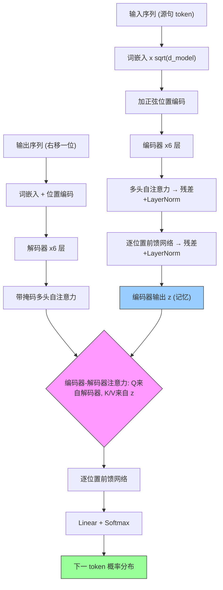

# Attention Is All You Need

**作者**: Ashish Vaswani, Noam Shazeer, Niki Parmar, Jakob Uszkoreit, Llion Jones, Aidan N. Gomez, Łukasz Kaiser, Illia Polosukhin（Google Brain / Google Research / University of Toronto）
**会议**: NeurIPS (NIPS) 2017 | **年份**: 2017
**链接**: [arXiv:1706.03762](https://arxiv.org/abs/1706.03762) · [Semantic Scholar](https://www.semanticscholar.org/paper/204e3073870fae3d05bcbc2f6a8e263d9b72e776) · [Connected Papers](https://www.connectedpapers.com/main/1706.03762) · [代码 tensor2tensor](https://github.com/tensorflow/tensor2tensor)

## 一句话总结

彻底抛弃 RNN 与 CNN，只用**（自）注意力机制 + 位置编码**搭建 encoder-decoder，凭借"任意两位置一步直连"实现高度并行，在 WMT2014 英德/英法翻译上双双刷新 SOTA，且训练成本低对手一到两个数量级——这就是奠定后续所有大模型的 **Transformer**。

## 核心贡献

1. **提出 Transformer 架构**：第一个完全基于注意力、不含任何 recurrence 与 convolution 的序列转换模型。
2. **Scaled Dot-Product + Multi-Head Attention**：用 $QK^T/\sqrt{d_k}$ 缩放稳住 softmax 梯度；用 8 个低维头并行捕捉不同表示子空间，总算力约等于单头全维。
3. **正弦位置编码**：以不同频率的正余弦注入顺序信息，可外推到训练未见的更长序列。
4. **理论论证并行优势**：以"复杂度 / 串行操作数 / 最大路径长度"三标准（Table 1）证明自注意力在并行度与长依赖学习上是理论最优 $O(1)$。
5. **双 SOTA + 低成本 + 强泛化**：英德 28.4、英法 41.8 BLEU；训练成本极低；零特化调参即可在英语句法成分分析上逼近专用解析器。

## 📖 批读导航

| Section | 内容 |
|---------|------|
| [00 - Abstract](sections/00-abstract.md) | 摘要：纯注意力主张 + 双 SOTA 三卖点 |
| [01 - Introduction](sections/01-introduction.md) | 动机：RNN 串行不可并行的痛点 + 架构地图 |
| [02 - Background](sections/02-background.md) | 与 CNN 派对比 + self-attention 定位 + novelty claim |
| [03 - Model Architecture](sections/03-model-architecture.md) | 核心：编码/解码栈、Scaled Dot-Product/Multi-Head、FFN、位置编码（Fig.1-2, Eq.1-2 及 PE 式）|
| [04 - Why Self-Attention](sections/04-why-self-attention.md) | 复杂度/并行度/路径长度三标准论证（Table 1）|
| [05 - Training](sections/05-training.md) | 数据、硬件、warmup 学习率调度（Eq.3）、正则 |
| [06 - Results](sections/06-results.md) | 翻译主结果 + 组件消融 + 句法分析泛化（Table 2-4）|
| [07 - Conclusion](sections/07-conclusion.md) | 结论 + 未来展望（跨模态/稀疏注意力/非自回归）|
| [08 - Appendix](sections/08-appendix.md) | 参考文献 + 注意力可视化（Fig.3-5）|

## 关键数字

| 指标 | 数值 |
|------|------|
| 层数 $N$ | 6（编码器 6 + 解码器 6）|
| 模型维度 $d_{model}$ | 512（big: 1024）|
| 注意力头数 $h$ | 8（big: 16）|
| 每头维度 $d_k=d_v$ | 64 |
| FFN 内层维度 $d_{ff}$ | 2048（big: 4096）|
| 英德 BLEU (base / big) | 27.3 / **28.4** |
| 英法 BLEU (big) | **41.8** |
| base 训练 FLOPs | $3.3\times10^{18}$ |
| 训练硬件/时长 | 8× P100；base 12 小时 / big 3.5 天 |
| warmup_steps | 4000 |
| 句法分析 F1（WSJ only / 半监督）| 91.3 / 92.7 |

## 数据流：输入 → 中间表示 → 输出

## 优缺点与还能做什么

### 优点
- **高度并行**：去掉串行 recurrence，序列内所有位置一次算完，训练时间大幅下降。
- **长依赖易学**：任意两位置路径长度 $O(1)$，规避 RNN 的梯度消失。
- **通用组件**：QKV + 位置编码与领域无关，为后续跨模态（文本/图像/语音）扩散奠基。
- **可解释性**：注意力权重可视化，个别头学到指代消解、句法结构等语言学功能（Fig.3-5）。
- **成本优势**：BLEU 更高的同时训练 FLOPs 低对手一到两个数量级。

### 局限 / 风险
- **$O(n^2 d)$ 复杂度**：序列长度 $n$ 很大时（长文档、高分辨率图像）自注意力成为瓶颈；本文仅以 restricted attention 作为 future work 提出。
- **兼容函数简单**：消融 (B) 显示减小 $d_k$ 掉点，暗示点积兼容函数可能不是最优，但作者未深入。
- **可解释性仅个例**：Fig.3-5 只给单句示例，未做跨种子的统计验证。
- **位置编码相加**：与语义 embedding 混叠，靠 $\sqrt{d_{model}}$ 量级匹配缓解，非根本解决。
- **正文/表格数字不一致**：英法 BLEU 正文写 41.0、表格与摘要写 41.8（原论文笔误）。

### 还能做什么
- **稀疏 / 线性注意力**：直接回应 $O(n^2)$ 瓶颈 → 后续 Sparse Transformer、Longformer、Linear Attention 一整条线。
- **跨模态推广**：图像（ViT）、语音、视频 Transformer 均源于此。
- **非自回归生成**：作者展望的 "making generation less sequential"。
- **预训练范式**：BERT/GPT 系列在此架构上引入大规模自监督预训练。

## 阅读 Q&A 记录

- **Q: 去掉 RNN 后模型如何感知 token 顺序？**
  A: 靠 3.5 节的**正弦位置编码**——偶数维 $\sin$、奇数维 $\cos$，波长呈几何级数，与词嵌入同维后直接相加。选正弦是因为 $PE_{pos+k}$ 可表示为 $PE_{pos}$ 的线性函数（利于学相对位置），且能外推到更长序列。详见 [03-model-architecture](sections/03-model-architecture.md#35-positional-encoding)。

- **Q: 为什么要除以 $\sqrt{d_k}$？**
  A: $d_k$ 维点积的方差随 $d_k$ 线性增长，数值过大会把 softmax 推入梯度极小的饱和区导致训练停滞；除以 $\sqrt{d_k}$ 把方差归一到 1 量级。见式 (1) 后的批注（[03](sections/03-model-architecture.md)）。

- **Q: 多头注意力凭什么比单头好，却不增加算力？**
  A: 每头维度缩小 $h$ 倍（$512/8=64$），$h$ 个头总算力 ≈ 单个全维注意力；同时不同头可关注不同表示子空间/位置，弥补单头加权平均的"分辨率模糊"。实验 Table 3(A) 证明单头掉 0.9 BLEU、头过多也掉点。见 [03](sections/03-model-architecture.md#322-multi-head-attention)。

- **Q: 解码器如何保证自回归、不偷看未来？**
  A: 解码器自注意力在 softmax 前把非法（未来）位置置为 $-\infty$（mask），配合输出右移一位，使位置 $i$ 只能依赖 $\lt i$ 的已知输出。见 3.2.3。

- **Q: "又快又好"到底快多少、好多少？**
  A: Table 2——英德 big 28.4 BLEU（+2 over 含 ensemble 旧 SOTA），base 训练仅 $3.3\times10^{18}$ FLOPs，比 GNMT+RL、ConvS2S ensemble 低一到两个数量级。见 [06-results](sections/06-results.md)。

- **Q: 凭什么说 Transformer 通用而非只会翻译？**
  A: 6.3 节英语句法成分分析——**几乎沿用翻译超参、不做任务特化**，WSJ only（4 万句小数据）F1 91.3 即超过 Berkeley-Parser，半监督 92.7。这正面回应了"RNN 在小数据上做不到 SOTA"的挑战。见 Table 4。

## 📊 Citation Landscape

> 数据来源：Semantic Scholar API（截至 2026-08）。paperId `204e3073870fae3d05bcbc2f6a8e263d9b72e776`。

**TLDR（S2 自动摘要）**: A new simple network architecture, the Transformer, based solely on attention mechanisms, dispensing with recurrence and convolutions entirely is proposed, which generalizes well to other tasks by applying it successfully to English constituency parsing both with large and limited training data.

**引用统计**

| 指标 | 数值 |
|------|------|
| 被引次数 (citationCount) | ~189,011 |
| Influential Citation Count | ~20,538 |
| 参考文献数 (referenceCount) | 41 |

> 💡 这是深度学习史上被引最高的论文之一——近 19 万次引用、2 万+ influential citations，几乎所有现代大模型（BERT、GPT、ViT、T5…）都建立在它之上。

**参考文献分组（按被引量 Top 排序）**

*通用深度学习组件*
| 参考文献 | 年份 | 被引 |
|------|------|------|
| Deep Residual Learning for Image Recognition (ResNet) [11] | 2015 | ~236,561 |
| Adam: A Method for Stochastic Optimization [20] | 2014 | ~169,916 |
| Long Short-Term Memory (LSTM) [13] | 1997 | ~108,713 |
| Dropout [33] | 2014 | ~44,034 |
| Rethinking the Inception Architecture (Label Smoothing) [36] | 2015 | ~31,691 |
| Layer Normalization [1] | 2016 | ~13,001 |

*神经机器翻译 / seq2seq / 注意力*
| 参考文献 | 年份 | 被引 |
|------|------|------|
| NMT by Jointly Learning to Align and Translate (Bahdanau attention) [2] | 2014 | ~29,874 |
| RNN Encoder–Decoder (GRU) [5] | 2014 | ~27,126 |
| Sequence to Sequence Learning with Neural Networks [35] | 2014 | ~22,289 |
| Empirical Evaluation of Gated RNNs [7] | 2014 | ~14,995 |
| NMT of Rare Words with Subword Units (BPE) [31] | 2015 | ~8,940 |
| Effective Approaches to Attention-based NMT (Luong) [24] | 2015 | ~8,440 |
| Google's NMT System (GNMT, word-piece) [38] | 2016 | ~7,355 |

*卷积 / 数据集*
| 参考文献 | 年份 | 被引 |
|------|------|------|
| Xception: Depthwise Separable Convolutions [6] | 2016 | ~18,295 |
| Building the Penn Treebank [25] | 1993 | ~9,233 |

> 💡 **参考文献 landscape 解读**: 引用结构清楚显示 Transformer 是**组合创新**——底座是通用组件（ResNet 残差、Adam、Dropout、LayerNorm、Label Smoothing），骨架继承自 NMT/seq2seq 线（Bahdanau/Luong 注意力、GRU、BPE、word-piece），本文的独创在于"删掉 recurrence、让注意力独当一面"。被引量最高的反而是它引用的 ResNet/Adam/LSTM，说明它站在巨人肩上，又成为新的巨人。

**相关 / 推荐论文**: Semantic Scholar Recommendations API 在本次查询返回的多为新近低引论文，参考价值有限，故不逐条列出；如需探索引用网络，建议直接访问上方 [Connected Papers](https://www.connectedpapers.com/main/1706.03762) 与 [Semantic Scholar](https://www.semanticscholar.org/paper/204e3073870fae3d05bcbc2f6a8e263d9b72e776) 页面。
