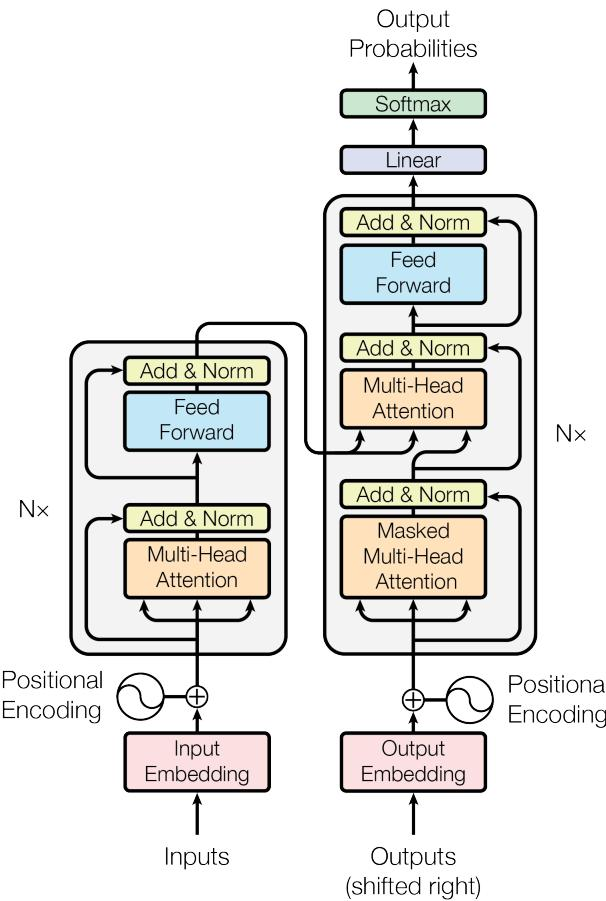
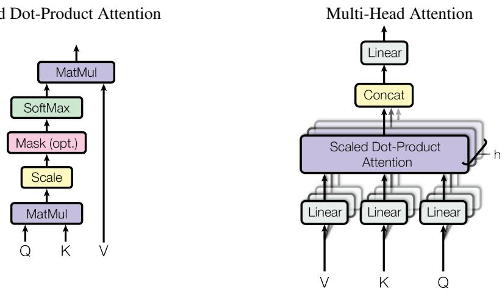
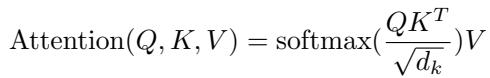
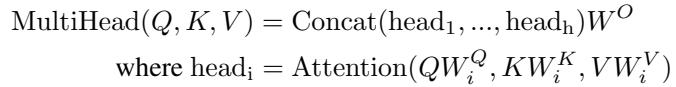
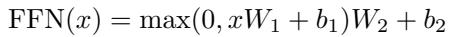
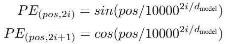

[← 返回 README](../README.md)

# 3 Model Architecture

## 📌 预览

这是全文的技术核心。按数据流展开：**编码器-解码器骨架 (3.1) → 注意力机制 (3.2：Scaled Dot-Product / Multi-Head / 三种用法) → 逐位置前馈网络 (3.3) → 词嵌入与 Softmax (3.4) → 位置编码 (3.5)**。读这一节的关键是抓住三个核心变量 Query/Key/Value，以及"多头 + 残差 + LayerNorm"如何拼成一层。

---

Most competitive neural sequence transduction models have an encoder-decoder structure [5, 2, 35]. Here, the encoder maps an input sequence of symbol representations $(x_1, ..., x_n)$ to a sequence of continuous representations $\mathbf{z} = (z_1, ..., z_n)$. Given z, the decoder then generates an output sequence $(y_1, ..., y_m)$ of symbols one element at a time. At each step the model is auto-regressive [10], consuming the previously generated symbols as additional input when generating the next.

> 💡 **机制拆解**: 这段定义了整个模型的输入输出契约。**编码器**：把离散符号序列 $(x_1,...,x_n)$ 映射成连续表示 $\mathbf{z}=(z_1,...,z_n)$（一次性并行算出全部）。**解码器**：给定 $\mathbf{z}$，一次生成一个 $y$，且是**自回归**的——生成第 $t$ 个符号时要把前面已生成的 $y_{\lt t}$ 当作额外输入喂回去。注意输入长度 $n$ 和输出长度 $m$ 可以不同（翻译任务源句和译句长度不等）。

The Transformer follows this overall architecture using stacked self-attention and point-wise, fully connected layers for both the encoder and decoder, shown in the left and right halves of Figure 1, respectively.

*Figure 1: The Transformer - model architecture.*

> 💡 **Figure 1 批读**: 全文骨架图，左半编码器、右半解码器，各堆叠 $N=6$ 层。按数据流读：
> - **底部输入**：Input/Output Embedding 后与 Positional Encoding 逐元素相加（图中 ⊕），因为没有 recurrence，顺序信息必须靠这里注入。
> - **编码器每层两个子层**：Multi-Head Attention（自注意力）→ Add & Norm；Feed Forward → Add & Norm。每个子层外都套残差连接（绕过子层的箭头）。
> - **解码器每层三个子层**：比编码器多一个中间的 Multi-Head Attention（encoder-decoder attention），其 K、V 来自编码器顶层输出（图中从左侧横跨过来的箭头），Q 来自解码器下层；底部的自注意力是 **Masked** 的，防止看到未来 token。
> - **顶部输出**：Linear → Softmax 得到下一 token 概率；解码器输入 "shifted right"（右移一位）以配合自回归。
> 这张图把 3.1–3.5 所有子模块的连接一次讲清，是本节的地图。

## 3.1 Encoder and Decoder Stacks

Encoder: The encoder is composed of a stack of $N = 6$ identical layers. Each layer has two sub-layers. The first is a multi-head self-attention mechanism, and the second is a simple, positionwise fully connected feed-forward network. We employ a residual connection [11] around each of the two sub-layers, followed by layer normalization [1]. That is, the output of each sub-layer is LayerNorm(x + Sublayer(x)), where Sublayer(x) is the function implemented by the sub-layer itself. To facilitate these residual connections, all sub-layers in the model, as well as the embedding layers, produce outputs of dimension $d_{model} = 512$.

> 💡 **机制拆解（编码器）**: 一层 = 两个子层：① 多头自注意力，② 逐位置前馈网络。每个子层的输出都是 `LayerNorm(x + Sublayer(x))`——即**先残差相加再层归一化**（post-norm 结构）。残差要求相加的两项维度一致，所以全模型（含 embedding）所有子层输出统一为 $d_{model}=512$。残差 + LayerNorm 是让 6 层深网络能稳定训练的关键工程手段。

Decoder: The decoder is also composed of a stack of $N = 6$ identical layers. In addition to the two sub-layers in each encoder layer, the decoder inserts a third sub-layer, which performs multi-head attention over the output of the encoder stack. Similar to the encoder, we employ residual connections around each of the sub-layers, followed by layer normalization. We also modify the self-attention sub-layer in the decoder stack to prevent positions from attending to subsequent positions. This masking, combined with fact that the output embeddings are offset by one position, ensures that the predictions for position i can depend only on the known outputs at positions less than i.

> 💡 **机制拆解（解码器）**: 解码器每层比编码器多一个"encoder-decoder attention"子层（在编码器顶层输出上做多头注意力，让解码器看得到源句）。此外解码器的**自注意力必须加掩码**：位置 $i$ 只能注意到 $\lt i$ 的位置。掩码 + 输出右移一位共同保证——预测第 $i$ 个 token 时绝不会偷看到第 $i$ 及之后的答案，从而维持自回归性质、训练时可并行（teacher forcing）但推理时逐步生成。

## 3.2 Attention

An attention function can be described as mapping a query and a set of key-value pairs to an output, where the query, keys, values, and output are all vectors. The output is computed as a weighted sum of the values, where the weight assigned to each value is computed by a compatibility function of the query with the corresponding key.

> 💡 **概念澄清**: 注意力的通用定义——给一个 query 和一组 (key, value) 对，输出是**values 的加权和**，每个 value 的权重由"query 与对应 key 的兼容度 (compatibility)"决定。用检索类比：query 是查询词，key 是索引，value 是内容；query 与哪个 key 越像，就越多地取用那个 value。（原文此处被 Figure 2 从 "weighted sum" 处切断，已按批读规则合并为完整段落。）

*Figure 2: (left) Scaled Dot-Product Attention. (right) Multi-Head Attention consists of several attention layers running in parallel.*

> 💡 **Figure 2 批读**:
> - **左图（Scaled Dot-Product Attention）**：数据流自下而上 —— Q、K 先做 MatMul（点积）→ Scale（除以 $\sqrt{d_k}$）→ Mask (opt.)（解码器才用）→ SoftMax → 再与 V 做 MatMul。这正是式 (1) 的图形化。
> - **右图（Multi-Head Attention）**：V、K、Q 各自经 $h$ 组独立的 Linear 投影 → 并行送入 $h$ 个 Scaled Dot-Product Attention（图中标注的 "h" 表示重叠了 $h$ 份）→ Concat 拼接 → 再过一个 Linear 得最终输出。
> - 两图的关系：右图是把左图当作一个"零件"复制 $h$ 份并行使用。这解释了为何多头能"从不同表示子空间"提取信息，而单个注意力只能给出一种平均。

## 3.2.1 Scaled Dot-Product Attention

We call our particular attention "Scaled Dot-Product Attention" (Figure 2). The input consists of queries and keys of dimension $d_k$, and values of dimension $d_v$. We compute the dot products of the query with all keys, divide each by $\sqrt{d_k}$, and apply a softmax function to obtain the weights on the values.

In practice, we compute the attention function on a set of queries simultaneously, packed together into a matrix $Q$. The keys and values are also packed together into matrices K and V. We compute the matrix of outputs as:

> 💡 **公式批读（式 1）**: 这是全文最核心的公式 $\text{Attention}(Q,K,V)=\text{softmax}(QK^T/\sqrt{d_k})\,V$。逐步拆解：
> - $QK^T$：每个 query 与所有 key 做点积，得到 $n\times n$ 的相似度打分矩阵（兼容度）。
> - $/\sqrt{d_k}$：缩放因子，防止点积随维度增大而爆炸（下一段专门解释）。
> - $\text{softmax}(\cdot)$：把每行打分归一化成权重（和为 1）。
> - $\times V$：用权重对 value 加权求和，得到输出。
> 全程只有两次大矩阵乘 + 一次 softmax，可高度并行——这就是"常数串行操作数"的来源。

The two most commonly used attention functions are additive attention [2], and dot-product (multiplicative) attention. Dot-product attention is identical to our algorithm, except for the scaling factor of $\frac{1}{\sqrt{d_k}}$. Additive attention computes the compatibility function using a feed-forward network with a single hidden layer. While the two are similar in theoretical complexity, dot-product attention is much faster and more space-efficient in practice, since it can be implemented using highly optimized matrix multiplication code.

> 💡 **设计取舍**: 为什么选点积注意力而非加性注意力（additive attention）？两者理论复杂度相当，但**点积可以直接调用高度优化的矩阵乘法**，实际更快更省显存。作者的方案 = 标准点积注意力 + 一个缩放因子 $1/\sqrt{d_k}$，改动极小但很关键。

While for small values of $d_k$ the two mechanisms perform similarly, additive attention outperforms dot product attention without scaling for larger values of $d_k$ [3]. We suspect that for large values of $d_k$, the dot products grow large in magnitude, pushing the softmax function into regions where it has extremely small gradients 4. To counteract this effect, we scale the dot products by $\frac{1}{\sqrt{d_k}}$.

> 💡 **公式批读（为何除以 $\sqrt{d_k}$）**: 这段解释缩放的动机。当 $d_k$ 大时，两个 $d_k$ 维向量的点积是 $d_k$ 个乘积之和，方差随 $d_k$ 线性增长（若各分量独立、均值 0 方差 1，则点积方差为 $d_k$）。点积数值过大会把 softmax 推到**梯度极小的饱和区**，训练停滞。除以 $\sqrt{d_k}$ 恰好把方差重新归一到 1 量级，稳住梯度。这是"scaled"一词的全部含义，也是本文相对普通点积注意力的核心改动。

## 3.2.2 Multi-Head Attention

Instead of performing a single attention function with $d_{model}$-dimensional keys, values and queries, we found it beneficial to linearly project the queries, keys and values h times with different, learned linear projections to $d_k$, $d_k$ and $d_v$ dimensions, respectively. On each of these projected versions of queries, keys and values we then perform the attention function in parallel, yielding $d_v$-dimensional output values. These are concatenated and once again projected, resulting in the final values, as depicted in Figure 2.

Multi-head attention allows the model to jointly attend to information from different representation subspaces at different positions. With a single attention head, averaging inhibits this.

Where the projections are parameter matrices $W_i^Q \in \mathbb{R}^{d_{model} \times d_k}$, $W_i^K \in \mathbb{R}^{d_{model} \times d_k}$, $W_i^V \in \mathbb{R}^{d_{model} \times d_v}$ and $W^O \in \mathbb{R}^{h d_v \times d_{model}}$.

> 💡 **公式批读（Multi-Head）**: 多头的机制是"分而治之"。不做一次 512 维的注意力，而是用 $h$ 组学习到的投影矩阵 $W_i^Q, W_i^K, W_i^V$ 把 Q/K/V 投到低维（$d_k, d_k, d_v$），**并行**做 $h$ 次注意力，各得 $d_v$ 维输出，Concat 后再经 $W^O$ 投回 $d_{model}$。为什么有效？单个头做加权平均会"抹平"信息（呼应第 2 节的 reduced resolution），多头让不同头关注**不同表示子空间、不同位置**（如一个头管句法、一个头管指代，见附录 Figure 3-5），最后融合。

In this work we employ $h = 8$ parallel attention layers, or heads. For each of these we use $d_k = d_v = d_{model}/h = 64$. Due to the reduced dimension of each head, the total computational cost is similar to that of single-head attention with full dimensionality.

> 💡 **超参与代价**: $h=8$，每头 $d_k=d_v=512/8=64$。关键点：因为每个头维度缩小了 $h$ 倍，$h$ 个头的**总计算量 ≈ 单个全维注意力**——即多头是"免费的午餐"，用几乎相同的算力换来多子空间建模能力。这也是为何后面 Table 3(A) 显示头数太少或太多都会掉点。

## 3.2.3 Applications of Attention in our Model

The Transformer uses multi-head attention in three different ways:

• In "encoder-decoder attention" layers, the queries come from the previous decoder layer, and the memory keys and values come from the output of the encoder. This allows every position in the decoder to attend over all positions in the input sequence. This mimics the typical encoder-decoder attention mechanisms in sequence-to-sequence models such as [38, 2, 9].

• The encoder contains self-attention layers. In a self-attention layer all of the keys, values and queries come from the same place, in this case, the output of the previous layer in the encoder. Each position in the encoder can attend to all positions in the previous layer of the encoder.

• Similarly, self-attention layers in the decoder allow each position in the decoder to attend to all positions in the decoder up to and including that position. We need to prevent leftward information flow in the decoder to preserve the auto-regressive property. We implement this inside of scaled dot-product attention by masking out (setting to −∞) all values in the input of the softmax which correspond to illegal connections. See Figure 2.

> 💡 **机制拆解（三种注意力用法）**: 同一个多头注意力零件在三个位置扮演不同角色，区别只在 Q/K/V 从哪来：
> - **Encoder-decoder attention**：Q 来自解码器下层，K/V 来自编码器输出 → 让译文每个位置都能看源句全部位置（跨序列对齐，替代传统 seq2seq 的注意力）。
> - **Encoder self-attention**：Q/K/V 全来自编码器上一层 → 源句内部每个位置看全部位置（无掩码）。
> - **Decoder self-attention**：Q/K/V 来自解码器上一层，但**加掩码**——把非法（未来）位置在 softmax 前置为 $-\infty$，softmax 后权重归零，保证位置 $i$ 只能看到 $\le i$。这是保持自回归、防止信息"向左泄漏"的实现细节。

## 3.3 Position-wise Feed-Forward Networks

In addition to attention sub-layers, each of the layers in our encoder and decoder contains a fully connected feed-forward network, which is applied to each position separately and identically. This consists of two linear transformations with a ReLU activation in between.

While the linear transformations are the same across different positions, they use different parameters from layer to layer. Another way of describing this is as two convolutions with kernel size 1. The dimensionality of input and output is $d_{model} = 512$, and the inner-layer has dimensionality $d_{ff} = 2048$.

> 💡 **公式批读（式 2 / FFN）**: 每层注意力之后接一个前馈网络 $\text{FFN}(x)=\max(0, xW_1+b_1)W_2+b_2$——即"线性升维 → ReLU → 线性降维"，$512 \to 2048 \to 512$。关键性质：它**对每个位置独立且相同地作用**（position-wise），等价于两个 kernel=1 的卷积；同一层内参数共享，但层与层之间参数不同。注意力负责"跨位置混合信息"，FFN 负责"逐位置非线性变换"，两者交替是 Transformer 一层的完整配方。

## 3.4 Embeddings and Softmax

Similarly to other sequence transduction models, we use learned embeddings to convert the input tokens and output tokens to vectors of dimension $d_{model}$. We also use the usual learned linear transformation and softmax function to convert the decoder output to predicted next-token probabilities. In our model, we share the same weight matrix between the two embedding layers and the pre-softmax linear transformation, similar to [30]. In the embedding layers, we multiply those weights by $\sqrt{d_{model}}$.

> 💡 **机制拆解**: 三处权重**共享同一个矩阵**——输入 embedding、输出 embedding、以及 softmax 前的线性投影（weight tying [30]）。好处：省参数、且让"token→向量"和"向量→token 概率"用一致的表示空间。embedding 处再乘 $\sqrt{d_{model}}$ 是为了让 embedding 的量级与位置编码（幅值约 ±1）相匹配，避免相加时位置信号被淹没或主导。

## 3.5 Positional Encoding

Since our model contains no recurrence and no convolution, in order for the model to make use of the order of the sequence, we must inject some information about the relative or absolute position of the tokens in the sequence. To this end, we add "positional encodings" to the input embeddings at the bottoms of the encoder and decoder stacks. The positional encodings have the same dimension $d_{model}$ as the embeddings, so that the two can be summed. There are many choices of positional encodings, learned and fixed [9].

In this work, we use sine and cosine functions of different frequencies:

where pos is the position and i is the dimension. That is, each dimension of the positional encoding corresponds to a sinusoid. The wavelengths form a geometric progression from $2\pi$ to $10000 \cdot 2\pi$. We chose this function because we hypothesized it would allow the model to easily learn to attend by relative positions, since for any fixed offset k, $PE_{pos+k}$ can be represented as a linear function of $PE_{pos}$.

> 💡 **公式批读（位置编码）**: 这是"去掉 recurrence 后如何感知顺序"的答案。位置 $pos$、维度 $i$ 处用不同频率的正余弦：偶数维 $\sin$、奇数维 $\cos$，波长从 $2\pi$ 到 $10000\cdot 2\pi$ 呈几何级数。位置编码与 embedding **维度相同 ($d_{model}$) 因此可直接相加**。选正弦函数的关键理由：对任意固定偏移 $k$，$PE_{pos+k}$ 都能写成 $PE_{pos}$ 的**线性函数**（由三角恒等式，正余弦的移位是原值的线性组合），这让模型容易学到"相对位置"的注意力模式。

We also experimented with using learned positional embeddings [9] instead, and found that the two versions produced nearly identical results (see Table 3 row (E)). We chose the sinusoidal version because it may allow the model to extrapolate to sequence lengths longer than the ones encountered during training.

> 💡 **设计取舍**: 正弦编码 vs 学习式位置嵌入，实验（Table 3 行 E）显示两者效果几乎一样。作者仍选正弦式，理由是它可能**外推到比训练时更长的序列**——学习式嵌入只对训练见过的位置有定义，正弦式则对任意 $pos$ 都有确定值。这是一个"效果打平时按泛化性选择"的判断。

---

## 🔖 Section 总结

### 关键数字速查
| 变量 | 含义 | 值 |
|------|------|-----|
| $N$ | 编码/解码器层数 | 6 |
| $d_{model}$ | 模型/embedding 维度 | 512 |
| $h$ | 注意力头数 | 8 |
| $d_k=d_v$ | 每头 K/V 维度 | 64 |
| $d_{ff}$ | FFN 内层维度 | 2048 |

### 核心洞察
1. **一层的配方**：多头注意力（跨位置混合）+ 逐位置 FFN（非线性变换），每个子层外套残差 + LayerNorm。
2. **QKV 是统一抽象**：三种注意力（enc-dec / enc self / dec self）本质是同一零件，区别只在 Q/K/V 来源与是否加掩码。
3. **两个补偿设计**：$\sqrt{d_k}$ 缩放补偿点积方差爆炸；位置编码补偿去掉 recurrence 后丢失的顺序信息。
4. **多头≈免费**：低维并行使多头总算力约等于单头全维。

### 可追问点
- 为什么用 post-norm（`LayerNorm(x+Sublayer(x))`）而非 pre-norm？（原文未讨论，后续工作表明 pre-norm 更易训深层）
- 位置编码相加而非拼接，会不会与语义信息冲突？（乘 $\sqrt{d_{model}}$ 的量级匹配是关键缓解）
