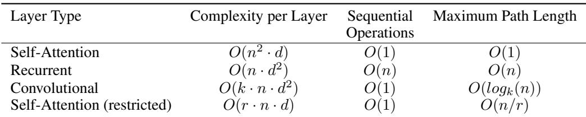

[← 返回 README](../README.md)

# 4 Why Self-Attention

## 📌 预览

这一节是**理论论证**，回答"为什么该用自注意力替代 RNN/CNN"。作者立三条评判标准——每层计算复杂度、可并行度（串行操作数）、长距离依赖的路径长度——并用 Table 1 把四种层类型放在一起对比。结论：自注意力在并行度和路径长度上完胜，复杂度在常见句长下也占优。附带一个额外收益：**可解释性**。

---

## 4 Why Self-Attention

In this section we compare various aspects of self-attention layers to the recurrent and convolutional layers commonly used for mapping one variable-length sequence of symbol representations $(x_1, ..., x_n)$ to another sequence of equal length $(z_1, ..., z_n)$, with $x_i, z_i \in \mathbb{R}^d$, such as a hidden layer in a typical sequence transduction encoder or decoder. Motivating our use of self-attention we consider three desiderata.

> 💡 **论证框架**: 作者不靠"效果好"来论证，而是先定义一个公平的对比场景——把一个变长序列 $(x_1,...,x_n)$ 映射到等长序列 $(z_1,...,z_n)$，每个元素 $d$ 维（即 encoder/decoder 里一个隐藏层要做的事）。然后提出三条"desiderata（期望标准）"，下面三段逐条展开。这种"先立标准再对比"的写法让结论更有说服力。

One is the total computational complexity per layer. Another is the amount of computation that can be parallelized, as measured by the minimum number of sequential operations required.

> 💡 **标准 1 & 2**: 第一条是**每层总计算复杂度**（算得多不多）；第二条是**可并行度**，用"最少需要多少个串行操作"来量化——这正是第 1 节 RNN 痛点的直接对应。RNN 需要 $O(n)$ 个串行步，自注意力只需 $O(1)$。

The third is the path length between long-range dependencies in the network. Learning long-range dependencies is a key challenge in many sequence transduction tasks. One key factor affecting the ability to learn such dependencies is the length of the paths forward and backward signals have to traverse in the network. The shorter these paths between any combination of positions in the input and output sequences, the easier it is to learn long-range dependencies [12]. Hence we also compare the maximum path length between any two input and output positions in networks composed of the different layer types.

> 💡 **标准 3（路径长度）**: 这是全文最深刻的论点。信号（前向/反向梯度）在两个位置之间传播要走的**路径越短，长距离依赖越好学**——因为路径越长，梯度经过的非线性变换越多，越容易消失。RNN 中位置 1 到位置 $n$ 要走 $n$ 步（梯度消失的根源）；自注意力一步直连，路径长度 $O(1)$。这把"长依赖难学"这个抽象问题量化成了可比较的指标。

*Table 1: Maximum path lengths, per-layer complexity and minimum number of sequential operations for different layer types. n is the sequence length, d is the representation dimension, k is the kernel size of convolutions and r the size of the neighborhood in restricted self-attention.*

> 💡 **Table 1 批读**: 这张表是本节的证据核心，对比四种层：
> | 层类型 | 每层复杂度 | 串行操作数 | 最大路径长度 |
> |---|---|---|---|
> | Self-Attention | $O(n^2 \cdot d)$ | $O(1)$ | $O(1)$ |
> | Recurrent | $O(n \cdot d^2)$ | $O(n)$ | $O(n)$ |
> | Convolutional | $O(k \cdot n \cdot d^2)$ | $O(1)$ | $O(\log_k n)$ |
> | Self-Attention (restricted) | $O(r \cdot n \cdot d)$ | $O(1)$ | $O(n/r)$ |
>
> 读法：自注意力在**串行操作数**和**路径长度**两栏都是 $O(1)$（最优）。复杂度栏是它唯一的"软肋"——$O(n^2 d)$ 对 $n$ 是平方，而 RNN 是 $O(nd^2)$。但作者在下段指出：当 $n \lt d$（多数句子表示的实际情况，$n$ 几十、$d$ 几百）时，$n^2 d \lt n d^2$，自注意力反而更快。受限自注意力（restricted）是应对超长序列的备选方案，用路径长度 $O(n/r)$ 换更低复杂度。

As noted in Table 1, a self-attention layer connects all positions with a constant number of sequentially executed operations, whereas a recurrent layer requires $O(n)$ sequential operations. In terms of computational complexity, self-attention layers are faster than recurrent layers when the sequence length n is smaller than the representation dimensionality d, which is most often the case with sentence representations used by state-of-the-art models in machine translations, such as word-piece [38] and byte-pair [31] representations. To improve computational performance for tasks involving very long sequences, self-attention could be restricted to considering only a neighborhood of size r in the input sequence centered around the respective output position. This would increase the maximum path length to $O(n/r)$. We plan to investigate this approach further in future work.

> 💡 **复杂度权衡解读**: 这段把 Table 1 的数字翻译成实际结论。核心是 $n$ vs $d$ 的比较：翻译任务里句长 $n$（词/子词数，几十）通常小于表示维度 $d$（512），所以自注意力的 $O(n^2 d)$ 实际比 RNN 的 $O(n d^2)$ 更小、更快。对于超长序列（$n$ 很大）才会翻盘，那时可用受限自注意力（只看邻域 $r$）把复杂度降下来，代价是路径长度升到 $O(n/r)$——这是一个明确标注为 future work 的开口。

A single convolutional layer with kernel width $k \lt n$ does not connect all pairs of input and output positions. Doing so requires a stack of $O(n/k)$ convolutional layers in the case of contiguous kernels, or $O(\log_k n)$ in the case of dilated convolutions [18], increasing the length of the longest paths between any two positions in the network. Convolutional layers are generally more expensive than recurrent layers, by a factor of k. Separable convolutions [6], however, decrease the complexity considerably, to $O(k \cdot n \cdot d + n \cdot d^2)$. Even with $k = n$, however, the complexity of a separable convolution is equal to the combination of a self-attention layer and a point-wise feed-forward layer, the approach we take in our model.

> 💡 **与 CNN 对比**: 卷积核宽 $k \lt n$ 时一层连不全所有位置对，要覆盖全序列需堆 $O(n/k)$ 层（膨胀卷积 $O(\log_k n)$），路径变长。即使用可分离卷积把复杂度压到 $O(knd+nd^2)$，在 $k=n$ 时也恰好等于"自注意力层 + 逐位置 FFN"的组合——也就是本文采用的方案。言下之意：作者的架构在复杂度上不比最优化的卷积差，却在路径长度上更优。

As side benefit, self-attention could yield more interpretable models. We inspect attention distributions from our models and present and discuss examples in the appendix. Not only do individual attention heads clearly learn to perform different tasks, many appear to exhibit behavior related to the syntactic and semantic structure of the sentences.

> 💡 **额外收益（可解释性）**: 除了速度和路径，自注意力还有一个副产品——**可解释性**。注意力权重是显式的分布，可以直接可视化"哪个词在关注哪个词"。作者在附录（Figure 3-5）展示不同头分别学会了不同任务（如指代消解、句法结构）。这为后文"个别头有明确语言学功能"的 claim 提供依据。

---

## 🔖 Section 总结

### 关键数字速查（Table 1 核心）
| 指标 | Self-Attention | Recurrent | Convolutional |
|------|------|------|------|
| 串行操作数 | $O(1)$ ✅ | $O(n)$ | $O(1)$ |
| 最大路径长度 | $O(1)$ ✅ | $O(n)$ | $O(\log_k n)$ |
| 每层复杂度 | $O(n^2 d)$ | $O(nd^2)$ | $O(knd^2)$ |

### 核心洞察
1. **三条标准撑起整个论证**：复杂度、并行度、路径长度——自注意力在后两条上是理论最优 $O(1)$。
2. **$n \lt d$ 是关键前提**：正是因为翻译句长小于表示维度，$O(n^2 d)$ 的"平方软肋"在实践中不成立。
3. **可解释性是白送的**：注意力分布天然可视化，不需额外机制。

### 可追问点
- 当 $n \gg d$（长文档、高分辨率图像）时，$O(n^2)$ 是否成为瓶颈？（→ 这正是后续 sparse/linear attention 系列工作的起点，本文以 restricted attention 留作 future work）
