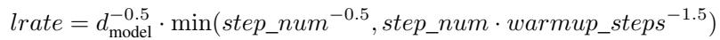

[← 返回 README](../README.md)

# 5 Training

## 📌 预览

训练配置节，交代复现所需的全部细节：**数据与分批 (5.1) → 硬件与时长 (5.2) → 优化器与学习率调度 (5.3) → 正则化 (5.4)**。最值得记的两点是那条"先线性升温再按平方根倒数衰减"的学习率公式，以及三种正则（残差 dropout、label smoothing）。

---

## 5 Training

This section describes the training regime for our models.

## 5.1 Training Data and Batching

We trained on the standard WMT 2014 English-German dataset consisting of about 4.5 million sentence pairs. Sentences were encoded using byte-pair encoding [3], which has a shared sourcetarget vocabulary of about 37000 tokens. For English-French, we used the significantly larger WMT 2014 English-French dataset consisting of 36M sentences and split tokens into a 32000 word-piece vocabulary [38]. Sentence pairs were batched together by approximate sequence length. Each training batch contained a set of sentence pairs containing approximately 25000 source tokens and 25000 target tokens.

> 💡 **数据与分批**: 英德用 WMT2014 约 450 万句对、BPE 共享词表约 37000 token；英法用更大的 3600 万句、word-piece 词表 32000。关键工程细节：**按近似句长分桶再组 batch**，每个 batch 约 25000 源 token + 25000 目标 token。按 token 数（而非句子数）组 batch 能让每步的计算量稳定，避免长短句混在一起造成大量 padding 浪费。

## 5.2 Hardware and Schedule

We trained our models on one machine with 8 NVIDIA P100 GPUs. For our base models using the hyperparameters described throughout the paper, each training step took about 0.4 seconds. We trained the base models for a total of 100,000 steps or 12 hours. For our big models,(described on the bottom line of table 3), step time was 1.0 seconds. The big models were trained for 300,000 steps (3.5 days).

> 💡 **算力预算**: 单机 8×P100。base 模型每步 0.4s，训 10 万步 ≈ 12 小时；big 模型每步 1.0s，训 30 万步 ≈ 3.5 天。呼应摘要与引言：base 的 12 小时对应引言"as little as twelve hours"，big 的 3.5 天对应摘要英法 SOTA。这组数字是"训练成本远低于对手"这一 claim 的直接证据（对比 Table 2 的 FLOPs 栏）。

## 5.3 Optimizer

We used the Adam optimizer [20] with $\beta_1 = 0.9$, $\beta_2 = 0.98$ and $\epsilon = 10^{-9}$. We varied the learning rate over the course of training, according to the formula:

This corresponds to increasing the learning rate linearly for the first warmup\_steps training steps, and decreasing it thereafter proportionally to the inverse square root of the step number. We used warmup\_steps $= 4000$.

> 💡 **公式批读（式 3 / warmup 调度）**: 这条学习率调度是 Transformer 能稳定训练的隐藏功臣。公式 $lrate = d_{model}^{-0.5}\cdot\min(step^{-0.5},\, step\cdot warmup^{-1.5})$ 分两段：
> - **升温段（step < 4000）**：$step\cdot warmup^{-1.5}$ 较小，学习率随步数**线性上升**。early 阶段参数还很随机、注意力分布不稳，小学习率避免训崩。
> - **衰减段（step ≥ 4000）**：$step^{-0.5}$ 生效，学习率按**步数平方根倒数衰减**。
> $d_{model}^{-0.5}$ 因子让更大的模型自动用更小的学习率。这套 "warmup + inverse-sqrt decay" 后来几乎成为训练 Transformer 的标配。

## 5.4 Regularization

We employ three types of regularization during training:

> 💡 **要点预览**: 原文说"三种正则"，但下文只详细写了 Residual Dropout 和 Label Smoothing 两类（另有 attention dropout 在 6.3/Table 3 中提及）。以下逐项批读。

Residual Dropout We apply dropout [33] to the output of each sub-layer, before it is added to the sub-layer input and normalized. In addition, we apply dropout to the sums of the embeddings and the positional encodings in both the encoder and decoder stacks. For the base model, we use a rate of $P_{drop} = 0.1$.

> 💡 **机制拆解（Residual Dropout）**: dropout 加在两处——① 每个子层输出**在做残差相加与 LayerNorm 之前**；② embedding 与位置编码之和处。base 模型 $P_{drop}=0.1$。作用是防止 6 层深模型过拟合；Table 3(D) 的消融显示 dropout 从 0.1 调到 0.0 会明显掉点（过拟合），是"很有帮助"的正则。

Label Smoothing During training, we employed label smoothing of value $\epsilon_{ls} = 0.1$ [36]. This hurts perplexity, as the model learns to be more unsure, but improves accuracy and BLEU score.

> 💡 **消融解读（Label Smoothing）**: 把 one-hot 目标"抹平"成 $1-\epsilon_{ls}$ + 均匀分布（$\epsilon_{ls}=0.1$）。有意思的权衡：它**让困惑度 (perplexity) 变差**（模型被迫变得"不那么自信"，预测分布更平），但**准确率和 BLEU 都提升**。这提醒读者：perplexity 与最终任务指标并不总是同向，评估翻译应看 BLEU。

---

## 🔖 Section 总结

### 关键数字速查
| 配置 | 值 |
|------|------|
| 英德数据 | WMT2014，4.5M 句对，BPE 词表 ~37K |
| 英法数据 | WMT2014，36M 句，word-piece 词表 32K |
| batch | ~25000 源 + 25000 目标 token |
| 优化器 | Adam，$\beta_1{=}0.9,\beta_2{=}0.98,\epsilon{=}10^{-9}$ |
| warmup_steps | 4000 |
| dropout ($P_{drop}$) | 0.1 (base) |
| label smoothing ($\epsilon_{ls}$) | 0.1 |

### 核心洞察
1. **按 token 组 batch**：稳定每步算力、减少 padding，是高效训练的工程要点。
2. **warmup + inverse-sqrt 调度**：Transformer 训练稳定的关键，后成标配。
3. **正则的反直觉权衡**：label smoothing 牺牲 perplexity 换 BLEU，说明保真类指标与任务指标可背离。

### 可追问点
- 为什么 $\beta_2=0.98$ 而非 Adam 默认 0.999？（更小的 $\beta_2$ 让二阶矩估计更"短记忆"，配合大 batch/warmup 更稳，原文未展开）
- warmup_steps=4000 与模型规模如何联动？（公式里已通过 $d_{model}^{-0.5}$ 自动缩放峰值学习率）
