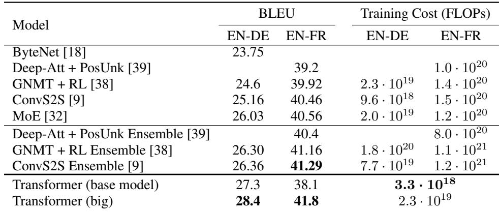
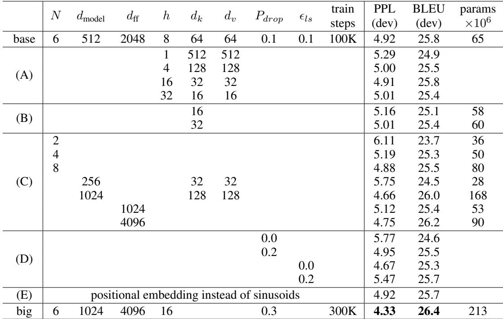
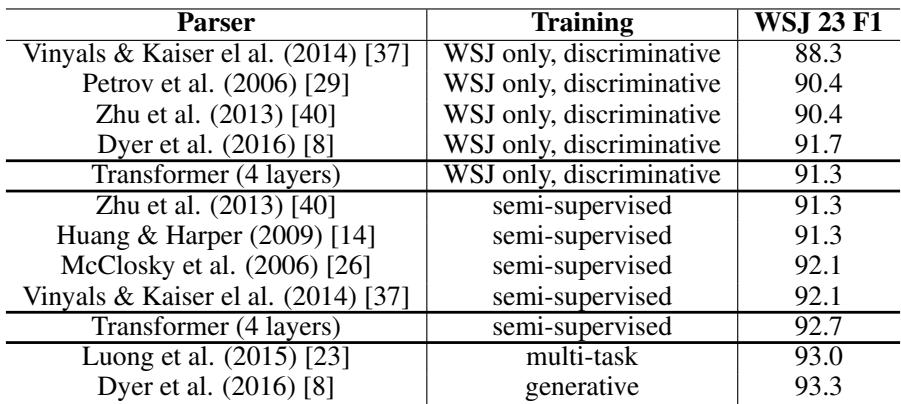

[← 返回 README](../README.md)

# 6 Results

## 📌 预览

实验证据链分三块：**机器翻译主结果 (6.1，Table 2) → 架构组件消融 (6.2，Table 3) → 泛化到句法分析 (6.3，Table 4)**。读法：Table 2 证"又好又便宜"，Table 3 逐个拆解每个设计的必要性，Table 4 证"不止会翻译"。

---

## 6 Results

## 6.1 Machine Translation

On the WMT 2014 English-to-German translation task, the big transformer model (Transformer (big) in Table 2) outperforms the best previously reported models (including ensembles) by more than 2.0 BLEU, establishing a new state-of-the-art BLEU score of 28.4. The configuration of this model is listed in the bottom line of Table 3. Training took 3.5 days on 8 P100 GPUs. Even our base model surpasses all previously published models and ensembles, at a fraction of the training cost of any of the competitive models.

*Table 2: The Transformer achieves better BLEU scores than previous state-of-the-art models on the English-to-German and English-to-French newstest2014 tests at a fraction of the training cost.*

> 💡 **Table 2 批读（主结果）**: 这是全文最硬的一张证据表，两个维度同时看：
> - **BLEU（越高越好）**：Transformer(big) 英德 **28.4**、英法 **41.8**，都刷新 SOTA；英德比含 ensemble 的旧最好高 2+ BLEU。base 模型英德 27.3 也已超过之前所有单模型和 ensemble。
> - **训练成本 FLOPs（越低越好）**：base 仅 $3.3\times10^{18}$，比 GNMT+RL 的 $2.3\times10^{19}$、ConvS2S ensemble 的 $7.7\times10^{19}$ 低一到两个数量级。
> 表格证明的不是"效果好一点"，而是"效果更好 + 成本低一到两个数量级"，这才是颠覆性所在。（注：此表在原 PDF 中排在第 5 节，但按内容归属 Results，故置于此。）

On the WMT 2014 English-to-French translation task, our big model achieves a BLEU score of 41.0, outperforming all of the previously published single models, at less than 1/4 the training cost of the previous state-of-the-art model. The Transformer (big) model trained for English-to-French used dropout rate $P_{drop} = 0.1$, instead of 0.3.

> 💡 **细节校对**: 正文此处写英法 41.0，而 Table 2 与摘要写 41.8——这是原论文自身的一处数字不一致（正文 vs 表格），批读时保留原文、如实标注。要点不变：英法单模型新 SOTA，成本不到旧 SOTA 的 1/4。另注意英法 big 用了较小的 dropout 0.1（因数据量大 3600 万句，过拟合风险低），而英德/一般 big 用 0.3。

For the base models, we used a single model obtained by averaging the last 5 checkpoints, which were written at 10-minute intervals. For the big models, we averaged the last 20 checkpoints. We used beam search with a beam size of 4 and length penalty $\alpha = 0.6$ [38]. These hyperparameters were chosen after experimentation on the development set. We set the maximum output length during inference to input length + 50, but terminate early when possible [38].

> 💡 **推理技巧**: 三个提分手段——① **checkpoint averaging**（base 平均最后 5 个、big 平均最后 20 个），相当于免费的模型集成、平滑参数；② **beam search**（束宽 4）+ 长度惩罚 $\alpha=0.6$，缓解 beam search 偏好短句的问题；③ 最大输出长度设为"输入 + 50"并允许提前终止。这些都是标准 seq2seq 推理工程，说明主结果不依赖特殊 trick。

Table 2 summarizes our results and compares our translation quality and training costs to other model architectures from the literature. We estimate the number of floating point operations used to train a model by multiplying the training time, the number of GPUs used, and an estimate of the sustained single-precision floating-point capacity of each GPU5.

> 💡 **方法学说明**: FLOPs 是**估算**的（训练时长 × GPU 数 × 单卡持续单精度算力），并非精确测量。批读判断：这是跨论文对比训练成本的合理近似，量级差异（一到两个数量级）远大于估算误差，所以"成本低"的结论稳健。

## 6.2 Model Variations

To evaluate the importance of different components of the Transformer, we varied our base model in different ways, measuring the change in performance on English-to-German translation on the development set, newstest2013. We used beam search as described in the previous section, but no checkpoint averaging. We present these results in Table 3.

*Table 3: Variations on the Transformer architecture. Unlisted values are identical to those of the base model. All metrics are on the English-to-German translation development set, newstest2013. Listed perplexities are per-wordpiece, according to our byte-pair encoding, and should not be compared to per-word perplexities.*

> 💡 **Table 3 批读（消融总览）**: 这张表用"改动一个组件、其余不变"的方式逐项证明每个设计的必要性，评测在英德 dev 集 newstest2013：
> - **(A) 头数 $h$**：固定总算力改变头数。单头比最优设置差 0.9 BLEU，头太多（如 32）也会掉——说明头数存在甜点（本文 8）。
> - **(B) $d_k$**：减小 key 维度会掉点，暗示"判断兼容度"并不简单，也许比点积更复杂的兼容函数会更好。
> - **(C)**：模型越大越好（$d_{model}$、$d_{ff}$、$N$ 增大均提升）。
> - **(D)**：dropout 和 label smoothing 都有效——去掉 dropout（0.0）会过拟合掉点。
> - **(E)**：正弦位置编码 ↔ 学习式位置嵌入，结果几乎相同（呼应 3.5）。
> - **底行 big**：$d_{model}{=}1024, d_{ff}{=}4096, h{=}16, N{=}6$，PPL 4.33、BLEU 26.4、参数 213M——最强配置。

In Table 3 rows (A), we vary the number of attention heads and the attention key and value dimensions, keeping the amount of computation constant, as described in Section 3.2.2. While single-head attention is 0.9 BLEU worse than the best setting, quality also drops off with too many heads.

> 💡 **消融解读 (A)**: 印证 3.2.2 的"多头总算力恒定"设定下，头数是纯粹的"分工粒度"选择。单头掉 0.9 BLEU（无法多子空间建模），过多头则每头维度太低（$d_k=d_v$ 变得很小）反而表达力不足。这是"多头有用但需适度"的直接实验支撑。

In Table 3 rows (B), we observe that reducing the attention key size $d_k$ hurts model quality. This suggests that determining compatibility is not easy and that a more sophisticated compatibility function than dot product may be beneficial. We further observe in rows (C) and (D) that, as expected, bigger models are better, and dropout is very helpful in avoiding over-fitting. In row (E) we replace our sinusoidal positional encoding with learned positional embeddings [9], and observe nearly identical results to the base model.

> 💡 **消融解读 (B)-(E)**: (B) 减小 $d_k$ 掉点 → 兼容度计算不容易，点积也许不是最优兼容函数（一个坦诚的局限，也是未来方向）。(C) 越大越好、(D) dropout 很关键——两条"符合预期"的结论。(E) 是对 3.5 设计选择的收尾：既然效果打平，选正弦式纯粹是为了长度外推能力。整张表的价值在于：**每个设计决定都有对应的对照实验**，而非拍脑袋。

## 6.3 English Constituency Parsing

To evaluate if the Transformer can generalize to other tasks we performed experiments on English constituency parsing. This task presents specific challenges: the output is subject to strong structural constraints and is significantly longer than the input. Furthermore, RNN sequence-to-sequence models have not been able to attain state-of-the-art results in small-data regimes [37].

> 💡 **问题动机（泛化实验）**: 选句法成分分析（constituency parsing）来测泛化不是随意的——它有两个"刁难"属性：① 输出是**带强结构约束的语法树**，且**比输入长得多**；② RNN seq2seq 在**小数据**上一直做不到 SOTA。用一个和翻译差别很大、且对 RNN 不友好的任务来验证，更能说明架构本身的通用性。

We trained a 4-layer transformer with $d_{model} = 1024$ on the Wall Street Journal (WSJ) portion of the Penn Treebank [25], about 40K training sentences. We also trained it in a semi-supervised setting, using the larger high-confidence and BerkleyParser corpora from with approximately 17M sentences [37]. We used a vocabulary of 16K tokens for the WSJ only setting and a vocabulary of 32K tokens for the semi-supervised setting.

> 💡 **实验设置**: 用 4 层、$d_{model}=1024$ 的小 Transformer，两种数据规模：WSJ only（约 4 万句，小数据）和半监督（约 1700 万句）。词表分别 16K / 32K。刻意用小模型 + 小数据，突出"架构本身"而非"堆规模"的泛化力。

We performed only a small number of experiments to select the dropout, both attention and residual (section 5.4), learning rates and beam size on the Section 22 development set, all other parameters remained unchanged from the English-to-German base translation model. During inference, we increased the maximum output length to input length + 300. We used a beam size of 21 and α = 0.3 for both WSJ only and the semi-supervised setting.

> 💡 **调参克制**: 关键 claim——**几乎不调参**：只在 dev 集上挑了 dropout、学习率、beam size，其余全部沿用英德翻译 base 模型的超参。这一点很重要：如果换任务要大改超参，就不算"架构通用"。推理时输出长度放宽到"输入+300"（因语法树远长于句子），beam size 21（比翻译的 4 大很多，树结构搜索空间大）。

Table 4: The Transformer generalizes well to English constituency parsing (Results are on Section 23 of WSJ)

*Table 4: The Transformer generalizes well to English constituency parsing (Results are on Section 23 of WSJ).*

> 💡 **Table 4 批读（泛化证据）**: 指标是 WSJ Section 23 上的 F1（越高越好）。要点：
> - **WSJ only（小数据）**：Transformer(4 层) F1 **91.3**，超过 Berkeley-Parser (Petrov 2006, 90.4)，也胜过多数判别式方法，在小数据上打破了"RNN seq2seq 做不到 SOTA"的局面。
> - **半监督**：F1 **92.7**，接近/超过多数已有方法。
> - 唯一没超过的是 Dyer 2016 的 RNN Grammar（生成式 93.3）。
> 结论：**几乎零任务特化调参**却能逼近专用解析器，强力支撑"架构通用"的 claim。

Our results in Table 4 show that despite the lack of task-specific tuning our model performs surprisingly well, yielding better results than all previously reported models with the exception of the Recurrent Neural Network Grammar [8].

In contrast to RNN sequence-to-sequence models [37], the Transformer outperforms the Berkeley-Parser [29] even when training only on the WSJ training set of 40K sentences.

> 💡 **证据链收束**: 两句话把泛化 claim 钉死：① 除了 RNN Grammar，超过所有已报告模型；② 即便只用 4 万句小数据，也超过 Berkeley-Parser——正面回应了 6.3 开头提出的"RNN 在小数据上做不到"的挑战。至此，Results 三块（主结果 / 消融 / 泛化）形成完整证据链。

---

## 🔖 Section 总结

### 关键数字速查
| 任务/指标 | 数值 |
|------|------|
| 英德 BLEU (big / base) | 28.4 / 27.3 |
| 英法 BLEU (big) | 41.8（表）/ 41.0（正文）|
| base 训练 FLOPs | $3.3\times10^{18}$（低对手 1-2 数量级）|
| 句法分析 F1（WSJ only / 半监督）| 91.3 / 92.7 |
| beam size（翻译 / 解析）| 4 / 21 |

### 核心洞察
1. **双赢主结果**：BLEU 更高 + 训练成本低一到两个数量级，是全文最强证据。
2. **消融覆盖每个设计**：头数、$d_k$、模型大小、dropout、位置编码逐项对照，方法论严谨。
3. **泛化不靠调参**：句法分析几乎沿用翻译超参仍逼近专用解析器，证明架构通用。

### 可追问点
- 英法 41.0 vs 41.8 的正文/表格不一致来自哪里？（原论文自身笔误，通常引用表格值 41.8）
- (B) 提到点积兼容函数或许不够——为何后续工作没大规模改动兼容函数？（点积的效率优势压倒了潜在精度收益）
