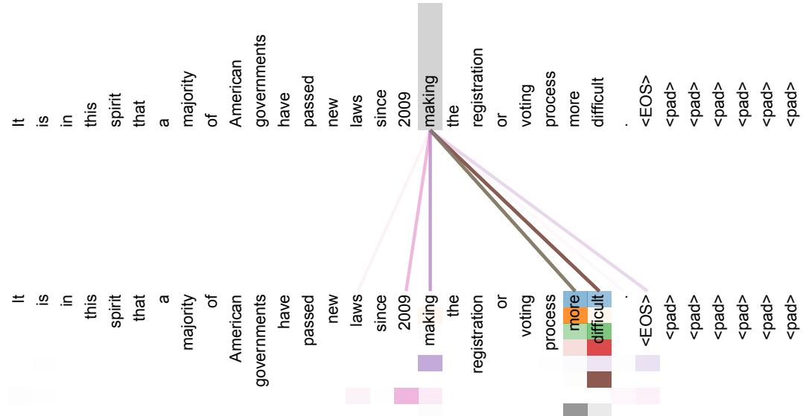
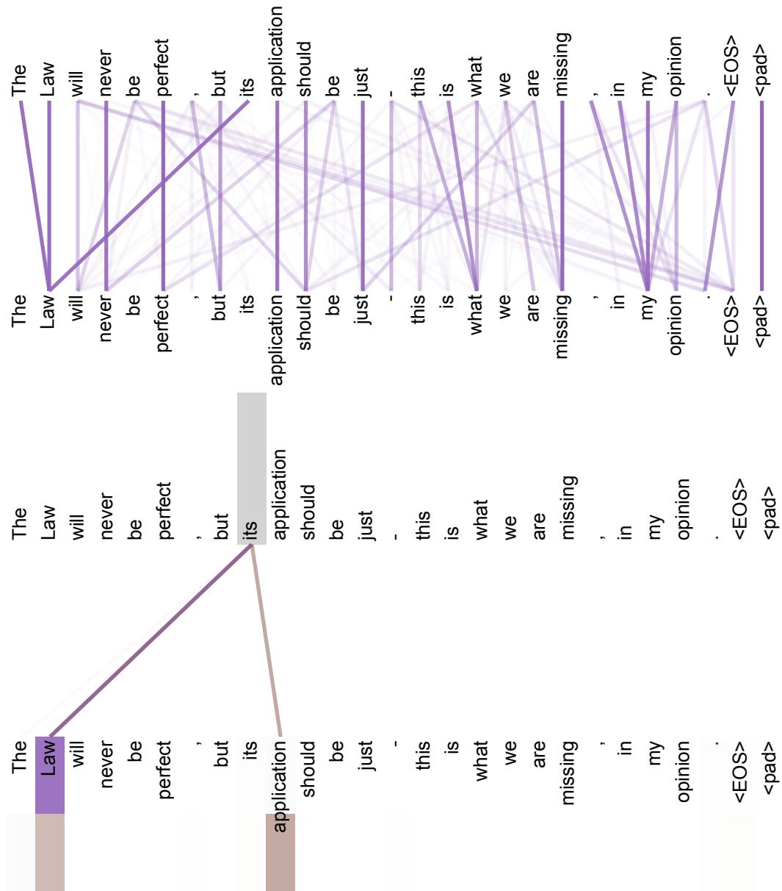
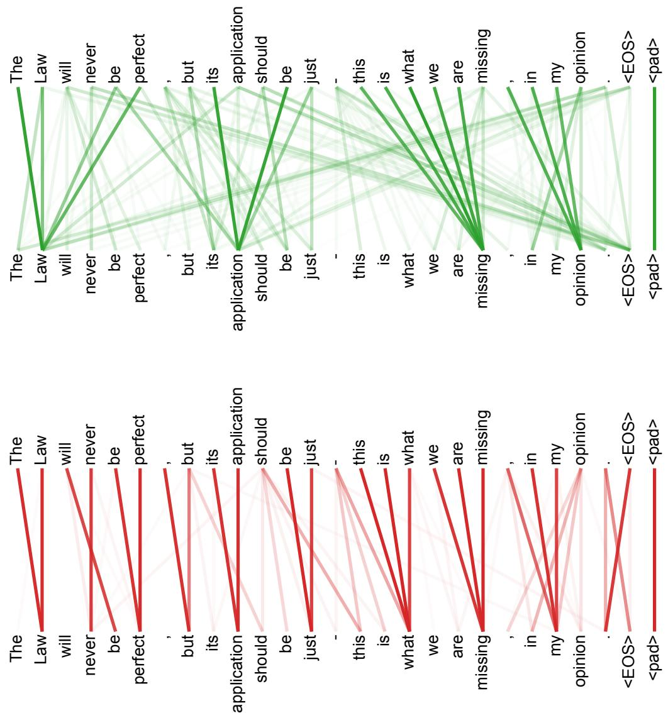

[← 返回 README](../README.md)

# 8 Appendix：References & Attention Visualizations

## 📌 预览

本节收录论文的**参考文献**（逐字保留）与附录的**注意力可视化**（Figure 3-5）。可视化是第 4 节"可解释性"claim 的实证：不同注意力头分别学会了长距离依赖补全、指代消解（anaphora）、句法结构等语言学任务。

---

## References

[1] Jimmy Lei Ba, Jamie Ryan Kiros, and Geoffrey E Hinton. Layer normalization. arXiv preprint arXiv:1607.06450, 2016.

[2] Dzmitry Bahdanau, Kyunghyun Cho, and Yoshua Bengio. Neural machine translation by jointly learning to align and translate. CoRR, abs/1409.0473, 2014.

[3] Denny Britz, Anna Goldie, Minh-Thang Luong, and Quoc V. Le. Massive exploration of neural machine translation architectures. CoRR, abs/1703.03906, 2017.

[4] Jianpeng Cheng, Li Dong, and Mirella Lapata. Long short-term memory-networks for machine reading. arXiv preprint arXiv:1601.06733, 2016.

[5] Kyunghyun Cho, Bart van Merrienboer, Caglar Gulcehre, Fethi Bougares, Holger Schwenk, and Yoshua Bengio. Learning phrase representations using rnn encoder-decoder for statistical machine translation. CoRR, abs/1406.1078, 2014.

[6] Francois Chollet. Xception: Deep learning with depthwise separable convolutions. arXiv preprint arXiv:1610.02357, 2016.

[7] Junyoung Chung, Çaglar Gülçehre, Kyunghyun Cho, and Yoshua Bengio. Empirical evaluation of gated recurrent neural networks on sequence modeling. CoRR, abs/1412.3555, 2014.

[8] Chris Dyer, Adhiguna Kuncoro, Miguel Ballesteros, and Noah A. Smith. Recurrent neural network grammars. In Proc. ofNAACL, 2016.

[9] Jonas Gehring, Michael Auli, David Grangier, Denis Yarats, and Yann N. Dauphin. Convolutional sequence to sequence learning. arXiv preprint arXiv:1705.03122v2, 2017.

[10] Alex Graves. Generating sequences with recurrent neural networks. arXiv preprint arXiv:1308.0850, 2013.

[11] Kaiming He, Xiangyu Zhang, Shaoqing Ren, and Jian Sun. Deep residual learning for image recognition. In Proceedings of the IEEE Conference on Computer Vision and Pattern Recognition, pages 770–778, 2016.

[12] Sepp Hochreiter, Yoshua Bengio, Paolo Frasconi, and Jürgen Schmidhuber. Gradient flow in recurrent nets: the difficulty of learning long-term dependencies, 2001.

[13] Sepp Hochreiter and Jürgen Schmidhuber. Long short-term memory. Neural computation, 9(8):1735–1780, 1997.

[14] Zhongqiang Huang and Mary Harper. Self-training PCFG grammars with latent annotations across languages. In Proceedings of the 2009 Conference on Empirical Methods in Natural Language Processing, pages 832–841. ACL, August 2009.

[15] Rafal Jozefowicz, Oriol Vinyals, Mike Schuster, Noam Shazeer, and Yonghui Wu. Exploring the limits of language modeling. arXiv preprint arXiv:1602.02410, 2016.

[16] Łukasz Kaiser and Samy Bengio. Can active memory replace attention? In Advances in Neural Information Processing Systems, (NIPS), 2016.

[17] Łukasz Kaiser and Ilya Sutskever. Neural GPUs learn algorithms. In International Conference on Learning Representations (ICLR), 2016.

[18] Nal Kalchbrenner, Lasse Espeholt, Karen Simonyan, Aaron van den Oord, Alex Graves, and Koray Kavukcuoglu. Neural machine translation in linear time. arXiv preprint arXiv:1610.10099v2, 2017.

[19] Yoon Kim, Carl Denton, Luong Hoang, and Alexander M. Rush. Structured attention networks. In International Conference on Learning Representations, 2017.

[20] Diederik Kingma and Jimmy Ba. Adam: A method for stochastic optimization. In ICLR, 2015.

[21] Oleksii Kuchaiev and Boris Ginsburg. Factorization tricks for LSTM networks. arXiv preprint arXiv:1703.10722, 2017.

[22] Zhouhan Lin, Minwei Feng, Cicero Nogueira dos Santos, Mo Yu, Bing Xiang, Bowen Zhou, and Yoshua Bengio. A structured self-attentive sentence embedding. arXiv preprint arXiv:1703.03130, 2017.

[23] Minh-Thang Luong, Quoc V. Le, Ilya Sutskever, Oriol Vinyals, and Lukasz Kaiser. Multi-task sequence to sequence learning. arXiv preprint arXiv:1511.06114, 2015.

[24] Minh-Thang Luong, Hieu Pham, and Christopher D Manning. Effective approaches to attentionbased neural machine translation. arXiv preprint arXiv:1508.04025, 2015.

[25] Mitchell P Marcus, Mary Ann Marcinkiewicz, and Beatrice Santorini. Building a large annotated corpus of english: The penn treebank. Computational linguistics, 19(2):313–330, 1993.

[26] David McClosky, Eugene Charniak, and Mark Johnson. Effective self-training for parsing. In Proceedings of the Human Language Technology Conference of the NAACL, Main Conference, pages 152–159. ACL, June 2006.

[27] Ankur Parikh, Oscar Täckström, Dipanjan Das, and Jakob Uszkoreit. A decomposable attention model. In Empirical Methods in Natural Language Processing, 2016.

[28] Romain Paulus, Caiming Xiong, and Richard Socher. A deep reinforced model for abstractive summarization. arXiv preprint arXiv:1705.04304, 2017.

[29] Slav Petrov, Leon Barrett, Romain Thibaux, and Dan Klein. Learning accurate, compact, and interpretable tree annotation. In Proceedings of the 21st International Conference on Computational Linguistics and 44th Annual Meeting of the ACL, pages 433–440. ACL, July 2006.

[30] Ofir Press and Lior Wolf. Using the output embedding to improve language models. arXiv preprint arXiv:1608.05859, 2016.

[31] Rico Sennrich, Barry Haddow, and Alexandra Birch. Neural machine translation of rare words with subword units. arXiv preprint arXiv:1508.07909, 2015.

[32] Noam Shazeer, Azalia Mirhoseini, Krzysztof Maziarz, Andy Davis, Quoc Le, Geoffrey Hinton, and Jeff Dean. Outrageously large neural networks: The sparsely-gated mixture-of-experts layer. arXiv preprint arXiv:1701.06538, 2017.

[33] Nitish Srivastava, Geoffrey E Hinton, Alex Krizhevsky, Ilya Sutskever, and Ruslan Salakhutdinov. Dropout: a simple way to prevent neural networks from overfitting. Journal of Machine Learning Research, 15(1):1929–1958, 2014.

[34] Sainbayar Sukhbaatar, Arthur Szlam, Jason Weston, and Rob Fergus. End-to-end memory networks. In C. Cortes, N. D. Lawrence, D. D. Lee, M. Sugiyama, and R. Garnett, editors, Advances in Neural Information Processing Systems 28, pages 2440–2448. Curran Associates, Inc., 2015.

[35] Ilya Sutskever, Oriol Vinyals, and Quoc VV Le. Sequence to sequence learning with neural networks. In Advances in Neural Information Processing Systems, pages 3104–3112, 2014.

[36] Christian Szegedy, Vincent Vanhoucke, Sergey Ioffe, Jonathon Shlens, and Zbigniew Wojna. Rethinking the inception architecture for computer vision. CoRR, abs/1512.00567, 2015.

[37] Vinyals & Kaiser, Koo, Petrov, Sutskever, and Hinton. Grammar as a foreign language. In Advances in Neural Information Processing Systems, 2015.

[38] Yonghui Wu, Mike Schuster, Zhifeng Chen, Quoc V Le, Mohammad Norouzi, Wolfgang Macherey, Maxim Krikun, Yuan Cao, Qin Gao, Klaus Macherey, et al. Google's neural machine translation system: Bridging the gap between human and machine translation. arXiv preprint arXiv:1609.08144, 2016.

[39] Jie Zhou, Ying Cao, Xuguang Wang, Peng Li, and Wei Xu. Deep recurrent models with fast-forward connections for neural machine translation. CoRR, abs/1606.04199, 2016.

[40] Muhua Zhu, Yue Zhang, Wenliang Chen, Min Zhang, and Jingbo Zhu. Fast and accurate shift-reduce constituent parsing. In Proceedings of the 51st Annual Meeting of the ACL (Volume 1: Long Papers), pages 434–443. ACL, August 2013.

> 💡 **参考文献速览**: 引用谱系清晰折射本文定位——RNN/LSTM/GRU 线（[13][7][35][5]）、注意力线（[2][19][27]）、CNN 序列建模线（[9][18][16]）、以及所借的通用组件（残差 [11]、LayerNorm [1]、Adam [20]、dropout [33]、label smoothing [36]、weight tying [30]、BPE [31]）。可以看出 Transformer 不是凭空发明，而是把多条成熟技术线**重新组合**，去掉 recurrence 后用注意力打通。

---

## Attention Visualizations

*Figure 3: An example of the attention mechanism following long-distance dependencies in the encoder self-attention in layer 5 of 6. Many of the attention heads attend to a distant dependency of the verb 'making', completing the phrase 'making...more difficult'. Attentions here shown only for the word 'making'. Different colors represent different heads. Best viewed in color.*

> 💡 **Figure 3 批读（长距离依赖）**: 只画了词 'making' 发出的注意力（不同颜色 = 不同头）。可以看到多个头把 'making' 连到很远处的 'more' 和 'difficult'——正好补全短语 "making ... more difficult"。这直接实证第 4 节的核心论点：自注意力**一步直连任意距离**，路径长度 $O(1)$，长依赖不再靠逐步传递。这是"路径长度短 → 长依赖好学"的可视化证据。

*Figure 4: Two attention heads, also in layer 5 of 6, apparently involved in anaphora resolution. Top: Full attentions for head 5. Bottom: Isolated attentions from just the word 'its' for attention heads 5 and 6. Note that the attentions are very sharp for this word.*

> 💡 **Figure 4 批读（指代消解）**: 展示两个头疑似在做 **anaphora resolution（指代消解）**。底部单独看代词 'its' 的注意力——它非常"锐利"地指向 'Law' 和 'application'（即 'its' 所指代的先行词）。这说明个别头学到的不是泛泛的相关性，而是**具体的语言学功能**（找代词指向谁）。支撑第 4 节"个别头清晰地承担不同任务"的 claim。

*Figure 5: Many of the attention heads exhibit behaviour that seems related to the structure of the sentence. We give two such examples above, from two different heads from the encoder self-attention at layer 5 of 6. The heads clearly learned to perform different tasks.*

> 💡 **Figure 5 批读（句法结构）**: 同一层 (layer 5) 的两个不同头（红/绿）呈现**不同的连接模式**——各自像是在捕捉句子的某种结构关系。要点在于"**分工**"：多头不是简单冗余，而是不同头学到不同的结构任务。这从可视化角度回收了 3.2.2 "多头能关注不同表示子空间"的设计动机，形成"设计→论证→可视化"的完整闭环。

---

## 🔖 Section 总结

### 核心洞察
1. **引用谱系 = 组合创新**：本文把 RNN/CNN/注意力三条线的成熟组件重组，创新在"去 recurrence + 纯注意力"，而非发明全新算子。
2. **可视化三连实证可解释性**：Fig.3 长距离依赖、Fig.4 指代消解、Fig.5 句法结构，分别对应第 4 节"路径短"与"多头分工"两大论点。
3. **头有明确功能**：注意力权重锐利且语言学可解释，是 Transformer 相对 RNN/CNN 的独特副产品。

### 可追问点
- 这些"可解释头"是否稳定跨随机种子出现？（原文只给个例，未做统计，属可解释性研究的已知局限）
- 为什么可解释现象集中在 layer 5（靠上层）？（高层通常编码更抽象的句法/语义关系，原文未展开分析）
