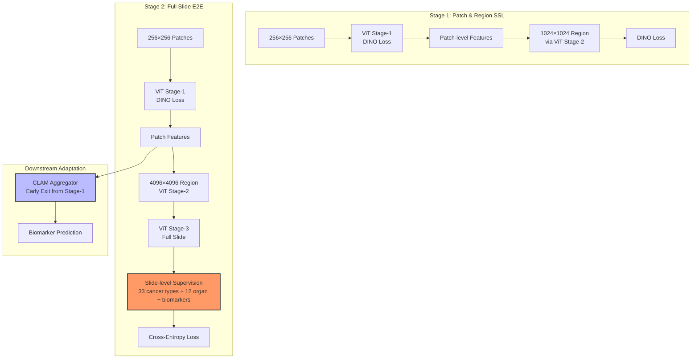

# EXAONE Path 2.0: Pathology Foundation Model with End-to-End Supervision

> **arXiv**: 2507.06639 | **年份**: 2025 | **引用数**: -- (S2 rate-limited)
>
> **作者**: LG AI Research
>
> **机构**: LG AI Research

---

## 一句话概述

提出 EXAONE Path 2.0，用 37K WSIs 的 slide-level 多任务监督信号通过三层 HIPT 架构实现端到端训练，在 10 个 biomarker 预测任务上以更少数据和参数量达到 SOTA 平均性能。

---

## 核心贡献

1. **训练范式创新**: 用 slide-level 多任务监督信号（33 癌种分型 + 12 器官分类 + 分子 biomarker 预测）直接训练 patch 编码器，取代传统的 SSL 预训练
2. **工程方案**: 三层 HIPT 架构 + curriculum learning（分阶段分辨率提升）+ activation checkpointing + CPU offloading，使 gigapixel E2E 训练可行
3. **数据效率**: 仅用 37K WSIs 超越 PRISM (587K)、CHIEF (60K)、Prov-GigaPath (170K) 等更大规模预训练模型

---

## 关键洞见 (Hao 批注)

1. **SSL 对 biomarker 预测无效**: DINO/DINOv2 在自然图像增强上做 SSL，学不到癌种突变 (EGFR/KRAS/TP53) 等分子特征——这些特征需要从整个组织区域的形态学模式中推理，而非单个 256x256 patch
2. **多任务 + 端到端 > 大数据 + SSL**: EXAONE Path 2.0 用 37K WSIs 超越用 170K+ WSIs 预训练的 GigaPath，说明"监督信号质量"比"数据量"更重要
3. **Early exit 策略实用**: 下游任务只用第一层 ViT + CLAM，而非整个三层 HIPT，大幅降低推理成本的同时保持性能
4. **与 Revisiting-E2E 互补**: 前者优化 MIL 设计，后者优化训练框架与多任务 signal

---

## 章节导航

| 章节 | 内容 |
|------|------|
| [00 Abstract](sections/00-abstract.md) | 摘要与核心发现 |
| [01 Introduction](sections/01-introduction.md) | 问题背景与研究动机 |
| [02 Method](sections/02-method.md) | HIPT 架构 + curriculum learning + 多任务框架 |
| [03 Experiments](sections/03-experiments.md) | 10 biomarker 任务评估 |
| [04 Discussion](sections/04-discussion.md) | 讨论、局限与未来方向 |

---

## 方法概览

---

## 实验结果速览

| Benchmark | Task | EXAONE Path 2.0 | Best Baseline |
|-----------|------|-----------------|---------------|
| LUAD-EGFR | EGFR mutation | **0.853** | PRISM 0.815 |
| LUAD-KRAS | KRAS mutation | **0.645** | PRISM 0.623 |
| CRC-MSI | MSI status | 0.938 | UNI2-h 0.981 |
| BRCA-PIK3CA | PIK3CA mutation | 0.804 | PRISM 0.893 |
| RCC-BAP1 | BAP1 mutation | **0.807** | PRISM 0.769 |
| COAD-KRAS | KRAS mutation | 0.912 | UNI2-h 0.943 |
| **Average** | 10 tasks | **0.784** | PRISM 0.765 |

---

## 与 Revisiting-E2E 的对比

| 维度 | EXAONE Path 2.0 | Revisiting-E2E |
|------|-----------------|---------------|
| 核心问题 | SSL 不捕获 biomarker 特征 | MIL 稀疏注意力引发 E2E 优化坍塌 |
| 解决路径 | 多任务 slide-level 监督 + curriculum | 改良 MIL (ABMILX: MHLA + A+) |
| 编码器 | HIPT 三层 ViT | ResNet (12M/26M) |
| 训练数据 | 37K WSIs (多任务标签) | ~1K-10K WSIs (下游数据) |
| 推理方案 | 第一层 ViT + CLAM (early exit) | ResNet + ABMILX (full model) |
| 任务类型 | Molecular biomarker prediction | Grading, sub-typing, survival |
